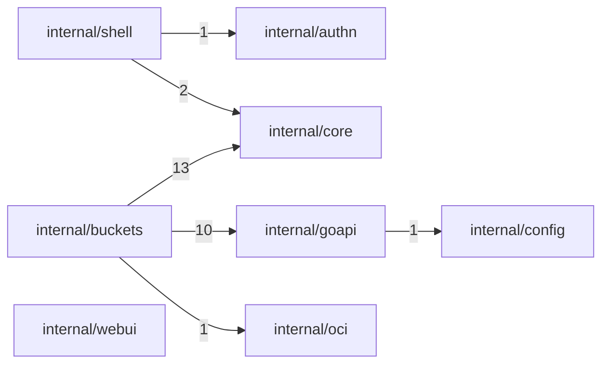

# Module architecture

<!-- Generated by `npm run arch` (scripts/arch-diagram.mjs). Do not edit by hand. -->

Arrows mean **depends on**. The number on an arrow counts the source files crossing
that boundary. Test files are excluded. **Red** marks a mutual dependency (a cycle).

## services/go-api

9 modules · 31 dependencies · 1 mutual

Utility modules (expected background, omitted from the diagram unless mutual):

- `internal/app` (root, in 0, out 8)
- `internal/auth` (sink, in 7, out 1)
- `internal/shared` (sink, in 8, out 0)

### Mutual dependencies

- `internal/catalog` ⇄ `internal/discovery`
  - `internal/catalog` → `internal/discovery` (1): services/go-api/internal/catalog/adapters/discoverybridge/featured_resolver.go
  - `internal/discovery` → `internal/catalog` (1): services/go-api/internal/discovery/adapters/catalogbridge/ownership_reader.go

```mermaid
flowchart LR
  services_go_api_internal_acquisition["internal/acquisition"]
  services_go_api_internal_admin["internal/admin"]
  services_go_api_internal_catalog["internal/catalog"]
  services_go_api_internal_discovery["internal/discovery"]
  services_go_api_internal_feedback["internal/feedback"]
  services_go_api_internal_playback["internal/playback"]
  services_go_api_internal_acquisition -->|15| services_go_api_internal_catalog
  services_go_api_internal_acquisition -->|1| services_go_api_internal_discovery
  services_go_api_internal_admin -->|1| services_go_api_internal_acquisition
  services_go_api_internal_admin -->|1| services_go_api_internal_catalog
  services_go_api_internal_admin -->|7| services_go_api_internal_discovery
  services_go_api_internal_admin -->|1| services_go_api_internal_feedback
  services_go_api_internal_admin -->|1| services_go_api_internal_playback
  services_go_api_internal_catalog -->|1| services_go_api_internal_discovery
  services_go_api_internal_discovery -->|1| services_go_api_internal_catalog
  services_go_api_internal_playback -->|1| services_go_api_internal_catalog
  classDef mutual stroke:#d33,color:#d33,stroke-width:2px;
  class services_go_api_internal_catalog,services_go_api_internal_discovery mutual;
  linkStyle 7 stroke:#d33,color:#d33;
  linkStyle 8 stroke:#d33,color:#d33;
```

## services/overseer

9 modules · 11 dependencies · 0 mutual

Utility modules (expected background, omitted from the diagram unless mutual):

- `internal/app` (root, in 0, out 5)



## apps/mobile

25 modules · 104 dependencies · 3 mutual

Utility modules (expected background, omitted from the diagram unless mutual):

- `src/shared` (sink, in 10, out 0)
- `src/shared/api-client` (sink, in 15, out 1)
- `src/shared/lib` (sink, in 10, out 2)
- `src/shared/ui` (sink, in 13, out 1)

### Mutual dependencies

- `src/features/playback` ⇄ `src/shared/playback`
  - `src/features/playback` → `src/shared/playback` (25): apps/mobile/src/features/playback/audioCache.ts, apps/mobile/src/features/playback/audioPrefetch.ts, apps/mobile/src/features/playback/createNativePlaybackActions.ts, apps/mobile/src/features/playback/derivePlaybackState.ts, apps/mobile/src/features/playback/hooks/PlaybackProvider.tsx, apps/mobile/src/features/playback/hooks/expoGoPlaybackProvider.tsx, and 19 more
  - `src/shared/playback` → `src/features/playback` (1): apps/mobile/src/shared/playback/useQueuePlayback.ts
- `src/features/playback` ⇄ `src/shared/telemetry`
  - `src/features/playback` → `src/shared/telemetry` (2): apps/mobile/src/features/playback/hooks/usePlaybackSignals.ts, apps/mobile/src/features/playback/playbackHealth.ts
  - `src/shared/telemetry` → `src/features/playback` (1): apps/mobile/src/shared/telemetry/session.ts
- `src/shared/auth` ⇄ `src/shared/offline`
  - `src/shared/auth` → `src/shared/offline` (1): apps/mobile/src/shared/auth/useSession.ts
  - `src/shared/offline` → `src/shared/auth` (1): apps/mobile/src/shared/offline/pinnedStore.ts

```mermaid
flowchart LR
  subgraph app
    apps_mobile_src_app["src/app"]
    apps_mobile_src_app__auth_["src/app/(auth)"]
    apps_mobile_src_app__tabs_["src/app/(tabs)"]
    apps_mobile_src_app_player["src/app/player"]
  end
  subgraph features
    apps_mobile_src_features_auth["src/features/auth"]
    apps_mobile_src_features_detail["src/features/detail"]
    apps_mobile_src_features_discover["src/features/discover"]
    apps_mobile_src_features_library["src/features/library"]
    apps_mobile_src_features_playback["src/features/playback"]
    apps_mobile_src_features_settings["src/features/settings"]
  end
  subgraph shared
    apps_mobile_src_shared_acquisition["src/shared/acquisition"]
    apps_mobile_src_shared_auth["src/shared/auth"]
    apps_mobile_src_shared_events["src/shared/events"]
    apps_mobile_src_shared_favorites["src/shared/favorites"]
    apps_mobile_src_shared_files["src/shared/files"]
    apps_mobile_src_shared_killSwitch["src/shared/killSwitch"]
    apps_mobile_src_shared_offline["src/shared/offline"]
    apps_mobile_src_shared_playback["src/shared/playback"]
    apps_mobile_src_shared_playlists["src/shared/playlists"]
    apps_mobile_src_shared_query["src/shared/query"]
    apps_mobile_src_shared_telemetry["src/shared/telemetry"]
  end
  apps_mobile_src_app__auth_ -->|3| apps_mobile_src_features_auth
  apps_mobile_src_app__tabs_ -->|3| apps_mobile_src_features_library
  apps_mobile_src_features_auth -->|10| apps_mobile_src_shared_auth
  apps_mobile_src_features_detail -->|4| apps_mobile_src_shared_acquisition
  apps_mobile_src_features_detail -->|4| apps_mobile_src_shared_playback
  apps_mobile_src_features_detail -->|3| apps_mobile_src_shared_telemetry
  apps_mobile_src_features_discover -->|6| apps_mobile_src_shared_telemetry
  apps_mobile_src_features_library -->|4| apps_mobile_src_shared_acquisition
  apps_mobile_src_features_library -->|4| apps_mobile_src_shared_events
  apps_mobile_src_features_library -->|11| apps_mobile_src_shared_offline
  apps_mobile_src_features_library -->|9| apps_mobile_src_shared_playback
  apps_mobile_src_features_library -->|4| apps_mobile_src_shared_playlists
  apps_mobile_src_features_playback -->|3| apps_mobile_src_shared_auth
  apps_mobile_src_features_playback -->|25| apps_mobile_src_shared_playback
  apps_mobile_src_features_playback -->|2| apps_mobile_src_shared_telemetry
  apps_mobile_src_features_settings -->|5| apps_mobile_src_shared_auth
  apps_mobile_src_shared_auth -->|1| apps_mobile_src_shared_offline
  apps_mobile_src_shared_offline -->|1| apps_mobile_src_shared_auth
  apps_mobile_src_shared_playback -->|1| apps_mobile_src_features_playback
  apps_mobile_src_shared_telemetry -->|1| apps_mobile_src_features_playback
  classDef mutual stroke:#d33,color:#d33,stroke-width:2px;
  class apps_mobile_src_features_playback,apps_mobile_src_shared_auth,apps_mobile_src_shared_offline,apps_mobile_src_shared_playback,apps_mobile_src_shared_telemetry mutual;
  linkStyle 13 stroke:#d33,color:#d33;
  linkStyle 14 stroke:#d33,color:#d33;
  linkStyle 16 stroke:#d33,color:#d33;
  linkStyle 17 stroke:#d33,color:#d33;
  linkStyle 18 stroke:#d33,color:#d33;
  linkStyle 19 stroke:#d33,color:#d33;
```

