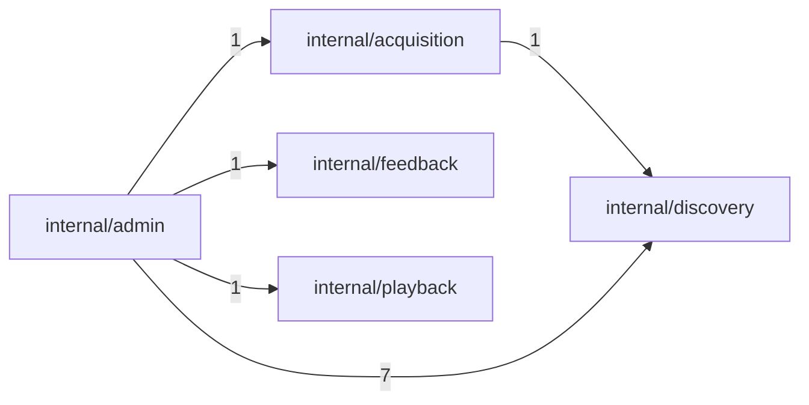
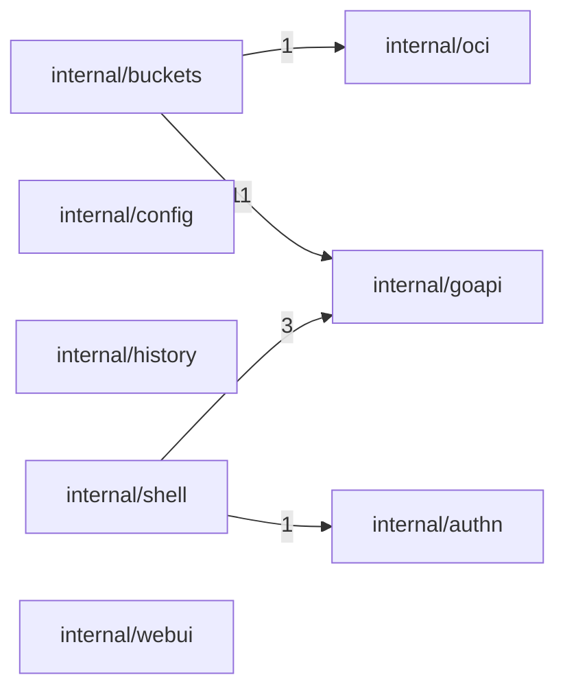
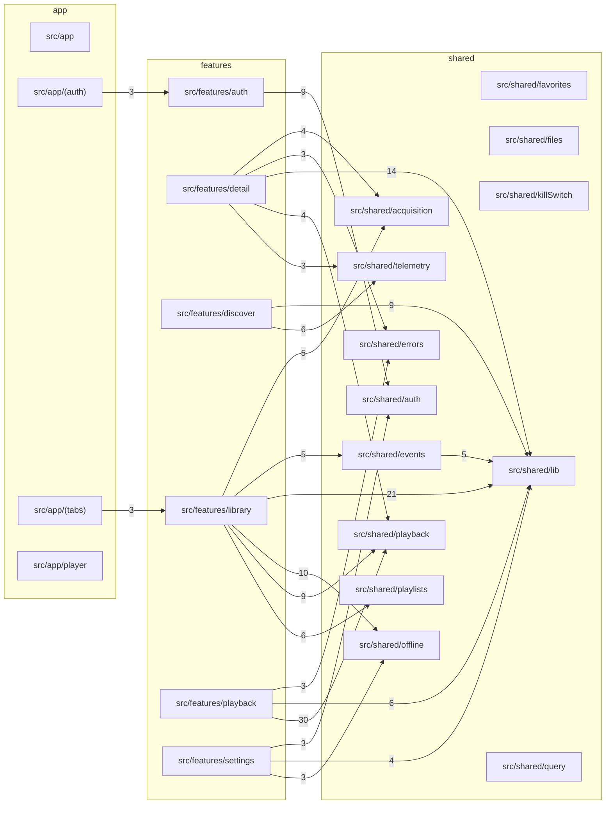

# Module architecture

<!-- Generated by `npm run arch` (scripts/arch-diagram.mjs). Do not edit by hand. -->

Arrows mean **depends on**. The number on an arrow counts the source files crossing
that boundary. Test files are excluded. **Red** marks a mutual dependency (a cycle).

## services/go-api

9 modules · 29 dependencies · 0 mutual

Utility modules (expected background, omitted from the diagram unless mutual):

- `internal/app` (root, in 0, out 8)
- `internal/auth` (sink, in 7, out 1)
- `internal/catalog` (sink, in 4, out 2)
- `internal/shared` (sink, in 8, out 0)

## services/overseer

10 modules · 14 dependencies · 0 mutual

Utility modules (expected background, omitted from the diagram unless mutual):

- `internal/app` (root, in 0, out 7)
- `internal/core` (sink, in 4, out 0)

## apps/mobile

26 modules · 109 dependencies · 0 mutual

Utility modules (expected background, omitted from the diagram unless mutual):

- `src/shared/api-client` (sink, in 15, out 2)
- `src/shared/session` (sink, in 11, out 0)
- `src/shared/ui` (sink, in 13, out 2)

