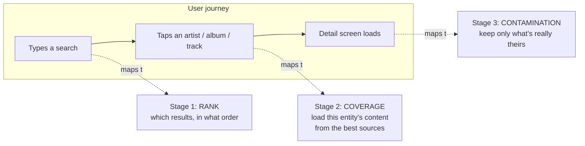
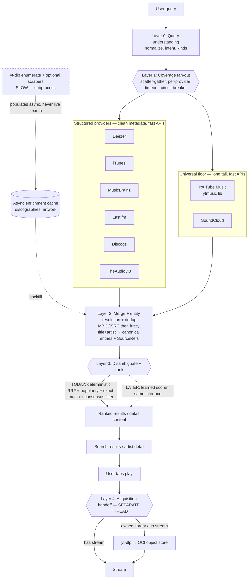
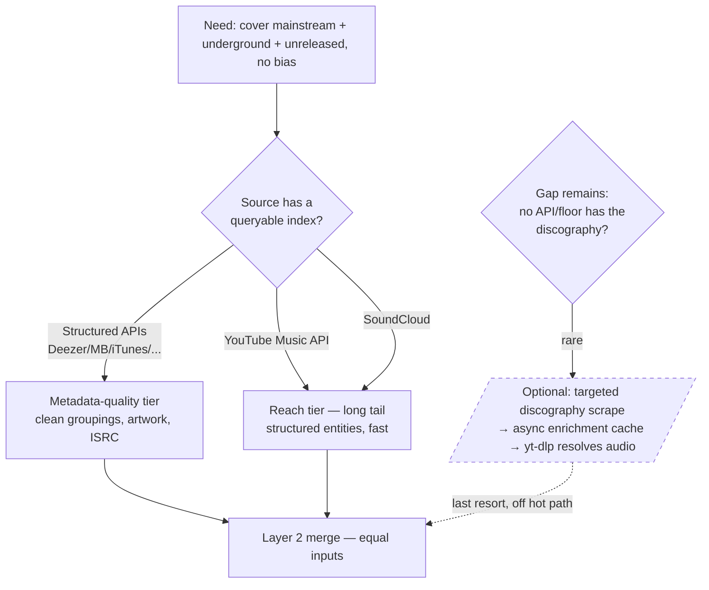
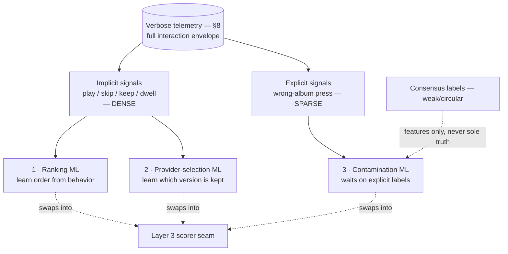
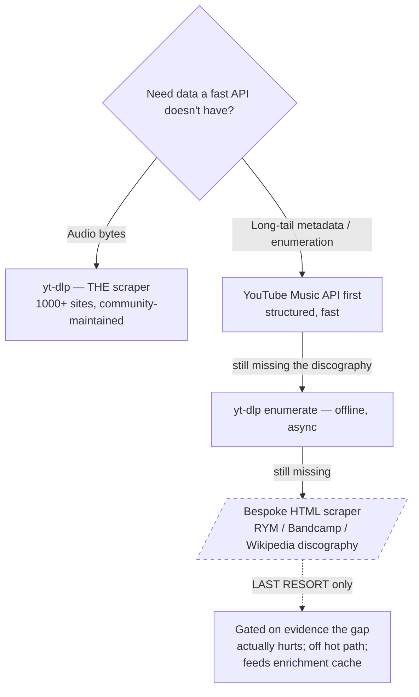
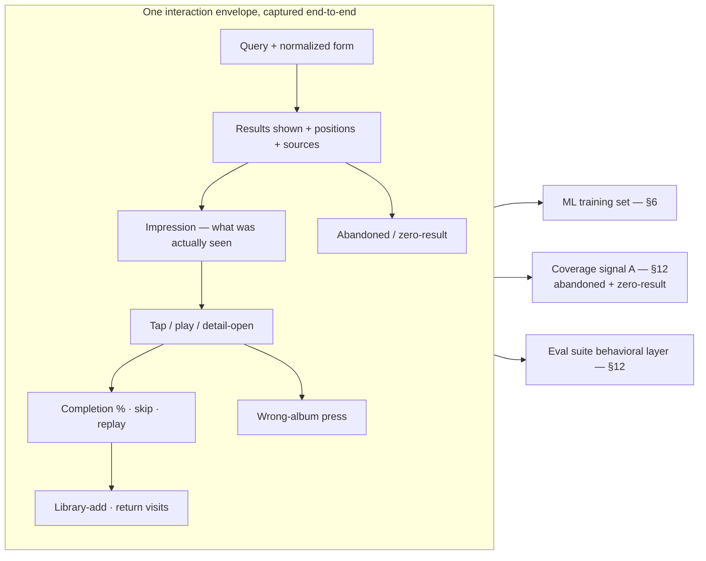
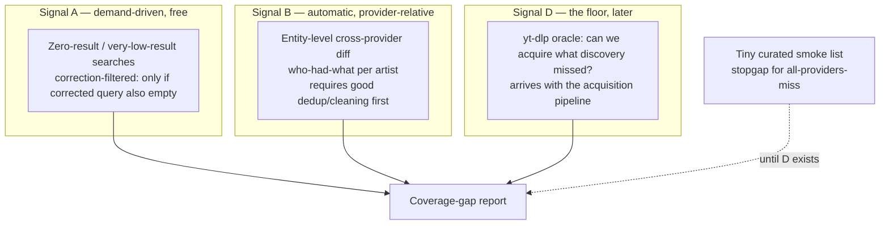
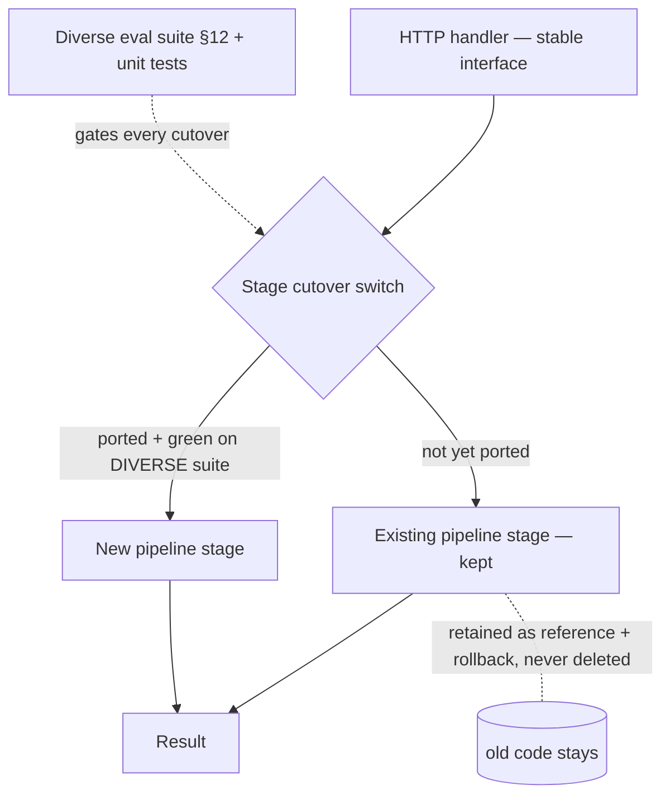

# Discovery Infrastructure — Target Architecture & Rebuild Blueprint

> **What this document is.** The complete intended design of Altune's discovery
> feature: how a user's search becomes ranked results, how tapping a result loads
> an artist/album, where machine learning fits (and why it waits), where scraping
> fits (and why it's mostly `yt-dlp`), and how to build it without throwing away
> the lessons already encoded in the current pipeline. It is written to be handed
> to someone on day one. It is a **blueprint**, not a spec — it names mechanisms
> and decisions, and defers code-level detail (schemas, signatures, file layout)
> to the planning step that follows.

---

## 0. How to read this document

- **§1–3** frame the problem and the mental model. Read these even if you skim.
- **§4–7** are the architecture proper — the five layers and the cross-cutting coverage,
  ML, and scraping strategies.
- **§8** is the telemetry / event service — the foundational layer the eval suite and ML
  both stand on. If you read one "new" section, read this one.
- **§9–12** are the engineering disciplines: latency, resilience, observability, and the
  testing/evaluation strategy (§12 is step zero — read it before believing any of the above).
- **§13–14** are the *build* plan: how to get from today's code to this design without a
  catastrophic rewrite, and what to keep/reconsider/drop.
- **§15–18** are the honest parts: open questions, risks, and the decisions we made with
  their reasoning, so you can challenge them.

A note on terminology: this codebase practices **ubiquitous language** — the words
here (Track, SearchResult, Consensus, SourceRef, Confidence) are the same words used
in the Go types. See `docs/ubiquitous-language.md`. New terms this design introduces
are listed in §17.

---

## 1. Problem frame — why this exists and why we're redesigning

Altune is a **self-hosted, owned-library music streaming app**. Discovery is the
front door: a user searches, finds music, taps it, and plays it. Audio is acquired
on demand (`yt-dlp` → OCI object store) rather than licensed from a streaming API —
so discovery must surface music we can then *actually acquire*, not just music that
exists in some catalog.

Three facts shape every decision below:

1. **The user base is deliberately diverse.** Altune serves family and friends with
   tastes spanning mainstream pop, underground hip-hop, and unreleased/leaked tracks.
   There is **no house genre.** A design that is great for one taste and poor for
   another is a failure. This is the single hardest constraint: discovery must be
   **genre-agnostic and popularity-agnostic** by construction.

2. **One provider's catalog is never enough.** Deezer is great for mainstream and
   useless for SoundCloud loosies; MusicBrainz is authoritative and sparse on the
   underground. No single API spans mainstream + underground + unreleased. Coverage
   must come from a *union* of sources plus a universal floor.

3. **Few users, but potentially heavy ones, solo-maintained.** The constraint is
   *labeled data*, and the right unit is **interactions = events/user/day × users × days**,
   not headcount (§6). Dense *implicit* behavioral data (plays/skips/keeps) is reachable at
   our scale if telemetry is rich; sparse *explicit* labels (wrong-album presses) are not.
   This rules out building model infrastructure now, but **not** collecting the telemetry
   that makes ML reachable later. Every choice is weighed against *carrying cost*, not just
   build cost — which is why bespoke scrapers and speculative ML scaffolding are out.

**Why redesign rather than keep patching.** We verified the code before asserting this:
there are **no hardcoded artist-specific hacks** — no special-case lists, no `if artist ==`,
every artist name in the code is a comment. What *has* accumulated is **stage sprawl**
(~13 sequential transforms in the search path) and a scatter of **tuned constants** nobody
has audited for removal, plus identity resolvers added and deleted across sessions. The
redesign's job is to collapse that sprawl into **one coherent shape** a new person can hold
in their head, make the ML and acquisition seams first-class instead of bolted on, and —
critically — **shed the constants that only ever fit one query.** The instrument that tells
a generic mechanism from a band-aid is the diverse eval suite (§12), which is why that suite
is step zero. The **build strategy (§13)** is explicitly *not* a big-bang rewrite, and the
old codebase is never deleted.

---

## 2. The three-stage mental model

The whole feature is three stages, and they map exactly to the user's journey:

| Stage | When | Job | Solved by (today → target) |
|---|---|---|---|
| **1 — Rank** | Search | Best results, #1 correct | Deterministic RRF + popularity + exact-match → *(ML lands here **first** — dense implicit signals, §6)* |
| **2 — Coverage** | Tap an entity | Load its tracks/albums from whichever sources have them | Deterministic fan-out + fallback chain → *(stays deterministic; ML for provider-selection is 2nd)* |
| **3 — Contamination** | Detail load | Drop albums/tracks that aren't actually this artist's | Deterministic consensus + MB authority → *(ML **last** — needs sparse explicit labels)* |

**The critical insight:** we build all three deterministically now, and ML enters later
**one stage at a time, ordered by which signal is actually dense at our scale** (§6).
That ordering is *rank → provider-selection → contamination* — driven by *implicit*
behavioral data (plays/skips/keeps) that piles up with heavy daily use, leaving
contamination last because its only trustworthy signal (the wrong-album press) is sparse.
Coverage (Stage 2's loading problem) isn't an ML problem at all — it's deterministic
fallback (§5).

---

## 3. Goals & non-goals

**Goals**
- G1 — Universal coverage: mainstream, underground, and unreleased all work, with no
  source promoted over another.
- G2 — Correct ranking: the right result is **#1 in the blended view**, not merely
  present in the top 10 (this distinction has burned us before — see §12).
- G3 — Clean contamination filtering on the detail screen, especially for common-name
  artists.
- G4 — A coherent, documented architecture with explicit ML and acquisition seams.
- G5 — **The verbose telemetry / event service** (§8) — the foundational, triple-purpose
  layer feeding ML, coverage detection, and the eval suite.
- G6 — **The diverse evaluation suite** (§12) — library-derived nightly eval + coverage-gap
  detection — as the instrument that makes pruning, rebuilding, and ML all measurable.
  This is *step zero*.
- G7 — Bounded latency: search feels instant; detail loads in ~1–2s on a warm cache.

**Non-goals (this cycle)**
- N1 — Ship a trained model of any kind. We build the telemetry and the eval set; the
  model waits until accrued data justifies it.
- N2 — Build **ML model infrastructure** (serving, feature pipelines, training). The
  deterministic scorer *is* the seam; don't scaffold beyond it (§6).
- N3 — Build bespoke HTML scrapers. `yt-dlp` is the scraper; custom parsers are last
  resort (§7).
- N4 — The acquisition pipeline itself (`yt-dlp` → OCI). It's a **separate thread**;
  discovery only defines a clean handoff to it (§4, Layer 4).
- N5 — A big-bang rewrite, and **never deleting the existing codebase** (§13).

---

## 4. Target architecture — the five layers

### Layer 0 — Query understanding
Normalize the raw string, detect **intent** (is this "artist + track" like
"Tay-K Megaman"?), resolve the requested **kinds** (artist/album/track). Cheap,
in-process. Output: a clean query + optional structured `(artist, track)` split that
structured providers can use for a better search.

### Layer 1 — Coverage fan-out (the universal net)
Query **all** providers in parallel, each wrapped in its own timeout and circuit
breaker. Two tiers, **neither promoted over the other**:

- **Structured providers** — clean album groupings, artwork, ISRCs, release years.
  Best for mainstream and for *metadata quality*.
- **Universal floor** — YouTube Music + SoundCloud — the long tail the structured DBs
  never ingested. Best for *reach* (underground, unreleased).

> **Design rule — no source is "primary."** Promoting YouTube would bias toward the
> underground; promoting Deezer biases toward the mainstream. Every source is an equal
> input to Layer 2, and each is *used for what it's best at* during merge (structured
> for metadata fields, floor for existence/reach). This is how G1 (genre-agnostic) is
> satisfied structurally rather than by tuning.

**Hard latency rule:** everything in Layer 1 is a **fast HTTP API**. `yt-dlp` is a
subprocess and is seconds-slow — it is **forbidden in the live fan-out** and lives only
off the hot path (acquisition + async enrichment). The YouTube source here is the
**YouTube Music API** (via the `ytmusic` library), which returns *structured* song /
album / artist entities — not raw video titles — so no title-cleaning is needed at
search time.

### Layer 2 — Merge, entity resolution, dedup
Union every provider's results, then collapse duplicates into **canonical entries**,
each carrying multiple `SourceRef`s (one per provider that had it). Resolution tiers,
identifier-first:

1. **MBID** match (MusicBrainz ID) — strongest.
2. **ISRC** match (recording identifier) — strong.
3. **Fuzzy** title + artist (token-sort ratio) — fallback when no shared identifier.

This is where the wide net becomes a **noisy firehose**: five structured providers'
near-duplicates plus the floor's variants (fan edits, sped-up versions, live cuts).
Dedup picks the most *complete* representative (most metadata, real artwork) and keeps
all sources for provenance.

### Layer 3 — Disambiguate + rank (the ML seam)
The decision layer, and **the only place ML ever enters.**

- **Stage-1 ranking (search):** Reciprocal-Rank Fusion across providers + an
  exact-match boost + popularity. **Design decision (load-bearing): popularity outranks
  multi-source.** Artists merge easily and accumulate sources; tracks rarely merge.
  Without this ordering, a niche multi-provider artist beats a massively popular
  single-provider track. (See §13 for the positioning tests that enforce this.)
- **Stage-3 contamination (detail):** multi-provider **consensus** — an album confirmed
  by 2+ providers is kept; a single-provider album is kept but marked unconfirmed; the
  MusicBrainz **authority filter** rejects albums when MB has strong data for the artist
  and doesn't list them (kills same-name contamination, e.g. "Che").

The layer is designed so a **learned scorer slots in behind the same interface** —
swap thresholds for a model without touching Layers 1–2. That seam is the whole point
of building deterministically first.

### Layer 4 — Acquisition handoff (separate thread)
When the user taps play: if a provider streams it, stream; otherwise resolve the audio
via `yt-dlp` and store to OCI (the owned-library path). **This pipeline is specced
separately** (its own brainstorm/plan). Discovery's only responsibility here is to hand
off a clean, resolvable identity (the `SourceRef`s) so acquisition knows exactly what
to fetch. It is drawn here only to show the seam.

---

## 4.5 Design doctrine — zero arbitrary, query-fit constants

> Added 2026-06-20 after the first measured baseline (§4.6). This is the rule the rebuild
> (plan 003) is organized around.

A constant appears whenever a *continuous* or *multi-signal* judgment is forced into a decision
("is this similar enough to be the same song?" → a threshold; "when does popularity beat
relevance?" → an exchange rate). Those judgments are unavoidable; the number is only *where the
judgment is written down*. Three ways to make one:

1. **Hand-tuned constant** (e.g. `TokenSortRatio ≥ 85`) — untraceable, rots, fit to a few queries.
   **This is the band-aid we remove.**
2. **Learned weight** — a model parameter fit to data. Needs labels we don't have yet and *hides*
   the number in a model. **Deferred** to the ML seam (Layer 3); telemetry (§8) is its groundwork.
3. **Categorical / structural decision** — restructure so the judgment is a category and the number
   disappears or shrinks to a documented last resort. **This is the strategy.**

**The rule: zero arbitrary, query-fit constants.** Not zero numbers — every survivor must be
**principled** (a published convention or SLA, e.g. provider timeouts, RRF's `k=60`),
**learned-later** (parked at the ML seam), or a single **last-resort** the eval proves generalizes.
The categorical mechanisms:

- **Layer 2 (merge):** identifier-first (MBID/ISRC — exact) → version-marker *categories* (sequel
  number, remix, feat, live, deluxe → different entity) → fuzzy only last-resort. Replaces
  `versionSimilarityThreshold = 85`.
- **Layer 3 (rank):** lexicographic **relevance tiers** (exact-intent-match > exact-title-other-kind
  > partial > none); popularity orders only *within* a tier. Replaces the `0.05` band, the dominance
  `gap/factor`, and the additive `intentBoost`. ("popularity > multi-source" survives — but only
  as a within-tier order.)

**Product corollary (user, 2026-06-20):** the right answer need not be #1 — it must be *visible in
the top results*. The eval measures **top-K** (default top-3; top-1 tracked alongside).

> **Refinement (2026-06-21) — the categorical mechanisms above were themselves query-fit.**
> Building the rebuild and measuring it revealed that "categorical" only counts when it *truly
> dissolves* the constant, not when it relocates it:
>
> - The **version-marker vocabulary** (a ~25-keyword list — remix/live/deluxe/remaster/…) is a
>   hand-tuned constant in disguise. It backfired: it over-merged *release variants* into one entity,
>   and `textnorm` strips the parens, so the exact saved variant's tokens were lost — the full-catalog
>   eval regressed.
> - The **relevance tiers** were pattern-fit (built for Pattern A) **and brittle** — they depend on
>   vocab-based intent that often fails, then fall off a cliff to popularity.
>
> Both were **removed**. The genuinely principled signals:
> - **Merge (L2):** identifiers (ISRC/MBID — exact) → **exact canonical-title equality** (the shared
>   `textnorm` *is* the "same title" decision). A trailing sequel number survives normalization
>   ("Shotta Flow 2" ≠ "Shotta Flow", so **Pattern B holds for free**); a parenthetical "(Remaster)"
>   is canonical noise and folds away. No keyword list, no fuzzy threshold.
> - **Rank (L3):** **continuous token-sort relevance** (the published rapidfuzz algorithm — no
>   bonuses, no bands) → popularity → multi-source → RRF (`k=60`). A similarity measure is an
>   *algorithm*, not a fitted constant, and it degrades gracefully where tiers did not.
> - **Pattern A is moot under top-3:** the exact result sits at #2/#3 and passes, so no kind tiebreak
>   is needed. (track>album>artist remains a *non*-query-fit lever for top-1 polish only.)
>
> **Verdict (full-catalog head-to-head, 2026-06-21): v2 99.0% top-3 vs v1 98.9%** (18 vs 20 failures)
> — query-fit-free, beating the tuned pipeline, winning on the real structural cases (sequels kept
> separate, remaster variants resolved). Top-1 traded down (93.6% vs 96.9%) — the top-3-moot Pattern-A
> effect. See ADR-0007 (strangler addendum) and plan 003's course-correction.

## 4.6 First measured baseline (2026-06-20)

The Step-Zero eval (plan 002) ran on the full production catalog (1,792 distinct entities, cloned
prod → dev): **top-1 97.2%, top-3 98.9%** (≈99.4% true at top-3 after the ~9 `¥$` eval-matcher
artifacts). The **top-3 rate is the gate** (product bar: the right answer must be *visible*, not
strictly #1). The failures are **three structural patterns**, not a long tail: **A** same-named
album outranks the track (Layer 3 banding + popularity) — already *acceptable* at top-3 (the track
sits at #2; the 31 below-#1 passes are all this); **B** numbered sequel collapsed into the original
(Layer 2 `CollapseVersions ≥ 85`); **C** obscure / cross-artist same-title misses (coverage +
popularity bias). Only 19 entities miss top-3 entirely (~9 `¥$` artifacts, 2 sequels, ~8 genuinely
hard). Evidence that quality is already high and its gaps are *categorical*: the rebuild is a
maintainability + constants-removal effort, gated to hold ~99% top-3 / ~97% top-1. Full taxonomy +
constants ledger: plan 003.

---

## 5. The universal coverage strategy

This is G1, the hardest goal, in detail.

### "The internet is the database" — the right instinct, the wrong literal reading
You cannot query *the internet*. The internet has no index; turning raw pages into
"what albums does this artist have" requires someone to have already crawled, parsed,
and structured them. That "someone" is exactly what an API — or Google — *is*. So
"scrape the internet" really means *query a search engine's index, then parse whatever
HTML it returns* — chaining two limited databases with a brittle parser between them.
Building your own index of the whole internet is Google's job and is infeasible solo.

### The resolution: YouTube + `yt-dlp` as the universal floor
The one source that spans mainstream + underground + unreleased in a single *queryable
index* is **YouTube**. Major labels run Topic channels; the underground uploads
directly; leaks surface there first. It is the **least biased single source** because it
has everyone. And we already run `yt-dlp` for audio — so it's **one tool, two jobs**:
metadata reach (via the YouTube Music API at search time) and audio acquisition (via
`yt-dlp` at play time).

### The three coverage gaps to close (this is the near-term work)
The fan-out already exists in code. Coverage is not "build a net" — it's **close three
specific holes** in the net we have:

1. **YouTube Music returns 0 results in the pipeline.** YT Music is wired into the
   fan-out but its results currently vanish before ranking — a mapping/integration bug.
   Fixing it is the single biggest coverage win for the long tail.
2. **Track-loading fails for long-tail albums.** When the chosen provider lacks an
   album's tracks, fall back across sources (Deezer search → YouTube Music album tracks
   → …) instead of returning empty.
3. **No top-tracks fallback for underground artists.** When the primary provider has
   none, fall back to Last.fm / YouTube Music.

All three are **deterministic fallback chains** — no model, no new infrastructure.

---

## 6. Where machine learning fits

### What "ML does everything" means (defined)
The vision, pinned to something buildable: **every tuned constant becomes a function fit
to telemetry.** Concretely, across the three stages:

- **Rank** — order results from how people actually behave (play / skip / completion / keep),
  not `clickBoostAmount 0.03` or `lowRelevanceThreshold 0.3`.
- **Provider-select** — learn which source's *version* people keep, not equal-weight RRF.
- **Contaminate** — learn which albums are really an artist's, not the `2+ providers` /
  `10 MB titles` thresholds.

That's the end state. The rest of this section is the honest path to it.

### Deterministic is the product; ML is a contingent upgrade
**The deterministic pipeline is not a placeholder for ML — it is the product.** ML is an
upgrade gated on data that may take years to accrue, or never trip at all, and the design
is built so that's *fine*: every deterministic scorer is a plain function a model could
later replace, so nothing is wasted if the model never arrives. The failure mode we
explicitly avoid is building model-serving / feature-pipeline / training infrastructure
*now*, against labels that don't exist yet, and carrying that dead scaffolding forever.

> **Build the data collection now (it pays for itself immediately); build model
> infrastructure only when accrued data justifies a specific model.** Telemetry
> collection ≠ ML infrastructure. See §8.

### The scale reframe: intensity, not headcount
"~10 users" undersells the data. The unit that matters is **interactions = events/user/day
× users × days.** A few dozen people using Altune *hard* every day produce hundreds of
events daily → ~100k+/year. For the right *kind* of signal, that is a real dataset well
before "100 users" — which we may never reach and don't need to.

The catch — and it reorders the whole roadmap — is that signals split into two kinds with
very different supply:

| Signal kind | Examples | Supply at heavy daily use | Feeds |
|---|---|---|---|
| **Implicit** (behavioral) | play, skip, completion %, replay, library-add, search→play | **Dense** — scales with usage intensity | Ranking, provider-selection |
| **Explicit** (deliberate) | "wrong album" press | **Sparse** — needs an error *and* the will to flag it | Contamination |

### The reordered ML roadmap (implicit-signal stages first)
Because implicit signals are dense at our scale and explicit ones aren't, the realistic
ML beachhead is the *implicit*-signal stages — which **inverts** the naïve "contamination
first" ordering:

1. **Ranking** — first viable, because behavioral feedback is dense. Replace the ranking
   constants with a learned order from play/skip/keep.
2. **Provider-selection** — next, from provenance telemetry (which `SourceRef` got played/kept).
3. **Contamination** — last, gated on explicit "wrong album" labels accruing to critical
   mass. May lag indefinitely; the deterministic consensus filter stands alone until then.

**Trigger, not date:** each stage trains "when its signal reaches critical mass," never on
a calendar. If a stage's signal never gets there, that stage stays deterministic forever —
by design, not by failure.

### The circularity trap (still the key contamination decision)
The consensus engine already emits labels (confirmed = +, rejected = −) every detail load.
It is tempting to train contamination on those. **Don't — at least not alone.** A model
trained on consensus labels learns to *reproduce the heuristic, including its mistakes* —
it mimics the rules, it can't beat them. Only **human judgment** (the wrong-album press)
can beat the heuristic. Consensus labels are weak supervision / features, never sole truth.
This is exactly why contamination is *last*: its only trustworthy signal is the sparse one.

### Model choice
Start **interpretable** — logistic regression / shallow tree over a handful of features —
not XGBoost. When you're debugging why a result ranked low or an album was dropped,
interpretability beats marginal accuracy. XGBoost is a later optimization.

---

## 7. The scraping strategy

- **`yt-dlp` *is* the scraping layer.** It is a maintained meta-scraper for 1000+ sites.
  Use it for **audio** (acquisition) and for **offline discography enumeration**
  (`ytsearchN:` + `--flat-playlist` / `extract_info(process=False)` returns metadata
  without downloading). It is subprocess-slow → **never** on the live search path.
- **Bespoke HTML scrapers are the last resort.** They break on every markup change, get
  IP-blocked, and become a fleet of fragile jobs a solo dev babysits forever. The *one*
  legitimate use is **discography enumeration** for an artist whose full release list
  exists on no API and isn't enumerable from YouTube — and even then, gated behind
  evidence, built last, feeding an async cache, never touching live latency.

The dashed nodes everywhere in this document are this principle made visual: scraping
is optional, off the hot path, and additive — never a foundation.

---

## 8. The telemetry / event service (the foundational layer)

This is the single highest-leverage thing to build, and it's foundational because **three
otherwise-separate needs are the same data**: ML training, coverage-gap detection (§12
signal A), and the behavioral layer of the eval suite (§12). Build it once, get all three.

**Principle — collect richly now, model lazily later.** The event log is cheap,
append-only, and useful *the day you log it* (coverage + eval). It is NOT ML
infrastructure; it's the substrate that makes ML *possible later* without committing to
it now.

### The interaction envelope
Thin logging ("a search happened") throws away the signal that heavy daily use generates.
Capture the **whole envelope** instead:

### What each captured signal feeds

| Signal | Kind | Supply at our scale | Feeds |
|---|---|---|---|
| Results shown + positions + which source | context | dense | every downstream use (the join key) |
| Play / completion % / skip / replay | implicit | **dense** | Ranking ML, eval |
| Library-add / return visits | implicit | dense | Ranking + provider-quality ML, eval |
| Provider provenance (which `SourceRef` played/kept) | implicit | dense | Provider-selection ML |
| Abandoned / **zero-result** search | implicit | trickle but free | **Coverage signal A** |
| **"Wrong album"** press | explicit | **sparse** | Contamination ML (the only beater of the heuristic) |
| Consensus status (auto) | derived | dense | weak supervision / features only |

Already collected today: search clicks, consensus status, search history (so abandoned /
zero-result mining is feasible from existing data). **New and required:** the full
play/skip/completion envelope, provider provenance, and the wrong-album press.

> Privacy note: this is prod data for a small, known user group (you + family/friends).
> The eval and coverage jobs read it directly; CI uses a snapshot. Worth an explicit
> decision at plan time, not a blocker.

---

## 9. Latency & caching budget

| Path | Bound | Mechanism |
|---|---|---|
| Search fan-out | ~1.5s | per-provider `context.WithTimeout`; parallel; circuit breakers |
| Enrichment (artwork/popularity) | ~4s ceiling, top-N only | bounded concurrency, capped to top results |
| Artist detail / consensus | ~10s ceiling → **~0 on warm cache** | bounded consensus context **+ per-artist consensus cache (to add)** |
| Acquisition (`yt-dlp`) | seconds — **off the request** | async, separate thread |

The detail-page pain (5–12s) is consensus querying 5 providers + MB validation. Two
fixes: the bounded context (already applied) caps the worst case; a **per-artist
consensus cache** keyed by artist MBID collapses repeat visits to near-zero. Caching is
the cheapest large UX win in the whole design.

---

## 10. Resilience

Per the project's Go resilience rules — every remote call is designed for partial
failure:

- **Timeouts everywhere** — no unbounded remote call; fan-out and consensus are both
  explicitly bounded.
- **Circuit breakers per provider** — a failing provider fails fast and is skipped,
  not retried into the ground.
- **Bulkheads** — separate HTTP clients per provider so one slow upstream can't starve
  the others.
- **Graceful degradation** — a provider timeout yields a *partial* result set with a
  `ProviderStatus` per source on the wire, never a failed search.
- **Observability of every fallback** — each fallback, circuit trip, and timeout logs
  structured context (this was a real gap — provider failures used to be swallowed
  silently; see §18 appendix).

---

## 11. Observability

A stage is not done until it's observable.

- **Structured logging (`log/slog`)** with a correlation ID per request, one summary
  line per search/detail with the full wiring story (raw count, merged count,
  per-provider status, art coverage, MBID coverage, duration).
- **Per-stage debug logs** (`pipeline.*`) so a wrong result can be traced to the exact
  signal that caused it (`LOG_LEVEL=debug`).
- **Per-provider latency** logged in consensus and fan-out, so "Discogs is the slow one"
  is *measured*, not guessed.
- **The math is logged** — ranking scores per result, so a mis-rank shows which signal
  did it.

---

## 12. Testing & evaluation strategy

This is **step zero** — it must exist before pruning, rebuilding, or ML, because it is
the instrument all three depend on: the band-aid detector, the strangler safety net (§13),
and the ML eval set, all in one.

### The problem with what exists today
The current "canonical suite" is **9 hand-picked, mainstream-heavy queries** (Humble,
Scorpion, Bohemian Rhapsody, Circles, Drake, Bad Bunny, Blinding Lights, Tay-K Megaman,
Kendrick Lamar Humble). The artists that actually exposed our contamination and coverage
bugs — OsamaSon, Killeastsxde — **aren't in it.** A suite this thin and this mainstream
*cannot* tell a generic constant from a band-aid: it can't see whether `clickBoostAmount`
is universal or just tuned to make "Circles" pass. **That blind spot is why nobody knows
what's a band-aid — and a rebuild gated by this same suite would just grow new ones.**

### Two principles that survive unchanged
- **Position, not presence.** The bar is "the correct result is **#1** in the blended
  view," not "present in the top 10." A prior audit reported 98–99% on presence while
  position was wrong.
- **No hardcoded workarounds.** If a query fails, fix the algorithm — never add the word
  to a bank or special-case list. Those rot immediately. (This rule is *why* the
  band-aids shouldn't have existed; the diverse suite is how we enforce it.)

### Part 1 — Library-derived nightly eval (the diverse regression + ML eval set)
Generate the suite from the **production database**: every unique track / artist / album
across *all* users' libraries. Because the user base is diverse, the library is
*automatically* a mainstream + underground + unreleased mix — no hand-curation. It is
**self-labeling**: a track someone saved is a known-good target.

- **Generic pass rule** (holds for thousands of entries without hand-tuning): search
  `artist + title` → **that exact entity ranks #1.**
- **Periodic, not per-commit** — thousands of entries × live provider APIs = a **nightly
  job** emitting a quality-regression report, not a `go test` gate. A small curated
  subset stays in the per-commit gate as a smoke test.
- **Known limitation — it's a regression detector, not a coverage detector.** A track can
  only be in a library if discovery *already surfaced it*; what we failed to surface is
  invisible here. Coverage gaps need Part 2.

### Part 2 — Coverage-gap detection (the library's blind spot)
The library can't reveal what discovery never showed it, so coverage is detected by
*letting other things reveal the gaps*:

- **Signal A — abandoned & zero-result searches** (you already log search history): a
  zero-result search is a *strong*, demand-weighted gap signal. A *no-click-on-results*
  search is **noisy** (distraction/typo/ranking) — treat it as a weak hint only, and
  filter through correction first (count it only if the *corrected* query also came up
  empty). Trickle-rate at our scale, but free and real.
- **Signal B — entity-level cross-provider diff**: per artist, who-had-what. Entities the
  universal floor has but structured providers don't = the long-tail gap. **Caveats that
  shape the design:** (1) the union is *not* absolute truth — B is blind to gaps *every*
  provider shares; it measures *provider imbalance*, not absolute coverage. (2) It must be
  **entity-level, not count-level** (providers categorize singles/EPs/comps differently).
  (3) It is only valid **after** Layer-2 dedup/cleaning is fixed, or YouTube noise inflates
  false gaps — a real sequencing dependency.
- **The residual blind spot:** A+B together still can't catch "*every* provider missed it
  entirely." Only **Signal D (yt-dlp oracle)** can, and it arrives with acquisition. Until
  then a **tiny curated list** is the stopgap smoke test — *not* the primary detector.

### How this gates the rebuild
During the strangler cutover (§13), **new code may only take traffic when it is at least
as good as old code on Part 1 (the diverse library eval) and shows no coverage regression
on Part 2.** This is the safety net that makes a parallel rebuild safe — and the evidence
that decides prune-vs-rebuild in the first place (if the library eval shows the core holds
up, prune; if it falls apart on underground entries, rebuild).

---

## 13. Build strategy — strangler-fig, not big-bang

The redesign happens in a **new package**, and the old pipeline keeps serving traffic
until each stage is provably replaced. **The existing discovery codebase is never
deleted** — it stays in the repo as reference and as instant rollback. This is the
entire risk-management plan.

**Sequence (each step keeps the *diverse* eval suite green):**
0. **Step zero — build the instrument first (§12, §8):** the verbose telemetry/event
   service and the library-derived eval + coverage signals A/B. Without these you can't
   tell band-aid from generic, can't gate any cutover, and can't feed ML. *Everything
   below is blind without this.* This step also produces the evidence that decides how
   much of the old pipeline is band-aid vs. generic — i.e. how aggressive the rebuild
   should be.
1. Stand up the new package with the **Layer 2 merge + Layer 3 ranking** core, validated
   against the diverse eval suite. This is the heart; get it right in isolation.
2. Port **Layer 1 fan-out** (the providers already exist as adapters — reuse them).
3. Port **Stage-3 consensus** (the just-audited engine — bring it over, add the cache).
4. Close the **three coverage gaps** (§5) in the new code; confirm via signals A/B.
5. Wire the **telemetry envelope** end-to-end (§8) — play/skip/completion + provenance +
   wrong-album press — so the flywheel starts filling.
6. Cut the handler over stage-by-stage. **Keep the old pipeline in place** as reference
   and rollback — do not delete it.
7. The **ML seam** sits unused (deterministic scorer) until data accrues.

**What we inherit vs what we shed.** Three kinds of things live in the old code, and the
rebuild treats them very differently:
- **Reusable assets** (provider adapters, domain types, the test suite) → inherit directly.
- **Genuinely generic decisions** (popularity > multi-source; identifier-first entity
  resolution) → re-derive and keep, *but only after re-validating them against the
  diverse suite* (§12) — not trusted because they exist.
- **Artist-specific band-aids** → **deliberately shed.** This is the heart of the user's
  reason for rebuilding (see callout below).

> **The band-aid problem — why a rebuild, not just a refactor.** Much of what looks like
> "hard-won lessons" in the old pipeline is actually **hardcoded patches for a single
> artist that once failed to come through** — a tweak that fixed "Che" or "OsamaSon" and
> was never checked against everyone else. It works for that one artist and does nothing
> (or quietly harms) the rest. That is the opposite of a generic solution, and it
> violates the project's own "no hardcoded workarounds" rule. The rebuild's central value
> is **shedding these band-aids** and keeping only mechanisms that improve results
> *across diverse queries*. The filter that tells the two apart is the diverse positioning
> suite (§12): if a stage only helps one artist and removing it doesn't break the
> multi-artist suite, it was a band-aid — leave it behind.

---

## 14. What to keep, reconsider, or drop

Two opposite mistakes here: drop everything (lose the few real generic decisions) or
keep everything (carry the band-aids forward). The filter for both is the same single
question, asked against the **diverse** suite: *"do the multi-artist positioning tests
still pass without this stage?"* If yes, it was a band-aid — drop it. If no, it's
generic — keep it. **"Keep" below means "keep the mechanism, re-validated" — not "trust
it because it's there."** Anything that was a hardcoded fix for one artist is shed by
default.

| Existing stage | Verdict | Reasoning |
|---|---|---|
| Provider adapters (Deezer/iTunes/MB/Last.fm/Discogs/SoundCloud/YTMusic/TheAudioDB) | **Keep** | Reusable; the coverage net itself. |
| Merge / dedup / entity resolution | **Keep, simplify** | Core. Just-fixed for determinism; carry it. |
| Consensus + MB authority filter | **Keep, add cache** | The contamination engine; only slow path, cacheable. |
| RRF + popularity + exact-match ranking | **Keep** | Encodes the popularity>multi-source lesson. |
| Circuit breakers | **Keep** | Cheap resilience. |
| Click signals + boost | **Keep, extend** | Becomes part of the telemetry envelope (§8). |
| Intent detection / query clean | **Reconsider** | Plausibly earns its keep on "artist + track" queries — but verify against the diverse suite, don't assume. |
| Vocabulary store + refresh + suggestions | **Reconsider** | Verify it pays for its complexity against the diverse eval suite (§12). A prime stage-sprawl suspect. |
| Pre-correction | **Already disabled — keep off** | Rewrote valid queries from vocab pollution. Post-correction (zero-results-only) suffices. |
| Identity resolver family | **Already deleted — stays deleted** | ~2,189 lines of heuristics replaced by consensus. Do not resurrect. |
| Tidal adapter | **Keep dormant / drop** | `client_credentials` unsupported for third-party apps; config-gated off. Drop if it adds noise. |

---

## 15. Open questions & risks

- **OQ1 — Acquisition boundary.** Is the `yt-dlp`→OCI pipeline truly a separate spec, or
  does discovery need to own part of it (e.g., pre-resolving a playable `SourceRef` at
  detail time)? Current bet: separate, clean handoff only.
- **OQ2 — `yt-dlp` enumeration richness.** `ytsearch:`/`--flat-playlist` give *some*
  metadata; verify it's rich enough for discography backfill before Layer-2 enrichment
  depends on it.
- **OQ3 — Consensus confirmation threshold.** Is "2+ providers" too permissive for
  common names? This is exactly what contamination-ML is meant to learn — until then,
  is a threshold tweak warranted?
- **OQ4 — Cache invalidation.** How stale can a per-artist consensus cache get before a
  new release is missing? TTL vs event-driven.
- **OQ5 — Will explicit labels ever reach critical mass?** The wrong-album press is
  *sparse* even under heavy use (§6), so contamination ML may stay deterministic
  indefinitely. The design accepts this: contamination is *last*, and the consensus filter
  stands alone. Open question is only the button's UX, not whether to depend on it.
- **OQ6 — Telemetry richness vs. cost.** How verbose is verbose? The envelope (§8) is
  append-only and cheap, but define retention and the event taxonomy at plan time so it
  doesn't sprawl into its own band-aid.
- **R1 — Rewrite scope creep.** The strangler must not stall with two live pipelines
  forever. Each stage must fully *cut traffic over* to the new path (old code retained but
  inert) — "never delete" is not "never finish."

---

## 16. Decisions & their reasoning (challenge these)

| # | Decision | Why |
|---|---|---|
| D1 | **Deterministic is the product, not a placeholder.** ML is a contingent upgrade that may never trigger | Avoids carrying dead model scaffolding; every deterministic scorer is a function a model can later replace, so nothing is wasted if it never arrives |
| D2 | **ML roadmap is implicit-signal-first:** ranking & provider-selection *before* contamination — inverting the naïve order | Implicit behavioral signals (play/skip/keep) are dense at heavy daily usage; explicit wrong-album labels stay sparse regardless of usage |
| D3 | Train contamination on **human** labels (wrong-album), not consensus labels alone | Consensus labels teach the model to mimic the heuristic's mistakes (circularity trap); this is why contamination is *last* |
| D4 | YouTube/`yt-dlp` is the universal floor; no source promoted | Genre-agnostic by construction; YT is the least-biased single index |
| D5 | `yt-dlp` confined to acquisition + offline enrichment | Subprocess-slow; would detonate the search latency budget |
| D6 | Bespoke scrapers are last-resort, off hot path, gated on evidence | Permanent maintenance cost for a solo dev; `yt-dlp` already covers most of it |
| D7 | Strangler-fig in a new folder; **never delete the old codebase** | New code is gated by the diverse suite before cutover; old code stays as reference + instant rollback |
| D8 | Coverage = close 3 specific gaps, not build a new net | The fan-out already exists and is bounded; the holes are specific bugs |
| D9 | Per-artist consensus cache | Cheapest large UX win; kills the 5–12s detail latency on repeat visits |
| D10 | Shed artist-specific band-aids; keep only mechanisms that help across the **diverse** suite | Verified: no hardcoded artist hacks exist — the issue is stage sprawl (~13 transforms) + tuned constants nobody audited for removal |
| D11 | **The verbose telemetry / event service is the foundational layer, built now** | Triple-purpose (ML training + coverage signal A + eval suite); cheap, append-only, useful day one. Collect richly, model lazily |
| D12 | **The diverse eval suite is step zero**, before prune / rebuild / ML | It's the band-aid detector, the strangler safety net, and the ML eval set in one. The current 9-query suite is mainstream-only and can't tell generic from band-aid |
| D13 | Eval = library-derived nightly regression (`artist+title → #1`) + coverage signals **A** (zero-result mining) & **B** (entity-level provider diff) | Library is self-labeling and diverse but blind to coverage gaps; A+B catch the gaps; D (yt-dlp oracle) is the later floor |
| D14 | "ML does everything" = replace every tuned constant with a function fit to telemetry, across all 3 stages | Defines the vision concretely; reached incrementally as each stage's signal hits critical mass — or not at all, with no cost |

---

## 17. Ubiquitous-language additions

Terms this design introduces (to be added to `docs/ubiquitous-language.md` when built):

- **Coverage** — the property that an entity's content (tracks/albums) can be sourced
  from *some* provider, independent of which one. Distinct from *acquisition* (can we
  get the audio).
- **Universal floor** — the YouTube-Music/SoundCloud tier that catches the long tail the
  structured providers miss; an equal input to merge, not a promoted source.
- **Consensus** (already in code) — multi-provider agreement that an album belongs to an
  artist; confirmed (2+), unconfirmed (1), rejected (MB-contradicted).
- **Label flywheel** — the loop where user interactions (clicks, keeps, wrong-album
  presses) accumulate into training labels that eventually enable ML.
- **Circularity trap** — training a model on the heuristic's own outputs, which can only
  reproduce its mistakes.
- **Interaction envelope** — the full end-to-end record of one user interaction (query →
  results+positions shown → play/skip/completion → library-add/return → abandoned/wrong-album),
  captured by the telemetry service (§8) as the substrate for ML, coverage, and eval.
- **Implicit vs explicit signal** — implicit = behavioral (play/skip/keep), dense and
  scaling with usage intensity; explicit = deliberate (wrong-album press), sparse. The
  split determines ML stage ordering.
- **Library-derived eval** — the nightly regression suite generated from every unique
  catalog entity across all users' libraries; self-labeling, diverse, `artist+title → #1`.
- **Coverage signal A / B** — A: zero-result/abandoned-search mining (demand-driven gap
  detection). B: entity-level cross-provider diff (provider-imbalance detection).

---

## 18. Appendix — audit fixes already applied this session (2026-06-20)

Context for whoever picks this up: the existing pipeline was audited and hardened
immediately before this design was written. These are *in* the current code and should
carry into the rebuild:

- Bounded the consensus operation with a timeout (was unbounded → up to ~150s worst case).
- Logged previously-swallowed provider failures (silent errors → `slog.WarnContext`).
- Deleted ~30 lines of dead code in the consensus merge loop.
- Made album merging deterministic (was map-iteration-order dependent → flaky status).
- Removed orphaned ports left by the identity-resolver deletion.
- Bounded an unbounded HTTP body read; added an artwork-resolver failure log.
- Corrected `docs/architecture.md`, which still described the backend as Python/FastAPI
  (it is Go/chi).

---

## Next steps

1. **Grill this document** (queued next) — stress-test the deterministic-first bet, the
   strangler sequence, and the ML deferral.
2. **`/ce-plan`** — turn the confirmed design into a slice-by-slice implementation plan
   (the strangler sequence in §14 is the natural backbone).
3. Spec the **acquisition** pipeline separately (§4 Layer 4 handoff).
