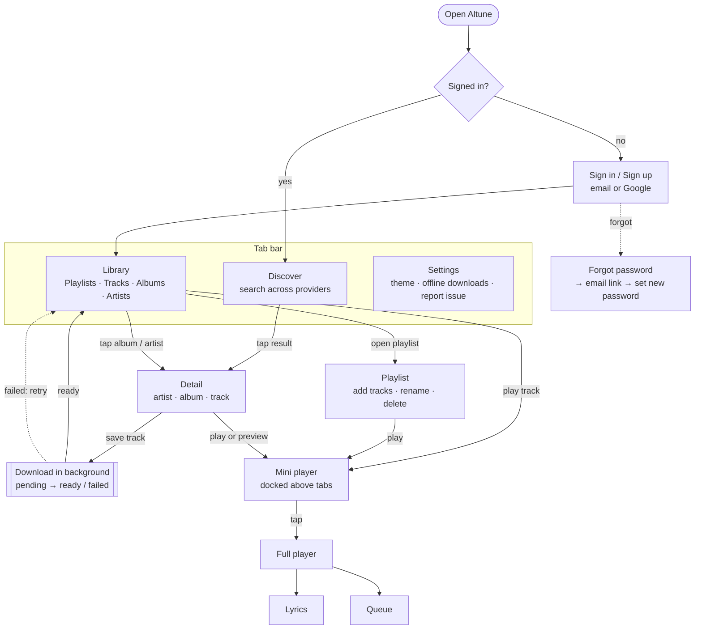

# App

## User flow

What a user can do in the mobile app, screen by screen.

```mermaid
flowchart TD
    open(["Open Altune"]) --> gate{"Signed in?"}
    gate -->|no| signin["Sign in / Sign up<br/>email or Google"]
    signin -.->|forgot| forgot["Forgot password<br/>→ email link → set new password"]
    signin --> library
    gate -->|yes| discover

    subgraph tabs [Tab bar]
        discover["Discover<br/>search across providers"]
        library["Library<br/>Playlists · Tracks · Albums · Artists"]
        settings["Settings<br/>theme · offline downloads · report issue"]
    end

    discover -->|tap result| detail["Detail<br/>artist · album · track"]
    library -->|tap album / artist| detail
    detail -->|save track| acquire[["Download in background<br/>pending → ready / failed"]]
    acquire -->|ready| library
    acquire -.->|failed: retry| library

    library -->|open playlist| playlist["Playlist<br/>add tracks · rename · delete"]
    library -->|play track| mini["Mini player<br/>docked above tabs"]
    playlist -->|play| mini
    detail -->|play or preview| mini
    mini -->|tap| player["Full player"]
    player --> lyrics["Lyrics"]
    player --> queue["Queue"]
```
