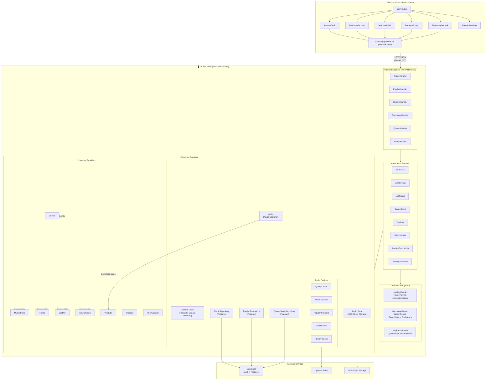

# Altune — System Architecture

## Key Principles

- **Dependencies point inward**: adapters → services → domain. Domain imports nothing from outer layers.
- **Ports defined in application layer**: services depend on interfaces, adapters implement them.
- **Mobile vertical slices**: each feature folder owns its UI, hooks, API calls. Cross-feature reuse goes through shared/.
- **Single deployment**: one Go binary, one Expo app. No microservices yet.
