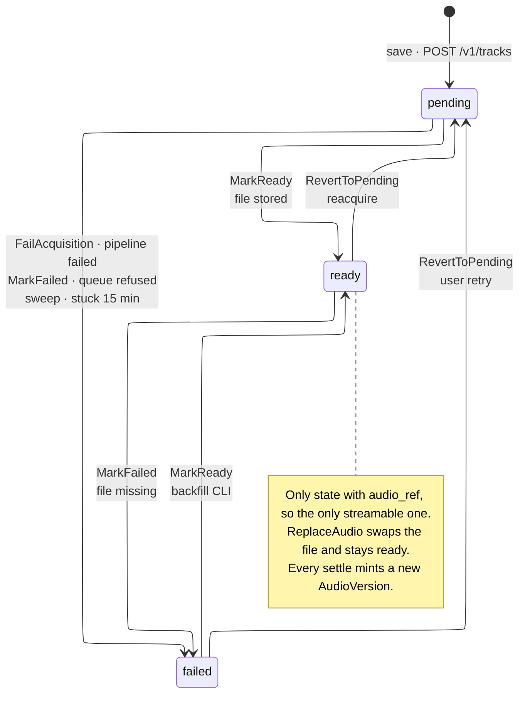
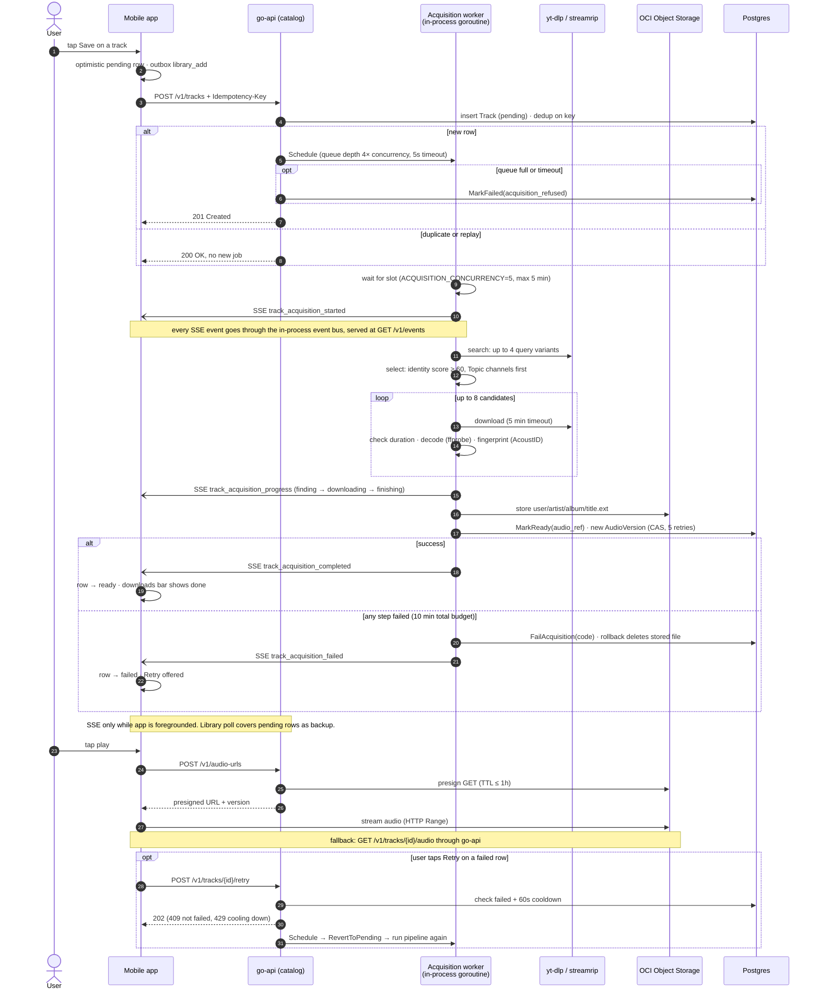

# Catalog and acquisition

## Track acquisition states

The states a saved Track can be in, and the domain method that moves it (`services/go-api/internal/catalog/domain/track.go`).

## Save to play

From tapping Save to hearing the track, including the retry path.

