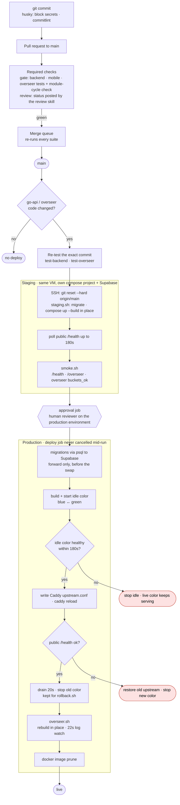
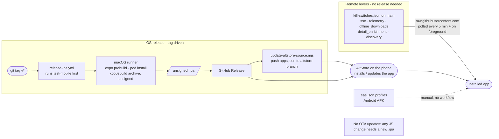

# Delivery

## Backend deploy

From commit to live: PR gate, staging, human approval, blue-green swap. Red boxes are the automatic fallbacks.

## Mobile release

How an iOS build reaches phones, and what can change without a release.

