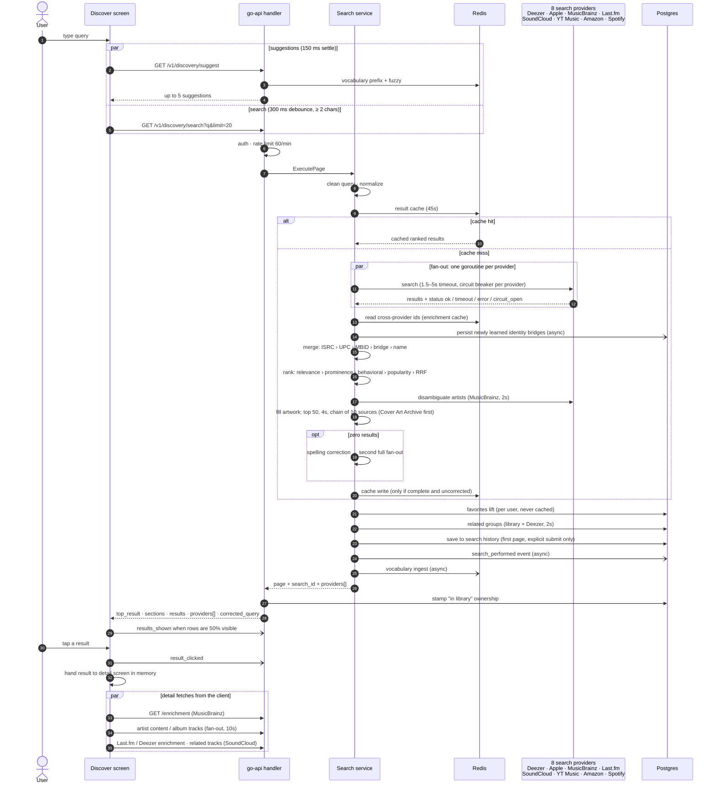

# Discovery

## Search

What happens between typing a query and opening a result's detail screen.

```mermaid
sequenceDiagram
    autonumber
    actor U as User
    participant App as Discover screen
    participant H as go-api handler
    participant S as Search service
    participant R as Redis
    participant P as 8 search providers<br/>Deezer · Apple · MusicBrainz · Last.fm<br/>SoundCloud · YT Music · Amazon · Spotify
    participant DB as Postgres

    U->>App: type query
    par suggestions (150 ms settle)
        App->>H: GET /v1/discovery/suggest
        H->>R: vocabulary prefix + fuzzy
        H-->>App: up to 5 suggestions
    and search (300 ms debounce, ≥ 2 chars)
        App->>H: GET /v1/discovery/search?q&limit=20
    end
    H->>H: auth · rate limit 60/min
    H->>S: ExecutePage
    S->>S: clean query · normalize
    S->>R: result cache (45s)
    alt cache hit
        R-->>S: cached ranked results
    else cache miss
        par fan-out: one goroutine per provider
            S->>P: search (1.5–5s timeout, circuit breaker per provider)
            P-->>S: results + status ok / timeout / error / circuit_open
        end
        S->>R: read cross-provider ids (enrichment cache)
        S-)DB: persist newly learned identity bridges (async)
        S->>S: merge: ISRC › UPC › MBID › bridge › name
        S->>S: rank: relevance › prominence › behavioral › popularity › RRF
        S->>P: disambiguate artists (MusicBrainz, 2s)
        S->>S: fill artwork: top 50, 4s, chain of 10 sources (Cover Art Archive first)
        opt zero results
            S->>S: spelling correction → second full fan-out
        end
        S->>R: cache write (only if complete and uncorrected)
    end
    S->>DB: favorites lift (per user, never cached)
    S->>DB: related groups (library + Deezer, 2s)
    S->>DB: save to search history (first page, explicit submit only)
    S-)DB: search_performed event (async)
    S-)R: vocabulary ingest (async)
    S-->>H: page + search_id + providers[]
    H->>DB: stamp "in library" ownership
    H-->>App: top_result · sections · results · providers[] · corrected_query
    App-)H: results_shown when rows are 50% visible

    U->>App: tap a result
    App-)H: result_clicked
    App->>App: hand result to detail screen in memory
    par detail fetches from the client
        App->>H: GET /enrichment (MusicBrainz)
        App->>H: artist content / album tracks (fan-out, 10s)
        App->>H: Last.fm / Deezer enrichment · related tracks (SoundCloud)
    end
```
