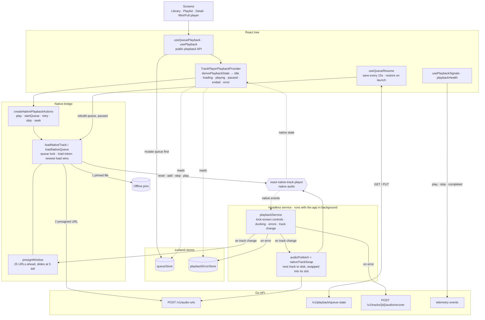
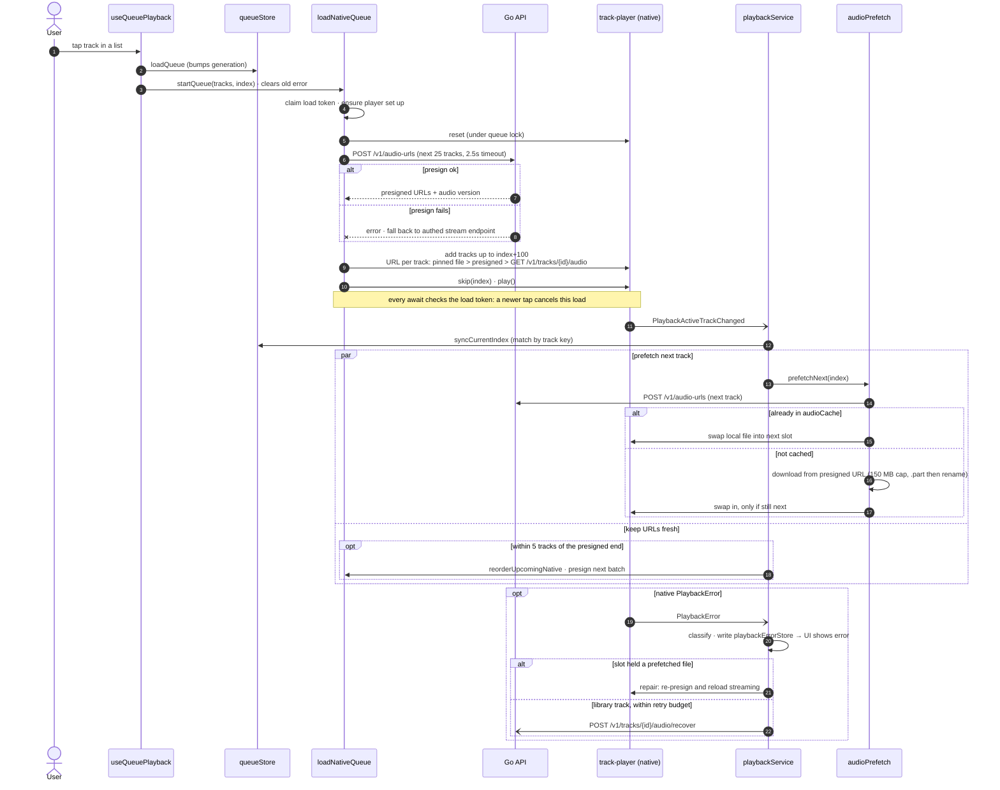
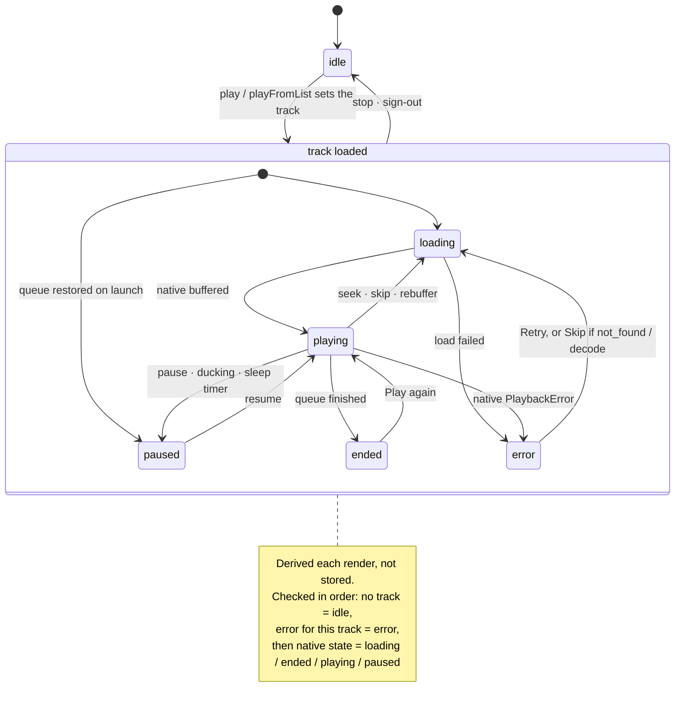

# Playback

## Modules

How the mobile playback modules depend on each other (`apps/mobile/src/features/playback`).

## Tap play

Runtime order when a user plays from a list: native queue load, prefetch, and error recovery.

## Player states

The states `derivePlaybackState` can return and what moves between them.

