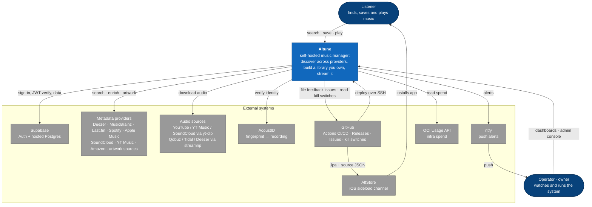
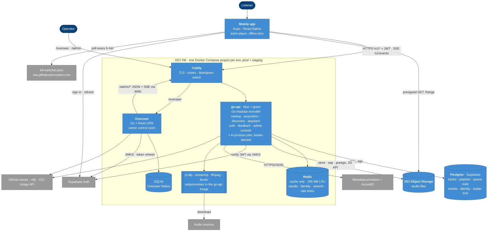

# System

## Context

Who uses Altune and which outside systems it depends on.

```mermaid
flowchart TD
    listener(["Listener<br/>finds, saves and plays music"])
    operator(["Operator · owner<br/>watches and runs the system"])

    altune["<b>Altune</b><br/>self-hosted music manager:<br/>discover across providers, build a library you own, stream it"]

    subgraph ext [External systems]
        supa["Supabase<br/>Auth + hosted Postgres"]
        meta["Metadata providers<br/>Deezer · MusicBrainz · Last.fm · Spotify · Apple Music<br/>SoundCloud · YT Music · Amazon · artwork sources"]
        sources["Audio sources<br/>YouTube / YT Music / SoundCloud via yt-dlp<br/>Qobuz / Tidal / Deezer via streamrip"]
        acoustid["AcoustID<br/>fingerprint → recording"]
        github["GitHub<br/>Actions CI/CD · Releases · Issues · kill switches"]
        ntfy["ntfy<br/>push alerts"]
        altstore["AltStore<br/>iOS sideload channel"]
        ociusage["OCI Usage API<br/>infra spend"]
    end

    listener -->|search · save · play| altune
    operator -->|dashboards · admin console| altune
    altune -->|sign-in, JWT verify, data| supa
    altune -->|search · enrich · artwork| meta
    altune -->|download audio| sources
    altune -->|verify identity| acoustid
    altune -->|file feedback issues · read kill switches| github
    github -->|deploy over SSH| altune
    altune -->|alerts| ntfy
    ntfy -->|push| operator
    altstore -->|installs app| listener
    github -->|.ipa + source JSON| altstore
    altune -->|read spend| ociusage

    classDef sys fill:#1168bd,color:#fff,stroke:#0b4884
    classDef person fill:#08427b,color:#fff,stroke:#052e56
    classDef external fill:#999,color:#fff,stroke:#6b6b6b
    class altune sys
    class listener,operator person
    class supa,meta,sources,acoustid,github,ntfy,altstore,ociusage external
```

## Containers

What runs where: the phone, the OCI VM, Supabase and the audio bucket, and how they talk.

```mermaid
flowchart TD
    listener(["Listener"])
    operator(["Operator"])

    mobile["<b>Mobile app</b><br/>Expo · React Native<br/>track-player, offline pins"]

    subgraph vm [OCI VM · one Docker Compose project per env, prod + staging]
        caddy["<b>Caddy</b><br/>TLS · routes · blue/green switch"]
        api["<b>go-api</b> · blue + green<br/>Go modular monolith<br/>catalog · acquisition · discovery · playback<br/>auth · feedback · admin console<br/>+ in-process jobs, leader-elected"]
        tools[["yt-dlp · streamrip · ffmpeg · fpcalc<br/>subprocesses in the go-api image"]]
        overseer["<b>Overseer</b><br/>Go + React SPA<br/>owner control room"]
        redis[("<b>Redis</b><br/>cache only · 256 MB LRU<br/>results · identity · artwork · rate limits")]
        sqlite[("SQLite<br/>Overseer history")]
    end

    pg[("<b>Postgres</b> · Supabase<br/>tracks · playlists · queue state<br/>events · identity · leader lock")]
    bucket[("<b>OCI Object Storage</b><br/>audio files")]
    auth["Supabase Auth"]
    providers["Metadata providers + AcoustID"]
    sources["Audio sources"]
    extras["GitHub Issues · ntfy · OCI Usage API"]
    ks["kill-switches.json<br/>raw.githubusercontent.com"]

    listener --> mobile
    mobile -->|HTTPS /v1/* + JWT · SSE /v1/events| caddy
    mobile -->|presigned GET, Range| bucket
    mobile -->|sign in · refresh| auth
    mobile -->|poll every 5 min| ks
    operator -->|/overseer · /admin| caddy
    caddy --> api
    caddy -->|/overseer| overseer
    overseer -->|/admin/* JSON + SSE via :8081| caddy
    overseer --> sqlite
    overseer -->|JWKS · token refresh| auth
    api -->|SQL, pgx| pg
    api --> redis
    api -->|store · stat · presign, S3 API| bucket
    api -->|verify JWT via JWKS| auth
    api -->|HTTPS/JSON| providers
    api --> tools -->|download| sources
    api --> extras
    overseer --> extras

    classDef container fill:#438dd5,color:#fff,stroke:#2e6295
    classDef store fill:#438dd5,color:#fff,stroke:#2e6295
    classDef person fill:#08427b,color:#fff,stroke:#052e56
    classDef external fill:#999,color:#fff,stroke:#6b6b6b
    class mobile,caddy,api,overseer,tools container
    class redis,sqlite,pg,bucket store
    class listener,operator person
    class auth,providers,sources,extras,ks external
```
