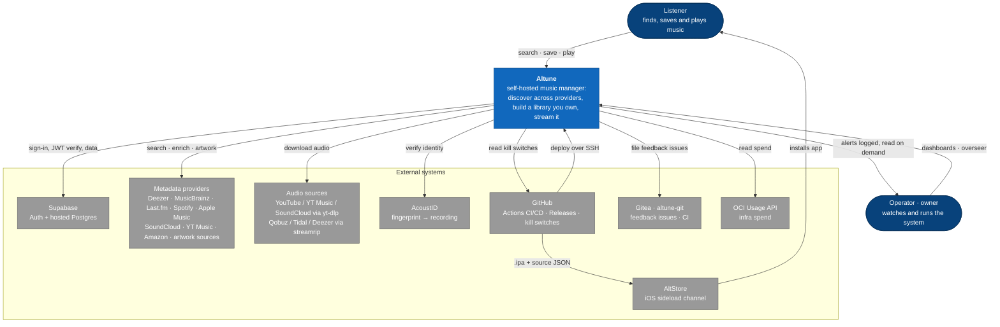
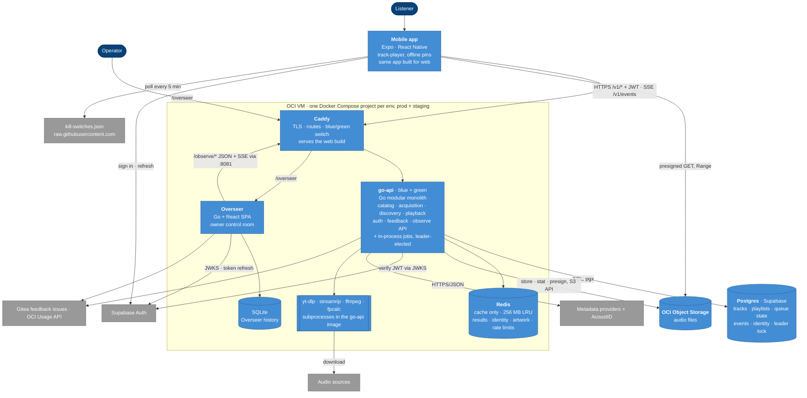
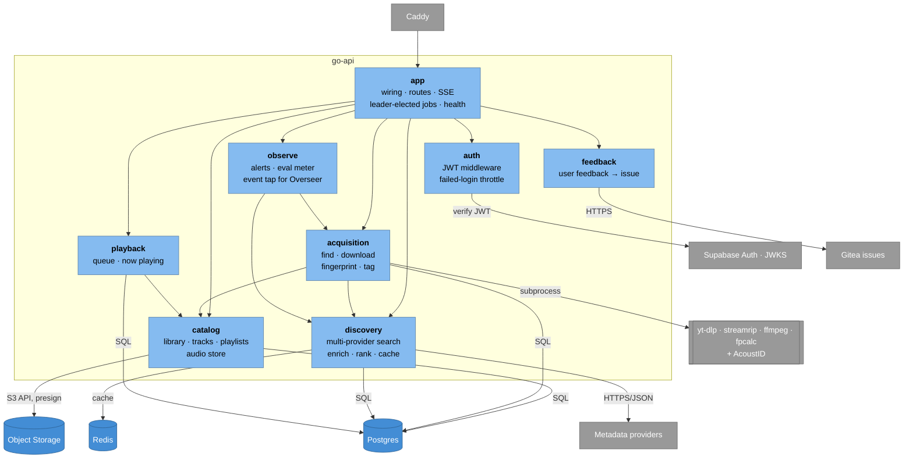

# System

## Context

Who uses Altune and which outside systems it depends on.

## Containers

What runs where: the phone, the OCI VM, Supabase and the audio bucket, and how they talk.

## Components

Inside go-api: one module per bounded context, each hexagonal (`domain` · `ports` · `service` · `adapters`), wired together only in `app`. An arrow is a Go import from `internal/<module>`; every module also uses `shared` (config, database, Redis, logging, exec), left out to keep the picture readable.

