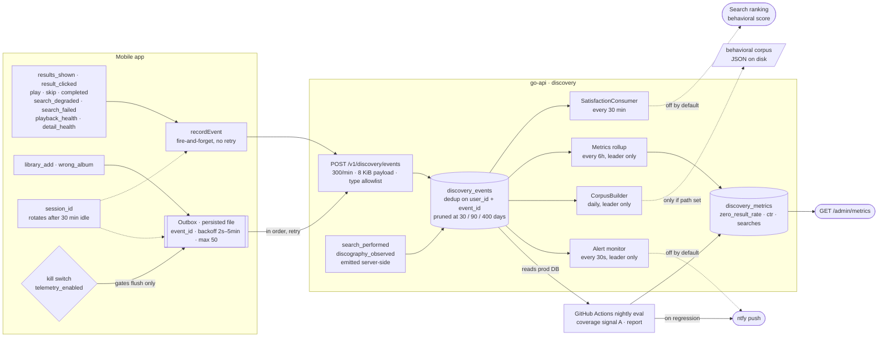
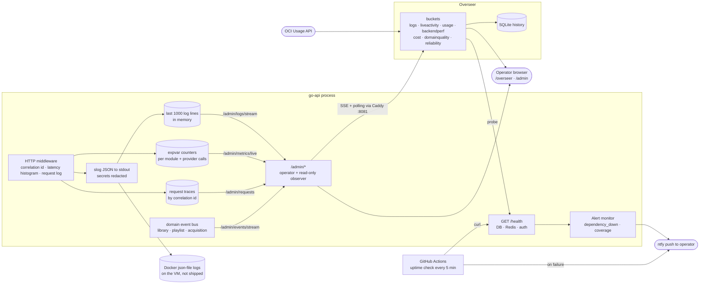

# Telemetry

## Behavioral events

Where app events go and what reads them. Dotted edges are off by default.

```mermaid
flowchart LR
    subgraph app [Mobile app]
        emitters["results_shown · result_clicked<br/>play · skip · completed<br/>search_degraded · search_failed<br/>playback_health · detail_health"]
        critical["library_add · wrong_album"]
        session["session_id<br/>rotates after 30 min idle"]
        ff["recordEvent<br/>fire-and-forget, no retry"]
        outbox[["Outbox · persisted file<br/>event_id · backoff 2s–5min · max 50"]]
        ks{"kill switch<br/>telemetry_enabled"}
    end

    subgraph api [go-api · discovery]
        ingest["POST /v1/discovery/events<br/>300/min · 8 KiB payload · type allowlist"]
        server_emit["search_performed<br/>discography_observed<br/>emitted server-side"]
        events[("discovery_events<br/>dedup on user_id + event_id<br/>pruned at 30 / 90 / 400 days")]
        sat["SatisfactionConsumer<br/>every 30 min"]
        rollup["Metrics rollup<br/>every 6h, leader only"]
        corpus["CorpusBuilder<br/>daily, leader only"]
        alert["Alert monitor<br/>every 30s, leader only"]
        metrics[("discovery_metrics<br/>zero_result_rate · ctr · searches")]
    end

    ranking(["Search ranking<br/>behavioral score"])
    corpusfile[/"behavioral corpus<br/>JSON on disk"/]
    adminm(["GET /admin/metrics"])
    ntfy(["ntfy push"])
    nightly["GitHub Actions nightly eval<br/>coverage signal A · report"]

    session -.-> ff & outbox
    emitters --> ff --> ingest
    critical --> outbox
    ks -->|gates flush only| outbox
    outbox -->|in order, retry| ingest
    ingest --> events
    server_emit --> events
    events --> sat -.->|off by default| ranking
    events --> rollup --> metrics --> adminm
    events --> corpus -.->|only if path set| corpusfile
    events --> alert -.->|off by default| ntfy
    events -->|reads prod DB| nightly
    nightly --> metrics
    nightly -->|on regression| ntfy
```

## Operational

How logs, metrics, alerts and Overseer fit together.

```mermaid
flowchart LR
    subgraph goapi [go-api process]
        mw["HTTP middleware<br/>correlation id · latency histogram · request log"]
        slog["slog JSON to stdout<br/>secrets redacted"]
        ring[("last 1000 log lines<br/>in memory")]
        expvar[("expvar counters<br/>per module + provider calls")]
        reqstore[("request traces<br/>by correlation id")]
        bus["domain event bus<br/>library · playlist · acquisition"]
        health["GET /health<br/>DB · Redis · auth"]
        alertmon["Alert monitor<br/>dependency_down · coverage"]
        admin["/admin/*<br/>operator + read-only observer"]
    end

    docker[("Docker json-file logs<br/>on the VM, not shipped")]
    ntfy(["ntfy push to operator"])
    uptime["GitHub Actions<br/>uptime check every 5 min"]

    subgraph overseer [Overseer]
        buckets["buckets<br/>logs · liveactivity · usage · backendperf<br/>cost · domainquality · reliability"]
        sqlite[("SQLite history")]
    end
    oci(["OCI Usage API"])
    operator(["Operator browser<br/>/overseer · /admin"])

    mw --> slog --> docker
    slog --> ring
    mw --> expvar & reqstore
    ring -->|/admin/logs/stream| admin
    expvar -->|/admin/metrics/live| admin
    reqstore -->|/admin/requests| admin
    bus -->|/admin/events/stream| admin
    health --> alertmon --> ntfy
    uptime -->|curl| health
    uptime -->|on failure| ntfy
    admin -->|SSE + polling via Caddy :8081| buckets
    buckets -->|probe| health
    oci --> buckets
    buckets --> sqlite
    buckets --> operator
    admin --> operator
```
