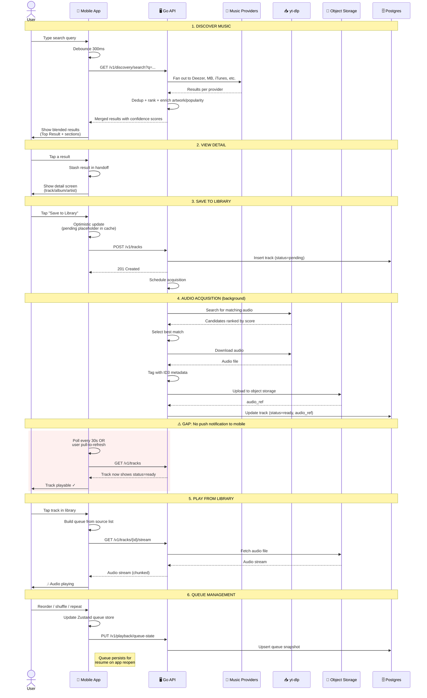

# Altune — User Flow (Happy Path)

## The SSE Gap (highlighted in red)

The red box shows where real-time events would improve UX:

| Current (polling) | With SSE |
|---|---|
| User saves track → waits up to 30s to see "ready" | Server pushes `track.status_changed` → instant UI update |
| Retry acquisition → no feedback | Server pushes progress events → loading indicator |
| Multi-device changes → stale until refresh | Server pushes `library.changed` → auto-refresh |

Domain events already exist (`TrackAddedToLibrary`, status changes). The missing piece is a **transport to push them to the client**.
