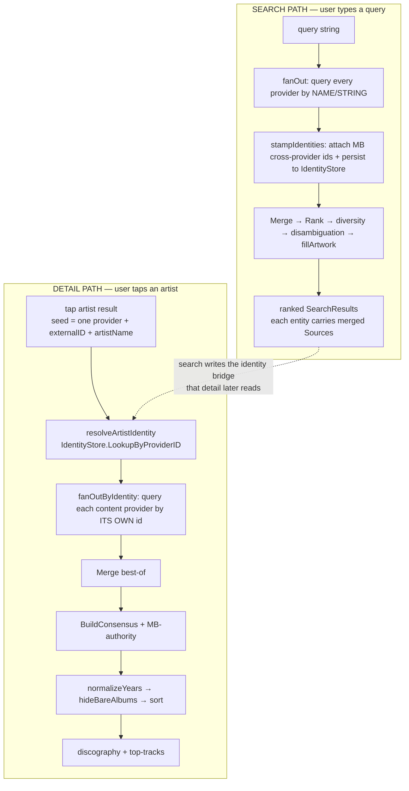
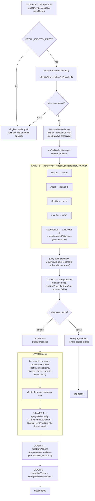

# Discovery detail / discography pipeline — architecture

> Living design doc (2026-07-23). Purpose: see the whole detail/discography flow at once so we can decide which decision-layers to keep, merge, or kill — instead of patching one layer and breaking another (which is exactly how the "wrong-Che discography" regression happened). Pairs with the OKF concept docs (`okf/backend/discovery/`), which describe each subsystem in prose; this doc is the *map between them*.

---

## 1. The two paths

There are two distinct request flows. They share providers and the `Merge` core, but they are **not** the same pipeline.

**Key insight:** the SEARCH path queries providers **by name/string** and leans on `Merge` + MB-bridge to resolve identity. The DETAIL path is supposed to be the opposite — query **by stable id** so a same-name artist can't bleed in. The bugs all live where the DETAIL path *falls back to name* (SoundCloud name-resolve; the by-name consensus fetch) and then can't tell the real artist from a namesake.

---

## 2. The detail / discography pipeline (the part we're redesigning)

### What each layer does — and its failure mode

| Layer | Purpose | Failure mode we've hit |
|------|---------|------------------------|
| **1. Identity id-resolution** (`providerContentID`, `resolveArtistIDByName`) | Get each provider's own id for the artist so we query by id, not name | MB xref never carries a **SoundCloud** id → SC falls back to **name-resolve (top hit)**, which for an ambiguous name ("Che") can be the **wrong person** |
| **2. Merge best-of** (`mergeInto`) | Union provider results; fill each field from whichever provider has it | Sound — but only as good as its inputs. If a provider **drops a field at extraction** (SC year/track-count), best-of has nothing to fill from |
| **3. Consensus by-name** (`BuildConsensus`) | Add completeness: albums the id fan-out missed, fetched by artist name | Name fetch pulls in **same-name contamination**; relies on Layer 4 to filter it |
| **4. MB-authority** (`applyMBAuthority`) | Remove same-name contamination using MB's discography as the spine | **Double-edged**: also **purges REAL releases** MB simply hasn't catalogued (REST IN BASS: ENCORE). This is the load-bearing, dangerous layer |
| **5. hideBareAlbums** | Drop metadata-less broken cards | Mostly benign (SC always has artwork so it's rarely triggered) |
| **6. normalize + sort** | Year display + newest-first ordering | Fine |

---

## 3. Provider participation matrix

Which provider participates in which path, and **keyed by what**. "by id" = identity-safe; "by name" = contamination-prone.

| Provider | Search fan-out | Content fan-out (detail, **by id**) | Consensus (**by name**) | Artwork chain |
|----------|:---:|:---:|:---:|:---:|
| Deezer | ✅ (string) | ✅ id | seed only | ✅ (name) |
| Apple Music | ✅ (string) | ✅ (shared iTunes id) | — | — |
| iTunes | — | — | ✅ name | ✅ (name) |
| Spotify | ✅ (string) | ✅ id | — | ✅ artist img (id) |
| SoundCloud | ✅ (string) | ⚠️ **name-resolved id** | ✅ name | ✅ (name, last) |
| Last.fm | ✅ (string) | ✅ (MBID) | ✅ name | — |
| MusicBrainz | ✅ (string) | — (spine/authority) | ✅ name + **authority** | ✅ CAA (id) |
| YouTube Music | ✅ (string) | ❌ **not wired** | ✅ name | ✅ artist img (id) |
| Amazon Music | ✅ (string) | ❌ not wired | — | — |
| Discogs | — | — | ✅ name | ✅ (id) |
| TheAudioDB | — | — | — | ✅ (id) |

**Two things this table surfaces immediately:**
1. **YouTube Music is in search + consensus but NOT the content fan-out** — yet it maps `year` (we confirmed `mapYTMusicAlbum` sets `r.Year`). Its discography never reaches the detail screen by id.
2. **SoundCloud is the only content-fan-out provider reached by name**, not id — the single contamination vector in a path designed to be id-only.

---

## 4. Where display metadata gets lost (the extraction question)

The merge best-of (Layer 2) can only surface a field if **some provider's mapper extracted it**. The existing `docs/providers/maximization-audit-2026-06-22.md` audited **identity keys** (ISRC/UPC/MBID) and **coverage** — it did **not** audit displayable fields (year, track-count, duration, record-type, label, explicit). That's the gap the SoundCloud year/track-count miss lived in for weeks.

Field-level extraction audit (2026-07-23, code-cited). Ranked drops — a **DROPPED** field is returned by the API and thrown away; **PARTIAL** is decoded-but-lossy. These are fix targets:

| # | Provider | Field | Status | Site |
|---|----------|-------|:---:|------|
| 1 | **YouTube Music** | explicit flag (track **and** album) — *parsed into the struct, then ignored by the mapper* (the exact SoundCloud pattern) | DROPPED | `ytmusic.go:183-189, 232-235` (fields at `ytmusic_client.go:78,96`) |
| 2a | **Deezer** | track `explicit_lyrics` — not even decoded | DROPPED | `deezer.go:161-181, 105-117` |
| 2b | **Deezer** | album genre stored as raw numeric `genre_id`, not a display name | PARTIAL | `deezer.go:127-129` |
| 2c | **Deezer** | search results ship 500px art while 1000px (`cover_xl`) is already in hand | PARTIAL | `deezer.go:111,123,132` |
| 3a | **iTunes** | album `record_type` never set — despite the code already knowing the "- Single"/"- EP" suffixes | DROPPED | `itunes.go:160-168` (suffixes at `:368`) |
| 3b | **iTunes** | track release date omitted (album branch sets it, track branch doesn't) | DROPPED | `itunes.go:178-183` |
| 4a | **Spotify (content)** | `album_type` collapsed to single-only; album/compilation dropped | PARTIAL | `spotify_content.go:152-154` |
| 4b | **Spotify (content)** | album artist subtitle blank (artists[] not decoded) | DROPPED | `spotify_content.go:155` |
| 4c | **Spotify (content)** | track release date dropped (embedded album decodes only name+images) | DROPPED | `spotify_content.go:128-131` |
| 5a | **Apple Music** | album `record_type` single-only (regular albums/EPs unlabeled) | PARTIAL | `applemusic.go:273-275` |
| 5b | **Apple Music** | artwork hard-capped at 500px; Apple serves up to 3000px (contrast iTunes' 1500px hero) | PARTIAL | `applemusic.go:43,249,281,300` |
| 5c | **Apple Music** | only first genre kept | PARTIAL | `applemusic.go:232,264,292` |
| 6 | **MusicBrainz** | recording `length` (duration) not decoded; secondary-types (compilation/live) dropped | DROPPED | `musicbrainz.go:301-306, 353` |
| 7 | **Spotify (search)** | albums ship blank artist subtitle (query never requests artists) | DROPPED | `spotify.go:364, 283-290` |
| 8 | **TheAudioDB** | genre/bio/country/formed-year all dropped (marginal — artist-only, artwork use) | DROPPED | `theaudiodb.go:36-40` |

**Fixed 2026-07-23 (extraction batch):** SoundCloud `release_date`+`track_count`; YT Music explicit (#1); Deezer track explicit + 1000px artwork (#2a,2c); iTunes album record_type + track release date (#3a,3b); Spotify content album_type + album artist + track release date (#4a,4b,4c); Apple Music album record_type default (#5a); MusicBrainz recording duration + secondary-types (#6). **Deferred (tuning/risk, not dropped data):** Deezer genre_id→name (needs extra fetch, #2b); Apple artwork resolution + multi-genre (#5b,5c — touches shared payloads/consumer type); Spotify search album artist (#7 — touches search merge keys, needs eval gate); TheAudioDB (#8 — marginal). None of the shipped changes touch ranking inputs, so no eval-gate needed.

**Cross-cutting patterns the table reveals:**
- **"Parsed then discarded"** (YT explicit, the SC year miss): the field is *in the response struct*, the mapper just doesn't copy it. Cheapest, safest fixes.
- **`record_type` is unreliable across the board** — iTunes never sets it, Spotify/Apple only flag "single". This is *directly* why album/single/EP bucketing is "better but not perfect": most providers under-label, so the section grouping falls back to whatever one provider said.
- **Artwork resolution left on the table** — Deezer (500 vs 1000), Apple (500 vs 3000). Hero images render softer than they could.
- **Album artist blank on both Spotify paths** — a whole subtitle dropped.

---

## 5. Open design questions (what the diagram is *for*)

The core tension is **Layer 4 (MB-authority)**. It is simultaneously:
- the **only** thing filtering same-name contamination from the by-name consensus fetch, and
- a **purger of real releases** MB hasn't catalogued.

We tried making the id-fan-out primaries immune to it (`protectPrimaries`) → contamination leaked through because a wrong SC name-resolve produced "primaries" that weren't the artist's. **Reverted.**

The redesign should decouple those two roles. Candidate directions to evaluate against the diagram:

1. **Confidence/corroboration-based keeping** instead of MB-veto. Keep an album if it is (a) on ≥2 **identity-safe** providers (id fan-out agreement), OR (b) a high-confidence id match — *regardless* of MB. Reject only single-source **name-fetched** albums MB contradicts. This keeps ENCORE (2+ id providers) and drops namesakes (name-only, MB-contradicted).
2. **Make SoundCloud id-safe.** The name-resolve top-hit is the contamination root. Options: (a) skip SC name-resolve when MB flags the name as ambiguous; (b) verify the resolved SC artist against a corroborating signal (shared track title / ISRC) before trusting it; (c) persist the SC id into the IdentityStore during search-merge when SC provably merges into the MB entity, so detail resolves it by id, never by name.
3. **Add YouTube Music (and Amazon) to the content fan-out** — but only if their id is bridgeable; otherwise they inherit SoundCloud's name problem.
4. **Separate "coverage" from "authority."** MB as a *vote* (adds corroboration weight) rather than a *veto* (removes) — matching the "every provider is an equal source, MB is the only one that removes" doctrine that may itself be the thing to revisit.

Each of these is a *layer change*, not a patch. Decide here, on the map, before touching code.
