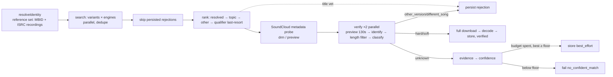

# Acquisition overhaul

## Outcome, what the person gets
Right now, a well-known song can fail to acquire. *Drinking in L.A.* failed because the pipeline trusted one guessed MusicBrainz recording, spent a full download on every rejection, and repeated the same failed walk when retried. After this work, a track that exists on a reachable source gets acquired, and it's the right recording, not a remix, live cut or 30s preview. Acquisition is faster. Retries learn from what failed before. Every stored track carries evidence and a confidence score, so the operator can tell a verified match from a best guess. An instrumental, a reaction video or a slowed edit is never stored in place of the song, which is happening today: *Rollacoasta* (prettifun) was stored as `verified` from "prettifun - Rollacoasta (Instrumental) [100% Accurate]", and *SPEED DEMON* (Lucy Bedroque) as `corroborated` from "SPEED DEMON (Instrumental)". Done means: the eval, fed real-world cases, shows fewer wrong or failed acquisitions and less time per track than today's baseline, and *Drinking in L.A.* acquires on staging.

## Appetite, the declared budget
18 tickets, 6 waves.

## Scope
### In
- **(8) A real eval, built first so every later change is measured.**
  - The harness runs the real `resolveIdentity` against a fake recording resolver and ISRC authority, instead of injecting identity at `service/eval/harness.go:80-87`.
  - It runs several named sources in registry order, runs query variants against each source, and keeps a simulated clock so time-to-acquire and attempts are scored.
  - A capture command, `acquisitioneval capture <track-id>`, plus `scripts/acq-debug.sh capture`, turns a real acquisition (DB row plus `candidate_evaluated` and rejection log lines) into a golden JSON that the operator reviews and commits.
  - New `goldens/realworld.json`, seeded with *Drinking in L.A.* (the remix-MBID case) and other captured failures.
  - `baselines.json` gains time and attempt metrics.
- **(1) Identify, then compare (approach C), and doubt the reference (approach D).** This replaces the single-MBID fingerprint check.
  - `RecordingIdentity` carries the reference set: the resolved MBID, plus every recording MusicBrainz lists for the ISRC, plus the track's own length and qualifiers.
  - `chromaprint.Identify` asks AcoustID with `meta=recordings releasegroups` and returns every result at or above the score floor, each with its linked recordings (title, artists, length).
  - **Length filter:** keep only linked recordings whose length is within max(5s, 3%) of the audio's full length. In the study this removed every live, extended and medley link.
  - **Classify** the audio against the surviving recordings. The verdict is one of:
    - `hard`: a recording is in the reference set.
    - `soft`: same core title after normalisation, no extra qualifiers, artist overlap, and length consistent with the track.
    - `other_version`: the linked title carries a qualifier the track didn't ask for.
    - `different_song`: the fingerprint matched, but no linked recording fits.
    - `unknown`: AcoustID has no match.
  - **Trust:** one surviving link that agrees is enough. When most surviving links name a different song, the verdict is `different_song`.
  - **Doubt the reference (D):** when the resolved MBID's own length or qualifiers disagree with the track (the *Drinking in L.A.* remix MBID, 307s against 236s), the ISRC set wins and the mismatch is logged as `acquisition.reference_doubted`.
  - No AcoustID cluster unions and no work-level siblings. The study showed clusters are loose, with up to 17 links, *Thinking in L.A.* among them.
  - A failed AcoustID lookup degrades to `unknown`, never to an accept.
- **(6) Retries that learn.**
  - A new `acquisition_rejections` store records every candidate rejected for a lasting reason: identity, qualifier, duration, fingerprint mismatch, preview, DRM, or undecodable. Transient download errors are not recorded.
  - Plain `Execute` (the retry path) skips those keys, and `ExecuteReplace` merges them with `rejected_source_keys`.
  - Entries expire after 30 days. When every candidate is excluded, the walk falls back to trying them anyway.
- **(2) Cheap attempts, in parallel.**
  - yt-dlp fetches only the first ~130s (`--download-sections "*0-130"`). `fpcalc` fingerprints only the first 120s by default, so the fingerprint matches the one from a full download.
  - The AcoustID lookup sends the candidate's full duration, not the preview's.
  - A full download happens only once the preview has passed the fingerprint and qualifier checks.
  - If the section download fails, the attempt falls back to a full download.
  - Up to 2 candidates per track are verified concurrently, under a global download limit of 6 (`ACQUISITION_DOWNLOAD_CONCURRENCY`).
  - The winner is deterministic: the best-ranked accepted candidate, not whichever finishes first.
- **(3) Search coverage.**
  - The yt-dlp source runs every query variant against each engine concurrently (bounded), merges, dedupes, and then ranks.
  - The `EnoughCandidates` early stop at `ytdlp/source.go:267` no longer lets the ISRC query crowd out the title/artist queries.
- **(4) Version and junk detection by title, which the fingerprint cannot do.**
  - Qualifier words are found anywhere in the candidate title, not only inside brackets. The lexicon has two families:
    - **Veto family:** instrumental, karaoke, acapella, remix, mix, live, cover, slowed, reverb, sped up, nightcore, 8d, reaction, reacts, leak, snippet, "in the booth", type beat, and "100% accurate".
    - **Fallback family:** edit, radio edit, extended, and version.
  - The veto family is never stored unless the track's own title asks for it. That holds even when the fingerprint says `hard`: the *Rollacoasta* instrumental fingerprinted to the vocal recording at score 0.908.
  - The fallback family may be stored only as `best_effort`, only when no clean candidate passed, and only when its length matches the track's metadata.
  - The source title of every stored candidate is saved in its evidence, so a later audit can re-check it.
- **(4b) Audit what's already in the library.**
  - `acq-debug.sh audit-qualifiers` is read-only. For ready tracks, it fetches the source title (YouTube oEmbed, SoundCloud metadata) and lists every track whose source title carries a veto qualifier the track didn't ask for.
  - Re-acquiring the tracks it lists writes to prod, so it needs the operator's yes per batch.
- **(5) SoundCloud previews and DRM, caught before download.**
  - Each SoundCloud candidate gets a cached, non-flat `yt-dlp -J` metadata probe.
  - DRM-only formats are rejected as `drm`, and snipped or 30s previews as `preview`, without spending an attempt.
- **(7) Confidence from evidence.**
  - Each verified candidate gets an Evidence record: the C verdict (hard, soft, other_version, different_song or unknown) with its AcoustID score, ISRC-set hit, duration delta, channel (Topic or artist), qualifier status, and whether it's a resolved source. That becomes a 0–1 confidence.
  - Policy: `hard` accepts immediately as `verified` (confidence around 0.95). `soft` accepts as `verified` with lower confidence (around 0.85). `other_version` and `different_song` reject. A top AcoustID score below 0.92 (the study's bottom 10%) lowers confidence but never vetoes on its own. For `unknown`: the walk continues within the budget, then stores the best candidate as `best_effort` if its confidence is at least the floor. Below the floor it fails with `no_confident_match`.
  - Confidence and evidence are saved on the track (additive migration), logged, and shown by `acq-debug.sh track`. Job timing already lands in `acquisition_outcomes` (#3127). That table is the time baseline, and the confidence work does not duplicate it.
- **Docs.** `internal/acquisition/ARCHITECTURE.md` is updated: §4 pipeline, §6 invariants, and §7 (closes 7.5, 7.6, 7.7 and 7.11). Its existing drift (54 vs 56 cases, the pre-download duration check) is fixed too.
- **A separate standalone bug ticket, filed alongside the epic but not in it.** Discovery's `merge.go` title-only merge must not import an MBID; that merge is what paired the ISRC with the remix.

### Out
- A confidence badge or "try another source" UI in the mobile app. It's a different job (surfacing acquisition data), and it's deferred by decision 3.
- New audio sources beyond yt-dlp, ytmusic and streamrip. Adding sources is its own job, and this work is about deciding well among the candidates we already have.
- Replacing AcoustID or MusicBrainz as identity authorities. They stay the trust anchors.

## Pre-mortem
- It failed because `--download-sections` turned out slow or broken on YouTube (DASH seeking, ffmpeg re-encode), so preview attempts cost as much as full ones.
- It failed because soft agreement let a same-titled but different recording through (a re-record or a sibling version), since AcoustID links are noisy.
- It failed because running more downloads at once, plus parallel search, tripped YouTube's bot check on the shared VM and took down acquisition for staging and prod together.

## Risks
- **Migrations:** 027 adds the `acquisition_rejections` table, and 028 adds `tracks.acquisition_confidence` and `acquisition_evidence`. Both are additive; to back out, drop them. The same runner applies them to staging and then prod.
- **Behaviour change:** the confidence floor fails tracks that are silently accepted today when their evidence is weak. It's measured on the eval and on staging before prod. The floor is a config knob.
- **More outbound calls:** there are more AcoustID lookups (a cluster per set member, at most 5, cached) and more MusicBrainz ISRC lookups (behind the shared 1 req/s limiter). The AcoustID client gets a 3 req/s limiter.
- **Pre-mortem answers:**
  - Section downloads: already measured on staging. A ~130s preview took p50 22.8s, p90 37.1s, max 48.3s across 69 tracks. A failed section download falls back to a full download, so the worst case is today's cost.
  - Loose matching: soft agreement requires the length filter, the same core title with no extra qualifiers, and artist overlap. The title veto runs independently of the fingerprint. Real-world goldens gate it: remix, live, instrumental and medley decoys taken from the 69-track staging study, plus *Rollacoasta* and *SPEED DEMON*.
  - Bot checks: the global limit is 6, set by config; searches are bounded to 4 at once. The existing source-dark paging (9f72ceca) and canaries alert, and lowering `ACQUISITION_DOWNLOAD_CONCURRENCY` to 1 restores today's load.

## Build
Extends `internal/acquisition` (service, ports, the ytdlp and chromaprint adapters, and the discoverybridge resolver) and `services/go-api/migrations`. No new service or infrastructure.
- **Data (lens):** rejections go in their own table (`track_id` FK cascade, `source_key`, `reason`, `detail`, `rejected_at`, unique on `(track_id, source_key)`), written by the acquire service. A table is better than widening `rejected_source_keys TEXT[]`: it needs a reason per key and an expiry, and an array can't hold either without parallel arrays.
- **Coupling (lens):** the reference set comes through the existing `RecordingResolver` port. Only the `RecordingIdentity` shape grows (`MBIDs []string`), and `RecordingMatch` grows to `Results []AcoustIDResult{ID, Score, Recordings []LinkedRecording{MBID, Title, Artists, Duration}}`. Classification is a pure function in the service package (acquisition has no domain package), `ClassifyAudio(ref AudioReference, audioDuration float64, results []ports.AcoustIDResult) AudioVerdict`, so it is table-tested without the network. The service stays behind ports.
- **Hot path (lens):** acquisition is a background job, not on the request path. The added cost is outbound lookups, which are cached and limited.
- **Failure (lens):** a failed ISRC lookup, AcoustID lookup or metadata probe degrades to today's behaviour, never to a hard failure. Only the confidence floor is fail-closed, and that's by decision.
- **Infra (lens):** none new. It uses yt-dlp flags and fpcalc as they are.

## First slice
The eval runs the real identity resolution, and the *Drinking in L.A.* golden goes in. The operator runs `go run ./cmd/acquisitioneval -v` and sees the real-world class scored. The golden reproduces the remix-MBID trap through the resolver: it fails with #3130 reverted and passes with #3130. CI's acquisition gate runs it on every PR. Every later slice is measured against this.

## Must-holds
1. Audio whose fingerprint hits any recording registered to the track's ISRC is accepted, even when the resolved MBID is a different recording. [repo-test: services/go-api/internal/acquisition/service/eval/goldens/realworld.json]
   - Example: *Drinking in L.A.*, ISRC CAA509814003, resolved MBID the "(Who Mix?)" remix d3dc2825; a candidate fingerprinting to AcoustID 5d5d307d, which links 5d6efd30 → stored with provenance `verified`.
2. A candidate whose linked recordings, after the length filter, all carry an unrequested qualifier or a different title is never stored while any other candidate is still untried within the budget. [repo-test: services/go-api/internal/acquisition/service/audio_verdict_test.go]
   - Example: Pavarotti "Nessun dorma" candidate whose surviving links are live recordings → `other_version`, rejected. A candidate whose AcoustID links both a 220s and a 342s recording, for a 236s track → only the 220s link survives the length filter.
3. A plain retry never downloads a candidate rejected for a lasting reason in the last 30 days, unless nothing else is left. [repo-test: services/go-api/internal/acquisition/service/acquire_test.go]
   - Example: the retry of track 3b0fe67b after soundcloud.com/bran-van-3000/drinking-in-l-a-3 was rejected as `drm` → that URL is not attempted.
4. With an `unknown` verdict, a candidate is stored only when its confidence is at least the floor, and then as `best_effort`, never `verified`. [repo-test: services/go-api/internal/acquisition/service/eval/goldens/verification.json]
   - Example: unknown fingerprint, Topic channel, duration within 2s → stored as `best_effort` with confidence ≥ 0.5. Unknown fingerprint, non-Topic channel, 20s off → fails as `no_confident_match`.
5. A candidate whose title carries a veto-family qualifier the track didn't ask for is never stored, even when its fingerprint verdict is `hard`. [repo-test: services/go-api/internal/acquisition/service/eval/goldens/realworld.json]
   - Example: track "Rollacoasta" by prettifun, candidate "prettifun - Rollacoasta (Instrumental) [100% Accurate]" fingerprinting to the vocal recording b29ac684 at 0.908 → rejected as `qualifier`. "Lucy Bedroque - SPEED DEMON (Instrumental)" → rejected. "ImDontai Reacts To Drake 8AM In Charlotte" → rejected.
6. A preview fingerprint is looked up with the candidate's full duration, not the preview's length. [repo-test: services/go-api/internal/acquisition/adapters/chromaprint/identifier_test.go]
   - Example: a 130s preview of a 236s candidate → the AcoustID request carries `duration=236`.
7. No more than `ACQUISITION_DOWNLOAD_CONCURRENCY` downloads run at once across all tracks, and the stored candidate is the best-ranked one that was accepted. [repo-test: services/go-api/internal/acquisition/service/step_download_test.go]
   - Example: limit 6, three tracks with 2 candidates in flight each, a 7th waits. Candidates ranked 1 and 2 both accepted, with rank 2 finishing first → rank 1 is stored.
8. SoundCloud DRM and preview candidates are rejected before any download. [repo-test: services/go-api/internal/acquisition/adapters/ytdlp/source_test.go]
   - Example: a metadata probe of soundcloud.com/bran-van-3000/drinking-in-l-a-3 showing only encrypted formats → rejected as `drm`, and the downloader is not called.
9. The ISRC query never stops the title/artist queries from running. [repo-test: services/go-api/internal/acquisition/adapters/ytdlp/source_test.go]
   - Example: the ISRC query returns 10 hits → the "title artist" and "title artist audio" queries still run, and their candidates are merged.
10. Soft agreement is stored as `verified` only when the core title matches with no extra qualifiers, the artists overlap, and the length is within tolerance. [repo-test: services/go-api/internal/acquisition/service/audio_verdict_test.go]
    - Example: Cutting Crew "(I Just) Died in Your Arms" audio linking a sibling recording of the same title and length, not the ISRC's recording → `soft`, stored as `verified` with confidence below `hard`'s.
11. An edit or radio edit is stored only as `best_effort`, only when no clean candidate passed, and only when its length matches the track. [repo-test: services/go-api/internal/acquisition/service/eval/goldens/selection.json]
    - Example: a 236s track with a clean 237s Topic upload and a "(Radio Edit)" 205s upload → the Topic upload is stored. With only the radio edit available → fails as `no_confident_match`, because the length disagrees.
12. The acquisition eval never scores below its baseline on accuracy, simulated time-to-acquire, or attempts. [repo-test: services/go-api/cmd/acquisitioneval/baselines.json]
    - Example: a change that stores the remix for *Drinking in L.A.* → `acquisitioneval -baseline` exits non-zero in CI.

## Expected signals
- **Endpoints:** no API or page changes. `GET /v1/tracks/{id}` and the status endpoints keep their shape; confidence is stored but not returned (decision 3).
- **Logs:** new `acquisition.audio_verdict` (the verdict, score and surviving links), `acquisition.reference_doubted`, `acquisition.preview_fingerprint`, `acquisition.candidate_skipped_prior_rejection`, `acquisition.candidate_rejected_drm` / `_preview`, and `acquisition.confidence` (with evidence) lines. The `rejection_summary` gains `drm`, `preview` and `qualifier` counts.
- **Telemetry:**
  - On staging, the share of failed tracks whose summary shows fingerprint rejections drops toward 0 for tracks that have an ISRC.
  - The median `elapsed_ms` of succeeded rows in `acquisition_outcomes` (#3127) falls to under half of the pre-overhaul median.
  - `acq-debug.sh audit-qualifiers` finds zero new veto-qualifier sources among tracks acquired after (4) ships.
  - The eval's real-world class accuracy rises from its first baseline.
- **Everything else stays the same:** ready tracks still stream, and the reacquire flow still excludes the source it was serving.

## Decisions
- **Q1, soft agreement** (operator): soft counts as `verified`, at lower confidence than hard, and only with title, qualifier, artist and length all agreeing.
- **Q2, unrequested versions** (operator): the veto family (remix, live, cover, instrumental, slowed, sped up, reaction and the rest) is never auto-accepted. Edit and radio edit are allowed as a `best_effort` fallback only when their length matches.
- **Q3, AcoustID trust** (operator): links are trusted only after the length and title checks. One agreeing link is enough, a majority pointing elsewhere is `different_song`, and a reference that disagrees with the track loses to the ISRC set.
- **Evidence** (staging study, 69 tracks): hard agreement accounts for about 40% of correct audio, and soft for most of the rest. About a third of candidates are unknown to AcoustID. Instrumentals fingerprint as the vocal recording (*Rollacoasta*, 0.908). A ~130s preview downloads in 23s at the median.
- **Operator note:** this algorithm will be revisited again; the eval and evidence logs exist so the next pass starts from data.
- **No fingerprint match** (operator accepted the default): keep searching within the budget, then store the best-evidence candidate as `best_effort` if its confidence ≥ floor (config, starts at 0.5). Otherwise fail with `no_confident_match`.
- **Parallelism** (operator accepted the default): 2 candidates per track, and a global download limit of 6 via `ACQUISITION_DOWNLOAD_CONCURRENCY`. Attempts become cheap because they fetch only a ~130s preview.
- **UI** (operator accepted the default): no app changes. Confidence is saved on the track and shown in logs and acq-debug; the badge is a follow-up.
- **Order** (operator): 8 → 1 → 6 → 2 + 3 → 4, 5, 7.
- **Default:** rejection expiry is 30 days, and the reference set is capped at 5 MBIDs.
- **Default:** the capture tool writes a golden for the operator to review. It's never auto-committed.
