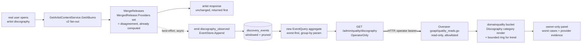

# Domain quality — deepening — design

Brief: `docs/drafts/domain-quality-deep.md`. Platform: `docs/overseer-design.md`. Enabler pattern
precedent: `docs/drafts/metrics-enabler-design.md`. Shipped bucket: `docs/features/domain-quality/`.

Design settles the *how*, read against the real code; it does not re-open the *what*.

## Anchor & inherited invariants (not re-argued)

- **Anchor:** open the bucket and current domain-quality problems pop out as real failing cases,
  each carrying the signal to act, without pre-naming what to watch for.
- **Spine from shape:** observe-only / no-act · disagreement-is-a-hint · bounded storage ·
  production data windowed+anonymized · owner-only · independent degrade · render-escaping · additive.
- **Platform spine:** Overseer never imports go-api internals nor touches its DB; it reads only
  go-api's operator HTTP surface; buckets are Collect/Store/Render plugins; analysis lives next to
  the data (in go-api), the bucket renders verdicts.

## Grounded in (real code)

**go-api — the signal already exists at the merge point:**
- Production discography fan-out: `GetArtistContentService.GetAlbums` → `v2Albums` → `fanOutByIdentity`
  (`internal/discovery/service/get_artist_content.go:88,185`; `get_artist_content_v2.go:11`). Per-provider
  results are the pre-merge `groups [][]domain.SearchResult` (`get_artist_content.go:122,149`).
- **The disagreement is computed today:** `MergeReleases` (`internal/discovery/service/release_merge.go:20`)
  collapses per-provider groups into `[]MergedRelease`, and `MergedRelease.Providers map[ProviderName]bool`
  (`release_merge.go:15`) is exactly the set of providers that supplied each release. `len(Providers)==1`
  = contamination suspect; per-provider album-count gap = incompleteness gap. Legacy path stamps the same
  verdict as `consensus_status` (`consensus.go:130-133,256-265`).
- Persisted event pattern: `domain.InteractionEvent` + `EventType` enum (`domain/events.go:82,25-54`);
  server-only events excluded from `ClientSubmittable` (`events.go:63`); write via `EventStore.Append`
  → `PgxEventStore.Append` (`ports/ports_telemetry.go:24`; `adapters/persistence/event_repo.go:49`).
  Precedent: `SearchTelemetry.emit` persists `search_performed` (`service/telemetry.go:36`).
- Aggregate-query pattern: `ports.EventQuery` JSONB aggregates (`ports_telemetry.go:63`;
  `event_repo.go:101-302`). Offline analogue already exists: `CoverageSignalBService.clusterEntities`
  reports per-provider presence / "provider imbalance" (`service/eval/coverage_signal_b.go:143,181`);
  `detail_eval.go:57-60` already defines `detail.contamination` / `detail.album_recall`.
- Operator surface: `/admin/*` behind `OperatorOnly` (`internal/app/admin_wiring.go:59-67`); routes in
  `internal/admin/handler/admin_handler.go:90-114`; `serveMetricsHistory` is the aggregate-read precedent
  (`admin_handler.go:108`, `metrics_handler.go:25`).

**Overseer — the thin reader:**
- Plugin contract Collect/Store/Render (`services/overseer/internal/core/bucket.go:32`); bounded
  `RingStore` (`core/store.go:25`); guarded read client with host-pin + operator bearer + bounded body +
  observe-only allowlist (`internal/goapi/client.go`, `eval_reads.go`, `observeonly_test.go`). A new read =
  a new additive file like `eval_reads.go`; a new render = the bucket's `Render` building escaped HTML.

## Significance

**Significant.** It forces: a new persisted signal recorded on a production request path, a new operator
aggregate endpoint + query, a new cross-service read, and windowed/anonymized retention. Walk the lenses.

## The shape

## Design decisions (lens by lens)

**Boundaries — two pieces, the boring split.** (1) A go-api **enabler**: emit + persist + aggregate +
serve the disagreement signal, all inside go-api's existing discovery + admin modules. (2) A **thin
Overseer deepening**: one new read file + the Discography category render. The recording attaches as a
constructor-injected `ports.EventStore` collaborator on `GetArtistContentService`, mirroring
`SearchTelemetry` — no new module, no new store type.
- *Over:* compute disagreement in the Overseer from raw provider data — rejected: it would force
  go-api to stream per-provider release lists out and rebuild the merge outside the domain, breaking
  "analysis lives next to the data" and the bucket's read-the-verdict rule.
- *Over:* a brand-new admin module for quality — rejected: it's a new event type + one aggregate + one
  route on the existing discovery/admin seams. Boring wins.

**Data & state — reuse `discovery_events`, don't invent a store.** The signal is a new server-emitted
`InteractionEvent` type (`discography_observed`) written through the existing `EventStore.Append`, with a
payload carrying: resolved artist ref, release count, single-provider (contamination-suspect) count, and
per-provider album counts. Read back by a new `EventQuery` aggregate method (JSONB over `payload`).
- *Over:* a new dedicated table — rejected: `discovery_events` + the enum + `Append` already fit exactly,
  and `search_performed` set the precedent.
- The Overseer keeps only a **bounded `RingStore`** of the served snapshot for its own trend render — it
  never reads `discovery_events` (owns-its-store invariant holds).

**Coupling.** The event type joins the `EventType` enum and is **server-emitted only** (excluded from
`ClientSubmittable`, like `search_performed`) so no client can forge quality data. The Overseer reads only
the new operator endpoint via an additive `quality_reads.go`, registered in the observe-only allowlist.

**Scaling / hot paths.** The detail path is low-volume (single-owner-ish operator app) and the disagreement
is **already computed** at merge — recording adds one map summarization + one async `Append`. It is
**best-effort and off the response path**: the artist response returns first; a panic in the emit is
recovered and dropped, exactly the metrics-enabler hot-path rule. No per-request blocking I/O added.

**Failure / degradation.** Source down → the Discography category renders its last-known snapshot flagged
**STALE**, independently of the other categories (inherited independent-degrade). Emit failure never fails
the user's discography request. The aggregate endpoint down → STALE panel, shell stays up.

**Play it forward (a month).** `discovery_events` grows with every discography open. The aggregate query is
**windowed** (`created_at > now() - interval`), and retention is bounded by a **prune** — reuse go-api's
existing event retention if present, else add a small prune job (confirm at build). Without this the table
and the "worst cases" scan grow unbounded. This is the clock/counter this feature must design for now.

**Infra / tech-stack fit.** No new deps, no new service, no new store: stdlib + pgx + chi on the go-api
side, the existing Overseer plugin + RingStore on the reader side. Group-on-demand is served by a `by=`
param on the endpoint (go-api groups: by provider, by contamination-ratio band, by artist); the Overseer
panel offers the pivot control that re-reads — analysis stays in go-api.

## Architectural invariants (add to the epic core rules)

- **The verdict is computed in go-api, never in the Overseer.** The bucket reads the served aggregate; it
  never re-fetches providers or re-runs `MergeReleases`. (A test asserts the read client has no
  provider/merge call; the observe-only allowlist covers the new read.)
- **Recording is best-effort and off the hot path.** A failure or panic in the `discography_observed` emit
  is recovered and dropped and never fails or slows the artist response. (A test injects an emit panic and
  asserts the response is unaffected.)
- **Structural signal carries no user identity.** `discography_observed` records artist + provider counts +
  timestamp, no user id (the signal is structural). Any future category that records user *behavior* stores
  a hashed id, never raw. (A test asserts no user identifier is in the payload.)
- **Bounded window, always.** The aggregate reads a fixed time window and `discovery_events` is pruned; no
  unbounded growth from this feature. (A retention test asserts old rows are evicted / the query is capped.)
- **Server-emitted only.** The new event type is never client-submittable. (A test asserts it is excluded
  from `ClientSubmittable`.)
- **Owner-only + render-escaping.** The endpoint is `OperatorOnly`; every rendered artist/title/provider
  string is HTML-escaped before entering `Panel.Body`.

## Slice-1 build (what ticketize cuts first) — the Discography category, end to end

go-api enabler:
1. New `discography_observed` `EventType` (enum + names + excluded from `ClientSubmittable`), emitted from
   `GetArtistContentService.GetAlbums` (v2 path) after `MergeReleases`, via an injected `ports.EventStore`,
   best-effort/recovered. Payload: artist ref, release count, single-provider count, per-provider counts.
2. New `EventQuery` aggregate (worst-first by contamination/imbalance, windowed, `by=` group param) in the
   event repo, mirroring the existing JSONB aggregates.
3. New operator-only `GET /admin/quality/discography` alongside `serveMetricsHistory`, returning the
   worst-case list + aggregates.
4. Retention: confirm/extend `discovery_events` prune so the new events stay windowed.
   Plant: best-effort-emit test (panic contained, response intact), server-emitted-only test,
   no-user-id-in-payload test, operator-only test, windowed-retention test.

Overseer thin reader:
5. `internal/goapi/quality_reads.go` (additive, allowlist-registered): `AdminDiscographyQuality` read of the
   new endpoint, guarded `get` primitive, version-skew tolerant.
6. Deepen the `domainquality` bucket with the **Discography category**: worst-case list rendered worst-first,
   each row showing the provider-by-provider evidence, STALE independent-degrade, bounded `RingStore` for
   trend, group-on-demand pivot re-reading the endpoint. Every field HTML-escaped.

## Deferred (own later slices, per the brief)

Coverage (mostly exposing existing zero-result / `CoverageReportA` data) → Search ranking → Query
understanding → Identity/matching → Acquisition+audio quality → Provider-health-as-quality. Then:
user-behavior as a second truth source, true-language + rising-artist signals, auto-clustering. Each is a
new category on this same enabler+thin-reader spine.
