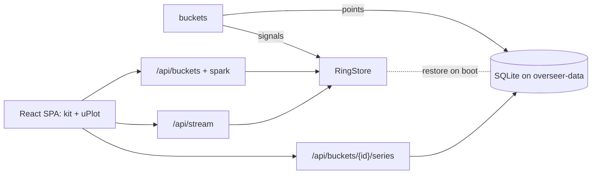

# Overseer UI revamp

Prior docs, not re-argued: `docs/features/overseer-ui/{shape,design}.md` (the React SPA split),
`docs/features/overseer/notes.md` (the platform). Spine carried forward: observe-only, outlives the
app, bounded storage, additive buckets, owner-only, degrade don't crash, no go-api internal imports.

## Outcome

The owner opens Overseer and knows within seconds if Altune is healthy, what changed, and where to
look, on a laptop or a phone. Today the SPA works but reads like a wall of text: every panel is
hand-built with inline styles, trends are flattened to one number, history resets on every deploy,
nothing works on a small screen, and the connection pill can lie ("error" forever after one blip).
Done looks like: a dense, sharp, dark control room (Vercel / Linear / Grafana feel) with real
charts over real history, one shared look across every bucket, and honest live status.

## Scope

### In

**Design system (web)**
- Tailwind + Radix primitives in `services/overseer/web/`, dark only. Tokens for color, spacing,
  type scale, and severity (ok / warn / critical as their own tokens, not reusing `--stale`).
- Shared panel kit: `Panel`, `Section`, `Metric` / `StatGrid`, `DataTable` (sortable), `SignalList`,
  `Notice` (stale / source_down / empty), `StateBadge` that carries severity, `RelativeTime`.
- One chart component set on a single chart lib (uPlot, see Build): `Sparkline`, `TimeSeries`
  (line / area, multi-series, hover readout), `BarSeries`, `UptimeStrip`.
- Visible focus styles, keyboard reachable nav, `prefers-reduced-motion` respected.
- Lint: add `eslint-plugin-react-hooks`, `jsx-a11y`, and a ban on `dangerouslySetInnerHTML`
  (asked for in the overseer-ui design, never landed).

**Layout and navigation (web)**
- App shell: collapsible side nav on desktop, bottom sheet / drawer nav on phone. Breakpoints for
  phone, tablet, desktop. No horizontal scroll at 360px wide.
- Overview rebuilt: a global health strip at the top (worst severity, how many buckets warn or
  are down, last collect cycle from `/health`), then bucket tiles each with headline, severity, and
  a sparkline of its key series.
- Bucket detail uses the full width, split into sections (key numbers, charts, tables, recent
  signals), not one panel in a 360px grid.
- Time range picker on detail pages (1h / 24h / 7d), kept in the URL.
- Command palette (Cmd/Ctrl-K) to jump to any bucket. Keyboard shortcuts for next / previous bucket.
- Logs and usage: search box and level / kind filter, list virtualized so a full tail stays smooth.
- Cross linking by `corrId`: click a correlation id on any signal to see every signal with it.

**Every panel rebuilt on the kit**
- All 8 panels (`backendperf`, `cost`, `domainquality`, `liveactivity`, `logs`, `reliability`,
  `security`, `usage`) moved to the shared kit, inline `style={}` gone.
- `heartbeat` gets a real panel instead of raw JSON.
- Data the backend already sends but the UI drops gets shown: backendperf `throughput` as a chart,
  domainquality `discoTrend` as a chart, reliability `history` / `poll` as uptime and latency
  charts, security `history` as a timeline, `dropped` / `droppedKeys` as a "window is lossy" note,
  per-route p50 / p95 / p99 as a chart as well as the table.
- `GenericPanel` stays as the fallback for a future bucket, but renders a readable key / value view
  instead of a `<pre>`.

**Live status (web)**
- Fix: any stream frame sets the connection back to live (`Dashboard.tsx:75` bug).
- Client side staleness: if no frame arrives within ~3 server ticks, the pill shows "stalled" and
  data dims. Relative "updated 4s ago" that ticks.

**History that survives restarts (Go)**
- A disk-backed time-series store on the existing `overseer-data` volume (`/var/lib/overseer`).
  Buckets record numeric points for named series. Raw points kept 24h, 1-minute rollups kept 7d,
  hard row cap per series. Old data pruned on a timer.
- Rings (`core.RingStore`) restored from disk on boot, so recent signals don't vanish on deploy.
- New guarded endpoint: `GET /api/buckets/{id}/series?range=1h|24h|7d` returns points for that
  bucket's series. Snapshot envelope gains a small `spark` field (last ~30 points of the key series)
  for overview tiles.
- `/health` data (last cycle, ok / failed counts) exposed through the guarded API for the health strip.
- Bring back cost `spendTrend` / `usageTrend` now that history has a home (cut earlier, see
  `cost.panel.tsx:48`).

**Connection to go-api that stays up (Go)**

Found in prod logs (2026-09-24): the read-only Supabase refresh token chain has been dead for
days (`status 400`, 1477 failed refreshes in a row), so reliability, backendperf, domainquality,
and the go-api half of cost fail on every cycle. The OCI half of cost fails on a missing IAM grant.
The single-use rotating refresh token is the root cause. The deploy doc already calls it a gotcha.

- Credential that can't die: when the refresh token gets a 400, overseer signs the read-only
  service account in again (Supabase password grant, secret in `.env.production` / `.env.staging`),
  and saves the rotated token to the volume under a file lock. The manual "seed a fresh token in
  incognito" step goes away (closes the #1471 idea).
- Keep using a still-valid access token while a refresh backs off, instead of dropping it at 80%.
- Public `/health` probe sends no token, so an auth problem can never read as "go-api is down".
- Sort failures into their own states: `auth` (our credential), `throttled` (429), `degraded`
  (503 with a body, read it as data, this is #2054), `down` (transport). Snapshot state and UI show
  which one, so "stale" always says why.
- Stop the 401 retry storm that can trip go-api's failure throttle into 429s.
- Live streams (liveactivity, usage, logs): a drop goes to `connecting`, not `source_down`. Reconnect
  if no keepalive for ~60s. Drain the event buffer in the stream reader, not once per collect
  cycle, so go-api's 10s slow-writer cut doesn't fire.
- domainquality runs its three reads in parallel, each with its own deadline.
- Prod reads go-api over the internal Docker network, following the blue/green switch, instead of
  going out through DuckDNS and Caddy and back in.
- Cost: the OCI usage-api IAM policy grant, written as a step in the deploy doc. **Needs a human in
  the OCI console.**
- `/health` on overseer reports credential state (last refresh ok, consecutive failures), shown
  in the health strip.

**Contract safety**
- A contract test that fails if Go snapshot / series JSON and `web/src/types.ts` drift.

### Out

- Light theme: you said no.
- Any control actions (restart, toggle, kill switch): Overseer is observe-only by design.
- New buckets or new signals the backend doesn't collect yet: different job, this is about showing
  what exists.
- The rest of epic #1824 not listed above (security items #1813, #1814): real, but a different job
  from staying connected and readable. #2054 is now in scope.
- Alerting / push notifications to your phone: a different job from reading the dashboard.

## Risks

- **New storage with a lifetime.** A disk store can fill the volume. Kept in scope with a hard cap
  per series and pruning, and a must-hold test on the cap. Prod and staging share one host disk.
- **New Go dependency** (pure Go SQLite, `modernc.org/sqlite`). Adds build size and a file on the
  shared volume next to the refresh token files. A corrupt DB must not stop Overseer booting.
- **Contract change across Go and TS.** Every panel is touched. Rolled out panel by panel behind the
  shared kit so the dashboard is never half broken on `main`.
- **A long-lived password for the read-only account** lives in env. It is as strong as today's
  refresh token but never expires on its own. go-api already refuses that account on every mutating
  route, so a leak can read, not write. Rotating it is a human step.
- **Prod is broken right now.** Until the self-healing credential ships, getting data back needs a
  fresh token seeded on the VM by hand. That's a secret change on prod, so it waits for your yes.
- **Internal network routing** must follow blue/green, or overseer reads the stopped color.
- **Big web diff.** Tailwind + Radix + uPlot added to an embedded SPA. Bundle budget is a must-hold.

## Build

Extends `services/overseer` (Go shell + core) and `services/overseer/web`. No new service, same
container, same Caddy route, same auth (`shell/auth.go` OwnerOnly). One new store.

- **History store: SQLite file on the existing volume** via `modernc.org/sqlite` (no cgo, fits the
  Go-only Dockerfile). One `points(bucket, series, at, value)` table plus a rollup table.
  Rejected: go-api's Postgres (breaks "outlives the app" and "no go-api coupling"). Rejected: dumping
  rings to JSON files (fine for restore, but no range queries or rollups for 7d charts).
- **Buckets opt in** by writing points through a small `core.Series` interface next to `core.Store`.
  A bucket that writes nothing still works. Core still names no concrete bucket.
- **Charts: uPlot.** Tiny and fast for dense time series. Rejected: Recharts (heavy, SVG slows with
  many points), ECharts (large bundle).
- **UI kit: Tailwind + Radix,** the default the overseer-ui shape already picked and never landed.

## First slice

Connection first, because a pretty dashboard of stale data is no use: the self-healing credential
plus the failure states, so Reliability shows live data again and survives a restart and a spent
token. Then, on top of it: sign in as today, land on the new shell with the working nav and honest live pill. Open
Reliability: its detail page is built on the new kit, shows an uptime chart and latency chart for
1h / 24h / 7d from the disk store, and after an Overseer restart the chart still has its history.
Works on a phone. That one path touches every layer: store, series API, kit, chart, layout, live status.

## Must-holds

- Every series in the store stays under its row cap, and points older than 7d are gone after a prune run.
- A missing or corrupt history file never stops Overseer from booting. It starts empty and says so.
- Every data route (`/api/buckets`, `/api/buckets/{id}/series`, `/api/stream`, health data) returns
  401 without a bearer and 403 for a non-owner.
- After a stream error, the next frame received sets the connection pill back to live.
- With no frame for ~3 ticks, the UI shows stalled, never live.
- No page scrolls sideways at 360px wide.
- No panel file uses inline `style={}`, and no file uses `dangerouslySetInnerHTML` (lint enforced).
- Go snapshot and series JSON match `web/src/types.ts` (contract test).
- Every nav item and control is reachable and visibly focused by keyboard.
- A spent refresh token (400) leads to a fresh sign-in and live data again with no human step.
- A failed credential never marks go-api as down. It shows as `auth`.
- go-api answering 503 with a body shows as `degraded` with the real down dependency, not stale.
- A stream drop shows `connecting`, and a stream silent for ~60s reconnects on its own.
- Overseer never sends more than one retry per request after a 401, so it can't trip go-api's throttle.
- Gzipped JS bundle stays under a set budget (starting target 250 KB).

## Decisions

- Dark only, no light theme (you).
- History persisted to disk with a size cap (you).
- Phone layout in scope (you).
- Tailwind + Radix, uPlot, SQLite on the existing volume (default, see Build).
- Connection reliability pulled in scope (you, after seeing it go down and stale).
- Self-healing via password grant for the read-only account (default). Rejected: a static overseer
  API key in go-api (new auth path in go-api to secure). Rejected: only persisting the rotated token
  (still dies the first time anything else spends it).
- 7d max range, 1-minute rollups past 24h (default).
