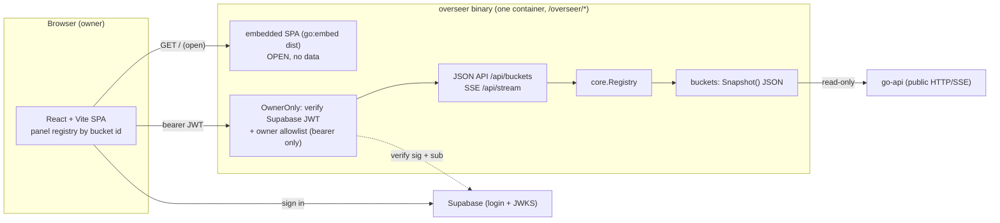

# Overseer UI — design

How the shaped reframe is built. Brief: `docs/drafts/overseer-ui.md`. Prior platform docs:
`docs/drafts/overseer.md`, `docs/drafts/overseer-design.md`, `docs/features/overseer/notes.md`.
Design settles the *how*; it does not re-open the *what*.

## Anchor & inherited invariants (not re-argued)

- **Goal:** split Overseer into a pure JSON API (Go) + a real React web app, so it becomes a
  control room the owner wants to open — readable, navigable, live.
- **Spine carried forward:** observe-only · outlives-the-app · bounded storage · additive buckets ·
  owner-only · degrade-don't-crash · no go-api internal imports · output-escaping.

## Significance

**Significant.** It forces three decisions: a **rewritten bucket contract** (`Render() Panel` →
JSON), a **new auth model** (Supabase login + owner allowlist, no cookie), and a **JS build
toolchain embedded in a Go service**. It forces **no new service and no new store** — that stays
boring on purpose.

## Grounded in (real code)

- Bucket contract: `internal/core/bucket.go:32` — `Meta / Collect / Store / Render() Panel`, where
  `Panel{Title, Body template.HTML}` (`bucket.go:18`). **This `Render`/`Panel` is what we scrap.**
- Registry: `internal/core/registry.go` — self-register, ID-sorted `Buckets()`, core references no
  concrete bucket. **Kept as-is.**
- Shell/router: `internal/shell/shell.go:80` — chi; `/health` open, `/login` GET+POST open, `/`
  behind `OwnerOnly`; serves embedded HTML via `//go:embed shell.html login.html` (`shell.go:18`).
- Auth: `internal/shell/auth.go:24` — owner token, bearer-or-cookie, constant-time. `login.go` sets
  the `overseer_token` cookie. **This whole path is replaced.**
- Config: `internal/config/config.go:21` — `OVERSEER_OWNER_TOKEN`, `OVERSEER_BASE_PATH`, port.
  Supabase vars already exist for the go-api operator token (`OVERSEER_SUPABASE_URL`,
  `OVERSEER_SUPABASE_ANON_KEY`, per `docs/features/overseer/notes.md`). **Reused for owner login.**
- Deploy: `Dockerfile` is a Go-only multi-stage build; Caddy already routes `/overseer/*` →
  `altune-overseer:8090` with `handle_path` stripping the prefix (`../go-api/deploy/Caddyfile`),
  which is why `BasePath` exists (`config.go:32`, commit d761a39d). **Same-origin holds.**

## The shape



## Design decisions (lens by lens)

### Boundaries — where it lives

**One binary, no new service.** The overseer process gains a JSON API + SSE stream and serves the
built SPA from `//go:embed`. The frontend lives at **`services/overseer/web/`** (React + Vite + TS),
built to a `dist/` that the Go `shell` package embeds and serves.

- SPA static assets (`/`, `/assets/*`) are **open** — they carry no watched-app data; the SPA itself
  decides login-vs-dashboard from the Supabase session.
- All watched-app data crosses **only guarded routes**: `GET /api/buckets` (all snapshots),
  `GET /api/stream` (SSE live updates). `/health` stays open (uptime backstop).
- The old `/login` HTML form + `overseer_token` cookie are **removed**; login is client-side.

*Over:* separate static host (Vercel) — rejected in shape (CORS, second thing to keep alive, blind
if down). *Over:* a second service — nothing forces it; same binary keeps outlives-the-app trivial.

### Data & state — the bucket contract

Replace `Render() Panel` with **`Snapshot() core.Snapshot`**, a JSON-serializable envelope:

```
type State string // "live" | "stale" | "source_down"
type Snapshot struct {
    Meta      Meta            // id + title (existing)
    State     State           // the three states the frontend must render
    UpdatedAt time.Time       // last successful collect
    Data      json.RawMessage // bucket-specific typed payload, marshaled by the bucket
}
```

Each bucket marshals its own already-held typed state (e.g. reliability's `lastHealth` + history)
into `Data`. **`Panel` and the `html/template` import are deleted from `core`.** The bounded
`Store` / ring buffer is **unchanged** — no new store.

- **State becomes a first-class enum.** Today "stale" is a bool and source-down comes from the
  consumer `Status`; formalize as one enum so every panel renders the three states uniformly.
- **Escaping invariant moves, doesn't vanish.** HTML-escaping mattered because buckets emitted HTML.
  Now the API emits JSON (Go's encoder escapes) and **React escapes on render** — so the invariant
  becomes *"the frontend never feeds watched-app data through `dangerouslySetInnerHTML`."*

*Over:* keep server-rendered HTML but as structured fragments — rejected in shape; no component
system, no live client. *Over:* an untyped `map[string]any` payload — rejected; hand-written TS
types mirror each bucket's Go payload (shape default), keeping the contract legible.

### Coupling — the plugin model, on both sides

- **Go:** only `bucket.go`'s `Render` → `Snapshot` changes; registry and self-registration are
  untouched. The API handler enumerates `registry.Buckets()` and marshals each `Snapshot()`.
- **Frontend:** a **panel registry keyed by bucket id** → React component, mirroring the Go
  registry. An id with **no bespoke panel falls back to a generic panel** that renders the envelope
  (state + raw fields). So a backend-only bucket **appears immediately**, then gets upgraded later —
  additive stays true, and shippable, on the frontend too. The frontend core references no concrete
  panel.

### Scaling / hot paths — played forward

One user, one browser; SSE fan-out is trivial. The real clock is **the owner's Supabase access
token (~1h TTL)**. Played forward to t = 1h: a naive SSE stream and API calls die silently.

- The SPA uses `@supabase/supabase-js`, which **refreshes the access token** automatically.
- API calls and the SSE fetch-stream **reconnect on 401 with the refreshed token** (the SSE uses a
  fetch-based `ReadableStream` reader, not native `EventSource`, precisely so it can send the bearer
  header — shape flagged this).
- Per-connection SSE buffers stay **bounded**, matching the existing consumer discipline.

### Failure / degradation

Outlives-the-app gets *cleaner*: overseer up ⇒ the SPA loads (static, embedded) regardless of go-api.
Each bucket snapshot carries `state=source_down` when go-api is unreachable, and the frontend renders
that state per panel. If the overseer data API itself errors, the SPA shows a degraded shell, never a
white screen. A bucket that panics on `Snapshot()` is contained (extend the existing
`safeRender`→`safeSnapshot` guard) and reported as a degraded snapshot.

### Infra / tech-stack fit

- **Dockerfile gains a Node build stage:** build the SPA → copy `dist/` into the Go build context →
  `go:embed`. The runtime image stays the same minimal static Go binary.
- **CI** (`.github/workflows/test-overseer.yml`) gains a frontend step: install, typecheck, lint,
  test, build.
- **Vite `base: '/overseer/'`** so assets and API paths resolve under the Caddy mount; API/SSE paths
  are base-relative. Caddy is **unchanged**.
- **Config:** drop `OVERSEER_OWNER_TOKEN`; add **`OVERSEER_OWNER_USER_ID`** (the allowlist) and reuse
  `OVERSEER_SUPABASE_URL` + `OVERSEER_SUPABASE_ANON_KEY` (anon key + URL go to the SPA for
  `supabase-js`; URL also yields the JWKS/JWT-secret for local verification). **Verify the JWT
  locally** (no per-request Supabase round-trip); the exact key mechanism (project JWT secret vs
  JWKS) is confirmed against the project's Supabase settings at build time.

## Architectural must-holds (add to the epic core rules)

- **JSON-only contract:** no bucket emits HTML; `core` no longer imports `html/template`. (Guard.)
- **Supabase owner-only:** every data route verifies a Supabase JWT **and** checks the owner
  allowlist; a valid **non-owner** JWT → **403**; missing/invalid → **401**. Bearer only; **no route
  emits `Set-Cookie`.** (Tests + guard.)
- **Open assets carry no data:** only the SPA shell/assets and `/health` are unauthenticated; every
  watched-app datum crosses a guarded route.
- **Frontend escaping:** no `dangerouslySetInnerHTML` on watched-app data (React escaping replaces
  html/template escaping). (Lint rule / review check.)
- **Additive on the frontend:** panel registry keyed by bucket id; unknown id → generic fallback;
  the frontend core references no concrete panel.
- **Token expiry never blanks the UI:** API + SSE reconnect on 401 with a refreshed token.
- **Single container, outlives-the-app:** the Go binary embeds and serves the SPA; overseer up ⇒
  site loads even when go-api is down.
- **Carried forward unbroken:** observe-only (read-only go-api client), bounded storage,
  degrade-don't-crash (`safeSnapshot`), no go-api internal imports.

## Slice plan (what ticketize cuts)

**Walking skeleton — the split proven on ONE bucket:**

1. `core`: `Render() Panel` → `Snapshot() core.Snapshot` + `State` enum; delete `Panel`/`html/template`.
   Port **live activity** to `Snapshot()`. (Backend stays green with a JSON smoke test.)
2. Auth swap: `OwnerOnly` verifies a Supabase JWT + `OVERSEER_OWNER_USER_ID`; remove cookie/`/login`.
   Config: drop owner token, add owner user id.
3. API surface: `GET /api/buckets`, `GET /api/stream` (SSE, bearer, reconnect-safe), serve embedded SPA.
4. `services/overseer/web/`: React + Vite + TS shell, Supabase login, panel registry + generic
   fallback, the **live-activity panel**, the design system (nav + one themed panel), live via
   fetch-stream. Vite base `/overseer/`.
5. Dockerfile Node stage + CI frontend step.

**Then, each its own slice:** port the remaining 7 buckets to `Snapshot()` + bespoke panels →
overview page (glanceable) + drill-down → retire any dead server-render code. (Mission Control
removal stays its own already-tracked ticket.)
