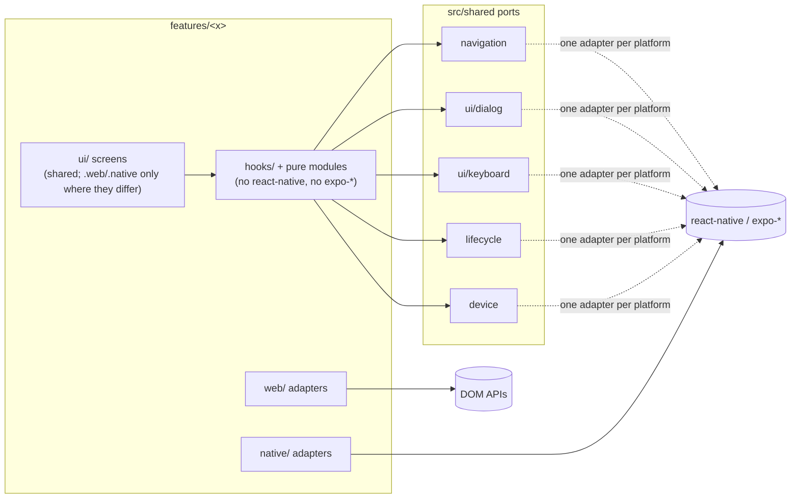

# Platform-free feature logic

## Outcome, what the person gets: the problem, who has it, what done looks like to them

Altune ships one Expo app to iOS, Android and web. Feature logic (hooks, stores, pure modules) imports platform APIs directly, and screens branch on `Platform.OS` inline. So a native habit breaks web silently: #3000's search blur, and react-native-web's `Alert.alert` being an empty function, which makes every confirm and error dialog a no-op on web. The operator, and any later builder, can't tell which code is safe on which platform, and a future surface (CarPlay through react-native-carplay, desktop through the web build) would have to untangle it first.

Done looks like this to them:
- No feature logic file imports `react-native`, `react-native-*` or `expo-*`.
- Every platform capability sits behind a port in `src/shared/` or in a feature's `native/` / `web/` adapter folder.
- Screens stay shared, with platform differences only in `.web.tsx` / `.native.tsx` split files.
- A lint rule keeps it that way, whoever writes the code.

## Appetite, the declared budget: "<n> tickets, <n> waves" (Shape Up, Ryan Singer). A budget to check against, never a cut: ticketize going over it checks in with the user

19 tickets, 5 waves. Two more run outside the epic: #3002 and the expedite web-dialog bug.

## Scope

### In, every piece the outcome needs, across all layers

- **The logic boundary rule (tracer).** `no-restricted-imports` bans `react-native`, `react-native-*`, `@react-native*` and `expo-*`, including type-only imports, in `src/features/**` outside `ui/`, `native/`, `web/`, `*.native.ts(x)` and `*.web.ts(x)`.
- **Legacy allowance without a hot file.** Each feature lists its violating files in its own `src/features/<x>/platform-legacy.json`, which `eslint.config.js` reads into the rule's `ignores`. A migration ticket deletes its line from its own feature's file, so tickets in different features never collide. A must-hold test (`__tests__/platformMustHolds/`) fails when a listed file no longer violates (a stale line) or a baseline gains a file, so the lists only shrink. No suppression comments: the constitution counts both comments and suppressions as defects.
- **#3002 moves to the same mechanism.** Its six UI files go in the same per-feature `platform-legacy.json` files (plus one for `src/app`), not a list inside `eslint.config.js`, so the UI tickets don't all edit that file.
- **Navigation port, `src/shared/navigation/`.**
  - `Navigator` (`push`, `replace`, `back`, `canGoBack`), `useNavigator()`, `useCurrentSegments()` and `useScreenFocusEffect(cb)`.
  - `Href` is re-exported (typed routes stay checked), bound to expo-router in exactly one adapter file.
  - A `memoryNavigator` for tests, plus a contract test both pass.
  - Callers migrate: detail (`navigation.ts`, `useAlbumDetailState`, `useArtistDetailState`, `useLateralNav`, `useTrackDetailActions`); library (`goBackOrToLibrary`, `useActiveLibraryView`, `useExploreArtist`, `useLibraryNavigation`, `usePlaylistDelete`); discover (`useResultTap`); auth (`completeAuthIntent`, `useOAuth`, `useAuthDeepLink`).
- **Dialog port, `src/shared/ui/dialog/`.**
  - Built by the expedite bug: `showAlert` and `confirm`, `.native` on `Alert`, `.web` on `window.alert` / `window.confirm`, with `confirmDestructive` routed through it.
  - The epic moves the remaining callers onto it: library `dropVanishedTrack`, `useDeleteTrack`, `useDeleteTracks`, `useExploreArtist`, `useReacquireTrack`, `useRetryAcquisition`, `pinBatchSummary`, plus `shared/playlists/mutations.ts` and `shared/query/useOptimisticMutation.ts`.
- **Keyboard port, `src/shared/ui/keyboard/`.** `dismissKeyboard()` (native `Keyboard.dismiss`, web no-op), `DismissKeyboardArea` (native `Pressable`, web `View`) and the keyboard-avoidance props, each with `.native` / `.web` files. Callers: `DiscoverScreen`, `SettingsModal`, `AuthHeroLayout`, `useResultTap`.
- **App lifecycle, `src/shared/lifecycle/`.** Move `useAppStateChange` / `useIsForeground` there from `playback/hooks`. It's one adapter file, because react-native-web implements `AppState`. `detail/detailHealth.ts`, `playback/playbackHealth.ts`, `usePlaybackPosition`, `useQueueResume` and `SleepTimerBridge` use it.
- **Device info, `src/shared/device/`.** OS and app version, today read in `settings/reportDiagnostics.ts` and `auth/parseAuthLink.ts` through `Platform` and `expo-constants`. One adapter file.
- **Playback adapter folders.**
  - `playback/native/` takes the track-player files: `createNativePlaybackActions`, `trackPlayerProvider`, `usePlaybackPosition`, `usePlaybackSignals`, `useQueueResume`, `initPlayer`, `loadNativeTrack`, `nativeTrack`, `nativeTrackSwap`, `nativeQueueLock`, `nativeSyncGuard`, `registerPlaybackService`, `seekControls`, `service`, `audioCache`, `audioPrefetch` and `expoGoPlaybackProvider`.
  - `playback/web/` takes `webPlaybackProvider`.
  - `PlaybackProvider` and `playsThroughTrackPlayer` become `.web` split files (unsuffixed file for native), so the platform choice lives in the bundler and not in a `Platform.OS` branch.
- **Auth platform split.** `useOAuth`, `useAuthDeepLink` and `parseAuthLink` become `.web` split files (unsuffixed file for native), or share one pure core with thin split adapters, over `expo-web-browser` and `expo-linking`.
- **UI splits (the #3002 files).**
  - `AuthCallbackScreen` becomes `.web.tsx` (the callback page) and `.native.tsx` (a redirect).
  - `app/_layout.tsx` and `app/(tabs)/_layout.tsx` render split `PlatformExtras` components in place of inline branches.
- **Small import moves.** `useImpressionLogger` drops the `ViewToken` import for a local structural type.
- **Close-out.** Once every `platform-legacy.json` is empty, delete them, the baseline test and the `ignores` wiring.
- **Config, in each ticket.** Each new `src/shared/` folder gets a `.fallowrc.json` zone.

### Out, only different jobs, each with a one-line reason

- The expedite web-dialog bug itself: a defect hurting real use, so it ships alone ahead of the epic (classes of service). The epic depends on its port.
- A styled in-app dialog on web to replace `window.confirm`: visual polish, a separate ticket once the port exists.
- Extracting `src/shared` into a separate package (`packages/core`): waits until a second surface that isn't React Native exists (Rule of Three).
- Building CarPlay, Android Auto or desktop: this makes them cheaper, it doesn't build them.
- `Platform.OS` inside `src/shared/` adapters: that is the sanctioned one place per capability.
- Moving logic out of `ui/` components into hooks: a separate refactor-survey concern per feature. This epic draws the platform boundary, not the UI/logic boundary.

## Pre-mortem, three lines "It failed because <cause>", imagined after the fact (Gary Klein, HBR 2007), each answered in Risks

- It failed because every ticket edited `eslint.config.js` and the waves collided into a serial crawl.
- It failed because a mechanical move broke the native playback service, which only runs on device, and CI stayed green.
- It failed because a port changed behaviour on one platform (web auth redirect, navigation back fallback) and the tests only ran the default platform.

## Risks, anything dangerous that stays in scope (migration, security, breaking dependents), stated plainly; each pre-mortem cause named with its answer

- **Hot config file (pre-mortem 1).** The legacy allowance is a per-feature `platform-legacy.json` plus a baseline must-hold test, so migration tickets touch only their own feature's files. Only the tracer and #3002 edit `eslint.config.js`, and #3002 lands first.
- **Native playback moves (pre-mortem 2).**
  - `registerPlaybackService` is registered from the app entry by path. The move ticket must update that registration and every `jest.mock('react-native-track-player')` path.
  - It is labelled `risk` and `mechanical`, and its Verify includes `npx expo export --platform ios` and `--platform android` bundling, which resolves the new paths without a device.
  - QA walks playback on a native build.
- **Per-platform behaviour (pre-mortem 3).**
  - Every migrated unit's existing test file keeps passing. Those are the characterization tests, run before the change.
  - Each new `.web` / `.native` pair gets a test per variant that imports the variant file directly, because Jest's `jest-expo` preset resolves only the native variant.
  - Auth tickets are tier 1 and labelled `risk`. The web redirect path is also walked in agent-browser at QA.
- **Security, auth.** `parseAuthLink` and `useAuthDeepLink` guard which links may become a session (#655, #1637). Their split must keep the no-`setSession` rule. It is kept as must-hold 5.
- **Behaviour change by design, only in the expedite bug.** Web dialogs start appearing. Everything in this epic is behaviour-preserving.

## Build, where it lives, `extends <module>` or the decisions made with rejected alternatives; a mermaid diagram when the shape isn't obvious. When the feature has UI on more than one platform, its first line is `Platforms: <list>`; builder, review and qa key their platform checks on it

Platforms: ios, android, web

Extends `apps/mobile/src/shared` (new ports: `navigation`, `ui/dialog`, `ui/keyboard`, `lifecycle`, `device`) and `apps/mobile/src/features/*` (adapter folders `native/` and `web/`). No new dependency, no new service. The rule and its reasons: `~/.claude/workflow/build/stacks/ts-react.md` "Platform code".

Decisions:
- **Ports in `src/shared` vs. per-feature adapters.** A capability more than one feature uses (navigation, dialogs, keyboard, lifecycle, device info) is a port in `src/shared`, mirroring `shared/files/` (`FileStore`). A capability only one feature has (the track player, the audio cache) stays in that feature's `native/` / `web/` folder. Rejected: one global `platform/` folder, which would re-mix unrelated capabilities.
- **Navigation is a port, not an exempt import** (operator's call). Rejected: exempting `expo-router`. Route type safety survives because the port re-exports expo-router's typed `Href` from its one adapter file.
- **Legacy allowance by per-feature baseline files.** Rejected: an `ignores` list in `eslint.config.js`, which every migration ticket would edit and so serialise the epic; and per-file `eslint-disable` tags, which are suppression comments the constitution bans.
- **Type-only imports are banned too.** Rejected: allowing `import type` from `react-native` / `expo-*`, which would keep logic tied to those packages' shapes (`ViewToken`, `ImperativeRouter`).
- **Adapter choice by bundler, not branch.** `PlaybackProvider` and `playsThroughTrackPlayer` become `.web` split files (unsuffixed file for native). Rejected: keeping the `Platform.OS` switch in feature code.

## First slice, the walking skeleton: how a person gets in, and the one thing they can do end to end

A builder writes a new library hook that imports `Alert` from `react-native` and gets a lint error naming the dialog port. At the same time, `goBackOrToLibrary` runs through `useNavigator()` from `@shared/navigation`, no longer carries the legacy tag, and behaves as before on web and native. So the tracer lands the rule, the baseline test and the navigation port with one real caller migrated.

## Must-holds, rules that must always hold (living, grows during the build), each one a list item:

1. No feature logic file imports `react-native`, `react-native-*`, `@react-native*` or `expo-*` outside `ui/`, `native/`, `web/` and `*.native.ts(x)` / `*.web.ts(x)`, unless it carries the legacy tag. [repo-test: apps/mobile/__tests__/platformMustHolds/mh01-logicBoundary.test.ts]
   - Example: ESLint on `src/features/library/hooks/useProbe.ts` containing `import { Alert } from 'react-native';` → one `no-restricted-imports` error.
2. The legacy baselines only shrink: every file in a `platform-legacy.json` still violates the rule, and no baseline holds a file absent from the frozen original set. [repo-test: apps/mobile/__tests__/platformMustHolds/mh02-baselineShrinks.test.ts]
   - Example: adding `src/features/discover/state.ts` to `discover/platform-legacy.json` → the test fails naming that file.
3. Every `Navigator` adapter behaves the same: the expo-router adapter and `memoryNavigator` pass one contract. [repo-test: apps/mobile/src/shared/navigation/__tests__/navigator.contract.test.ts]
   - Example: on a fresh navigator, `push('/library')` then `back()` → `canGoBack()` is `false`.
4. Web confirm dialogs act: on web, `confirmDestructive` runs `onConfirm` when the user accepts. [repo-test: apps/mobile/src/shared/ui/dialog/__tests__/dialog.test.ts]
   - Example: `window.confirm` returns `true` → `onConfirm` called once; returns `false` → not called.
5. No auth link becomes a session without a server exchange, on either platform's split. [repo-test: apps/mobile/src/features/auth/__tests__/parseAuthLink.test.ts]
   - Example: `altune://auth/callback#access_token=x&refresh_token=y` → an intent that `completeAuthIntent` refuses (`no_spendable_credential`), never a session.

## Expected signals, what the running thing should show once built: the API endpoints and pages that change (everything unlisted must stay the same), and how telemetry should move ("p95 of GET /orders stays under 200ms"); see `~/.claude/workflow/feedback-loop.md`

None, internal-only change: no endpoint or page changes and no telemetry moves. `uicheck` side by side should show no difference on any page, native or web. The one visible change, web dialogs appearing, belongs to the expedite bug, not this epic.

## Decisions, what the user answered or accepted as a default in step 3

- The web dialog bug is filed now as a separate `expedite` ticket. Its web adapter uses `window.confirm` / `window.alert`; a styled modal is later polish (operator: yes).
- Logic hooks do not import `expo-router`; navigation goes behind a port (operator: no to exempting it).
- Platform adapters live in `native/` and `web/` folders inside the owning feature, or as `.native` / `.web` split files (operator: yes).
- Default: #3002 switches from a config `ignores` list to the per-feature `platform-legacy.json` files so UI tickets don't collide on `eslint.config.js`. Its body is amended before crew picks it up.
- Default: Jest keeps the `jest-expo` native preset, and web variants are tested by importing the `.web` file directly. Rejected for now: `jest-expo/universal`, which would double the suite's runtime.
- Default: split-file convention is `foo.ts(x)` for native with `foo.web.ts(x)` beside it; where this plan says `.native`, read the unsuffixed file. TypeScript and Jest's native preset resolve the unsuffixed file; Metro picks `.web` on web (`~/.claude/workflow/build/stacks/ts-react.md` "Platform code").
