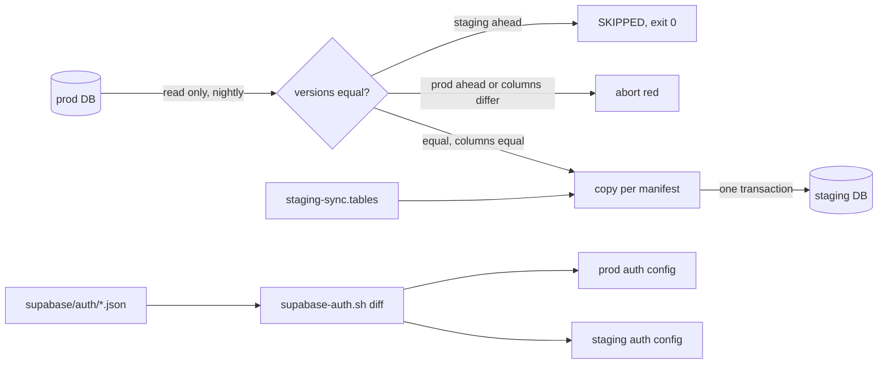

# Disposable staging, one-way data

## Outcome

Staging and prod run the same code, schema and Supabase auth settings. Only names, URLs and secrets differ. Data flows one way, prod → staging, every night. Nothing done on staging is ever kept, so nothing on staging can ever destroy something a person wanted. Today the opposite holds. On 2026-10-02 the nightly sync wiped two songs the owner's dad downloaded on staging: `promote-staging` skipped them because prod had `failed` rows with the same `(user_id, dedup_key)` (`cmd/api/commands/promote_staging.go:170-176`), the sync overwrote the `ready` staging rows, and `sweep-staging-audio` deleted the audio. Done looks like this. Real people use prod only. Staging says plainly on screen that it is wiped nightly and can't take new sign-ups. A sync or drift check fails loudly whenever the two tiers differ in a way nobody wrote down.

## Appetite

8 tickets, 3 waves. Each ticket is about an hour of build.

## Scope

### In

- **T1. Remove the staging → prod path.** Delete `cmd/api/commands/promote_staging.go`, `promote_staging_test.go` and `promote_staging_integration_test.go`. Remove the dispatch and usage string (`cmd/api/main.go:50-51,55`) and the whole test `TestNewAudioStoreFromConfigCopierStaysInsidePrefixSoPromoteNeedsTheUnscopedStore` (`common_test.go:91-~130`). Delete `deploy/promote-staging_test.sh` and the CI lines `.github/workflows/test-backend.yml:100,105-106`. In `deploy/staging-sync.sh`, cut `:133-142` (the prod container lookup and promote step). In `staging-sync_test.sh`, remove its stub and checks (`:40-46`, `:208-212`). Move `stagingRefPrefix` into `sweep_staging_audio.go` and use it in the sweep's SQL (`:101`) in place of the literal `'staging/%'`.
- **T2. Remove the dead copier.** With promote gone, `ports.AudioCopier`/`Copy` has no caller. Delete it from `ports/audio_store.go:58-59`, `filesystem.go:19,224`, `object_storage.go:22,121`, the copier wrappers in `scoped_store.go:55-63,163-203`, and their tests (`scoped_store_test.go:213-240`, `filesystem_test.go:306`, `object_storage_integration_test.go:188`).
- **T3. A table manifest instead of hardcoded lists.** `deploy/staging-sync.tables` gives every public table one rule:
  - `user`: filter by `user_id`, re-key it to the staging id.
  - `child <parent> <fk-col>`: filter via the parent, removed by the parent's cascade. Only for real foreign keys.
  - `global`: replace the whole table.
  - `reset`: delete matched users' rows, insert none.
  - `skip <reason>`: never touched.

  It replaces `USER_TABLES`, `CHILD_TABLES` and `GLOBAL_TABLES` (`staging-sync.sh:11-13`) and the `orphaned_audio` special case (`:79`). The rules today:
  - user: tracks, playlists, discovery_search_history, discovery_search_clicks, playback_queue_state, discovery_events, featured_artists, discovery_favorites
  - child: playlist_tracks, track_featured_artists, acquisition_cooldowns
  - global: entity_identity
  - reset: orphaned_audio
  - skip: acquisition_outcomes and acquisition_rejections (staging-local telemetry: text `track_id` with no FK, and a BIGSERIAL id), schema_migrations (owned by the migration runner)

  The sync aborts before writing if any public table on either tier has no rule. A repo test migrates a fresh DB and fails if any public table it finds lacks a rule. It reads the live catalog, not `CREATE TABLE` lines, so dropped tables such as `discovery_metrics` don't count.
- **T4. A schema gate in the sync.** Before writing, compare `schema_migrations` on both tiers:
  - **Same versions:** compare every manifest table's columns by name and `format_type`. Any difference, whichever side, aborts red and names the table and column. This replaces the silent `shared_columns` (`staging-sync.sh:45-54`).
  - **Staging has extra versions, and every one still exists as a file in the checked-out `migrations/`:** a deploy is in flight (staging migrates first, `release.sh:31-35`). Exit 0 with `SKIPPED: staging is ahead by <versions>`.
  - **Staging has an extra version with no file:** a reverted or renamed migration (`migration-safety.sh:19`). Nothing would ever clear it, so abort red and name the version.
  - **Prod has a version staging lacks:** abort red.

  The test harness builds DBs from raw migration files (`staging-sync_test.sh:80-82`), so it must seed `schema_migrations` too. Update the existing test that expects a prod-only column to pass (`staging-sync_test.sh:85,157`). Widen `prod_fingerprint` (`:128-135`) to every manifest table.
- **T5. Supabase auth settings as code.** `supabase/auth/base.json` holds the shared settings, snapshotted from prod's `GET /v1/projects/{ref}/config/auth`. It carries two lists:
  - `"$secrets"`: all 36 secret key names, listed by name: 21 `external_*_secret`, 7 `hook_*_secrets`, 6 `sms_*` (including `sms_vonage_api_secret` and `sms_messagebird_access_key`), `smtp_pass` and `security_captcha_secret`. A secret's value is never stored or sent. `diff` compares only whether it is set or null, which turns red if, for example, staging's Google secret was never set.
  - `"$ignore"`: platform-managed keys (`db_max_pool_size`, `db_max_pool_size_unit`, `api_max_request_duration`, `custom_oauth_max_providers`, `nimbus_*`).

  `supabase/auth/prod.json` and `staging.json` hold only per-tier keys: `uri_allow_list` and `disable_signup`. A new `scripts/supabase-auth.sh diff|apply <prod|staging>` reads the token from `~/.supabase/access-token`, merges base and tier, and compares with live, comparing values exactly (null is a value). Keys are classified by presence, not value:
  - A differing managed key is drift: exit 1.
  - A live key that's in neither file nor `$ignore` (a new Supabase setting) prints `NEW KEY <name>` and exits 1, so a person classifies it.
  - `apply` prints the diff, asks y/N, and PATCHes only the differing keys. It never runs `supabase config push` (`docs/drafts/web-app/plan.md:57`).
- **T6. A nightly drift check and pipeline cleanup.** Add an `if: always()` step to `.gitea/workflows/staging-sync.yml` that runs `supabase-auth.sh diff` for both tiers on the host runner. curl, jq and the token are on it. Delete `.github/workflows/staging-sync.yml`, which has zero runs ever. Fix `deploy/SKILL.md:18,24`: Gitea runs `deploy.yml`, `deploy-web.yml` and `staging-sync.yml`, and `staging.md` is the guide for the one-way data copy.
- **T7. Staging says it's staging.** A `StagingBanner` component sits above `<AuthGate>` in `apps/mobile/src/app/_layout.tsx`, so it also covers the splash and notice screens `AuthGate` returns (`AuthGate.tsx:26,30,38`). It renders when `EXPO_PUBLIC_SUPABASE_URL` (`supabaseClient.ts:15`, set per build in `deploy-web.yml`) is staging's. It shows a banner on every screen: "Staging. Everything here is wiped every night. Use altune.duckdns.org." The staging web app is built from `apps/mobile` by `.gitea/workflows/deploy-web.yml:40-54`. Sign-up maps `signup_disabled` to its own message, "Sign-ups are closed on staging" (`useSignUp.ts:46-49`, `SignUpScreen.tsx:34`).
- **T8. Docs.** Rewrite `.claude/skills/deploy/staging.md`:
  - "Data from prod" (`:16,27,29,31`): staging is disposable and wiped nightly, its `staging/` downloads are temporary, and there is no promotion.
  - The sign-up lock, and how to add a tester by hand.
  - How to change an auth setting (edit the JSON, then `apply` both tiers) and how to set a secret (the dashboard, never the repo).
  - The schema gate's SKIPPED state.
  - That rolling back staging alone to a script that still calls promote turns the sync red, with no data loss.

### Out

- Copying all prod users and `auth.users` into staging. That's a different job (full clone), rejected in Decisions for privacy.
- Storage bucket policy as code (`altune-staging-s3-prefix`). That's OCI IAM, not Supabase, and it already blocks staging writes outside `staging/`.

## Pre-mortem

- It failed because the schema gate fired after every staging deploy, so people learned to ignore red syncs.
- It failed because `apply` sent a hashed secret back and broke Google sign-in on prod.
- It failed because removing promotion wiped songs someone had downloaded on staging.

## Risks

- **Staging ahead of prod is normal.** Answer: the gate compares migration versions first and skips, without going red, while a deploy is in flight. It goes red only on drift at equal versions or when prod is ahead. Must-holds 3 and 4. On 2026-10-02 both tiers held the same 32 versions, matching the migration files, checked read-only.
- **Writing auth config touches a live system.** Answer: secrets are on an explicit list that is never read, compared or sent. `apply` PATCHes only the differing managed keys, prints them, and asks y/N. The slice applies only to staging. The nightly job runs `diff`, never `apply`. Must-holds 6, 7 and 8.
- **Data loss at cutover.** Answer: ship runs this before the T1 PR merges, while promotion still exists:
  1. Disable the Gitea `staging-sync` workflow.
  2. Query staging for matched users' `ready` tracks under `staging/`.
  3. Run `promote-staging --execute` once. Then list every staging `ready` track it skipped or failed where the prod row isn't `ready`. The tool prints only `SKIP <id>` (`promote_staging.go:100`), so query by id. The owner re-downloads those on prod.
  4. Re-enable the workflow only after T1 and T7 are live on prod and staging.

  On 2026-10-02 the query found 2 such songs for aleburrascano123@gmail.com ("STFU", "off that!"), with no prod rows, so promote will copy them. The other 25 belong to `queue-proof-752@altune.invalid`, which has no prod account, so they never leave staging.
- **Existing staging users keep using staging.** Answer: the T7 banner on every screen, and the owner tells their dad to use prod.
- **Sign-up lock blocks first-time Google users on staging.** Answer: accepted. New staging testers are made by hand.

## Build

Waves:
- **Wave 1:** T3, T5, T7.
- **Wave 2:** T4 (needs T3's manifest), T6 (needs T5's script).
- **Wave 3:** T1, T2, T8.

T7 is live before T1, so the banner is up before staging becomes disposable.

Extends `services/go-api/deploy/staging-sync.sh`, the Gitea `staging-sync` workflow and the app's shell. Adds one script, three JSON files and one manifest file. No new service and no new runtime dependency.

Platforms: web (the staging banner shows only on the staging web build. No mobile build points at staging: every profile in `apps/mobile/eas.json` uses prod).

Decisions:
- **Table manifest, not catalog inference.** Inferring rules from foreign keys would mis-key a table without one, which is the same silent-skip class as this bug. The manifest makes every table a written choice, and the test forces one per new table.
- **Gate on migration versions first, then columns.** A columns-only gate would false-fire on every contract migration between the staging and prod releases (`migration-safety.sh:14-20`). Rejected: allow-listing staging-only columns, which can't explain drops or type changes.
- **Explicit secret list, not a name pattern.** The pattern `key|token|password|secret` matches 56 keys, including `password_min_length` and `external_keycloak_*`, and misses `smtp_pass` (read via GET on 2026-10-02).
- **Diff-and-PATCH, not `supabase config push`.** `config push` overwrites the whole config, including Google settings and `altune://` redirects.
- **New live keys go red, not silent.** A setting Supabase adds must be classified once, or it can drift unseen.
- **No prod auth writes in the slice.** base.json is prod's snapshot, so prod has no drift by construction. `site_url` is `http://localhost:3000` on both tiers. It stays shared and unchanged (see Backlog).

State owners (constitution XI): sync abort or skip is fired by `staging-sync.sh`. Auth drift red is fired by the `staging-sync` workflow's drift step. The staging banner is fired by the app reading its Supabase URL at build time.

## First slice

The owner opens Gitea Actions in the morning. The `staging-sync` job is green. Staging holds a fresh copy of prod's data for the matched accounts, every table has a written rule, and both Supabase projects match the repo. If any of that isn't true, the job is red and its log names the table, column or auth key. Anyone who opens the staging web app sees that it is wiped nightly and where prod is, and can't create a new account there.

## Backlog

- Full prod clone including all users: waits on a decision about anonymizing emails.
- Fix `site_url` (`http://localhost:3000` on both tiers): a prod auth change that affects email links. It needs its own check of the mobile and web auth flows.
- Disable or remove GitHub's `Deploy backend` workflow, which still has live deploy secrets and is a second deploy path (red-team round 1). `origin/main` is behind `gitea/main`.
- Staging re-downloads prod tracks copied mid-acquisition with their lease and queue columns (red-team round 1): wasteful, not unsafe.
- Clean up staging rows of users whose email match disappears (red-team round 1).
- Stale staging `acquisition_rejections` can make staging skip a source for a track id copied from prod (`rejection_store.go:85-88`, red-team round 2). Harmless on a disposable tier.
- Tie the sweep's `staging/` constant to `AUDIO_KEY_PREFIX` (`config.go:56`), so they can't drift.
- Storage bucket policy as code: OCI IAM, a separate surface.
- Supabase settings beyond auth (API, database, storage).

## Must-holds

1. Nothing in the repo can write staging data into prod. [repo-test: services/go-api/deploy/staging-sync_test.sh]
   - Example: `grep -rn promote-staging services/ .gitea .github` → no matches. A sync run leaves `prod_fingerprint`, covering every manifest table, unchanged.
2. Every public table on either tier has exactly one manifest rule, or the sync aborts before writing. [repo-test: services/go-api/deploy/staging-sync_test.sh]
   - Example: add table `foo` to the test prod DB with no manifest line → exit 1, log `FAILED: public.foo has no rule in staging-sync.tables`, staging rows unchanged.
3. At equal migration versions, any column or type difference aborts the sync before writing. [repo-test: services/go-api/deploy/staging-sync_test.sh]
   - Example: prod `tracks.bar text`, staging lacks `bar`, same versions → exit 1, log names `tracks.bar`, staging rows unchanged.
4. When staging's extra migration versions all exist as files, the sync skips without writing and exits 0. If one has no file, it aborts red. [repo-test: services/go-api/deploy/staging-sync_test.sh]
   - Example: staging has extra `033_x` and `migrations/033_x.sql` exists → exit 0, log `SKIPPED: staging is ahead by 033_x`, staging rows unchanged. Staging has extra `033_gone` with no file → exit 1, log names `033_gone`.
5. A freshly migrated DB has no public table without a manifest rule. [repo-test: services/go-api/deploy/staging-sync-manifest_test.sh]
   - Example: a new migration creates `foo` with no manifest line → test fails naming `foo`.
6. `supabase-auth.sh diff` exits non-zero on managed-key drift or an unclassified live key. [repo-test: scripts/supabase-auth_test.sh]
   - Example: stubbed live staging has `disable_signup: false`, staging.json says `true` → exit 1, prints `disable_signup: false → true`. Stubbed live has `brand_new_key` → exit 1, prints `NEW KEY brand_new_key`.
7. `supabase-auth.sh apply` PATCHes only differing managed keys, and never sends a `$secrets` key. [repo-test: scripts/supabase-auth_test.sh]
   - Example: live differs on `disable_signup` and on hashed `external_google_secret` → the stubbed PATCH body is exactly `{"disable_signup":true}`. Stubbed live staging has `external_google_enabled: true` with `external_google_secret: null` → `diff` exits 1 and prints `external_google_secret: unset`.
8. No `$secrets` key appears with a value in `supabase/auth/*.json`. [repo-test: scripts/supabase-auth_test.sh]
   - Example: `"external_google_secret": "abc"` in base.json → test fails.
9. The staging web build shows the wiped-nightly banner, and the prod build doesn't. [repo-test: apps/mobile/src/shared/staging/__tests__/StagingBanner.test.tsx]
   - Example: render `StagingBanner` with `EXPO_PUBLIC_SUPABASE_URL=https://ijyjoyxhwmbmriwzazbx.supabase.co` set before the module loads → the banner text is present. With `https://ellvexundmgvbbfqbzau.supabase.co` → it is absent.
10. Staging refuses new sign-ups. [operator: `curl -s -X POST https://ijyjoyxhwmbmriwzazbx.supabase.co/auth/v1/signup -H "apikey: $STAGING_ANON_KEY" -d '{"email":"probe@example.com","password":"x-Long-pass-123"}'`]
    - Example: POST a new email to staging sign-up → HTTP 422 with `signup_disabled`.
11. Both tiers have no auth drift after the slice ships. [operator: `scripts/supabase-auth.sh diff prod && scripts/supabase-auth.sh diff staging`]
    - Example: run diff for both tiers after `apply staging` → both exit 0 and print `no drift`.

## Expected signals

- Staging web shows the banner on every page. Staging's sign-up endpoint returns `signup_disabled`. Prod pages and all API endpoints are unchanged.
- The Gitea `staging-sync` job gains a drift step. Its run time grows by under 30s.
- The sync log gains one line per manifest table and a SKIPPED line during deploys. The `promote_staging_completed` event disappears from prod go-api logs.

## Decisions

- Staging copies only accounts that exist on staging, matched by email (user said yes). Copying every prod user would put real emails and logins on a weaker tier.
- Staging sign-up is locked (user said yes).
- Supabase auth settings as code are in this slice (user said yes).
- No interim guards or bandaids. Every change is the permanent shape (user, 2026-10-02).
- Default: staging password rules and `external_phone_enabled` match prod through base.json. Google sign-in on staging also comes from base (`external_google_enabled: true`, the same client id). Before `apply staging`, the operator sets the Google secret in the staging dashboard and adds staging's callback URL in Google Cloud.
