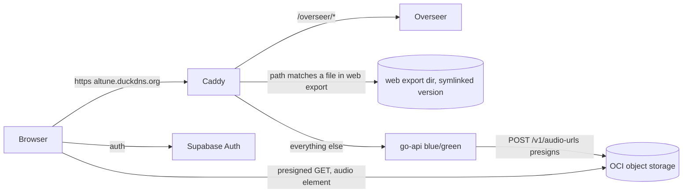

# Altune on the web

## Outcome

The owner (and anyone with an Altune account) opens `https://altune.duckdns.org` in a desktop browser, signs in with their existing account, and uses Altune the way they use the phone app: search and save music, browse the library and playlists, and **hear it**, with a layout built for a wide screen (sidebar, persistent player bar, keyboard and media keys). A reload keeps them signed in. Done looks like: open the URL on a laptop, sign in once, click a track, music plays; close the tab, come back tomorrow, still signed in.

## Scope

### In

**Delivery (the way in)**
- Web build from the existing app: `apps/mobile` exported with `npx expo export -p web` (already a CI gate, `test-mobile.yml`). No second codebase.
- Same-origin hosting: Caddy serves the static export on `altune.duckdns.org` and `altune-staging.duckdns.org`. Rule: **serve a file from the export if one matches the path, otherwise hand the request to go-api exactly as today**. No API path list in Caddy, so `/v1`, `/health`, `/test`, `/admin` (or a future `/operator`), and `/overseer` keep routing unchanged.
- Security headers on web-app responses only: CSP (`script-src 'self'` plus the `sha256-…` of the one constant script the Expo export inlines, `connect-src 'self' https://<supabase-project>.supabase.co` plus the exact kill-switch URL `https://raw.githubusercontent.com/aleburrascano/altune/main/kill-switches.json` that `killSwitchPoll.ts` fetches, `media-src` covering the object-storage presign host), `X-Content-Type-Options`, `Referrer-Policy`, `frame-ancestors 'none'`. HTML is `no-cache`; hashed JS/CSS bundles are `immutable`.
- `deploy-web.yml`: on push to `main` touching `apps/mobile/**`: build the export with the staging env, ship to the VM into a versioned directory, flip a symlink atomically, smoke-test staging, wait for manual approval, repeat for prod. Rollback = flip the symlink back.
- Compose files mount the web directory read-only into the Caddy container.

**Auth on web**
- Web session persists across reloads: the Supabase storage adapter on web moves from in-memory (#945) to `localStorage`, backed by the CSP above. The existing test that pins in-memory storage is deliberately changed.
- Web redirect URLs instead of `altune://`: OAuth (Google), signup confirmation, and password recovery use `${window.location.origin}/auth/callback|confirm|recovery` on web. New web route(s) exchange the PKCE code (`exchangeCodeForSession`) and land the user signed in. Google OAuth on web is a full-page redirect, not `WebBrowser.openAuthSessionAsync`.
- Supabase project config: add the prod and staging web callback URLs to the redirect allow-list (done through the Supabase CLI / Management API as a **targeted** change, see Risks).
- Sign out clears the persisted session.

**Playback on web**
- A web `PlaybackContextValue` implementation (`webAudioProvider`) on a single `HTMLAudioElement`, selected in `PlaybackProvider.tsx` for `Platform.OS === 'web'` in place of the no-op. It drives the existing `queueStore`, uses the existing presign window (`POST /v1/audio-urls`) for sources, and supports play/pause/next/prev/seek/rate/repeat/shuffle, sleep timer and lyrics sync through the existing stores.
- Presigned URL expiry: on a media error or on resume after the URL's TTL, re-presign and resume at the same position.
- Media Session API: title/artist/artwork, play/pause/next/prev/seek handlers, so OS media keys and browser media controls work.
- `registerPlaybackService` no longer runs on web.

**Desktop layout**
- Responsive shell switched on window width (`useWindowDimensions`): at or above a desktop breakpoint, a left sidebar (Discover, Library, playlists, Settings) replaces the bottom `TabBar`, and a persistent bottom player bar replaces the mini-player. The full player (`player/`) becomes a panel/page rather than a phone modal. Below the breakpoint (a phone browser), the current mobile layout.
- Content width caps and multi-column grids for library/discover/detail so wide screens don't stretch rows edge to edge.
- Keyboard: space play/pause, arrows seek/skip, `/` focuses search; visible focus rings; hover states on rows and buttons.
- Page titles per route (`document.title`), so browser tabs and history are readable.

**Native-only features degraded cleanly on web**
- `shared/files/durableDocument.ts` / `fileStore.ts` (kill-switch state, telemetry outbox, theme preference) get a web variant on `localStorage`.
- Offline pin/download controls hidden on web; `shared/offline` and the audio prefetch cache (`audioCache.ts`, `audioPrefetch.ts`) are not loaded on web.
- Haptics, navigation bar, and iOS keyboard handling are no-ops on web without warnings.
- Empty states and error states render on web (signed-out landing, empty library, playback error with retry).

**Proof**
- Each slice is proven on the real thing: `agent-browser` against the local static export with test auth (the existing `apps/mobile/e2e/agent-browser/authed-library.sh` pattern), then a smoke check on staging after deploy. Browser e2e in CI is owned by epic #2634 (Playwright on the Expo web build, journeys #2640-#2642); once the web audio provider lands, its play-from-library journey (#2642) exercises real playback instead of the no-op.

### Out
- **Offline downloads / pinning in the browser**: storing audio in browser storage is a separate feature; the web streams.
- **Cookie-based server-held sessions (BFF)**: a stronger session model than localStorage + CSP; a separate security project.
- **PWA / installable app / service worker**: a separate job from "use Altune in a browser".
- **Desktop native wrapper (Electron/Tauri)**: a different product surface.
- **go-api code changes**: none needed; same origin makes CORS irrelevant and every endpoint already exists.
- **Browser e2e harness in CI**: epic #2634 owns it (Playwright on the same web build); this epic feeds it, not a second harness.
- **Google sign-in on staging**: the staging Supabase project has Google disabled and no OAuth client; setting one up is separate from the web app. Web Google sign-in is verified on prod.
- **Admin module**: owned by the admin-removal work; this plan's routing is indifferent to it.

## Risks
- **Security: session in localStorage.** Reverses #945. An XSS on the web origin could read the refresh token. Mitigated by a strict CSP with no `'unsafe-inline'` in `script-src`, no third-party scripts, and all user content (track titles, lyrics) rendered as text, never HTML. Kept in scope by the owner's decision.
- **Supabase auth config is production and shared with the phone app.** The redirect allow-list change must be additive: read the current config, append the two web URLs, write only that field (Management API `PATCH /v1/projects/{ref}/config/auth` with `uri_allow_list`). **Never `supabase config push`**: it would overwrite the whole auth config from a local file, including Google provider settings and mobile `altune://` redirects. Stops for a human yes before the write (Article II).
- **Caddyfile is shared with prod routing and Overseer.** A bad block takes the API down with it. Mitigated: Caddy validates on reload and keeps the old config on failure; staging first; the file-first/API-fallback rule means an empty or missing web directory degrades to exactly today's behaviour.
- **Route-name collision.** Same origin means a web route can never be named `/v1`, `/health`, `/test`, `/admin`, `/operator`, or `/overseer`. Checked by a test.
- **Presigned URL lifetime (1h).** A paused tab resumed later holds a dead URL. Designed for, see Must-holds.
- **Expo Router static export and dynamic routes** (`library/playlist/[id]`, detail pages): deep links to them must resolve on a hard reload. Needs an explicit Caddy rewrite to the route's HTML shell or `generateStaticParams`; the builder picks, the must-hold checks it.

## Build

Extends `apps/mobile` (platform variants via `*.web.ts` and `Platform.OS`, plus a responsive shell) and `services/go-api/deploy` (Caddy + compose). No go-api code, no new service, no new data store.

Decisions:
- **Same codebase via Expo web**, rejected a separate Vite/React app like Overseer (would rebuild every screen and drift from mobile).
- **Same origin, Caddy file-first then API fallback**, rejected a separate subdomain (needs CORS changes in go-api plus a new DuckDNS name) and rejected a Caddy API-path allow-list (breaks whenever go-api adds or renames a prefix, e.g. admin → operator).
- **Own `HTMLAudioElement` provider behind the existing `PlaybackContextValue` seam**, rejected react-native-track-player's web build (shaka fetch-loading needs CORS on the OCI bucket, an infra change; beta quality). The seam already has two implementations (`trackPlayerProvider`, `expoGoPlaybackProvider`), so a third earns no new abstraction.
- **localStorage + CSP for the session**, rejected in-memory (every reload signs out, and the PKCE verifier is lost across the OAuth full-page redirect) and rejected a cookie BFF (new server component).
- **Versioned directory + symlink flip for static deploys**, rejected rebuilding the Caddy image per web release (couples web releases to proxy restarts).

## First slice

On `altune-staging.duckdns.org` in a desktop browser: a stranger sees the sign-in screen, signs in with **email and password**, lands on the library, clicks a track, and **hears it**; reloading the page keeps them signed in and the library loads again. That thread needs: the Caddy file-first block on staging, `deploy-web.yml` to staging, localStorage session + CSP, and the minimal `webAudioProvider` (play/pause of one track). OAuth web redirects, the desktop layout, Media Session, and the prod promotion follow as their own slices.

## Must-holds
1. Every go-api path answers exactly as before the web deploy: for a request to `/v1/*`, `/health`, `/test/*`, `/admin/*`, or `/overseer/*`, the response comes from go-api/Overseer, never from the web export.
2. With the web directory empty or missing, every API request still behaves as today (web outage never takes the API with it).
3. No expo-router route in `apps/mobile/src/app` starts with `v1`, `health`, `test`, `admin`, `operator`, or `overseer`.
4. A signed-in web user who reloads the page is still signed in; after sign-out, a reload shows the sign-in screen and `localStorage` holds no Supabase session.
5. A hard reload on any deep link (`/library`, `/library/playlist/<id>`, a detail page, `/player`) renders that screen, never a 404 or the API's response.
6. Web-app HTML responses carry a CSP whose `script-src` contains no `'unsafe-inline'` and no `'unsafe-eval'`.
7. A track paused for longer than the presign TTL resumes playing from the same position after pressing play (re-presigns, no user-visible error).
8. On web, playing a track calls only `POST /v1/audio-urls` for sources, never `GET /v1/tracks/{id}/audio` (the header-authed stream the audio element can't use).
9. Offline pin/download controls are not rendered on web.
10. The native build is unchanged: `trackPlayerProvider` is still selected on iOS/Android, and secure-store remains the native session store.
11. The Supabase redirect allow-list after the change is a superset of the list before it (every existing `altune://` entry still present).

## Expected signals
- **Pages (new, web):** `/`, `/sign-in`, `/sign-up`, `/forgot-password`, `/reset-password`, `/auth/callback`, `/discover`, `/library`, `/library/playlist/:id`, detail pages, `/settings`, `/player`, `/player/queue`, `/player/lyrics`. Checked with `uicheck` at `1440x900` and `360x740`.
- **API endpoints:** none change. `replay` over the existing API corpus through Caddy must show zero diff, old vs new.
- **Static edge:** `GET /` on staging and prod returns 200 HTML with the CSP header; `GET /health` still returns go-api's health JSON.
- **Telemetry:** `POST /v1/audio-urls` volume rises with web plays; `GET /v1/tracks/{id}/audio` does not. p95 of `POST /v1/audio-urls` and `GET /v1/library` stays at its current level; go-api error rate does not move after the web deploy. New `/v1/events` SSE connections from web stay under `SSE_MAX_CONNS`.

## Decisions
- Same codebase (Expo web from `apps/mobile`): **accepted.**
- Same origin on `altune.duckdns.org` / staging, served by Caddy: **accepted**, refined to file-first/API-fallback so it never lists API paths (keeps it independent of the admin-removal work).
- Session persists in localStorage behind a strict CSP: **accepted.**
- No go-api code changes; the non-frontend pieces are the Caddy block, compose mounts, `deploy-web.yml`, and the Supabase redirect allow-list: **accepted** by the owner.
- Offline downloads out on web: **default, accepted.**
- Web audio via own `HTMLAudioElement` provider on presigned URLs (no bucket CORS): **default.**
- Supabase current state (read 2026-09-25): prod `ellvexundmgvbbfqbzau` has `uri_allow_list = "altune://**"`, Google enabled; staging `ijyjoyxhwmbmriwzazbx` (separate project) has an empty allow-list and Google **disabled**. Target: prod `altune://**,https://altune.duckdns.org/auth/**`; staging `https://altune-staging.duckdns.org/auth/**`. `site_url` (`http://localhost:3000` on both) left untouched. Google sign-in on staging stays off (out: enabling it needs a Google OAuth client for staging, a separate setup); web OAuth is proven on prod after promotion.
- Supabase config managed through the Supabase CLI / Management API by Claude, targeted `uri_allow_list` update only, human yes before the write: **default** (owner asked for CLI management; CLI is installed at v2.117.0 and needs `supabase login`).
