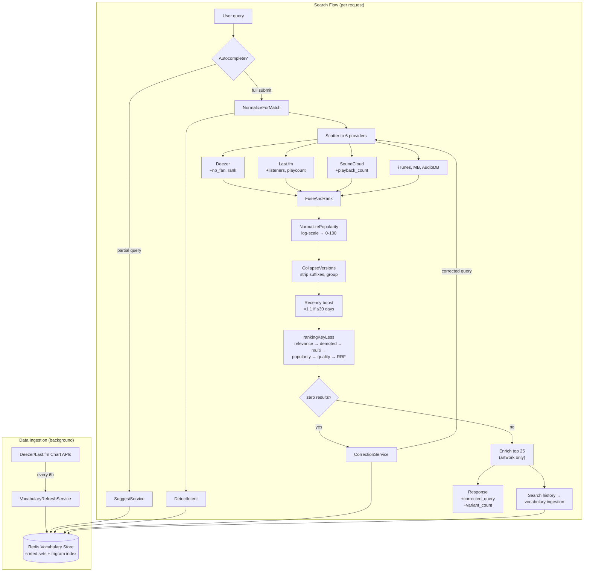

# feat: Discovery search quality improvements

## Summary

Ten implementation units across provider adapters, the discovery service layer, and a new Redis-backed vocabulary store. Popularity signals are extracted directly from existing provider search responses and normalized via log-scale into the already-wired ranking slot. A trigram-indexed vocabulary (seeded from Deezer/Last.fm charts, grown from search history) powers both a new autocomplete endpoint and a zero-result correction pipeline. Query intent parsing, version deduplication, and a recency boost round out the quality pass.

---

## Problem Frame

User testing showed "Megamsn" returning zero results (no query correction) and "Megaman" ranking an obscure artist above the Tay-K track (popularity data captured but unused in ranking). The brainstorm scoped seven improvements to close the gap with mainstream music apps before production launch. (See origin: `docs/brainstorms/2026-06-15-discovery-search-quality-requirements.md`)

---

## Requirements

- R1. Extract popularity metrics from providers that offer them: Deezer `nb_fan`/`rank`, Last.fm `listeners`/`playcount`, SoundCloud `playback_count`. (iTunes, MusicBrainz, and TheAudioDB do not expose engagement metrics in their search responses — verified during research.)
- R2. Normalize popularity to a common scale for cross-provider comparison
- R3. Wire normalized popularity into the existing ranking sort key
- R4. Provide an autocomplete suggestion endpoint with fuzzy matching
- R5. Seed vocabulary from provider charts + search history
- R6. Autocomplete tolerates partial input and minor misspellings
- R7. On zero results, fuzzy-match query against vocabulary and retry with correction
- R8. Response includes "showing results for" indicator when correction fires
- R9. No correction attempted when confidence is below threshold
- R10. Multi-term queries boost results matching detected artist + track fields
- R11. Intent parsing is best-effort; no pattern detected → bag-of-words
- R12. Collapse remix/live/acoustic versions into one representative entry
- R13. Indicate existence of variant versions on collapsed entries
- R14. Small ranking boost for recent releases
- R15. Recency does not dominate popularity or relevance

**Origin flows:** F1 (autocomplete-assisted search), F2 (corrected search on typo), F3 (popularity-ranked results). Note: the origin doc's flow-to-R-ID mappings are misaligned with flow descriptions — the plan maps units to requirements directly via R-IDs, not via flow coverage.
**Origin acceptance examples:** AE1 (R7, R8), AE2 (R1-R3), AE3 (R4-R6), AE4 (R10-R11), AE5 (R12-R13), AE6 (R14-R15), AE7 (R9)

---

## Scope Boundaries

- Modifying the identifier-only merge strategy (settled per discovery-identity-v1)
- Eval harness or golden query set (separate effort)
- Mobile frontend changes beyond consuming new/modified wire fields
- Adding new search providers
- ML/NLP-based query understanding (deferred escalation path)
- Personalized ranking from user history

### Deferred to Follow-Up Work

- PopularityResolver port cleanup (signature mismatch between port `(int64, error)` and cached adapter `(float64, bool, error)`) — not needed for this work since popularity comes from raw provider data
- Full MusicBrainz database dump as vocabulary source — add if chart + history coverage proves insufficient
- Search analytics dashboard for data-driven tuning of thresholds

---

## Context & Research

### Relevant Code and Patterns

- Provider adapters: `internal/discovery/adapters/providers/{deezer,lastfm,soundcloud,itunes,musicbrainz,theaudiodb}.go` — each implements `ports.SearchProvider`, returns `[]domain.SearchResult` with `Extras` map
- Ranking key: `internal/discovery/service/dedup.go` `rankingKeyLess()` — 8-tier sort: relevance-band → demoted → multi-source → popularity → quality → RRF → subtitle → title. Popularity reads `extras["popularity"]` — currently empty
- Enrichment: `internal/discovery/service/search_music.go` `enrich()` — top 25 results, 8 concurrent goroutines, 4s budget. PopularityResolver called but port never wired in `app.go`
- Fuzzy matching: `internal/discovery/service/fuzzy.go` — `TokenSortRatio` (Levenshtein-based), `levenshteinDistance`
- Normalization: `internal/discovery/service/normalize.go` — `NormalizeForMatch` 8-step pipeline
- Redis caches: `internal/discovery/adapters/cache/` — all follow pattern: nil-safe client, `discovery:<type>:v1:<hash>` keys, positive/negative TTLs, JSON serialization
- Background goroutine pattern: `internal/acquisition/service/scheduler.go` — `sync.WaitGroup` + semaphore, `context.WithCancel`, panic recovery, graceful shutdown
- DI wiring: `internal/app/app.go` — `buildDiscoveryProviders()` instantiates providers, injected into services
- Wire format: `DiscoverySearchResponse` / `SearchResultDTO` in handler — `extras` map is the extension point
- Testing: hand-rolled mock structs in `mock_ports_test.go`, table-driven subtests, `httptest.NewServer` for handler/provider tests, `redirectTransport` for provider URL rewriting

### Institutional Learnings

- **Extras merge provider-priority** (`docs/solutions/2026-06-07-extras-merge-provider-priority.md`): pairwise merge works for identity fields but is toxic for display fields. Pre/post merge stabilization pattern needed — already implemented in Go port
- **Combined-identity token matching** (`docs/solutions/design-patterns/2026-06-08-combined-identity-string-matching-over-field-gates.md`): `token_sort_ratio` on combined identity strings outperforms field-by-field JW gates for relevance scoring. Already in use via `fuzzy.go`
- **Test enrichment success paths** (`docs/solutions/2026-06-10-type-checking-import-runtime-crash.md`): best-effort pipeline stages with swallowed errors must have tests driving the success branch. Applies to vocabulary ingestion and correction logic

---

## Key Technical Decisions

- **Popularity from provider search results, not enrichment API calls**: Deezer, Last.fm, and SoundCloud return engagement metrics in their search responses. Extracting directly avoids extra API calls, gives popularity data for ALL results (not just top 25), and eliminates the chicken-and-egg problem where the initial rank determines which results get enriched. The existing PopularityResolver port stays unwired.
- **Log-scale normalization**: Raw counts span orders of magnitude (SoundCloud track: 10K plays vs Last.fm track: 1B plays). Log-scale compresses while preserving relative ordering. Formula: `min(100, log10(count+1) / log10(refMax+1) * 100)` with per-provider reference maxima.
- **Redis sorted sets + trigram index for vocabulary**: Prefix matching via `ZRANGEBYLEX` on a sorted set. Fuzzy matching via trigram decomposition — each term's trigrams stored in Redis sets, candidate retrieval via set intersection, final scoring by Jaccard coefficient + Levenshtein filter. Consistent with established Redis cache patterns.
- **Background goroutine for chart refresh**: No existing cron/periodic pattern in the codebase. A goroutine with `time.Ticker` (6-hour interval) follows the `BackgroundAcquisitionScheduler` lifecycle pattern (context cancel, panic recovery, graceful shutdown). Runs on startup + ticker.
- **Recency as a popularity multiplier**: Recent releases (within 30 days) get popularity × 1.1. This is proportional — a new track with zero popularity still gets zero, while a new track with moderate popularity edges up within its relevance band. A classic with much higher popularity still wins. (see origin: R14, R15)
- **Version dedup by suffix stripping**: Group results by `normalizeBaseTitle(title) + artist` where `normalizeBaseTitle` strips known suffixes (Remix, Live, Acoustic, Remaster, Slowed, Sped Up, Instrumental, Cover). Representative is the most popular version. `variant_count` in extras signals grouping to the client. Runs after FuseAndRank's merge pass, before final ranking.
- **Intent detection via vocabulary lookup**: For multi-term queries, check if any token subsequence matches a known artist in the vocabulary store. If so, split into detected artist + remainder (track). Boost relevance for results matching both fields. No ML needed — the vocabulary provides the artist dictionary.

---

## Open Questions

### Resolved During Planning

- **Popularity source** — direct extraction from provider search results, not the PopularityResolver enrichment port
- **Vocabulary storage** — Redis sorted sets + trigram index, consistent with existing cache patterns
- **Chart refresh mechanism** — background goroutine with ticker, following acquisition scheduler pattern
- **Correction algorithm** — trigram similarity (Jaccard) for candidate retrieval + Levenshtein distance for scoring

### Deferred to Implementation

- Exact Jaccard + Levenshtein threshold for correction confidence — needs tuning with real queries
- Per-provider reference maxima for log-scale normalization — calibrate from actual API responses
- Trigram index memory/key count at scale — monitor after chart seeding; may need key expiry policy
- Whether to debounce or batch search-history vocabulary ingestion to reduce Redis write volume

---

## High-Level Technical Design

> *This illustrates the intended data flow and is directional guidance for review, not implementation specification. The implementing agent should treat it as context, not code to reproduce.*

**Key flow points:**
- Popularity extraction happens at the provider adapter level (U1), not during enrichment — all results get popularity, not just the top 25
- Vocabulary store is the shared backbone for autocomplete (U6), correction (U7), and intent detection (U8)
- Version collapse (U9) runs after popularity normalization so the most popular version is picked as representative
- Correction retry reuses the existing scatter-gather path — no separate search flow

---

## Implementation Units

- U1. **Extract popularity metrics from providers**

**Goal:** Ensure Deezer, Last.fm, and SoundCloud provider adapters emit popularity-related fields into the extras map.

**Requirements:** R1

**Dependencies:** None

**Files:**
- Modify: `services/go-api/internal/discovery/adapters/providers/deezer.go`
- Modify: `services/go-api/internal/discovery/adapters/providers/lastfm.go`
- Modify: `services/go-api/internal/discovery/adapters/providers/soundcloud.go`
- Test: `services/go-api/internal/discovery/adapters/providers/deezer_test.go`
- Test: `services/go-api/internal/discovery/adapters/providers/lastfm_test.go`
- Test: `services/go-api/internal/discovery/adapters/providers/soundcloud_test.go`

**Approach:**
- Deezer: store `rank` in extras for tracks (currently parsed as `deezerItem.Rank` but dropped). Store `nb_fan` for all kinds, not just artists.
- Last.fm: add `Listeners` and `Playcount` fields to the response parsing structs in `parseLastFmResponse()`. Store in extras as `"listeners"` and `"playcount"`.
- SoundCloud: add `PlaybackCount` field to the yt-dlp JSON struct. Store in extras as `"playback_count"`.
- Follow existing pattern: extras values only set when the API returns a non-zero value.

**Patterns to follow:**
- Deezer adapter's existing extras population (e.g., `extras["nb_fan"]` for artists at line ~135)
- Each provider's `mapTo*()` helpers for domain result construction

**Test scenarios:**
- Happy path: Deezer track JSON includes `rank: 150000` → `extras["rank"]` populated
- Happy path: Deezer album JSON includes `nb_fan: 50000` → `extras["nb_fan"]` populated (not just artists)
- Happy path: Last.fm track JSON includes `listeners: "1234567"` → `extras["listeners"]` populated
- Happy path: SoundCloud yt-dlp JSON includes `playback_count: 500000` → `extras["playback_count"]` populated
- Edge case: Missing field in API response → extras key absent, not zero-valued

**Verification:**
- All three provider test suites pass with new assertions on extras keys
- `go test ./internal/discovery/adapters/providers/...` passes

---

- U2. **Normalize popularity and wire into ranking**

**Goal:** Combine raw provider popularity metrics into a single 0-100 score and ensure the ranking key consumes it.

**Requirements:** R2, R3

**Dependencies:** U1

**Files:**
- Create: `services/go-api/internal/discovery/service/popularity.go`
- Modify: `services/go-api/internal/discovery/service/dedup.go`
- Test: `services/go-api/internal/discovery/service/popularity_test.go`
- Test: `services/go-api/internal/discovery/service/dedup_test.go`

**Approach:**
- New `NormalizePopularity(extras map[string]any) int64` function that reads raw metrics (`nb_fan`, `rank`, `listeners`, `playcount`, `playback_count`), applies log-scale normalization per metric, and returns the highest normalized score (max-of-normalized strategy — a result popular on any provider gets credit).
- Call `NormalizePopularity` in `FuseAndRank` after the merge pass, setting `extras["popularity"]` on each result before ranking. The existing `popularity()` helper in dedup.go already reads this field.
- For merged results with multiple providers' metrics, max-of-normalized naturally picks the strongest signal.
- Deezer `rank` is inverse (lower = more popular) — invert before normalizing.

**Patterns to follow:**
- Existing `popularity()` helper in dedup.go for reading the field
- `ComputeQualityScore` pattern in `quality_scorer.go` for per-result score computation

**Test scenarios:**
- Covers AE2: Result with Deezer `nb_fan=5000000` + Last.fm `playcount=100000000` → high popularity score; result with no metrics → score 0. When both are in the same relevance band, high-pop result ranks first.
- Happy path: Result with only one provider metric → normalized correctly
- Edge case: Extremely large values (billions) → capped at 100
- Edge case: Zero or negative values → score 0
- Edge case: Deezer `rank` inversion — rank 1 → high score, rank 999999 → low score
- Integration: Two results in same relevance band with different popularity → higher popularity wins sort

**Verification:**
- `go test ./internal/discovery/service/...` passes
- Manual test: searching "Megaman" with a running server shows the Tay-K track above the obscure artist

---

- U3. **Vocabulary store infrastructure**

**Goal:** Redis-backed vocabulary store supporting prefix search, fuzzy lookup, and bulk ingestion.

**Requirements:** R5, R6

**Dependencies:** None

**Files:**
- Create: `services/go-api/internal/discovery/domain/vocabulary.go`
- Modify: `services/go-api/internal/discovery/ports/ports.go`
- Create: `services/go-api/internal/discovery/adapters/cache/vocabulary_store.go`
- Test: `services/go-api/internal/discovery/adapters/cache/vocabulary_store_test.go`

**Approach:**
- Domain type: `VocabularyEntry` carrying term text, normalized form, kind (artist/track/album), and popularity score.
- Port interface: `VocabularyStore` with `Add`, `BulkAdd`, `SuggestByPrefix(prefix, limit)`, `FindClosest(query, limit)`.
- Redis implementation: two complementary structures.
  - Prefix search: sorted set `discovery:vocab:v1:terms` with members scored by popularity. `ZRANGEBYLEX` for prefix matching, then re-sort by score.
  - Fuzzy search: trigram index. For each term, decompose into character trigrams and store in sets `discovery:vocab:v1:tri:<trigram>`. Candidate retrieval via multi-set intersection in Go. Score candidates by trigram overlap (Jaccard coefficient), filter by Levenshtein distance using existing `levenshteinDistance` from fuzzy.go.
  - Term detail: hash keys `discovery:vocab:v1:entry:<termNorm>` storing kind, raw text, popularity.
- Nil-safe client pattern (matches existing caches).

**Patterns to follow:**
- `internal/discovery/adapters/cache/artwork_cache.go` for Redis adapter structure, nil-safety, key format
- `internal/discovery/service/fuzzy.go` for `levenshteinDistance` reuse
- `internal/discovery/service/normalize.go` for `NormalizeForMatch` reuse on vocabulary terms

**Test scenarios:**
- Happy path: Add entry → SuggestByPrefix returns it for matching prefix
- Happy path: Add "megaman" → FindClosest("megamsn") returns it as top candidate
- Happy path: BulkAdd 100 entries → all retrievable
- Edge case: Empty prefix → returns top entries by popularity
- Edge case: No matching trigrams → FindClosest returns empty
- Edge case: Nil Redis client → all methods return empty/nil gracefully
- Integration: Add entries with varying popularity → prefix results sorted by popularity descending

**Verification:**
- Unit tests pass with mock Redis (or integration test with real Redis behind env-var guard)
- `go test ./internal/discovery/adapters/cache/...` passes

---

- U4. **Chart data ingestion and background refresh**

**Goal:** Periodically fetch popular artists, tracks, and albums from Deezer and Last.fm charts and populate the vocabulary store.

**Requirements:** R5

**Dependencies:** U3

**Files:**
- Modify: `services/go-api/internal/discovery/ports/ports.go` (add `ChartProvider` interface)
- Modify: `services/go-api/internal/discovery/adapters/providers/deezer.go` (add chart methods)
- Modify: `services/go-api/internal/discovery/adapters/providers/lastfm.go` (add chart methods)
- Create: `services/go-api/internal/discovery/service/vocabulary_refresh.go`
- Modify: `services/go-api/internal/app/app.go` (wire service, start goroutine)
- Test: `services/go-api/internal/discovery/service/vocabulary_refresh_test.go`
- Test: `services/go-api/internal/discovery/adapters/providers/deezer_test.go` (chart methods)
- Test: `services/go-api/internal/discovery/adapters/providers/lastfm_test.go` (chart methods)

**Approach:**
- New `ChartProvider` port with `FetchCharts(ctx, limit) ([]VocabularyEntry, error)`.
- Deezer adapter: `GET /chart/0/tracks?limit=100`, `/chart/0/artists?limit=100`, `/chart/0/albums?limit=100`. Map to `VocabularyEntry` with popularity from `rank`/`nb_fan`.
- Last.fm adapter: `chart.getTopTracks?limit=100`, `chart.getTopArtists?limit=100`. Map with popularity from `listeners`.
- `VocabularyRefreshService` with `RunOnce(ctx)` and `Start(ctx)` methods.
  - `RunOnce`: fetches from all chart providers, deduplicates, bulk-adds to vocabulary store.
  - `Start`: calls `RunOnce` immediately, then every 6 hours via `time.Ticker`. Lifecycle managed via context cancellation.
- Wired in `app.go`: instantiated during setup, `Start()` called after HTTP server starts. `Shutdown()` called during graceful shutdown.

**Patterns to follow:**
- `internal/acquisition/service/scheduler.go` for background goroutine lifecycle (context cancel, panic recovery, shutdown)
- Existing provider `Search()` methods for HTTP client usage and JSON parsing

**Test scenarios:**
- Happy path: Chart fetch returns 100 tracks from Deezer → all added to vocabulary store
- Happy path: Both Deezer and Last.fm charts fetched → combined entries in vocabulary
- Error path: One chart provider fails (timeout/error) → other provider's data still ingested, error logged
- Edge case: Duplicate term from both providers → upserted with highest popularity
- Edge case: Empty chart response → no error, no entries added
- Integration: After RunOnce, vocabulary store SuggestByPrefix returns chart entries

**Verification:**
- Provider chart tests pass with mock HTTP servers
- Service tests pass with mock ChartProvider
- `go test ./internal/discovery/service/... ./internal/discovery/adapters/providers/...` passes

---

- U5. **Search history vocabulary ingestion**

**Goal:** Successful search queries automatically feed the vocabulary store for long-tail coverage.

**Requirements:** R5

**Dependencies:** U3

**Files:**
- Modify: `services/go-api/internal/discovery/service/search_music.go`
- Test: `services/go-api/internal/discovery/service/search_music_test.go`

**Approach:**
- After successful search with >0 results, fire a goroutine that adds vocabulary entries:
  - The raw query (normalized) as a vocabulary entry with kind inferred from result distribution
  - Top 3 result titles + subtitles as individual entries (artist entries from artist results, track entries from track results)
- Fire-and-forget with panic recovery (existing pattern in search history save).
- Vocabulary store's `Add` is an upsert — duplicate terms naturally update popularity.
- No debouncing in v1; if write volume becomes a concern, batch via a channel (deferred to implementation).

**Patterns to follow:**
- Existing async search history save in `search_music.go` (goroutine after successful search)

**Test scenarios:**
- Happy path: Search returns 5 results → query + top 3 result terms added to vocabulary
- Edge case: Search returns zero results → nothing added to vocabulary
- Edge case: Vocabulary store unavailable (nil client) → goroutine completes without error
- Error path: Vocabulary store returns error → logged, does not affect search response

**Verification:**
- `go test ./internal/discovery/service/...` passes with mock vocabulary store

---

- U6. **Autocomplete endpoint**

**Goal:** New `GET /v1/discovery/suggest` endpoint returning popularity-ranked suggestions from the vocabulary.

**Requirements:** R4, R6

**Dependencies:** U3

**Files:**
- Create: `services/go-api/internal/discovery/service/suggest.go`
- Modify: `services/go-api/internal/discovery/adapters/handler/discovery_handler.go`
- Modify: `services/go-api/internal/app/app.go` (wire SuggestService)
- Test: `services/go-api/internal/discovery/service/suggest_test.go`
- Test: `services/go-api/internal/discovery/adapters/handler/discovery_handler_test.go`

**Approach:**
- `SuggestService` with `Execute(ctx, partial string, limit int) ([]SuggestionResult, error)`.
  - Normalizes the partial query.
  - Tries prefix match first via `VocabularyStore.SuggestByPrefix`.
  - If fewer than `limit` results, supplements with fuzzy matches via `FindClosest`.
  - Returns results ranked by popularity.
- Handler: `GET /v1/discovery/suggest?q=<partial>&limit=5`. Validates `q` (non-empty after trim) and `limit` (1-10, default 5). Auth required (same middleware as search).
- Response: `{ "suggestions": [{ "text": "Megaman - Tay-K", "kind": "track", "popularity": 85 }] }`.

**Patterns to follow:**
- Existing `handleSearch()` in `discovery_handler.go` for request parsing, error responses, auth
- `SearchMusicService` constructor pattern for dependency injection

**Test scenarios:**
- Covers AE3: Prefix "Mega" → suggestions include entries containing "Megaman" ranked by popularity
- Happy path: Exact prefix match returns results sorted by popularity descending
- Happy path: Fuzzy query with minor typo still returns relevant suggestions
- Edge case: Empty query parameter → 400 Bad Request
- Edge case: No matches for prefix or fuzzy → empty suggestions array (200 OK)
- Edge case: Limit=1 → returns only top suggestion
- Error path: Vocabulary store error → 500 with appropriate error response

**Verification:**
- Service and handler tests pass
- `go test ./internal/discovery/service/... ./internal/discovery/adapters/handler/...` passes

---

- U7. **Server-side query correction**

**Goal:** When all providers return zero results, correct the query against the vocabulary and retry search transparently.

**Requirements:** R7, R8, R9

**Dependencies:** U3, U2

**Files:**
- Create: `services/go-api/internal/discovery/service/correction.go`
- Modify: `services/go-api/internal/discovery/service/search_music.go`
- Modify: `services/go-api/internal/discovery/domain/types.go` (add correction fields to `SearchOutput`)
- Modify: `services/go-api/internal/discovery/adapters/handler/discovery_handler.go` (add correction fields to response DTO)
- Test: `services/go-api/internal/discovery/service/correction_test.go`
- Test: `services/go-api/internal/discovery/service/search_music_test.go`
- Test: `services/go-api/internal/discovery/adapters/handler/discovery_handler_test.go`

**Approach:**
- `CorrectionService` with `Correct(ctx, query string) (corrected string, confidence float64, err error)`.
  - Calls `VocabularyStore.FindClosest(query, 5)` to get candidates.
  - Scores each candidate: trigram Jaccard coefficient × (1 - normalized Levenshtein distance). Picks the highest-scoring candidate above the confidence threshold.
  - Threshold tuned during implementation (starting point: 0.4).
- In `SearchMusicService.Execute()`: after scatter-gather, if total result count is zero AND vocabulary store is available, call `CorrectionService.Correct()`. If correction found, re-run scatter-gather with corrected query, set output fields.
- Domain: add `CorrectedQuery string` and `OriginalQuery string` to `SearchOutput`.
- Handler: add `corrected_query` (string, omitempty) and `original_query` (string, omitempty) to `DiscoverySearchResponse`.

**Patterns to follow:**
- Existing zero-result handling in `search_music.go` (the early-return path when all providers fail)
- `VocabularyStore.FindClosest` from U3

**Test scenarios:**
- Covers AE1: Query "Megamsn" → all providers return zero → correction finds "Megaman" → retry returns results → response includes `corrected_query: "Megaman"` and `original_query: "Megamsn"`
- Covers AE7: Query "xkqzwp" → no vocabulary match above threshold → zero results returned, no correction fields
- Happy path: Single character transposition ("megamna" → "megaman") → corrected
- Edge case: Query already correct but providers all timed out → correction matches original → no retry, no correction fields in response (skip retry when corrected == original)
- Edge case: Multiple candidates above threshold → highest scoring picked
- Edge case: Vocabulary store unavailable → zero results returned without correction attempt
- Error path: Correction service error → logged, zero results returned gracefully

**Verification:**
- Correction service unit tests pass
- Search service integration tests verify the full flow (zero results → correct → retry)
- Handler tests verify new response fields
- `go test ./internal/discovery/...` passes

---

- U8. **Query intent parsing**

**Goal:** Detect "artist + track" patterns in multi-term queries and boost relevance for results matching both fields.

**Requirements:** R10, R11

**Dependencies:** U3

**Files:**
- Create: `services/go-api/internal/discovery/service/intent.go`
- Modify: `services/go-api/internal/discovery/service/dedup.go`
- Test: `services/go-api/internal/discovery/service/intent_test.go`
- Test: `services/go-api/internal/discovery/service/dedup_test.go`

**Approach:**
- `QueryIntent` struct: `{ Artist string, Track string, Confidence float64 }`.
- `DetectIntent(ctx, queryTokens []string, vocabStore VocabularyStore) *QueryIntent`.
  - For each possible split point in the token list (left = artist candidate, right = track candidate, and vice versa):
    - Check if the left/right side matches a known artist in the vocabulary (prefix or exact match).
    - Score by artist popularity (higher popularity = more likely to be the intended artist).
  - Return the best split if confidence is above threshold. Return nil if no split is strong enough.
- In `FuseAndRank`: if intent is non-nil, compute a relevance boost for results where `NormalizeForMatch(subtitle)` matches the detected artist AND `NormalizeForMatch(title)` matches the detected track. Boost: add 0.15 to the raw relevance score before banding. This shifts borderline results up a band.
- Intent detection called once per search, passed into FuseAndRank as an optional parameter.

**Patterns to follow:**
- `NormalizeForMatch` from normalize.go for term comparison
- `relevanceScore` function in dedup.go for existing relevance computation

**Test scenarios:**
- Covers AE4: "Tay-K Megaman" → detects artist="Tay-K", track="Megaman" → result with subtitle "Tay-K" and title "Megaman" gets relevance boost → ranks above result with only title match
- Happy path: "artist track" order detected
- Happy path: "track artist" order also detected (tries both directions)
- Edge case: Single-term query → returns nil, no boost applied
- Edge case: All tokens form one artist name (e.g., "The Weeknd") → no split, bag-of-words
- Edge case: No token subset matches any artist → returns nil
- Edge case: Ambiguous query where multiple splits are valid → picks split with highest-popularity artist

**Verification:**
- Intent detection unit tests pass
- Dedup tests verify relevance boost is applied when intent is present
- `go test ./internal/discovery/service/...` passes

---

- U9. **Version deduplication**

**Goal:** Collapse multiple versions of the same recording (remix, live, acoustic, etc.) into one representative entry.

**Requirements:** R12, R13

**Dependencies:** None

**Files:**
- Modify: `services/go-api/internal/discovery/service/dedup.go`
- Test: `services/go-api/internal/discovery/service/dedup_test.go`

**Approach:**
- New `CollapseVersions(results []SearchResult) []SearchResult` function.
  - `normalizeBaseTitle(title)` strips known version suffixes via regex: `(?i)\s*[\(\?|slowed(\s*\+?\s*reverb)?|sped up|instrumental|cover|radio edit|deluxe|extended|clean|explicit|bonus track)[\)\]]`.
  - Groups results by `normalizeBaseTitle(title) + NormalizeForMatch(subtitle)`.
  - Within each group: picks the result with the highest `extras["popularity"]` (falling back to first-in-original-order if equal). Sets `extras["variant_count"]` to the group size on the representative.
  - Returns the collapsed list preserving the original relative order of representatives.
- Called in `FuseAndRank` after the merge pass, after popularity normalization (U2), and before final sort.

**Patterns to follow:**
- Existing `IsDemoted()` in quality_scorer.go for suffix-based classification
- `NormalizeForMatch` for artist name comparison

**Test scenarios:**
- Covers AE5: "Megaman" + "Megaman (Remix)" + "Megaman (Slowed + Reverb)" by same artist → collapsed to one entry with `variant_count: 3`
- Happy path: Different recordings with similar titles but different artists → NOT collapsed
- Edge case: Title with parenthetical that isn't a version suffix (e.g., "Song (feat. Artist)") → not stripped, not collapsed
- Edge case: Only one version exists → no grouping, no `variant_count` in extras
- Edge case: All versions have equal popularity → first in original order is representative
- Edge case: Mixed kinds (track "Megaman" + album "Megaman") → NOT collapsed (different kinds)

**Verification:**
- Dedup tests pass with new collapse scenarios
- `go test ./internal/discovery/service/...` passes

---

- U10. **Recency boost**

**Goal:** Small ranking boost for recently released music so new releases surface without dominating established hits.

**Requirements:** R14, R15

**Dependencies:** U2

**Files:**
- Modify: `services/go-api/internal/discovery/service/dedup.go`
- Test: `services/go-api/internal/discovery/service/dedup_test.go`

**Approach:**
- Recency boost is applied as a **separate field** (`extras["popularity_boosted"]`) after popularity normalization and **after** version collapse. Version collapse (U9) uses the raw `extras["popularity"]` to pick the representative — recency does not influence which version is kept.
- Parse `extras["release_date"]` (ISO 8601: `YYYY-MM-DD` or `YYYY`). If the release is within the last 30 days, set `extras["popularity_boosted"] = min(100, popularity * 1.1)`. Otherwise, `popularity_boosted = popularity`.
- The ranking key's popularity slot reads `popularity_boosted` instead of raw `popularity`.
- This means: a new track with popularity 50 becomes 55 (small bump within its band). A new track with popularity 0 stays 0. A classic with popularity 95 beats a new track with boosted 55.
- Robust to missing or malformed dates — no boost applied, no error.

**Patterns to follow:**
- Existing date parsing in provider adapters (Deezer stores `release_date` in extras)

**Test scenarios:**
- Covers AE6: New album (released 2 days ago, popularity 40) vs classic hit (popularity 90) → classic still ranks higher. But new album (popularity 40 → 44 after boost) vs older track (popularity 42) → new album edges ahead.
- Happy path: Release date 5 days ago → boost applied
- Edge case: Release date exactly 30 days ago → boost applied (inclusive)
- Edge case: Release date 31 days ago → no boost
- Edge case: No `release_date` in extras → no boost
- Edge case: Malformed date string (e.g., "2025") → parse year-only as Jan 1; if within window, boost; otherwise no boost
- Edge case: Boost would exceed 100 → capped at 100

**Verification:**
- Dedup tests pass with recency scenarios
- `go test ./internal/discovery/service/...` passes

---

## System-Wide Impact

- **Wire format extension:** New fields on search response (`corrected_query`, `original_query`). New endpoint (`/v1/discovery/suggest`). New field in result extras (`variant_count`). All additive — existing mobile client is unaffected until it consumes the new fields.
- **Redis key namespace expansion:** Vocabulary store adds `discovery:vocab:v1:*` keys (terms sorted set, trigram sets, entry hashes). No collision with existing `discovery:*` keys.
- **Background goroutine:** Chart refresh runs every 6 hours. Failure is logged and retried next cycle. No impact on request handling. Lifecycle managed via context cancellation during shutdown.
- **Provider API rate limiting:** Chart fetches add ~4 API calls every 6 hours (2 Deezer + 2 Last.fm). Well within rate limits.
- **Search latency:** Popularity normalization and version dedup add negligible compute (in-memory operations on already-fetched data). Query correction adds latency only on zero-result searches (vocabulary lookup + retry). Autocomplete is a separate fast endpoint.
- **Unchanged invariants:** Identifier-only merge strategy, circuit breaker behavior, cache TTLs, search history ring buffer, click tracking — all untouched.

---

## Risks & Dependencies

| Risk | Mitigation |
|------|------------|
| Deezer/Last.fm chart endpoints unavailable or rate-limited | Chart refresh is best-effort; vocabulary works with whatever data is available. Search history ingestion provides a second growth path. |
| Trigram index grows large with many vocabulary entries | Monitor key count after initial seeding. Add TTL to trigram sets if needed. ~10K terms = ~50K trigram keys — manageable for Redis. |
| Correction false positives (correcting intentional queries) | Confidence threshold + "search instead for original" UX gives user escape hatch. Threshold can be tuned up if false positives are common. |
| Intent parsing misidentifies artist/track split | Best-effort by design (R11). Bag-of-words fallback ensures no degradation from current behavior. |
| Version dedup collapses results that shouldn't be grouped | Conservative suffix list. Non-version parentheticals (feat., prod.) excluded from stripping. |
| Log-scale normalization calibration | Per-provider reference maxima may need adjustment. Start with conservative values, tune based on actual API responses. |

---

## Sources & References

- **Origin document:** [docs/brainstorms/2026-06-15-discovery-search-quality-requirements.md](docs/brainstorms/2026-06-15-discovery-search-quality-requirements.md)
- Related plan: [docs/plans/2026-06-14-001-refactor-go-modular-monolith-plan.md](docs/plans/2026-06-14-001-refactor-go-modular-monolith-plan.md)
- Institutional learning: [docs/solutions/2026-06-07-extras-merge-provider-priority.md](docs/solutions/2026-06-07-extras-merge-provider-priority.md)
- Institutional learning: [docs/solutions/design-patterns/2026-06-08-combined-identity-string-matching-over-field-gates.md](docs/solutions/design-patterns/2026-06-08-combined-identity-string-matching-over-field-gates.md)
- Related code: `services/go-api/internal/discovery/` (bounded context root)
- Related ADR: `docs/adr/0007-unified-music-search.md` (ranking addendum)
