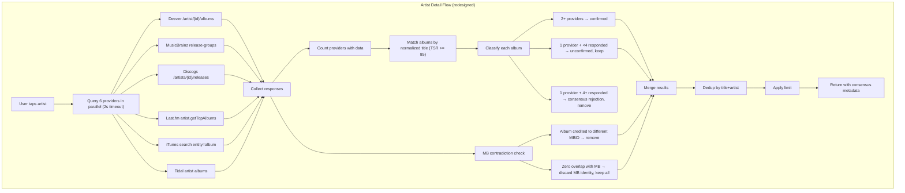

# refactor: Discovery pipeline clarity — consensus, artwork, providers

## Summary

Replace identity resolution with multi-provider consensus for artist discography, add Tidal and Cover Art Archive adapters, restructure the artwork chain to ID-first ordering, equalize RRF weights, add per-stage diagnostic logging, wire click signals, and fix remaining audit bugs. 13 implementation units across 6 phases, ordered by dependency.

---

## Problem Frame

The identity resolution system on the artist detail page filters albums using heuristics (genre, temporal, ISRC registrant checks) that produce false positives for underground artists and false negatives for common-name artists when the MusicBrainz identity is wrong. Multi-provider consensus replaces it: query 6 providers for album lists, confirm albums appearing on 2+ providers, remove only when MusicBrainz explicitly credits an album to a different artist or when 4+ providers have data and an album appears on none of them. (see origin: `docs/brainstorms/2026-06-19-discovery-pipeline-clarity-requirements.md`)

---

## Requirements

- R1. Artist detail page fetches albums from multiple providers in parallel and builds consensus
- R2. Albums on 2+ providers = confirmed; 1 provider = unconfirmed but included; consensus rejection when 4+ providers responded and album on none except Deezer
- R3. MB identity contradiction (different MBID) is the only identity-based removal. MB cross-validated against provider data (zero overlap = discard MB identity)
- R4. Search page and detail page return consistent data
- R5. Default album limit raised from 10 to 50
- R6. Identity resolution system removed (identity_resolver.go, identity_constraints.go, identity_cache.go)
- R7. Add Tidal as search + artist content provider
- R8. Add Cover Art Archive as MBID-keyed artwork source
- R9. Expand Last.fm: add `artist.getTopAlbums` + `artist.getTopTracks`
- R10. Expand Wikidata bridge for search merging
- R11. Expand YouTube for popularity signal via view counts
- R12. Artwork chain: ID-based first (Deezer → Cover Art Archive → Fanart.tv), name-search last
- R13. Artist images: Deezer `picture_big` → Fanart.tv → TheAudioDB → Genius → YouTube
- R14. Each pipeline stage documented in ARCHITECTURE.md with input/output types
- R15. Search-path and detail-path documented as separate pipelines with Mermaid diagrams
- R16. Diagnostic logging per stage (stage name, input count, output count, items changed) at debug level
- R17. Wire ClickSignalProvider to persistence and ranking pipeline
- R18. RRF weights equalized to 1.0 for all providers
- R19. `dedupAlbums` includes artist name in dedup key
- R20. Error responses initialize Items to empty slice, not nil
- R21. Evaluate `maxProviderLookups` increase in FindRelatedService

**Origin actors:** A1 (Developer), A2 (App user), A3 (Pipeline stages)
**Origin flows:** F1 (Search flow), F2 (Artist detail flow — redesigned), F3 (Artwork resolution flow)
**Origin acceptance examples:** AE1 (Killeastsxde full discography), AE2 (OsamaSon all albums), AE3 (che contamination removed via MB), AE4 (wrong MB identity discarded), AE5 (ID-first artwork), AE6 (Tidal in scatter), AE7 (diagnostic logging)

---

## Scope Boundaries

- ML model implementation
- Personalization layer
- Mobile-side UI changes (confirmed/unconfirmed badges)
- Paid provider integrations (Spotify, Apple Music)
- SoundCloud official API
- Elasticsearch adoption
- AcoustID audio fingerprinting
- Vocabulary store / suggestion / correction pipeline changes

### Deferred to Follow-Up Work

- YouTube view count expansion (R11) — if Tidal + consensus ship well, YouTube popularity can wait for a follow-up PR
- Mobile app update to consume consensus metadata in artist album responses

---

## Context & Research

### Relevant Code and Patterns

- `services/go-api/internal/discovery/adapters/providers/deezer.go` — canonical adapter pattern: struct with `*http.Client`, `Name()`, `SupportedKinds()`, `Search()`, content methods. All new adapters follow this shape.
- `services/go-api/internal/discovery/ports/ports.go` — 14 port interfaces. `ArtistContentProvider` (GetArtistTopTracks, GetArtistAlbums) is the consensus provider interface. `ArtworkResolver` for Cover Art Archive.
- `services/go-api/internal/discovery/service/get_artist_content.go` — integration point. `GetAlbums()` currently calls `resolveDiscographyIdentity()` at line 94-96. This becomes the consensus call site.
- `services/go-api/internal/app/app.go` — DI wiring. Provider registration (line 379-403), artwork chain (line 172-200), identity resolver setup (line 242-258), artist content service (line 257-259).
- `services/go-api/internal/discovery/service/normalize.go` — `NormalizeForMatch()` 8-step canonicalization. Used for consensus title matching.
- `services/go-api/internal/discovery/service/dedup.go` — `providerRRFWeight` map (line 23-30) for RRF equalization. `TokenSortRatio` for fuzzy title matching.
- `services/go-api/internal/shared/config/` — config pattern for new env vars (Tidal credentials).

### External References

- Provider inventory: `docs/brainstorms/2026-06-20-provider-inventory.md`
- Tidal developer portal: `developer.tidal.com`
- Cover Art Archive API: `musicbrainz.org/doc/Cover_Art_Archive/API`
- Last.fm API: `last.fm/api` — `artist.getTopAlbums`, `artist.getTopTracks`

---

## Key Technical Decisions

- **Consensus service is a new file, not a refactor of identity_resolver.go:** The consensus abstraction (query multiple providers, match titles, apply rules) has no conceptual overlap with identity resolution (build profiles, check constraints). Clean-room replacement prevents carrying over complexity.
- **Consensus title matching uses NormalizeForMatch + TokenSortRatio >= 85:** Reuses existing, tested infrastructure. `NormalizeForMatch` handles case, accents, punctuation. `TokenSortRatio` handles word-order differences and parenthetical variations ("Greatest Hits" vs "Greatest Hits (Deluxe)"). The 85 threshold is already validated by version-collapse tests.
- **Consensus providers share a 2-second parallel timeout:** Matches existing `relatedTimeout` constant. Artist detail pages are user-initiated (tap), so 2s is acceptable. Each provider is optional — partial results are fine.
- **Tidal adapter manages OAuth token with sync.Once-guarded field:** Pattern consistent with how Deezer/iTunes use simple `*http.Client` — Tidal needs token refresh but the adapter owns it internally. No token management in the DI layer.
- **Diagnostic logging uses existing slog pattern:** `slog.DebugContext(ctx, "pipeline.stage_name", "input_count", n, "output_count", m, "changed", delta)`. No separate event system. Consistent with existing search pipeline logging.
- **Cover Art Archive uses release-group MBID lookup:** `/release-group/{mbid}/front` returns the canonical front cover at up to 1200px. Requires MBID, which comes from MusicBrainz search results or the Wikidata bridge.

---

## Open Questions

### Resolved During Planning

- **Consensus title matching approach:** NormalizeForMatch + TokenSortRatio >= 85 (reuses existing infrastructure)
- **Consensus timeout:** 2 seconds, matching relatedTimeout
- **Diagnostic logging format:** Structured slog attributes at debug level
- **MB contradiction when no MBIDs exist:** Defaults to "keep all" — contradiction requires both the artist and the album to have MBIDs

### Deferred to Implementation

- **Tidal ToS review:** Verify non-commercial use compatibility before shipping. If ToS is hostile, Tidal adapter ships disabled behind a config flag.
- **Wikidata SPARQL latency:** Measure actual latency. If >500ms, cache aggressively (existing MBID cache has 30-day TTL). May need to run SPARQL resolution asynchronously during enrichment.
- **Click signal ranking weight:** Start at zero impact, tune once click volume is measurable.

---

## High-Level Technical Design

> *This illustrates the intended approach and is directional guidance for review, not implementation specification. The implementing agent should treat it as context, not code to reproduce.*



---

## Implementation Units

### Phase 1: Quick audit fixes

- U1. **Quick audit fixes (album limit, nil slices, dedup key, RRF weights, provider lookups)**

**Goal:** Fix all low-hanging audit bugs in one atomic commit.

**Requirements:** R5, R18, R19, R20, R21

**Dependencies:** None

**Files:**
- Modify: `services/go-api/internal/discovery/adapters/handler/discovery_handler.go`
- Modify: `services/go-api/internal/discovery/service/get_artist_content.go`
- Modify: `services/go-api/internal/discovery/service/get_album_tracks.go`
- Modify: `services/go-api/internal/discovery/service/dedup.go`
- Modify: `services/go-api/internal/discovery/service/find_related.go`
- Test: `services/go-api/internal/discovery/service/dedup_test.go`
- Test: `services/go-api/internal/discovery/adapters/handler/discovery_handler_test.go`

**Approach:**
- `handleArtistAlbums`: change default limit from 10 to 50
- `GetTopTracks` and `GetAlbums` error paths: initialize `Items: []domain.SearchResult{}` instead of leaving nil
- `dedupAlbums`: change key from `NormalizeForMatch(r.Title)` to `NormalizeForMatch(r.Title) + "|" + NormalizeForMatch(r.Subtitle)`
- `providerRRFWeight`: replace entire map with a single constant `1.0` — remove the map, use `1.0` directly in the RRF calculation
- `maxProviderLookups`: increase from 3 to 5

**Patterns to follow:**
- Existing `dedup.go` signature function (line 84-88) for the title+subtitle key pattern

**Test scenarios:**
- Happy path: `dedupAlbums` with two albums titled "Deluxe" by different artists → both kept
- Happy path: `dedupAlbums` with two albums titled "Deluxe" by same artist → dedup to one (higher track count)
- Edge case: error response from GetTopTracks has `items: []` in JSON, not `items: null`
- Happy path: RRF calculation with all providers at weight 1.0 produces same score regardless of provider
- Integration: handler returns album limit of 50 when no limit param provided

**Verification:**
- `go test ./internal/discovery/...` passes
- `go vet ./internal/discovery/...` clean

---

### Phase 2: New provider adapters

- U2. **Tidal adapter**

**Goal:** Add Tidal as a search provider and artist content provider with OAuth 2.0 client credentials.

**Requirements:** R7

**Dependencies:** None

**Files:**
- Create: `services/go-api/internal/discovery/adapters/providers/tidal.go`
- Create: `services/go-api/internal/discovery/adapters/providers/tidal_test.go`
- Modify: `services/go-api/internal/shared/config/config.go` (add Tidal env vars)
- Modify: `services/go-api/internal/app/app.go` (register Tidal in provider list)

**Approach:**
- Implements `SearchProvider`, `ArtistContentProvider`
- OAuth 2.0 client credentials: POST to Tidal token endpoint with client_id/secret, cache token with `sync.Once` pattern, refresh on 401
- Search endpoint maps to `domain.SearchResult` with ISRC in extras
- Artist albums and top tracks endpoints map to `domain.SearchResult`
- Config: `TIDAL_CLIENT_ID`, `TIDAL_CLIENT_SECRET` env vars, `HasTidal()` method

**Patterns to follow:**
- `services/go-api/internal/discovery/adapters/providers/deezer.go` — struct shape, Name(), SupportedKinds(), Search(), GetArtistAlbums(), GetArtistTopTracks(), mapResult function
- `services/go-api/internal/app/app.go` line 394-398 (conditional provider registration with `HasLastFM()`)

**Test scenarios:**
- Happy path: Search returns tracks/albums/artists mapped to SearchResult with correct kinds
- Happy path: GetArtistAlbums returns album list with titles, subtitles, release dates
- Happy path: GetArtistTopTracks returns track list with ISRCs
- Error path: Token request fails → Search returns error, circuit breaker records failure
- Error path: API returns 429 → error propagated, not retried within adapter
- Edge case: Token expired mid-request → refresh and retry once

**Verification:**
- Tidal appears in search provider list when configured
- `go test ./internal/discovery/adapters/providers/...` passes

---

- U3. **Cover Art Archive adapter**

**Goal:** Add Cover Art Archive as an MBID-keyed artwork resolver for album covers up to 1200px.

**Requirements:** R8

**Dependencies:** None

**Files:**
- Create: `services/go-api/internal/discovery/adapters/providers/coverartarchive.go`
- Create: `services/go-api/internal/discovery/adapters/providers/coverartarchive_test.go`

**Approach:**
- Implements `ArtworkResolver` interface
- Endpoint: `https://coverartarchive.org/release-group/{mbid}/front-500` (500px) or `/front-1200` (1200px)
- Only resolves when MBID is provided (returns empty string for empty MBID)
- The API returns a redirect to the actual image URL on archive.org — follow the redirect and return the final URL
- No rate limit, no auth

**Patterns to follow:**
- `services/go-api/internal/discovery/adapters/providers/fanarttv.go` — MBID-keyed artwork resolver pattern

**Test scenarios:**
- Happy path: Resolve with valid MBID returns image URL
- Edge case: Resolve with empty MBID returns empty string immediately
- Error path: API returns 404 (no cover art) → returns empty string, no error
- Edge case: redirect URL is followed correctly

**Verification:**
- Cover Art Archive appears in artwork chain when configured

---

- U4. **Expand Last.fm adapter**

**Goal:** Add `artist.getTopAlbums` and `artist.getTopTracks` endpoints to the existing Last.fm adapter so it can participate in consensus and provide popularity data.

**Requirements:** R9

**Dependencies:** None

**Files:**
- Modify: `services/go-api/internal/discovery/adapters/providers/lastfm.go`
- Modify: `services/go-api/internal/discovery/adapters/providers/lastfm_test.go`

**Approach:**
- Add `GetArtistAlbums` method: calls `artist.getTopAlbums` API, maps to `[]domain.SearchResult` with `ResultKindAlbum`
- Add `GetArtistTopTracks` method: calls `artist.getTopTracks` API, maps to `[]domain.SearchResult` with `ResultKindTrack`, includes `listeners` and `playcount` in extras
- Both methods match the `ArtistContentProvider` interface
- Artist lookup by name (not by provider-specific ID) since Last.fm doesn't use numeric IDs in the same way

**Patterns to follow:**
- Existing `lastfm.go` search methods for API call pattern, response parsing, result mapping

**Test scenarios:**
- Happy path: GetArtistAlbums for well-known artist returns album list with titles and image URLs
- Happy path: GetArtistTopTracks returns tracks with playcount in extras
- Edge case: artist not found on Last.fm → returns empty slice, no error
- Error path: API timeout → returns error

**Verification:**
- Last.fm adapter satisfies `ArtistContentProvider` interface
- `go test ./internal/discovery/adapters/providers/...` passes

---

### Phase 3: Consensus service

- U5. **Consensus service**

**Goal:** Build the core consensus logic that queries multiple providers for an artist's albums, matches across providers by title, and applies consensus rules + MB contradiction checking.

**Requirements:** R1, R2, R3

**Dependencies:** U2, U3, U4 (providers must exist, but consensus degrades gracefully if some are unavailable)

**Files:**
- Create: `services/go-api/internal/discovery/service/consensus.go`
- Create: `services/go-api/internal/discovery/service/consensus_test.go`
- Modify: `services/go-api/internal/discovery/domain/types.go` (add ConsensusStatus to SearchResult extras or as a field)

**Approach:**
- `ConsensusService` struct holds a map of named `ArtistContentProvider` implementations (Deezer, MB, Discogs, Last.fm, iTunes, Tidal)
- `BuildConsensus(ctx, artistName string, primaryAlbums []SearchResult) -> []ConsensusAlbum` method:
  1. Query all providers in parallel with 2s timeout via errgroup
  2. Count providers that returned non-empty results (`respondedCount`)
  3. For each primary album (from Deezer), check how many other providers have a matching title using `NormalizeForMatch` + `TokenSortRatio >= 85`
  4. Classify: 2+ matches = confirmed, 1 match + respondedCount < 4 = unconfirmed (keep), 1 match + respondedCount >= 4 = consensus rejection (remove)
- `CheckMBContradiction(ctx, artistName string, albums []SearchResult) -> []SearchResult` method:
  - Uses existing `mbLookup.LookupAlbumArtist` to check if MB credits album to different MBID
  - Cross-validates: if MB confirmed titles have zero overlap with Deezer albums, discard MB identity
  - Budget: max 10 MB lookups per call (same as current R2 limit)

**Patterns to follow:**
- `services/go-api/internal/discovery/service/find_related.go` — parallel provider queries with mutex, WaitGroup, timeout
- `services/go-api/internal/discovery/service/identity_resolver.go` — MB lookup pattern (reuse mbLookup interface)

**Test scenarios:**
- Covers AE1. Happy path: Killeastsxde — only Deezer responds (others empty), respondedCount=1, all albums unconfirmed and kept
- Covers AE2. Happy path: OsamaSon — no MB entry, no contradiction check, all albums kept
- Covers AE3. Happy path: che — MB confirms 12 albums (matching MBID), contradicts 4 (different MBID), 4 unknown. 4 removed, 16 kept
- Covers AE4. Edge case: wrong MB identity — zero overlap between MB confirmed titles and Deezer albums → MB identity discarded, all kept
- Happy path: album on Deezer + Last.fm + Discogs → confirmed (3 providers)
- Happy path: album on Deezer only, 5 providers responded → consensus rejection
- Happy path: album on Deezer only, 2 providers responded → unconfirmed, kept
- Edge case: all providers fail except Deezer → respondedCount=1, all albums kept
- Edge case: title variation "Greatest Hits" vs "Greatest Hits (Deluxe Edition)" → TSR >= 85, matched
- Edge case: title "Love" vs "Lover" → TSR < 85, not matched (correct — different albums)

**Verification:**
- All consensus rules are exercised by tests
- No hardcoded thresholds except respondedCount >= 4 (from requirements) and TSR >= 85 (reused from version collapse)

---

- U6. **Wire consensus into GetArtistContentService**

**Goal:** Replace identity resolution call in `GetAlbums` with consensus service. Wire in `app.go`.

**Requirements:** R1, R4, R6

**Dependencies:** U5

**Files:**
- Modify: `services/go-api/internal/discovery/service/get_artist_content.go`
- Modify: `services/go-api/internal/app/app.go`
- Modify: `services/go-api/internal/discovery/adapters/handler/discovery_handler.go` (response DTO expansion)
- Test: `services/go-api/internal/discovery/service/get_artist_content_test.go`
- Test: `services/go-api/internal/discovery/adapters/handler/discovery_handler_test.go`

**Approach:**
- Remove `identityResolver` field from `GetArtistContentService`, add `consensus *ConsensusService`
- `GetAlbums`: after Deezer fetch + dedup, call `consensus.BuildConsensus(ctx, artistName, albums)` then `consensus.CheckMBContradiction(ctx, artistName, albums)`
- Remove `resolveDiscographyIdentity` method entirely
- Remove `ArtistContentOption` for identity resolver, add one for consensus
- In `app.go`: remove identity resolver wiring (lines 242-258), build consensus service with all available providers, wire into artist content service
- Handler DTO: add `consensus_status` field to `SearchResultDTO` extras (confirmed/unconfirmed/rejected)

**Patterns to follow:**
- Existing `GetAlbums` method shape — the consensus call replaces the identity resolution call at the same point in the flow

**Test scenarios:**
- Covers AE1. Integration: search "Killeastsxde" → detail page shows all Deezer albums (no filtering)
- Covers AE3. Integration: search "che" → detail page removes MB-contradicted albums only
- Happy path: consensus metadata appears in response JSON extras
- Edge case: consensus service nil (not configured) → returns raw Deezer data (graceful degradation)
- Happy path: FindRelatedService and GetArtistContentService return consistent albums for the same artist

**Verification:**
- Artist detail page for underground artists shows full discography
- Artist detail page for common-name artists removes contamination via MB contradiction only
- No reference to identity resolution remains in the artist content flow

---

- U7. **Remove identity resolution system**

**Goal:** Delete the identity resolution files that are now unused after consensus replacement.

**Requirements:** R6

**Dependencies:** U6

**Files:**
- Remove: `services/go-api/internal/discovery/service/identity_resolver.go`
- Remove: `services/go-api/internal/discovery/service/identity_resolver_test.go`
- Remove: `services/go-api/internal/discovery/service/identity_constraints.go`
- Remove: `services/go-api/internal/discovery/service/identity_constraints_test.go`
- Remove: `services/go-api/internal/discovery/adapters/cache/identity_cache.go`
- Remove: `services/go-api/internal/discovery/adapters/cache/identity_cache_test.go`
- Modify: `services/go-api/internal/discovery/ports/ports.go` (remove unused ports: AlbumValidator, IdentityResolver, DiscographyEnricher if not reused by consensus)
- Modify: `services/go-api/internal/discovery/domain/identity.go` (evaluate — keep AlbumVerdict enum if consensus uses it, remove ArtistIdentityProfile)

**Approach:**
- Delete files, remove unused imports, remove unused port interfaces
- Keep `AlbumVerdict` if consensus reuses it for contamination/confirmed status; otherwise replace with simpler consensus status type
- Keep `mbLookup` interface if consensus uses it (it does — for MB contradiction checking)
- Run `go vet` and `go build` to catch any remaining references

**Test expectation: none** — this is a deletion unit. Verification is that the build succeeds without the deleted files.

**Verification:**
- `go build ./...` succeeds
- `go vet ./...` clean
- No import references to deleted files remain
- Grep for `identityResolver`, `IdentityResolverService`, `identity_constraints`, `identity_cache` returns zero hits in non-test Go files

---

### Phase 4: Artwork chain restructure

- U8. **Restructure artwork chain to ID-first ordering**

**Goal:** Reorder artwork resolution to prioritize ID-based sources (Deezer own image, Cover Art Archive, Fanart.tv) over name-based search (Genius, TheAudioDB, iTunes).

**Requirements:** R12, R13

**Dependencies:** U3 (Cover Art Archive adapter)

**Files:**
- Modify: `services/go-api/internal/app/app.go` (artwork chain wiring, lines 172-200)
- Modify: `services/go-api/internal/discovery/adapters/providers/artwork_chain.go` (if chain needs logic changes beyond ordering)
- Modify: `services/go-api/internal/discovery/service/search_music.go` (enrichment — ensure Deezer's own image is checked first before chain)

**Approach:**
- Current chain order: Fanart.tv → Discogs → YouTube → Genius → Deezer → TheAudioDB → iTunes
- New chain order for album/track art: Deezer own image (already on result) → Cover Art Archive (MBID) → Fanart.tv (MBID) → Genius → TheAudioDB → iTunes
- New chain order for artist images: Deezer `picture_big` (already on result) → Fanart.tv (MBID) → TheAudioDB → Genius → YouTube
- The key change: Deezer's own image is already on the result from the search response. The enrichment chain should only fire when the Deezer image is missing or is a placeholder. Cover Art Archive and Fanart.tv go before name-search resolvers.
- Register Cover Art Archive adapter in the chain in `app.go`

**Patterns to follow:**
- `services/go-api/internal/discovery/adapters/providers/artwork_chain.go` — existing chain resolver pattern

**Test scenarios:**
- Covers AE5. Happy path: artist with MBID → Deezer image used first (already present), no chain call needed
- Happy path: artist with MBID but no Deezer image → Cover Art Archive returns 1200px image
- Happy path: artist with MBID but no Deezer/CAA image → Fanart.tv returns HD thumb
- Edge case: artist without MBID → ID-based resolvers skipped, falls through to name-search (Genius, TheAudioDB)
- Edge case: Deezer placeholder image detected → treated as missing, chain fires

**Verification:**
- Artists with MBIDs get ID-based artwork (no name-search wrong-artist risk)
- Artists without MBIDs still get artwork via name-search fallback
- No regression in artwork coverage

---

### Phase 5: Search pipeline enhancements

- U9. **Expand Wikidata bridge for search merging**

**Goal:** Use Deezer→MBID resolution during search to enable MBID-based entity merging for artist results across providers.

**Requirements:** R10

**Dependencies:** None

**Files:**
- Modify: `services/go-api/internal/discovery/service/search_music.go` (add MBID resolution step)
- Modify: `services/go-api/internal/discovery/adapters/providers/wikidata.go` (if interface changes needed)
- Modify: `services/go-api/internal/discovery/adapters/cache/mbid_cache.go` (ensure caching is aggressive — 30-day TTL already exists)

**Approach:**
- After scatter-gather, before FuseAndRank: for each artist result with a Deezer source but no MBID, resolve via Wikidata SPARQL
- Run resolutions in parallel with enrichment concurrency limit
- Cache resolved MBIDs (existing MBID cache, 30-day TTL)
- Once MBIDs are populated, `tryMerge` in FuseAndRank can merge same-MBID artists from different providers

**Test scenarios:**
- Happy path: Deezer artist result gets MBID resolved, merges with MB artist result that has same MBID
- Edge case: Wikidata returns no MBID → artist stays unmerged (fine — hasBrowseableSource gates it)
- Edge case: MBID cache hit → no SPARQL query, instant resolution
- Error path: Wikidata timeout → artist stays without MBID, no crash

**Verification:**
- Artist results from different providers merge by MBID when available
- Search latency increase is bounded by cache hit rate

---

- U10. **Wire click signals**

**Goal:** Connect the existing ClickSignalProvider port to persistence and make click data available to the ranking pipeline.

**Requirements:** R17

**Dependencies:** None

**Files:**
- Modify: `services/go-api/internal/discovery/adapters/persistence/click_repo.go` (add TopClickedSignatures query)
- Modify: `services/go-api/internal/discovery/service/search_music.go` (query click data, apply boost)
- Modify: `services/go-api/internal/discovery/service/dedup.go` (click boost in scoring)
- Test: `services/go-api/internal/discovery/adapters/persistence/discovery_repo_test.go`
- Test: `services/go-api/internal/discovery/service/search_music_test.go`

**Approach:**
- Implement `TopClickedSignatures` on PgxSearchClickRepository: query `search_clicks` for the top N clicked result signatures for a given `query_norm` within a time window
- In `SearchMusicService.Execute`: after FuseAndRank, before enrichment, query click data for the current query_norm
- In scoring: add a small relevance boost (0.02-0.05) for results whose signature matches a top-clicked signature
- Graceful degradation: if click data is unavailable (no clicks yet, DB error), skip the boost silently

**Test scenarios:**
- Happy path: result matching a top-clicked signature gets relevance boost
- Edge case: no click data for this query → no boost applied, no error
- Edge case: click repo returns error → boost skipped silently
- Happy path: click boost changes result ordering when relevance scores are close

**Verification:**
- Click data flows from `POST /clicks` → persistence → ranking boost
- Search still works when no click data exists

---

### Phase 6: Documentation and diagnostics

- U11. **Per-stage diagnostic logging**

**Goal:** Add structured debug logging at every pipeline stage so each stage's contribution is visible.

**Requirements:** R16

**Dependencies:** None (can be done at any point, but placed here because it's best to log the final pipeline shape)

**Files:**
- Modify: `services/go-api/internal/discovery/service/search_music.go`
- Modify: `services/go-api/internal/discovery/service/dedup.go`
- Modify: `services/go-api/internal/discovery/service/consensus.go`

**Approach:**
- At each pipeline stage boundary in `Execute()`, emit a `slog.DebugContext` entry:
  ```
  slog.DebugContext(ctx, "pipeline.stage_name",
      "stage", "fuse_and_rank",
      "input_count", rawCount,
      "output_count", len(merged),
      "removed", rawCount - len(merged))
  ```
- Stages to log: query_clean, intent_detect, scatter (per provider), fuse_and_rank, collapse_artist_duplicates, enrich, rerank, collapse_versions, popularity_dominance, diversity, correction, find_related
- For consensus (detail page): log each provider response count and the consensus classification counts (confirmed, unconfirmed, rejected)
- All at debug level — no production performance impact

**Patterns to follow:**
- Existing `search.merged` log at line 243-248 in search_music.go — same slog pattern

**Test scenarios:**
- Covers AE7. Happy path: search with LOG_LEVEL=debug shows one log entry per stage with stage name and counts
- Edge case: zero results after a stage → logged with output_count=0

**Verification:**
- `LOG_LEVEL=debug ./tmp/api.exe` + search query shows complete pipeline trace
- Each stage is individually identifiable in logs

---

- U12. **Update ARCHITECTURE.md**

**Goal:** Document both the search and detail pipelines with Mermaid diagrams, per-stage input/output contracts, and the new consensus flow.

**Requirements:** R14, R15

**Dependencies:** U5, U6, U7, U8 (document the final pipeline shape)

**Files:**
- Modify: `services/go-api/internal/discovery/ARCHITECTURE.md`

**Approach:**
- Update the existing Search Flow Mermaid diagram to include Tidal, equal RRF weights, Wikidata MBID bridge, click signal boost
- Add a new Artist Detail Flow Mermaid diagram showing the consensus pipeline (parallel provider queries → match → classify → MB contradiction → response)
- Add an Artwork Resolution Flow diagram showing the ID-first chain
- For each stage: document input type, output type, and what the stage does
- Update the File Map to reflect new files (tidal.go, coverartarchive.go, consensus.go) and removed files (identity_resolver.go, identity_constraints.go, identity_cache.go)
- Update the Ranking Key table to show equal RRF weights

**Test expectation: none** — documentation only.

**Verification:**
- ARCHITECTURE.md renders correctly in a Markdown viewer
- All three flows (search, detail, artwork) have Mermaid diagrams
- File map matches actual directory contents

---

## System-Wide Impact

- **Interaction graph:** `GetArtistContentService` changes from calling identity resolver to calling consensus service. `app.go` wiring changes for identity resolver removal, consensus registration, artwork chain reordering, Tidal/CAA registration. Handler DTO gains consensus metadata. Click repo gains a new query method.
- **Error propagation:** Consensus providers fail independently — each provider's error is logged, and partial results are used. If ALL providers fail, Deezer data is returned raw (same as current behavior when identity resolution is disabled).
- **State lifecycle risks:** Tidal OAuth token caching — ensure thread safety with `sync.Mutex` around token refresh. MBID cache (30-day TTL) may serve stale data — acceptable since MBIDs rarely change.
- **API surface parity:** The `GET /artists/{provider}/{externalId}/albums` response gains `consensus_status` in extras. This is additive — existing clients ignore unknown extras fields.
- **Integration coverage:** Consensus → MB contradiction → result filtering is the critical integration path. Must test with real artist scenarios, not just unit mocks.
- **Unchanged invariants:** Search pipeline flow (query → scatter → fuse → rank → enrich → rerank) is unchanged. Only the detail-page album-fetching flow changes. Search ranking, vocabulary, correction, suggestions are all untouched.

---

## Risks & Dependencies

| Risk | Mitigation |
|------|------------|
| Tidal API changes or becomes restricted | Tidal adapter is behind config flag (`HasTidal()`). If unavailable, consensus works with 5 providers. |
| Consensus latency exceeds acceptable threshold (>2s) | 2s timeout per provider, parallel execution. If consistently slow, reduce provider count or increase timeout. Cache consensus results per artist. |
| MB rate limit (1 req/sec) bottleneck during consensus | Budget MB lookups to 10 per artist detail page. Cache MB results. Consensus degrades gracefully without MB. |
| Removing identity resolution breaks "che" case | AE3 acceptance example specifically tests this. MB contradiction + consensus rejection (4+ providers, zero matches) covers che contamination. Run acceptance tests before merging. |
| Cover Art Archive (Internet Archive hosted) availability | CAA is a fallback in the artwork chain, not a primary. If unavailable, Fanart.tv and name-search resolvers still work. |

---

## Documentation / Operational Notes

- New env vars: `TIDAL_CLIENT_ID`, `TIDAL_CLIENT_SECRET` — add to `.env.example`
- ARCHITECTURE.md is the primary operational doc — must be updated last (U12) to reflect final state
- Provider inventory at `docs/brainstorms/2026-06-20-provider-inventory.md` should be referenced from ARCHITECTURE.md

---

## Sources & References

- **Origin document:** [docs/brainstorms/2026-06-19-discovery-pipeline-clarity-requirements.md](docs/brainstorms/2026-06-19-discovery-pipeline-clarity-requirements.md)
- **Provider inventory:** [docs/brainstorms/2026-06-20-provider-inventory.md](docs/brainstorms/2026-06-20-provider-inventory.md)
- Related code: `services/go-api/internal/discovery/` (entire bounded context)
- Related code: `services/go-api/internal/app/app.go` (DI wiring)
