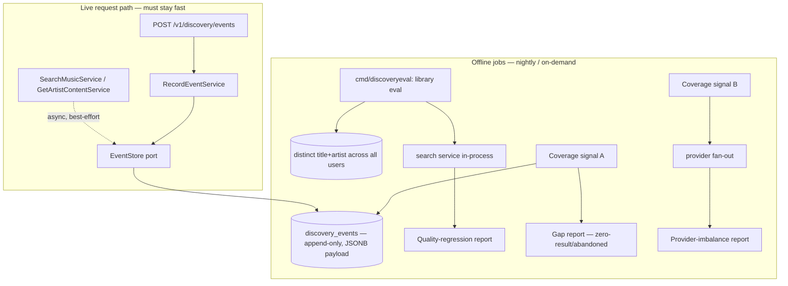

# feat: Discovery Step Zero — telemetry service, library eval, coverage signals A/B

## Summary

Build the **instrument** the discovery rebuild depends on, as additive infrastructure in
the *existing* discovery package: a verbose append-only telemetry/event store (§8), a
library-derived nightly eval harness (`artist+title → #1`, §12 Part 1), and coverage
signals A (zero-result/abandoned-search mining) and B (entity-level cross-provider diff,
§12 Part 2). Deterministic only — no model code, no new-package rebuild. This is the
"Step Zero" that makes pruning, the later rebuild, and any eventual ML all *measurable*.

---

## Post-completion notes (2026-06-20)

Status: **complete** (U1–U6 shipped on `refactor/discovery-pipeline-clarity`).

- **First baseline captured.** The eval (U4) ran on the full production catalog (1,792 distinct
  entities, cloned prod → dev): **top-1 pass-rate 97.4%** (≈98% true). The 46 failures are three
  structural patterns mapped to three layers — see the blueprint §4.6 and plan 003's taxonomy +
  constants ledger.
- **Eval hardening done.** `matchesEntity` now matches when providers embed the artist/track-number
  in the title (e.g. "A-Ha - Take On Me"), and `--random` sampling was added (the default
  alphabetical read is biased). Commit `77b5700`.
- **Top-K follow-on (carried into plan 003).** The product bar is "the right answer is visible in
  the top results," not strictly #1. The eval still measures **top-1 only**; it should be extended
  to **top-K** (default top-3, top-1 tracked alongside). This is the gate metric for the rebuild's
  cutover — tracked as the first eval task in plan 003's verification, not reopened here.
- **Signal A is blind** until client telemetry accrues (mobile emission deferred). Signal B is live.

---

## Problem Frame

The discovery pipeline can't currently tell a generic mechanism from a band-aid, can't
gate a rebuild cutover, and can't feed ML — because the only test instrument is 9
mainstream queries and the only telemetry is thin (`discovery_search_history` doesn't even
record result counts). The blueprint (see origin) establishes that one instrument solves
all three needs at once: rich telemetry + a diverse eval suite + coverage-gap detection.
Building it first is what lets every later decision be driven by evidence instead of guesses.

---

## Requirements

- R1. A verbose, append-only **telemetry/event store** capturing the interaction envelope
  (query → results+positions+sources shown → outcomes), cheap and evolvable. *(origin §8, G5; D11)*
- R2. Telemetry capture must **never slow or fail a user request** — emission is async and
  best-effort. *(origin §8 "collect richly", §10)*
- R3. **Server-side search/detail events** are captured (result counts, positions, sources,
  zero-result flag). *(origin §8)*
- R4. A **client-event ingest endpoint** accepts the deliberate interaction events
  (play/skip/completion/library-add/wrong-album) for storage. *(origin §8 envelope)*
- R5. A **library-derived eval harness** runs `artist+title → #1` over every unique catalog
  entity across all users and emits a quality-regression report. *(origin §12 Part 1, G6, D13)*
- R6. **Coverage signal A** — mine zero-result/abandoned searches (correction-filtered) into
  a gap report. *(origin §12 Part 2, D13)*
- R7. **Coverage signal B** — entity-level cross-provider diff into a provider-imbalance
  report (diagnostic only this slice). *(origin §12 Part 2, D13)*
- R8. All work lands in the **existing** discovery package; **deterministic only**, no model
  code. *(user scope; origin N1/N2/N5)*

**Origin document:** `docs/brainstorms/2026-06-20-discovery-rebuild-architecture.md` (§8, §12, §6 for the "collect richly, model lazily" discipline).

---

## Scope Boundaries

- No model/ML code, no feature pipelines, no training/serving infra (collect data only).
- No new-package strangler rebuild — that is a later plan; this is additive to the current package.
- Signal B is **not** a cutover gate this slice — it is a diagnostic report, since its
  accuracy depends on Layer-2 dedup/cleaning that the rebuild will address.
- The eval harness does **not** replace the per-commit canonical suite; it runs nightly.

### Deferred to Follow-Up Work

- **Client-side telemetry emission** (mobile app firing play/skip/completion/library-add/
  wrong-album events): separate `apps/mobile` frontend slice. This plan builds the
  *backend ingest endpoint*; the client wiring that calls it is deferred.
- **Telemetry retention / partitioning policy**: separate ops decision (origin OQ6).
- **Signal D (yt-dlp coverage oracle)**: arrives with the acquisition pipeline (separate spec).
- **Promoting the library eval into a gate / dashboard**: once it has run and produced baselines.

---

## Context & Research

### Relevant Code and Patterns

- **Persistence pattern to mirror:** `services/go-api/internal/discovery/adapters/persistence/click_repo.go`
  — pgxpool, raw SQL, `var _ ports.X = (*PgxY)(nil)` compile-time check, `NewPgx...(pool)` constructor.
- **Async best-effort side-write pattern to mirror:** the vocabulary ingest in
  `services/go-api/internal/discovery/service/search_music.go` (`ingestToVocabulary` —
  `context.WithoutCancel`, goroutine, `WaitGroup`, panic-recover, failures logged not surfaced).
- **Domain events:** `services/go-api/internal/discovery/domain/events.go` (existing
  `SearchPerformed` / `ResultClicked` family — extend, don't reinvent).
- **Ports:** `services/go-api/internal/discovery/ports/ports.go` (add the new store port here).
- **Handler/route + DTO + auth pattern:** `services/go-api/internal/discovery/adapters/handler/discovery_handler.go`
  (`handleRecordClick` is the closest analog for the new ingest endpoint — `auth.RequireUserID`,
  JSON decode, validate, service call, `204`).
- **Click service analog for the ingest use case:** `services/go-api/internal/discovery/service/record_click.go`.
- **Catalog source for the library eval:** `tracks` table (migration `001_baseline.sql`),
  `services/go-api/internal/catalog/ports/track_repo.go` (per-user only today — the eval
  needs a new distinct-across-all-users read).
- **Migrations:** `services/go-api/migrations/NNN_name.sql` (golang-migrate convention; next is `004_`).
- **DI wiring:** `services/go-api/internal/app/app.go`.
- **Search orchestrator (emission points):** `services/go-api/internal/discovery/service/search_music.go`
  (`search.complete` already computes result counts — the telemetry hook attaches here).

### Institutional Learnings

- Provider failures were historically swallowed silently (fixed this session) — telemetry
  emission failures must be **logged**, never swallowed *and* never surfaced (single-handling rule).
- "Position not presence" — the eval asserts **rank #1**, not membership (origin §12).

### External References

- None required — this is local-pattern work (pgx persistence, chi handlers, a CLI command).
  Per the go-database rule, the migration schema is a **proposal for human review**, not a
  finalized AI-authored schema.

---

## Key Technical Decisions

- **Append-only event store with a JSONB payload.** New `discovery_events` table: typed core
  columns (`id`, `user_id`, `event_type`, `occurred_at`, nullable `query_norm`) + a JSONB
  `payload` for the evolving envelope. JSONB lets the envelope grow (new fields, new event
  types) **without migrations** — the literal "collect richly" mechanism. *Schema is a
  proposal for human review.*
- **Telemetry emission is async + best-effort.** Mirrors `ingestToVocabulary`:
  `context.WithoutCancel`, goroutine, bounded timeout, panic-recover, failures logged. A
  telemetry write must never block, slow, or fail a search/detail request (R2).
- **One ingest endpoint for client events.** `POST /v1/discovery/events` accepts a typed
  interaction event (play/skip/completion/library-add/wrong-album); thin handler →
  `RecordEventService` → store. Mirrors `handleRecordClick`.
- **The eval is a CLI command, not `go test`.** `cmd/discoveryeval` wires the search service
  in-process and loops over catalog entities against **live provider APIs** — thousands of
  rate-limited queries, nightly. The per-commit gate stays the existing 9-query canonical suite.
- **Eval reads catalog via a dedicated distinct-entity query (cross-context, offline only).**
  The eval needs "all unique (title, artist) across *all* users," which the per-user
  `TrackRepository` doesn't offer. Add a thin read-only query for the harness. This crosses
  the discovery↔catalog boundary, which is acceptable for **offline admin tooling** but must
  not leak into the request path.
- **Signal A reads the new telemetry, not `search_history`.** `search_history` lacks result
  counts; zero-result detection needs the telemetry envelope. Zero-result = strong signal;
  no-click-on-results = weak hint; correction-filter (count only if the corrected query is
  also empty).
- **Signal B is diagnostic, entity-level, and flagged.** It measures provider *imbalance*
  (who-had-what per artist), not absolute coverage, and its accuracy depends on dedup
  cleaning (a later rebuild concern). Ship it as a report with that caveat stated in output.

---

## Open Questions

### Resolved During Planning

- *Where do play/skip events originate?* — Client-side; this plan builds the backend ingest
  endpoint, client wiring is deferred frontend work.
- *Is the eval a unit test?* — No; CLI/nightly against live APIs. Per-commit stays the 9-query suite.
- *Does Signal A reuse `search_history`?* — No; it reads the new telemetry events.

### Deferred to Implementation

- Exact JSONB payload field names per event type (settle while wiring real emission).
- Whether the eval CLI calls the search service in-process vs. over HTTP (prefer in-process;
  confirm once the wiring is touched).
- Throttle/concurrency limits for the nightly eval against live provider rate limits.

---

## High-Level Technical Design

> *This illustrates the intended approach and is directional guidance for review, not implementation specification. The implementing agent should treat it as context, not code to reproduce.*

---

## Implementation Units

### Phase 1 — Telemetry / event service (U1–U3)

- U1. **Append-only event store (domain event + port + migration + pgx adapter)**

**Goal:** A durable, evolvable place to write interaction events.

**Requirements:** R1, R2

**Dependencies:** None

**Files:**
- Create: `services/go-api/migrations/004_discovery_telemetry_events.sql`
- Modify: `services/go-api/internal/discovery/domain/events.go` (add telemetry event type(s) / `EventType` enum)
- Modify: `services/go-api/internal/discovery/ports/ports.go` (add `EventStore` port: `Append(ctx, event) error`)
- Create: `services/go-api/internal/discovery/adapters/persistence/event_repo.go`
- Test: `services/go-api/internal/discovery/adapters/persistence/event_repo_test.go` (`//go:build integration`)

**Approach:**
- Table `discovery_events`: `id UUID`, `user_id UUID`, `event_type TEXT`, `occurred_at TIMESTAMPTZ`,
  `query_norm TEXT NULL`, `payload JSONB`. Index `(event_type, occurred_at DESC)` and `(user_id, occurred_at DESC)`.
- `EventType` enum in domain (zero value = unknown/invalid, per go-design-patterns).
- `PgxEventStore` mirrors `PgxSearchClickRepository` (pool, raw SQL `INSERT`, compile-time `var _` check).

**Execution note:** Integration test for the repo against a real DB (build-tagged), per the persistence-testing convention.

**Patterns to follow:** `adapters/persistence/click_repo.go`; enum style in `domain/result_kind.go`.

**Test scenarios:**
- Happy path: append an event → row exists with correct type, user, payload round-trips through JSONB.
- Edge case: nil/empty `query_norm` stored as NULL; unknown event type rejected at the domain boundary.
- Error path: pool error from `Append` is returned wrapped, not swallowed.

**Verification:** Events insert and read back; `go vet` and integration test green; schema migration applies cleanly on a fresh DB.

---

- U2. **Server-side search/detail telemetry emission**

**Goal:** Capture what discovery *showed* — result counts, positions, sources, zero-result — on every search and detail load.

**Requirements:** R3, R2

**Dependencies:** U1

**Files:**
- Modify: `services/go-api/internal/discovery/service/search_music.go` (emit a search event near `search.complete`)
- Modify: `services/go-api/internal/discovery/service/get_artist_content.go` (emit a detail event)
- Modify: `services/go-api/internal/app/app.go` (inject `EventStore` into the services via an option)
- Test: `services/go-api/internal/discovery/service/search_music_test.go` (extend — assert emission via a fake `EventStore`)

**Approach:**
- Add a `WithEventStore(...)` functional option to both services (consistent with existing `With*` options).
- Emit **asynchronously and best-effort** using the `ingestToVocabulary` pattern (`context.WithoutCancel`,
  goroutine, bounded timeout, panic-recover). Never block or fail the request on telemetry.
- Search event payload: query, query_norm, result_count, zero-result flag, top-N (kind, title, position, sources).

**Execution note:** Test-first on the emission contract using a recording fake `EventStore`.

**Patterns to follow:** `ingestToVocabulary` (async/best-effort) and the `With*` options in `search_music.go`.

**Test scenarios:**
- Happy path: a search emits exactly one event with the right result_count and positions.
- Edge case: zero-result search emits an event flagged zero-result.
- Integration: a slow/failing `EventStore` does **not** delay or error the search response (emission is detached).
- Edge case: no `EventStore` injected → no emission, no panic.

**Verification:** Search/detail responses are unchanged in latency and content; events appear asynchronously; fake-store tests green.

---

- U3. **Client interaction-event ingest endpoint**

**Goal:** Accept deliberate client events (play/skip/completion/library-add/wrong-album) for storage.

**Requirements:** R4

**Dependencies:** U1

**Files:**
- Create: `services/go-api/internal/discovery/service/record_event.go` (`RecordEventService`)
- Modify: `services/go-api/internal/discovery/adapters/handler/discovery_handler.go` (add `POST /events` route + DTO + handler)
- Modify: `services/go-api/internal/app/app.go` (wire `RecordEventService` into the handler)
- Test: `services/go-api/internal/discovery/service/record_event_test.go`

**Approach:**
- Thin handler: `auth.RequireUserID` → decode JSON → validate event type/fields → `RecordEventService.Execute` → `204`.
- Validate `event_type` against the domain enum; reject unknown types with `400` (mirrors `handleRecordClick`'s `ParseResultKind` validation).
- Body already capped by the global `MaxBodySize(1<<20)` middleware.

**Execution note:** Test-first on the request/response contract.

**Patterns to follow:** `handleRecordClick` + `record_click.go`.

**Test scenarios:**
- Happy path: valid `play` event → `204`, one row appended.
- Error path: unknown `event_type` → `400`, nothing stored.
- Error path: malformed JSON body → `400`.
- Error path: unauthenticated → handled by `auth.RequireUserID` (no row).

**Verification:** Endpoint stores well-formed events and rejects bad input; `go vet` green.

---

### Phase 2 — Library-derived eval harness (U4)

- U4. **Library-derived nightly eval (`artist+title → #1`)**

**Goal:** A self-labeling regression report over every unique catalog entity across all users.

**Requirements:** R5

**Dependencies:** None (consumes the existing search service; independent of U1–U3)

**Files:**
- Create: `services/go-api/cmd/discoveryeval/main.go` (wires config/DB/providers + search service, runs the eval, writes the report)
- Create: `services/go-api/internal/discovery/service/library_eval.go` (eval logic: per-entity assertion + aggregation)
- Create: `services/go-api/internal/discovery/service/library_eval_test.go`
- Create/Modify: a distinct-entity read for catalog tracks — either
  `services/go-api/internal/catalog/ports/track_repo.go` (+ adapter) **or** a discovery-local
  read query. Decide at implementation; keep it read-only and offline-only.

**Approach:**
- For each unique `(title, artist)` in `tracks`, run the search service with query `artist + title`
  and assert the matching entity is **rank #1** (position 0) in the blended view.
- Aggregate into a report: total, pass, fail (with the failing query and what ranked #1 instead),
  pass-rate by kind. Output machine-readable (JSON) + human summary (markdown).
- Throttle/concurrency-limit the loop to respect live provider rate limits (use an `errgroup.SetLimit`).

**Execution note:** Unit-test the assertion + aggregation logic against a **fake search** returning
canned results; do not hit live APIs in the test. Live runs happen via the CLI.

**Patterns to follow:** `cmd/api` for app wiring; `errgroup.SetLimit` per go-concurrency.

**Test scenarios:**
- Happy path: entity at position 0 → pass; entity at position 2 → fail (records what beat it).
- Edge case: search returns empty → fail with a "no results" reason (distinct from "wrong #1").
- Happy path: aggregation computes correct totals and per-kind pass-rates from a mixed result set.
- Edge case: a `(title, artist)` with an empty artist is skipped (can't form the `artist+title` query) and counted separately.

**Verification:** CLI produces a report over a small seeded library; assertion/aggregation unit tests green; no live-API calls in tests.

---

### Phase 3 — Coverage signals (U5–U6)

- U5. **Coverage signal A — zero-result / abandoned-search mining**

**Goal:** Turn the telemetry into a demand-weighted coverage-gap report.

**Requirements:** R6

**Dependencies:** U1, U2

**Files:**
- Create: `services/go-api/internal/discovery/service/coverage_signal_a.go`
- Create: `services/go-api/internal/discovery/service/coverage_signal_a_test.go`
- Modify: `services/go-api/cmd/discoveryeval/main.go` (expose as a sub-report/flag) **or** a small dedicated entrypoint

**Approach:**
- Query telemetry for **zero-result** searches (strong) and **no-click-on-nonzero** searches (weak hint).
- Correction-filter: a zero-result query only counts as a gap if its *corrected* form is also empty
  (reuse the existing `CorrectionService`).
- Output: ranked list of candidate gap queries by frequency, with the strong/weak split labeled.

**Patterns to follow:** the read-query style in `click_repo.go` (`TopClickedSignatures`); `CorrectionService` usage in `search_music.go`.

**Test scenarios:**
- Happy path: repeated zero-result query surfaces as a strong gap, ranked by count.
- Edge case: a zero-result query whose correction *does* return results is filtered out (typo, not a gap).
- Edge case: no-click-on-results is reported only under the weak-hint label, never as a strong gap.
- Edge case: empty telemetry → empty report, no error.

**Verification:** Report distinguishes strong gaps from weak hints and excludes correctable typos; unit tests green against a fake event store.

---

- U6. **Coverage signal B — entity-level cross-provider diff (diagnostic)**

**Goal:** Measure per-artist provider imbalance — which provider misses what the others have.

**Requirements:** R7

**Dependencies:** None (consumes the existing provider fan-out / consensus providers)

**Files:**
- Create: `services/go-api/internal/discovery/service/coverage_signal_b.go`
- Create: `services/go-api/internal/discovery/service/coverage_signal_b_test.go`
- Modify: `services/go-api/cmd/discoveryeval/main.go` (expose as a sub-report/flag)

**Approach:**
- For a set of artists (e.g., the library's distinct artists), fan out to providers and compute an
  **entity-level** diff: for each canonical album, which providers had it vs. didn't.
- Report per-provider gap (% of the union each provider is missing). **Output must state the caveats**:
  measures imbalance not absolute coverage; accuracy depends on dedup cleaning; entity-level not count-level.

**Patterns to follow:** the consensus fan-out in `service/consensus.go` (`fetchFromProviders`); entity
resolution in `service/dedup.go`.

**Test scenarios:**
- Happy path: an album present on 3 of 4 providers yields a 25% gap attributed to the missing provider.
- Edge case: an album present on all providers → 0 gap (and the report notes "all-providers-miss is invisible here").
- Edge case: count-vs-entity — two providers listing the same album under slightly different titles are
  resolved to one entity (no false gap), exercising the entity-level (not count) requirement.

**Verification:** Report attributes gaps to the right providers at entity granularity and prints the caveats; unit tests green against fake provider results.

---

## System-Wide Impact

- **Interaction graph:** new async emission hooks in `SearchMusicService` / `GetArtistContentService`;
  new `POST /v1/discovery/events` route under the authed `/v1` group in `app.go`.
- **Error propagation:** telemetry write failures are **logged only** (best-effort), never surfaced to
  the request and never both logged-and-returned; ingest-endpoint validation errors return `400`.
- **State lifecycle risks:** events are append-only (no update/delete); a crash may drop an in-flight
  async event — acceptable for best-effort telemetry. Table growth is real → retention deferred (OQ6).
- **API surface parity:** the new ingest endpoint follows the existing discovery handler conventions
  (auth, DTO, JSON, status codes).
- **Integration coverage:** U2's "telemetry failure doesn't break search" is an integration-level
  guarantee a unit mock alone won't prove — assert it with a deliberately-failing fake store.
- **Unchanged invariants:** search ranking, consensus, and response shapes are **unchanged**; telemetry
  is purely additive. The eval and coverage signals are read-only/offline and touch no request path.

---

## Risks & Dependencies

| Risk | Mitigation |
|------|------------|
| Telemetry write volume / unbounded table growth | Append-only + indexes now; retention/partitioning deferred to an explicit ops decision (OQ6). |
| Async emission drops events on crash | Accepted — telemetry is best-effort, not transactional; documented. |
| Eval hammering live provider APIs / rate limits | Nightly only (not per-commit); `errgroup.SetLimit` throttle; never in `go test`. |
| Migration schema subtly wrong under real load | Schema is a **proposal for human review** per the go-database rule; human approves before apply. |
| Signal B false positives from YouTube noise | Shipped as **diagnostic only** with caveats in output; not a gate until dedup cleaning lands. |
| Cross-context read (eval reads catalog tracks) leaking into request path | Read-only, offline-only, used solely by the eval CLI; flagged in the decision. |

---

## Sources & References

- **Origin document:** [docs/brainstorms/2026-06-20-discovery-rebuild-architecture.md](docs/brainstorms/2026-06-20-discovery-rebuild-architecture.md) — §8 (telemetry), §12 (eval + coverage A/B), §6 (collect-richly-model-lazily), §10 (resilience).
- Persistence pattern: `services/go-api/internal/discovery/adapters/persistence/click_repo.go`
- Async best-effort pattern: `services/go-api/internal/discovery/service/search_music.go` (`ingestToVocabulary`)
- Handler/service analog: `services/go-api/internal/discovery/adapters/handler/discovery_handler.go` (`handleRecordClick`), `services/go-api/internal/discovery/service/record_click.go`
- Migrations: `services/go-api/migrations/001_baseline.sql`
