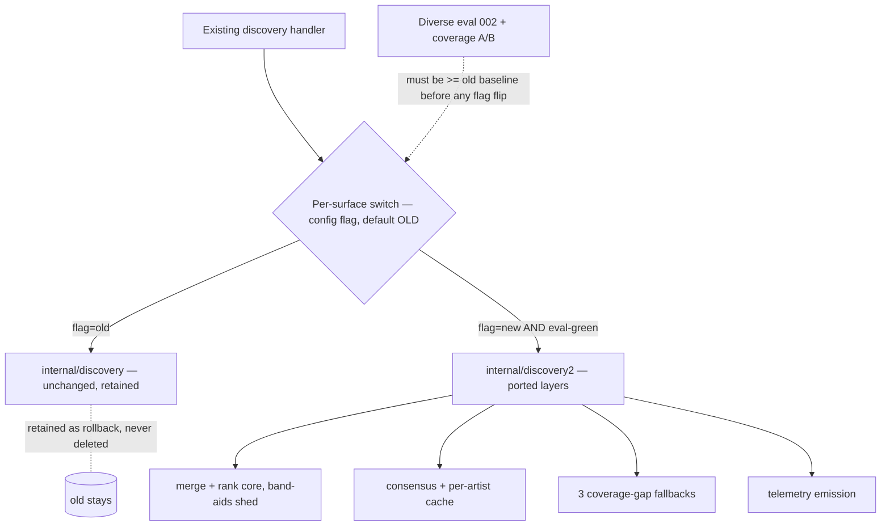

# refactor: Discovery strangler rebuild — new package, ported layers, gated cutover

## Summary

Rebuild the discovery pipeline as a clean five-layer architecture in a **new package**,
porting Layers 1–4 stage by stage behind the existing HTTP handler, **gated at every step
by the diverse eval suite from Step Zero**, and **never deleting the old package** (kept as
reference + instant rollback). The rebuild's distinctive job — beyond a tidier shape — is to
**shed the accreted tuned constants and stage sprawl** that don't generalize, keeping only
mechanisms that help across the diverse suite. No ML, no acquisition pipeline; those are
separate threads with clean seams.

---

## Problem Frame

The current discovery pipeline works but has accumulated ~13 sequential transforms and a
scatter of tuned constants across many sessions, with no instrument to tell which generalize
and which were one-query band-aids (verified: the band-aids are tuned constants + stage
sprawl, **not** hardcoded artist hacks — see origin §1, §13). The blueprint establishes the
fix as a strangler-fig rebuild gated by a diverse eval. This plan is that rebuild. It is
**step 1+** of the strangler sequence; **step 0** (the eval + telemetry instrument) is plan
002 and is a hard prerequisite.

---

## Prerequisite (hard dependency)

**Plan 002 (Step Zero) must be complete and have produced baselines before this plan's
cutover units (U7–U8) run.** Specifically:
- The diverse **library-derived eval** (002 U4) must run and produce a current-pipeline
  baseline — the number the new pipeline must match or beat before any cutover.
- **Coverage signals A/B** (002 U5/U6) must run to baseline coverage.
- The **telemetry store** (002 U1) must exist (the new services re-emit into it, U7).

Earlier units of *this* plan (U1–U6, building the new pipeline in isolation) can proceed in
parallel with 002's later units, but **no traffic flips** until the baseline exists.

---

## Requirements

- R1. New discovery pipeline in a **new package** with clean Layers 0–4, not modifying the
  old package's internals. *(origin §4, §13)*
- R2. **Strangler cutover**: the HTTP handler routes each surface (search, artist albums,
  album tracks, top tracks) to old-or-new via a switch, defaulting to old. *(origin §13)*
- R3. **The old package is never deleted** during this rebuild — retained as reference +
  rollback. *(origin §13, D7; user, 2026-06-20)*
- R4. Every cutover is **gated green on the diverse eval** (002) and shows no coverage
  regression on signals A/B. *(origin §12, §13)*
- R5. **Shed band-aids**: ported Layer-3 ranking keeps only constants/stages that help across
  the diverse suite; one-query tuning is dropped. *(origin §1, §13, D10)*
- R6. Port Layers 1 (fan-out), 2 (merge/dedup/entity-resolution), 3 (rank), and Stage-3
  consensus (with the per-artist cache); reuse existing provider adapters as-is. *(origin §4, §9)*
- R7. Close the **three coverage gaps** in the new code (YT Music 0-results, long-tail track
  fallback, underground top-track fallback). *(origin §5)*
- R8. Re-add **telemetry emission** in the new services (the mechanical re-add of 002 U2). *(origin §8)*
- R9. Deterministic only — **no model code**; Layer 4 acquisition is a **handoff seam**, not
  built here. *(origin §6 N1/N2, §4 Layer 4)*

**Origin:** `docs/brainstorms/2026-06-20-discovery-rebuild-architecture.md` — §4 (layers), §5 (coverage), §12 (eval gate), §13 (strangler), §9 (cache).

---

## Scope Boundaries

- No ML / model code (deterministic scorers only; the Layer-3 seam stays a plain function).
- No acquisition pipeline (yt-dlp→OCI) — Layer 4 is an interface/handoff only.
- No new providers — reuse the existing adapters in `internal/discovery/adapters/providers/`.
- No mobile/client changes.

### Deferred to Follow-Up Work

- **Eventual removal of the old package**: only after the new pipeline has run in production
  on all surfaces for a sustained period, and **only at the user's explicit decision**. Out
  of scope here — this plan *retains* old code by design (R3).
- **Final package rename** (collapsing the provisional new-package name back to `discovery`):
  bundled with the eventual old-package removal, deferred.
- **ML scorers** at the Layer-3 seam: future, gated on telemetry data (origin §6).
- **Provider-selection / ranking ML, contamination ML**: future (origin §6 roadmap).

---

## Context & Research

### Relevant Code and Patterns (the current pipeline being ported)

- **Orchestrator (the ~13-stage search path to slim down):** `services/go-api/internal/discovery/service/search_music.go`
  (`Execute` runs CleanQuery → DetectIntent → fan-out → `FuseAndRank` → `CollapseVersions` →
  `ApplyPopularityDominance` → `CollapseArtistDuplicates` → `applyArtistDisambiguation` →
  `applyClickBoost` → `enrich` → `Rerank` → correction → suggest → findRelated → ingest).
- **Ranking/merge core (Layer 2/3):** `services/go-api/internal/discovery/service/dedup.go`
  (`FuseAndRank`, `Rerank`, `CollapseVersions`, `ApplyPopularityDominance`, `CollapseArtistDuplicates`),
  `services/go-api/internal/discovery/service/popularity.go`, `quality_scorer.go`.
- **Consensus (Stage-3):** `services/go-api/internal/discovery/service/consensus.go` (just
  audited; carry the bounded-timeout + deterministic-merge fixes; add the per-artist cache).
- **Providers (reuse as-is):** `services/go-api/internal/discovery/adapters/providers/` (Deezer,
  iTunes, MusicBrainz, Last.fm, Discogs, SoundCloud, YouTube Music, TheAudioDB).
- **Handler (the switch point):** `services/go-api/internal/discovery/adapters/handler/discovery_handler.go`
  (`Routes`, `handleSearch`, `handleArtistAlbums`, `handleAlbumTracks`, `handleArtistTopTracks`).
- **DI wiring:** `services/go-api/internal/app/app.go` (`buildDiscoveryProviders`, the service construction).
- **The eval gate + telemetry (from plan 002):** `internal/discovery/service/library_eval.go`,
  `coverage_signal_a.go`, `coverage_signal_b.go`, `adapters/persistence/event_repo.go`.

### Institutional Learnings

- **Position not presence** (origin §12); the eval asserts rank #1.
- **Popularity > multi-source** is a *genuine* generic decision — keep it (origin §2, §14).
- **Pre-correction stays disabled**, identity-resolver family stays deleted (origin §14).
- **No hardcoded workarounds** — the band-aid-shedding (R5) enforces this rule the old code drifted from.

### External References

- None — this is a port of existing local code into a new package shape; no new technology.

---

## Key Technical Decisions

- **New package, provisional name `internal/discovery2/`.** Same hexagonal layout
  (`domain/ service/ ports/ adapters/`). The name is provisional; collapsing back to
  `discovery` happens only with the (deferred) old-package removal. Reusing the existing
  `domain/` types where unchanged is allowed (import the current `discovery/domain`) to avoid
  pointless duplication — the rebuild targets *orchestration and stage boundaries*, not the
  value objects (`SearchResult`, `SourceRef`, `Confidence`).
- **Reuse provider adapters verbatim.** They're clean and already hexagonal; the new
  orchestrator depends on the same `ports.SearchProvider` / content-provider interfaces.
- **Per-surface handler switch via config flag**, defaulting to old. Each of the four
  surfaces flips independently once green. No big-bang flip.
- **Band-aid shedding is gated, not guessed (R5).** Each ported Layer-3 stage/constant must
  earn its place on the **diverse** eval: port it, then try removing it — if the diverse
  suite + coverage signals stay green, it was a band-aid; drop it. This is the core method,
  not a side note.
- **Carry forward the audited consensus** (bounded timeout, deterministic merge, logging) and
  **add the per-artist consensus cache** (origin §9, D9) during the consensus port.
- **Old code is never deleted here (R3).** The switch keeps both live; rollback = flip the flag.
- **Telemetry emission re-added in the new services (R8)** — the small mechanical port of 002 U2.

---

## Open Questions

### Resolved During Planning

- *Does the rebuild touch provider adapters?* No — reused as-is.
- *Is the old code deleted?* No — retained as rollback; removal is a deferred, user-decided cleanup.
- *Where does ML go?* Nowhere in this plan — the Layer-3 scorer stays a deterministic function (the future ML seam).

### Deferred to Implementation

- Final new-package name and whether new `domain/` types are needed or the existing ones are imported wholesale.
- Exact flag mechanism (env var vs config struct field) for the per-surface switch — match `internal/app` config conventions when wiring.
- Which specific tuned constants survive the diverse-suite pruning (only knowable once the eval runs against ported code).

---

## Output Structure

    services/go-api/internal/discovery2/        # provisional name
    ├── service/
    │   ├── search.go            # new orchestrator (slim — only stages that earn their keep)
    │   ├── merge.go             # Layer 2: merge + entity resolution + dedup
    │   ├── rank.go              # Layer 3: RRF + popularity + exact-match (pruned)
    │   ├── consensus.go         # Stage-3 + MB authority + per-artist cache
    │   ├── coverage.go          # the 3 coverage-gap fallbacks
    │   └── telemetry.go         # emission hooks (re-add of 002 U2)
    ├── ports/                   # consumed interfaces (reuse discovery/ports where identical)
    └── adapters/
        └── handler/             # or extend the existing handler with the switch

(Provider adapters and domain value objects are imported from the existing `internal/discovery/`, not duplicated.)

---

## High-Level Technical Design

> *Directional guidance for review, not implementation specification.*

---

## Implementation Units

### Phase A — New package + the ranking/merge core (the heart, in isolation)

- U1. **New package skeleton + handler switch (default old)**

**Goal:** Stand up `internal/discovery2/` and a per-surface switch in the handler that always
chooses old until a flag flips. No behavior change yet.

**Requirements:** R1, R2, R3

**Dependencies:** None

**Files:**
- Create: `services/go-api/internal/discovery2/` package skeleton (service/, ports/)
- Modify: `services/go-api/internal/discovery/adapters/handler/discovery_handler.go` (inject an optional new-pipeline service + per-surface flag check)
- Modify: `services/go-api/internal/app/app.go` (config flag; wire new service as nil/off)
- Test: `services/go-api/internal/discovery/adapters/handler/discovery_handler_test.go` (switch routes to old when flag off)

**Approach:** Switch is a thin conditional in each handler method; new service is an interface so it can be nil (off). Default all surfaces to old.

**Test scenarios:**
- Happy path: flag off → handler calls the old service, response unchanged.
- Edge case: new service nil + flag on → falls back to old (no panic).

**Verification:** Existing handler tests pass unchanged; switch compiles with new service off.

---

- U2. **Port Layer 2 — merge + entity resolution + dedup**

**Goal:** The canonical merge core in the new package, validated against the diverse eval in isolation.

**Requirements:** R6, R5

**Dependencies:** U1; (eval available from 002 U4 for validation)

**Files:**
- Create: `services/go-api/internal/discovery2/service/merge.go`
- Test: `services/go-api/internal/discovery2/service/merge_test.go`

**Approach:** Port `FuseAndRank`'s merge half + `CollapseVersions`/`CollapseArtistDuplicates` +
identifier-first entity resolution (MBID → ISRC → fuzzy). **Prune as you port:** carry the
canonical dedup tests; drop collapse logic the diverse suite doesn't need.

**Execution note:** Characterization-first — capture current merge behavior on the canonical + diverse inputs before porting, so pruning is measured, not guessed.

**Test scenarios:**
- Happy path: multi-provider duplicates collapse to one canonical entry with all SourceRefs.
- Edge case: MBID match merges; ISRC match merges; fuzzy-only merge respects the threshold.
- Edge case (band-aid probe): removing a given collapse sub-stage leaves the diverse suite green → document it as shed.

**Verification:** Merge unit tests green; diverse-eval pass-rate on merge-sensitive queries ≥ old baseline.

---

- U3. **Port Layer 3 — ranking (RRF + popularity + exact-match), band-aids shed**

**Goal:** The ranking core, keeping only constants/stages that help across the diverse suite.

**Requirements:** R5, R6

**Dependencies:** U2

**Files:**
- Create: `services/go-api/internal/discovery2/service/rank.go`
- Test: `services/go-api/internal/discovery2/service/rank_test.go`

**Approach:** Port RRF + exact-match boost + popularity (keep "popularity > multi-source").
Bring `Rerank`/`ApplyPopularityDominance` only if they earn their keep. **For each tuned
constant (`intentBoost`, `lowRelevanceThreshold`, `clickBoostAmount`, dominance gaps): port it,
then test removal against the diverse suite; drop or keep based on the result, and record the
verdict in a comment.**

**Execution note:** Test-first against the diverse eval — each ranking change is judged by pass-rate, not intuition.

**Test scenarios:**
- Happy path: the canonical positioning suite (Humble→#1 track, Drake→#1 artist, …) passes.
- Edge case: ambiguous single words (Humble, Scorpion, Circles) rank by popularity correctly.
- Edge case (band-aid probe): for each ported constant, a recorded keep/drop decision with the diverse-suite delta.

**Verification:** Diverse-eval pass-rate ≥ old baseline; every surviving constant has a recorded justification; no hardcoded special-cases.

---

### Phase B — Coverage layers

- U4. **Port Layer 1 fan-out (reuse provider adapters)**

**Goal:** The new orchestrator's scatter-gather, reusing existing adapters, bounded + circuit-broken.

**Requirements:** R6

**Dependencies:** U2, U3

**Files:**
- Create: `services/go-api/internal/discovery2/service/search.go` (the slim orchestrator wiring fan-out → merge → rank)
- Test: `services/go-api/internal/discovery2/service/search_test.go`

**Approach:** Reuse `ports.SearchProvider` adapters and the circuit breaker; per-provider
timeout (1.5s) as today. The orchestrator is intentionally short — fan-out → merge → rank →
(enrich) — not the old 13-stage chain.

**Test scenarios:**
- Happy path: parallel fan-out merges into ranked results.
- Edge case: a provider timeout yields partial results + per-provider status, never a failed search.
- Integration: full search path produces correct #1 for the canonical suite via the new orchestrator.

**Verification:** New orchestrator passes the canonical suite end-to-end with providers faked; latency bounded by the per-provider timeout.

---

- U5. **Port Stage-3 consensus + MB authority + per-artist cache**

**Goal:** Contamination filtering in the new package, with the latency fix the blueprint calls for.

**Requirements:** R6 (cache per origin §9)

**Dependencies:** U4

**Files:**
- Create: `services/go-api/internal/discovery2/service/consensus.go`
- Test: `services/go-api/internal/discovery2/service/consensus_test.go` (the consensus engine currently has **no** unit test — add one here)

**Approach:** Port the audited consensus (bounded timeout, deterministic merge, MB authority,
logging) and **add a per-artist cache keyed by artist MBID** (TTL; origin OQ4). This is also
the chance to add the consensus unit test that the old package lacks.

**Test scenarios:**
- Happy path: album on 2+ providers confirmed; single-provider unconfirmed; MB-contradicted rejected.
- Edge case: MB authority filter rejects unconfirmed albums when MB has strong data; underground (0 MB) unaffected.
- Edge case: cache hit returns without re-querying providers; cache miss populates.
- Edge case: deterministic merge — same inputs yield same confirmed/unconfirmed split across runs.

**Verification:** Consensus unit tests green (new coverage); repeat artist-detail loads hit the cache; behavior matches the audited old engine on shared inputs.

---

- U6. **Close the three coverage gaps in the new code**

**Goal:** Make the new pipeline genuinely universal — fix the gaps the blueprint names.

**Requirements:** R7

**Dependencies:** U4, U5; (coverage signals A/B from 002 for confirmation)

**Files:**
- Modify: `services/go-api/internal/discovery2/service/search.go` / `consensus.go`
- Create: `services/go-api/internal/discovery2/service/coverage.go`
- Test: `services/go-api/internal/discovery2/service/coverage_test.go`

**Approach:** (1) Fix the YouTube Music search 0-results mapping; (2) long-tail album-track
fallback chain (Deezer search → YT Music album tracks → …); (3) underground top-track
fallback (Last.fm / YT Music). Deterministic fallback chains, no promotion of any source.

**Test scenarios:**
- Happy path: YouTube Music search results now appear in merged output (regression of the 0-results bug).
- Edge case: an album with no tracks on the primary provider loads via fallback.
- Edge case: an underground artist with 0 Deezer top tracks gets top tracks from a fallback.
- Coverage: signal A/B on the new pipeline show reduced gaps vs. the old baseline.

**Verification:** The three named gaps are closed on representative underground artists (OsamaSon, Killeastsxde); coverage signals improve vs. baseline.

---

### Phase C — Cutover (gated on the 002 baseline)

- U7. **Re-add telemetry emission in the new services**

**Goal:** The new pipeline feeds the same telemetry envelope the old one does.

**Requirements:** R8

**Dependencies:** U4; 002 U1 (event store) and 002 U2 (emission shape)

**Files:**
- Create: `services/go-api/internal/discovery2/service/telemetry.go`
- Modify: `services/go-api/internal/discovery2/service/search.go`, `consensus.go` (emit hooks)
- Test: extend the new orchestrator test with a fake `EventStore`

**Approach:** Mechanical port of 002 U2's async best-effort emission into the new services
(same `EventStore` port, same `context.WithoutCancel` + wait-barrier pattern, never blocks the request).

**Test scenarios:**
- Happy path: a new-pipeline search emits one search event with correct result_count/positions.
- Integration: a failing `EventStore` does not delay or error the new search path.

**Verification:** New pipeline emits the same envelope; emission failures are logged, not surfaced.

---

- U8. **Stage-by-stage handler cutover (gated, old retained)**

**Goal:** Flip each surface to the new pipeline once it's provably ≥ old on the diverse eval, keeping old as rollback.

**Requirements:** R2, R3, R4

**Dependencies:** U1–U7; **002 U4–U6 baselines must exist**

**Files:**
- Modify: `services/go-api/internal/app/app.go` (per-surface flags), `discovery_handler.go` (already switched in U1)

**Approach:** For each surface (search → artist albums → album tracks → top tracks): run the
diverse eval + coverage signals on the new path, confirm ≥ old baseline with no coverage
regression, then flip that surface's flag. Old code stays; rollback = flip back. Do not flip
a surface that regresses.

**Execution note:** This unit is the gate. No flip without a green diverse-eval delta recorded for that surface.

**Test scenarios:**
- Happy path: with a surface flagged new, the handler routes to the new pipeline and the canonical suite passes.
- Edge case: flipping back to old is instant and lossless (rollback works).
- Integration: the diverse eval run on the flipped surface meets-or-beats the recorded old baseline.

**Verification:** Each flipped surface meets-or-beats baseline on the diverse eval and shows no coverage regression; old path remains a working rollback.

---

## System-Wide Impact

- **Interaction graph:** the handler gains a per-surface switch; two pipelines coexist behind it.
- **Error propagation:** new pipeline preserves partial-result + per-provider-status behavior; telemetry failures logged only.
- **State lifecycle risks:** the per-artist consensus cache adds an invalidation concern (TTL; origin OQ4).
- **API surface parity:** response shapes must be **identical** old vs new (the switch is invisible to clients) — assert with shared response-contract tests.
- **Integration coverage:** the diverse eval (002) is the cross-cutting integration gate; U8 flips depend on it.
- **Unchanged invariants:** wire/response contracts, provider adapters, and domain value objects are unchanged; the old package keeps working throughout.

---

## Risks & Dependencies

| Risk | Mitigation |
|------|------------|
| Strangler stalls with two pipelines coexisting indefinitely | Per-surface flags + a finish-each-surface discipline; U8 flips are tracked to completion. |
| Pruning a constant that was load-bearing for a query absent from the suite | The eval is library-derived + diverse + coverage-signal-backed (broad), but residual risk is accepted and monitored post-flip via signals + abandoned-search telemetry. |
| Cutover before the 002 baseline exists | Hard prerequisite stated; U8 blocked until 002 U4–U6 produce baselines. |
| Response-shape drift between old and new | Shared response-contract tests; switch is invisible to clients by construction. |
| Per-artist consensus cache staleness (missing a new release) | TTL + the existing search path still surfaces new releases; invalidation policy decided at implementation (OQ4). |
| Old + new code duplication burden while both live | Accepted by design (rollback safety); removal is a deferred user-decided cleanup. |

---

## Sources & References

- **Origin document:** [docs/brainstorms/2026-06-20-discovery-rebuild-architecture.md](docs/brainstorms/2026-06-20-discovery-rebuild-architecture.md) — §4, §5, §9, §12, §13.
- **Prerequisite plan:** [docs/plans/2026-06-20-002-feat-discovery-telemetry-eval-step-zero-plan.md](docs/plans/2026-06-20-002-feat-discovery-telemetry-eval-step-zero-plan.md)
- Current pipeline: `services/go-api/internal/discovery/service/search_music.go`, `dedup.go`, `consensus.go`
- Handler/switch point: `services/go-api/internal/discovery/adapters/handler/discovery_handler.go`
- DI: `services/go-api/internal/app/app.go`
