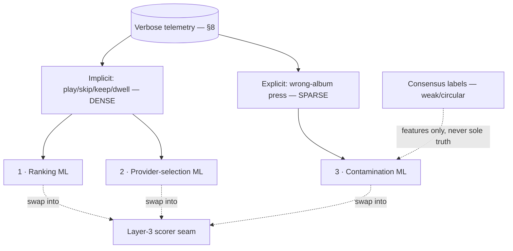

# feat: Discovery ML — learned scorers at the Layer-3 seam

> **Status: BLOCKED / future.** This plan does not execute on a calendar. Each stage trains
> *when its signal reaches critical mass*, and if a signal never gets there, that stage stays
> deterministic forever — by design, not failure. This document exists so we **know the whole
> ML picture now** and collect the right data, not so we build models now. Building model
> infrastructure against labels that don't exist yet is the explicit anti-pattern (blueprint N2).

---

## What ML means here (and why it still obeys the doctrine)

The doctrine is **zero arbitrary, query-fit constants** (blueprint §4.5). ML is the *third* way to
set a judgment (after categorical, which the rebuild uses): **every remaining tuned constant becomes
a function fit to telemetry.** A learned weight is **data-fit, not query-fit** — it is derived from
behavior, traceable to the events that produced it, and re-derivable. So ML *extends* the doctrine;
it does not violate it. The end state, pinned to something buildable:

- **Rank** — order results from how people actually behave (play / skip / completion / keep), not
  `clickBoostAmount 0.03` or `lowRelevanceThreshold 0.3`.
- **Provider-select** — learn which source's *version* people keep, not equal-weight RRF.
- **Contaminate** — learn which albums are really an artist's, not the `2+ providers` / `10 MB titles`
  thresholds.

**Deterministic is the product; ML is a contingent upgrade.** Every deterministic scorer from plan
003 is a plain function a model can later replace behind the same interface. Nothing is wasted if a
model never arrives.

---

## Hard prerequisites

1. **The rebuilt Layer-3 seam (plan 003 U3).** ML swaps the deterministic scorer for a learned one
   *behind the same interface*. No seam → nowhere to plug in. This is why 003 comes first.
2. **Telemetry flowing and attributable.** Already underway:
   - Telemetry store + async emission shipped (plan 002 U1/U2).
   - **Migration 004 applied to dev AND Supabase (done 2026-06-20)** — search events now persist in prod.
   - **`pipeline_version` stamped on every search event (done 2026-06-20)** — `v1` today, `v2` after
     the rebuild — so training data is attributable to the pipeline that produced it and labels are
     not mixed across the cutover.
   - **Client-side emission (mobile slice) — NOT done.** The dense behavioral signals (play / skip /
     completion / keep) are fired by the client; the ingest endpoint exists (002 U3) but nothing calls
     it yet. **This is the gating data-collection task — see plan 003's near-term tasks.** Until it
     lands, ranking ML has no training data.
3. **Critical mass of the relevant signal** (per stage — see Triggers).

---

## The scale reframe: intensity, not headcount

"~10 users" undersells it. The unit is **interactions = events/user/day × users × days.** A few dozen
people using Altune *hard* daily produce hundreds of events/day → ~100k+/year — a real dataset for the
right *kind* of signal, well before "100 users" (which we may never reach and don't need). Signals split
into two supplies, and that split reorders the whole roadmap:

| Signal kind | Examples | Supply at heavy daily use | Feeds |
|---|---|---|---|
| **Implicit** (behavioral) | play, skip, completion %, replay, library-add, search→play | **Dense** — scales with intensity | Ranking, provider-selection |
| **Explicit** (deliberate) | "wrong album" press | **Sparse** — needs an error *and* the will to flag it | Contamination |

---

## The reordered roadmap (implicit-signal stages first)

Because implicit signals are dense and explicit ones aren't, the beachhead is the implicit stages —
which **inverts** the naïve "contamination first" intuition.

### Stage 1 — Ranking ML (first; dense behavioral signal)
- **Replaces:** the Layer-3 relevance-tie / popularity ordering *within a tier* (the within-tier order,
  not the categorical tiers themselves — tiers stay; the model orders inside them).
- **Label:** did the user play / keep / complete the result they were shown (and at what position)?
- **Features:** relevance tier, popularity, multi-source/RRF, kind, recency, per-source priors,
  query↔result text features. All already computable from the rebuilt pipeline + telemetry envelope.
- **Model:** interpretable first — logistic regression or a shallow tree over a handful of features.
  Not XGBoost (interpretability beats marginal accuracy when debugging a bad rank). XGBoost is a later
  optimization.
- **Swap:** the learned scorer implements the same Layer-3 scorer interface; the per-surface switch
  (plan 003 U8) flips search to the learned scorer once it beats deterministic on the gate.

### Stage 2 — Provider-selection ML (next; provenance signal)
- **Replaces:** equal-weight RRF / "which `SourceRef` do we present and acquire."
- **Label:** which provider's *version* of a track got played / kept (from the `SourceRef` provenance
  in the telemetry envelope).
- **Use:** when multiple providers offer the same entity, learn whose version to prefer (audio quality,
  correct cut, not a sped-up/fan edit) instead of treating sources as equal.

### Stage 3 — Contamination ML (last; sparse explicit signal)
- **Replaces:** the consensus `2+ providers` / `10 MB titles` thresholds.
- **Label:** the **wrong-album press** (explicit human judgment).
- **Why last:** its only *trustworthy* signal is sparse. May lag indefinitely; the deterministic
  consensus filter stands alone until then.
- **The circularity trap (load-bearing):** the consensus engine already emits labels
  (confirmed = +, rejected = −) every detail load. **Do not train contamination on those alone.** A
  model trained on consensus labels learns to *reproduce the heuristic, including its mistakes* — it
  mimics the rules, it cannot beat them. Only human judgment (the wrong-album press) can beat the
  heuristic. Consensus labels are weak supervision / features, never sole truth. This is exactly why
  contamination is last.

---

## Evaluation (how a learned scorer earns the swap)

A model never flips a surface on accuracy claims alone. Three gates, in order:

1. **Offline replay** on banked telemetry: does the learned order improve play/keep over the
   deterministic order on held-out events? (Filter by `pipeline_version` so you replay against the
   pipeline the model will run on.)
2. **The top-K eval (plan 002)**: the learned scorer must hold **≥ the deterministic baseline**
   (top-3 ~99% / top-1 ~97%) on the library-derived suite — the same guardrail every change passes.
   A model that improves engagement but regresses the eval does not ship.
3. **Online**, via the per-surface switch: flip one surface, watch the coverage/abandoned-search
   signals + engagement, roll back instantly if it regresses.

---

## Serving (no heavy infrastructure)

The scorer is an **in-process function** loaded at startup behind the Layer-3 interface — a small set
of learned weights/tree, not a model server. Training is offline (a `cmd/` job over the telemetry,
mirroring `cmd/discoveryeval`). **No feature store, no model server, no training cluster** — those are
the carrying cost we refuse until a specific model's accuracy demands them.

---

## Triggers (when each stage trains — not a date)

- **Ranking:** when search→play telemetry from the **`v2` (rebuilt) pipeline** reaches a few thousand
  labeled (query → shown → played) tuples. Needs the mobile emission slice live first.
- **Provider-selection:** when provenance telemetry (which `SourceRef` was played/kept) reaches mass —
  typically after ranking, since it needs the same play events plus source attribution.
- **Contamination:** when wrong-album presses reach critical mass — may be never; deterministic
  consensus stands alone until then.

If a stage's signal never reaches mass, that stage **stays deterministic forever.** That is a success
state, not a failure.

---

## Scope boundaries

- **No model infrastructure now** (serving, feature pipelines, training infra) — blueprint N2.
- **No model built in this plan until a trigger fires.** This document is the *map*; execution is
  gated.
- ML never replaces the **categorical tiers / version-marker / identifier** decisions from plan 003 —
  it orders *within* the structure the rebuild establishes. The structure is not a model's job.

---

## Risks

| Risk | Mitigation |
|------|------------|
| Training on transition-phase data mixed across pipelines | `pipeline_version` stamp (done) — train per-version. |
| Contamination model mimics the consensus heuristic | Train only on explicit human labels; consensus = features, never sole truth. |
| A model improves engagement but hurts correctness | The top-K eval is a hard gate; engagement gains never override an eval regression. |
| Speculative ML scaffolding accrues carrying cost | This plan is BLOCKED; nothing builds until a trigger fires; serving stays in-process. |
| Sparse labels → overfit | Start interpretable (LR / shallow tree); few features; regularize; offline-replay before any flip. |

---

## Sources & References

- **Origin / blueprint:** [docs/brainstorms/2026-06-20-discovery-rebuild-architecture.md](docs/brainstorms/2026-06-20-discovery-rebuild-architecture.md) — §6 (ML), §8 (telemetry), §2/§4 (the three stages + the seam).
- **Prerequisite:** [docs/plans/2026-06-20-003-refactor-discovery-strangler-rebuild-plan.md](docs/plans/2026-06-20-003-refactor-discovery-strangler-rebuild-plan.md) — the Layer-3 seam + the eval gate.
- Telemetry store / eval tooling: `internal/discovery/adapters/persistence/event_repo.go`, `internal/discovery/service/library_eval.go`, `cmd/discoveryeval/`.
