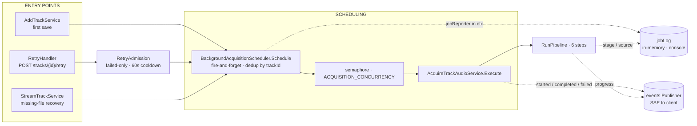
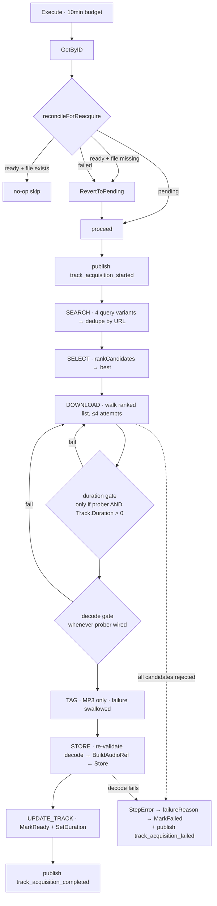
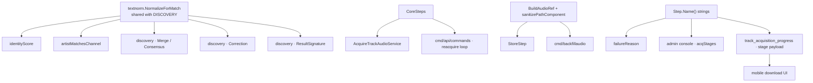

# Acquisition — Module Architecture

The acquisition bounded context (`services/go-api/internal/acquisition/`) turns a
saved `Track` into a playable audio file: it searches public sources by metadata,
ranks the candidates, downloads one, verifies it, tags it, stores it, and marks the
Track ready. This document is the whole-module map — what a *correct* acquisition
means, the design principles the pipeline serves, the invariants a change must
preserve, and the open tensions worth improving. Per-step prose lives in
`okf/backend/acquisition/`; this is the map between those docs and the code, plus
the reasoning a reviewer needs before changing selection behavior.

Everything here is present tense — how the module *is* and *why*. The recurring
adversary the whole design fights is the **right-song-wrong-recording problem**: a
public search returns dozens of things that are all legitimately named "Blinding
Lights" — the master, a sped-up edit, a slowed+reverb edit, a piano cover, a live
cut, a remix, a music video with a spoken intro. Almost every non-obvious decision
below exists to keep those apart. Where the module is weakest is where it currently
*fails* to keep them apart (§7).

---

## 0. Orientation

Acquisition is a **customer of catalog**, not an aggregate owner. It consumes
`catalog/domain.Track` and its `MarkReady` / `MarkFailed` / `RevertToPending`
invariants; there is deliberately no `domain/` folder here, because the context is
orchestration-heavy rather than aggregate-heavy. The candidate type
(`ports.AudioCandidate`) lives in `ports/` and doubles as the pipeline's working
type — a service-side twin would duplicate its fields inside one bounded context.

Three machines, coupled only through explicit seams:



- **[pipeline](okf/backend/acquisition/pipeline.md)** — the `Step` chain that does the work.
- **[scheduling](okf/backend/acquisition/scheduling.md)** — concurrency, dedupe, panic isolation, operator telemetry.
- **[retry](okf/backend/acquisition/retry.md)** — the admission policy in front of manual re-acquisition.

The load-bearing seam between them: **the scheduler threads a `jobReporter` through
`context`**, so pipeline steps report live stage/source without the pipeline package
knowing that scheduling or an operator console exist. `jobReporterFrom` returns a
no-op when none is wired, so eval and test paths calling `Execute` directly are
unaffected.

---

## 1. What "correct" means

Acquisition has one job and it has never been written down. Stating it:

> **The stored file is the studio master of the recording the user saved** — the
> same performance, the same edit, the same length, and nothing else in the file.

Everything that goes wrong is a violation of one of those four clauses. The full
failure taxonomy, because it is also the spec any future verification must satisfy:

| # | Failure | Example | Defended by |
|---|---|---|---|
| F1 | **Different performance** — cover, tribute, karaoke, AI clone | "Blinding Lights (Piano Cover)" | ⚠️ ranking only when a master competes; **undefended when a cover is all that exists** |
| F2 | **Different edit — longer** — remix, extended mix, live, mashup | "Starboy (Extended Remix)" | ✅ duration gate |
| F3 | **Different edit — same length** — slowed, sped-up, reverb, nightcore, 8D | "Blinding Lights (Slowed + Reverb)" | ⚠️ length tiebreak and duration gate; **undefended when no duration is known** |
| F4 | **Different mix of the same performance** — radio edit, clean/explicit swap | "…(Radio Edit)" | ✅ duration gate |
| F5 | **Right recording, contaminated container** — music video with a spoken intro, an unrelated snippet | the Smaxk Or Die music video | ✅ corroborated-duration gate |
| F6 | **Truncated** — a preview stub sold as the full track | SoundCloud's ~30s public preview | ✅ duration gate + the 45s CLI threshold |
| F7 | **Wrong artist, same title** — namesake | Dr. Dre "Die Hard" vs Kendrick's "DIE HARD" | ✅ identity + Topic artist-match |
| F8 | **Wrong featured credit** — solo cut when the saved track is a feature | "Smaxk Or Die" solo vs "(feat. Playboi Carti)" | ✅ `featureMatch` |
| F9 | **Undecodable bytes** — valid header, corrupt samples | the shipped-m4a defect | ✅ `ValidateDecodable`, twice |
| F10 | **Corrupted by our own pipeline** — ID3 written onto a non-MP3 container | m4a whose `ftyp` got displaced | ✅ tagger skips non-MP3 |

Every class is gated by `cmd/acquisitioneval` against a committed baseline; the
suite currently scores **42/44**, and the two failures are the genuine open gaps
named in the table rather than defects to fix before shipping. Three mechanisms
cover most of the table rather than one rule per row:

1. **Resolve identity before fetching** — discovery supplies ISRC/MBID/duration
   (`RecordingResolver`), so the pipeline knows *what* it wants.
2. **Corroborate the bytes — positive evidence only, never a veto.**
   `AudioIdentifier` (fpcalc → AcoustID → MusicBrainz recording ids) marks a
   track `verified` when the expected MBID appears in AcoustID's cluster for the
   audio. It must **not** reject on a mismatch: a recording carries many MBIDs
   (album, single, compilation, remaster each get their own), so the cluster
   legitimately need not contain the one MBID discovery happened to pick.
   Shipping this as a veto rejected every candidate for Rihanna's "Don't Stop
   the Music" — AcoustID returned the same seven correct MBIDs for three
   different uploads, none of them the expected one. Restoring rejection power
   needs cluster-to-cluster comparison (AcoustID's `track/list_by_mbid` maps the
   expected MBID to its own AcoustID set), not MBID equality.
3. **Reconcile length** — when discovery corroborates the duration the gate
   tightens from ±max(15s, 7%) to ±max(5s, 3%), which is what catches a
   contaminated container carrying the right recording.

What survives is honestly two-tiered, and the tier is recorded on the track:
`verified` (fingerprint-matched), `corroborated` (length agreed with an
independent catalogue), `best_effort` (neither — the unidentified tail).

---

## 2. Design philosophy (the load-bearing principles)

1. **Re-search by metadata; never trust a saved URL.** `Execute` re-runs the full
   search on every call. The direct-download-by-permalink path was removed because
   SoundCloud's public stream is frequently a ~30s preview that yt-dlp will happily
   store as if it were the whole track (F6). A pasted URL is a *hint at save time*,
   never an acquisition instruction.

2. **Provenance beats popularity.** A YouTube "Topic" channel is auto-generated
   from the label's own audio delivery, so it *is* the master. Topic candidates
   therefore rank ahead of every non-Topic candidate unconditionally — a
   billion-view VEVO music video never displaces a Topic match. View count is the
   weakest term in the blend (0.10) for the same reason.

3. **Verification is fail-open; acquisition never blocks on a broken validator.**
   A missing or timing-out ffmpeg/ffprobe *skips* the check rather than failing the
   track. This is a deliberate availability-over-correctness trade with a real cost
   (§7.6).

4. **Every step rolls back honestly, or it leaves orphans.** `RunPipeline` unwinds
   completed steps in reverse under a 30s budget. A step that acquires a resource
   and cannot undo it is a bug, not a simplification.

5. **Tagging is cosmetic and must never fail the pipeline.** A tag failure is
   logged and swallowed; audio in the library beats audio with perfect metadata.

6. **The pipeline shape has exactly one definition.** `CoreSteps` is the sole
   assembly of search→select→download→tag→store, shared by the production service
   (which appends `UpdateTrackStep`) and the reacquire CLI commands (which stop
   before it). Two hand-maintained copies would drift silently.

7. **Errors are mapped before they leave.** A raw error chain can carry a cookie
   path or a filesystem layout. `failureReason` maps a structured `StepError` onto
   a five-word client-safe vocabulary; the full chain is logged, never stored on the
   Track and never returned over the wire.

8. **Dependencies point inward, wired explicitly.** `ports ← service ← adapters`;
   the composition root (`internal/app`) is the only place adapters are chosen, and
   the whole context switches off cleanly when no audio store or searcher is
   configured.

---

## 3. Layering & structure

```
ports/       AudioSearcher, AudioProber, AudioTagger, AudioWriter, TrackRepository,
             AudioCandidate, TrackTags, DedupeCandidatesByURL
service/     pipeline.go  — Step, StepError, RunPipeline, rollback, AcquisitionContext, TrackRef
             acquire.go   — Execute, reconcileForReacquire, CoreSteps, failureReason, CleanupTemp
             step_*.go    — the six steps
             matching.go  — identityScore, metadataRank, featureMatch, rankCandidates
             scheduler.go — BackgroundAcquisitionScheduler, schedulerJobReporter, Status, Shutdown
             joblog.go    — JobRecord, the recent ring, counters
             job_telemetry.go — the jobReporter context seam
             retry_admission.go — RetryAdmission
adapters/
  ytdlp/       YtDlpAudioSearcher (search + download), FfprobeProber (duration + decode)
  id3/         Tagger (ID3v2.4, MP3-only)
  handler/     RetryHandler (the one inbound HTTP surface)
```

Ports are deliberately **narrow slices of larger capabilities**: `AudioWriter` is
the store-side subset of catalog's `AudioStore` (`Exists`/`Store`/`Delete`, no
`Stream`), and `TrackRepository` is `GetByID`/`Update` only. Acquisition can neither
stream audio nor list a library, and the compiler enforces it.

The context is **optional at runtime**. `wireCatalog` builds the searcher only when
an audio store exists, and the scheduler only when both exist; catalog then receives
`ports.NoopAcquisitionScheduler()` and the retry route is never mounted. Nothing
fails — the feature is simply off.

---

## 4. The pipeline



**Search** issues up to four query variants (ISRC, title+artist, +album,
+"audio"), each fanned by the adapter to `ytsearch5:` and `scsearch5:`. Results
merge and dedupe by URL through the one shared helper. A single engine failing is
tolerated; the search fails only when *every* engine fails, for *every* query.

**Select** scores each candidate and splits survivors into two buckets:

```
identityScore = max( TokenSortRatio(norm(artist+title), norm(candidate)),
                     TokenSortRatio(norm(title),        norm(candidate)) × 0.6 )
gate: identityScore >= 60

metadataRank  = 0.45·channel + 0.25·duration + 0.20·category + 0.10·views
                channel: Topic 1.0 · VEVO 0.8 · other 0.3
                duration: ≤3s 1.0 · ≤15s 0.5 · else 0.0

Topic bucket → sort by artistMatch, then featMatch, then identity
Other bucket → sort by identity, then featMatch, then metadataRank
Topic bucket always ranks ahead of Other.
```

The title-only 0.6 penalty exists because an unqualified title match is ambiguous
(F7). `featureMatch` reads the **raw** title, not the normalized one, because
normalization strips `(feat. X)` before the matcher ever sees it — the one place the
module already works around the normalization blindness that §7.1 is about.

**Download** walks the ranked list (cap 4 — each attempt is a full download) and
applies two per-candidate gates, falling through to the next candidate on rejection.
**Tag** is a no-op for non-MP3 containers, because ID3v2 prepends a block at byte 0
and that invalidates an MP4 sample-offset table. **Store** re-runs the decode check
on the final file — the last gate after download *and* tagging, catching corruption
any earlier step introduced — then derives `userId/artist/album/title.<ext>` with the
extension taken from the file that actually landed. **UpdateTrack** marks ready.

Events: `started` before the pipeline (the server-authoritative signal the client
seeds its download UI from), `progress` per step from the scheduler's reporter,
then `completed` or `failed`.

---

## 5. Scheduling & operator surface

`Schedule(userId, trackId, sourceURL)` is fire-and-forget and idempotent per track:
a `sync.Map.LoadOrStore` on the track id silently drops a second call while the
first is in flight. Each accepted job takes its own goroutine tracked on the app's
shared `WaitGroup`, recovers panics into a `failed`/`"panic"` job record rather than
crashing the process, then blocks on the semaphore (`ACQUISITION_CONCURRENCY`,
default 5) or bails out as `cancelled` if the scheduler's lifecycle context closes
first.

`jobLog` is the operator console's read model: current queued/running jobs, running
succeeded/failed counters, and a 20-entry ring of recent terminal outcomes.
`complete` is the single call site advancing all three, so they cannot drift.
Failures ride the same ring carrying their reason — there is no parallel failure
list. All of it is **in-memory and resets on restart** (§7.9).

`RetryAdmission` owns the *whole* manual-retry policy, not just the cooldown:
non-`AcquisitionFailed` tracks are rejected (→ 409) and a second retry within 60s is
rejected (→ 429). Both checks live service-side deliberately — the state check used
to live in the handler, and a second entry point replicating half the policy would
admit what the first refuses.

---

## 6. Invariant checklist

A change should preserve all of these; if it can't, that's the discussion.

- The pipeline shape is defined once, in `CoreSteps`. Never in a caller.
- Every `Step` implements `Rollback` honestly.
- Tagging failure is logged and swallowed — never fatal.
- Non-MP3 containers are never ID3-tagged.
- `ProbeDuration` is not proof of decodability; `ValidateDecodable` is.
- Verification is skipped, never fatal, when the validator itself is unavailable.
- A transient existence-check error falls through to re-acquire — never skips.
- A qualifying YouTube Topic candidate is never displaced by a SoundCloud one.
- One search engine failing never fails the search.
- Feature extraction reads the raw title; "with" is never a feature separator.
- No raw error chain reaches the Track row or the wire — `failureReason` first.
- `CleanupTemp` removes the parent of `TempPath`, never `TempPath` itself.
- Manual retry stays admission-gated: failed-state only, one per track per 60s.
- `complete` is the only call site that advances job counters.
- Acquisition never imports catalog's adapters, admin, or the composition root.
- Step `Name()` strings are a public contract (§8) — renaming one is a breaking change.

---

## 7. Known tensions & improvement surface

Current state → tension → candidate direction. Ordered by how much they cost the
user, not by how hard they are.

### 7.1 Normalization deletes the words that distinguish variants

`identityScore` compares titles through `textnorm.NormalizeForMatch`, which strips
every bracketed segment. `"Blinding Lights (Slowed + Reverb)"`,
`"Blinding Lights (Sped Up)"` and `"Blinding Lights"` all normalize to
`blinding lights` and score **identically**. Against track "Blinding Lights"/"The
Weeknd" every one of them scores exactly 60.0 — the threshold, which passes.

This is F3, and it is completely undefended. The module already knows the failure
mode: `extractFeaturedArtists` reads the raw title *precisely because*
normalization ate `(feat. X)`. That workaround was never generalized.

**Direction:** extract variant markers from the raw title the way features already
are, and treat an *unrequested* marker as disqualifying rather than as a tiebreak —
if the saved track's title doesn't say "remix", a candidate that does is a different
recording. The asymmetry matters: a user who saves "Song (Slowed)" should get the
slowed version. **Constraint:** do not "fix" this inside `NormalizeForMatch` — it is
shared with discovery's merge, consensus, correction and result-signature join key
(§8).

### 7.2 The duration gate is conditional, and its input is optional

`verify := s.prober != nil && ac.Track.Duration > 0`. A track saved without a
duration gets **no length check at all** — the only real defense against F1/F2
silently disappears. `DurationSeconds` is a nullable column filled from whatever
discovery metadata came with the save.

Meanwhile discovery *already resolved this track* to a canonical entity carrying an
authoritative duration, and acquisition drops it and re-searches by text.

**Direction:** thread discovery's duration into `TrackRef.Duration` so the gate
always runs. Highest value-per-line change available, and it needs no new
dependency.

### 7.3 Ties are resolved non-deterministically

Both sorts use `sort.Slice`, which is **not stable**. Two candidates on the same
Topic channel with equal identity, artist-match and feature-match — exactly the
master-vs-sped-up case in §7.1 — are ordered arbitrarily. Which version enters the
library depends on the order yt-dlp happened to return, and is not reproducible
run-to-run.

**Direction:** `sort.SliceStable` plus an explicit final tiebreak (URL, or duration
distance from expected) so the same candidate set always yields the same pick.
Cheap, and a precondition for any golden-set evaluation (§7.8).

### 7.4 Nothing verifies the *contents* of the chosen file

`ProbeDuration` reads a container header; `ValidateDecodable` asks only whether
ffmpeg can decode the stream. Neither asks whether the audio *is the recording*.
F5 — a music video whose first 12 seconds are an unrelated snippet — passes every
gate, and when no Topic channel exists (the common case for underground releases)
the official video is the correct *selection* and still the wrong *file*.

**Direction:** acoustic fingerprinting (chromaprint/`fpcalc` → AcoustID →
MusicBrainz recording id) turns "does this title look right" into "is this the
recording", and catches F1–F5 in one pass. It is a new binary, but ffmpeg already
ships to the VM and MusicBrainz is already a wired provider. A cheaper partial:
compare probed duration against an authoritative duration and flag a *head/tail
excess* rather than only a total mismatch.

### 7.5 The source set is two engines wide

`searchEngines` is a two-element slice. yt-dlp's built-in search prefixes are thin
beyond `ytsearch`/`scsearch`, so widening means a search step *outside* yt-dlp that
hands it URLs — which the `AudioSearcher` port already accommodates, since `Search`
and `Download` are separate methods. Bandcamp and Audiomack are the obvious
additions for exactly the underground long tail where Topic channels don't exist and
§7.4 bites hardest.

### 7.6 Fail-open is broader than it reads

`ValidateDecodable` returns `nil` for any error that isn't an `exec.ExitError` — a
missing binary, a bad path, a timeout. A misconfigured `FFMPEG_LOCATION` therefore
disables **both** the duration gate and the decode gate silently, and every gate in
§1's table that depends on them. Nothing surfaces this: there is no startup probe,
no health signal, no counter.

**Direction:** resolve the binaries once at construction and log/expose a
`verification_available` flag on the admin acquisition panel, so "gates are off"
is visible rather than inferred from a rise in bad audio.

### 7.7 ISRC is a search hint, never an identity check

The ISRC query variant is issued first, but `AudioCandidate` carries no ISRC field —
yt-dlp doesn't expose one — so nothing verifies the returned candidate *is* that
recording. The strongest identifier the system holds is used only to bias a text
search.

### 7.8 Selection is tested for self-consistency, not correctness

Every matching test feeds hand-written candidate lists. That proves the ranking
function is internally consistent; it proves nothing about behavior on what YouTube
actually returns. There is no golden set, no accuracy number, and no gate — so
"did that change improve selection?" is currently unanswerable.

Discovery solved exactly this shape with `cmd/discoveryeval`: run the real pipeline
in-process against committed goldens, gate headline metrics against a measured
baseline, re-baseline explicitly. **Direction:** an `acquisitioneval` counterpart
over *recorded real yt-dlp candidate lists*, gating selection accuracy and a
per-failure-class breakdown from §1's table. This is the artifact that makes every
other item here provable rather than plausible.

### 7.9 Acquisition history is in-memory only

`jobLog` resets on restart, and the ring holds 20 entries. "Which tracks failed this
week, and why?" is unanswerable. The per-track `failure_reason` column survives, but
only the latest one, and only in the client-safe vocabulary. Two deploy colours also
keep separate logs and separate `RetryAdmission` maps, so a retry cooldown does not
hold across a swap.

### 7.10 The stored duration is unverified

`UpdateTrackStep` writes `ac.Selected.Duration` — the duration yt-dlp *reported in
search metadata*, not the value `ProbeDuration` measured. The probed number is
computed, used for the gate, and discarded. So a track's stored duration is provider
metadata, and any later consumer that trusts it (including a future run of this same
pipeline, via §7.2) inherits that trust. *(Note: `okf/backend/acquisition/pipeline.md`
currently describes this as the probed duration — that line is out of date.)*

### 7.11 The attempt cap can starve a good candidate

`maxVerifyAttempts = 4` bounds downloads, not candidates — and rejection only
happens *at download time*. A query returning three plausible-but-wrong variants
ahead of the master exhausts the budget and fails the track, even though the right
answer was ranked fifth. Better ranking (§7.1) reduces the pressure; a
cheap pre-download filter would remove it.

### 7.12 Retry admission is untested

`RetryAdmission` has no unit test. The cooldown branch — the 429 path — is exercised
nowhere in the suite; the handler test only covers the not-failed 409. The prune
loop and the record-on-admission semantics are likewise unverified.

---

## 8. Change-impact map

Acquisition is small, but three primitives are shared outward and one is shared
*inward from another module*. Consult this before editing.



| Change this… | Ripples to… | Classic failure mode |
|---|---|---|
| `NormalizeForMatch` | **discovery's** merge tiers, consensus clustering, correction, and the behavioral join key — plus both acquisition matchers | fixing variant matching here silently shifts search ranking and de-joins stored behavioral scores |
| `identityScore` / `identityMin` | which candidates survive the gate at all | raising the floor drops legitimate sparse-metadata tracks; lowering it admits covers |
| the `rankCandidates` sorts | which recording enters the library | a tiebreak that looks harmless reorders every equal-identity pair (§7.3) |
| `metadataRank` weights | non-Topic ordering only — Topic bucketing is upstream of it | tuning views/duration while the real problem is bucket membership |
| `durationWithinTolerance` | the only F1/F2 defense | tighter rejects legitimate intro/outro trims; looser admits remixes |
| a `Step.Name()` string | `failureReason`'s vocabulary, the admin console's stage list, the `progress` event payload the mobile client renders | rename compiles clean and breaks the console and the client silently |
| `CoreSteps` | production *and* every reacquire CLI command | a step added for the service also runs in bulk repair, on the whole library |
| `BuildAudioRef` / the sanitizer | the storage layout *and* `cmd/backfillaudio`'s key derivation | a layout change orphans every existing object and makes backfill unable to find them |
| `AudioCandidate` fields | the ytdlp adapter's extraction and every matcher | a field added but not populated reads as a zero score, not as an error |
| port narrowing (`AudioWriter`, `TrackRepository`) | what acquisition is *able* to do | widening a port is how a context stops being a customer and starts being an owner |

**Where correctness is concentrated.** The pure, I/O-free functions are where the
hard logic lives and where change is safest: `matching.go` in its entirety
(`identityScore`, `metadataRank`, `featureMatch`, `rankCandidates`,
`durationWithinTolerance`), `failureReason`, and `BuildAudioRef`. Each is
exhaustively testable with plain data. Every gate that has ever failed a user lives
in one of them — and, per §7.8, every one of them is currently tested only against
data we wrote ourselves. Put new selection logic in a pure core, add a golden case
first, and treat the (unbuilt) eval gate as the backstop.
