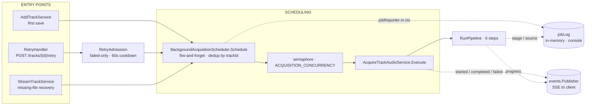
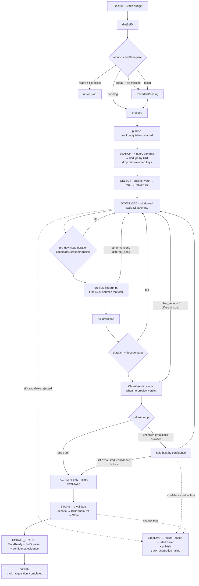

# Acquisition — Module Architecture

The acquisition bounded context (`services/go-api/internal/acquisition/`) turns a
saved `Track` into a playable audio file: it searches public sources by metadata,
ranks the candidates, downloads one, verifies it, tags it, stores it, and marks the
Track ready. This document is the whole-module map — what a *correct* acquisition
means, the design principles the pipeline serves, the invariants a change must
preserve, and the open tensions worth improving.

Everything here is present tense — how the module *is* and *why*. The recurring
adversary the whole design fights is the **right-song-wrong-recording problem**: a
public search returns dozens of things that are all legitimately named "Blinding
Lights" — the master, a sped-up edit, a slowed+reverb edit, a piano cover, a live
cut, a remix, a music video with a spoken intro. Almost every non-obvious decision
below exists to keep those apart. Where the module is weakest is where it currently
*fails* to keep them apart (§7).

---

## 0. Orientation

Acquisition is a **customer of catalog**, not an aggregate owner. It consumes
`catalog/domain.Track` and its `MarkReady` / `MarkFailed` / `RevertToPending`
invariants; there is deliberately no `domain/` folder here, because the context is
orchestration-heavy rather than aggregate-heavy. The candidate type
(`ports.AudioCandidate`) lives in `ports/` and doubles as the pipeline's working
type — a service-side twin would duplicate its fields inside one bounded context.

Three machines, coupled only through explicit seams:


```mermaid
flowchart LR
    subgraph ENTRY["ENTRY POINTS"]
        direction TB
        ADD["AddTrackService<br/>first save"]
        RETRY["RetryHandler<br/>POST /tracks/{id}/retry"]
        STREAM["StreamTrackService<br/>missing-file recovery"]
    end
    ADD --> SCH
    RETRY --> ADM["RetryAdmission<br/>failed-only · 60s cooldown"]
    ADM --> SCH
    STREAM --> SCH
    subgraph SCHED["SCHEDULING"]
        SCH["BackgroundAcquisitionScheduler.Schedule<br/>fire-and-forget · dedup by trackId"]
        SCH --> SEM["semaphore · ACQUISITION_CONCURRENCY"]
        SEM --> EXEC["AcquireTrackAudioService.Execute"]
    end
    EXEC --> PIPE["RunPipeline · 6 steps"]
    SCH -. "jobReporter in ctx" .-> LOG[("jobLog<br/>in-memory · console")]
    PIPE -. "stage / source" .-> LOG
    EXEC -. "started / completed / failed" .-> EV[("events.Publisher<br/>SSE to client")]
    PIPE -. "progress" .-> EV
```

- **pipeline** — the typed, fixed-order stage chain that does the work.
- **scheduling** — concurrency, dedupe, panic isolation, operator telemetry.
- **retry** — the admission policy in front of manual re-acquisition.

The load-bearing seam between them: **the scheduler threads a `jobReporter` through
`context`**, so pipeline steps report live stage/source without the pipeline package
knowing that scheduling or Overseer exist. `jobReporterFrom` returns a
no-op when none is wired, so eval and test paths calling `Execute` directly are
unaffected.

---

## 1. What "correct" means

Acquisition has one job and it has never been written down. Stating it:

> **The stored file is the studio master of the recording the user saved** — the
> same performance, the same edit, the same length, and nothing else in the file.

Everything that goes wrong is a violation of one of those four clauses. The full
failure taxonomy, because it is also the spec any future verification must satisfy:

| # | Failure | Example | Defended by |
|---|---|---|---|
| F1 | **Different performance** — cover, tribute, karaoke, acoustic take, AI clone | "Sunglasses at Night (Acoustic Version)" | ✅ qualifier distance when a master competes; fingerprint cluster rejection when it doesn't — **undefended only where AcoustID has no cluster for the expected recording** |
| F2 | **Different edit — longer** — remix, extended mix, live, mashup | "Starboy (Extended Remix)" | ✅ duration gate |
| F3 | **Different edit — same length** — slowed, sped-up, reverb, nightcore, 8D | "Blinding Lights (Slowed + Reverb)" | ✅ qualifier distance, then fingerprint cluster rejection — no longer dependent on a known duration |
| F4 | **Different mix of the same performance** — radio edit, clean/explicit swap | "…(Radio Edit)" | ✅ duration gate |
| F5 | **Right recording, contaminated container** — music video with a spoken intro, an unrelated snippet | the Smaxk Or Die music video | ✅ corroborated-duration gate |
| F6 | **Truncated** — a preview stub sold as the full track | SoundCloud's ~30s public preview | ✅ duration gate + the 45s CLI threshold |
| F7 | **Wrong artist, same title** — namesake | Dr. Dre "Die Hard" vs Kendrick's "DIE HARD" | ✅ identity + Topic artist-match |
| F8 | **Wrong featured credit** — solo cut when the saved track is a feature | "Smaxk Or Die" solo vs "(feat. Playboi Carti)" | ✅ `featureMatch` |
| F9 | **Undecodable bytes** — valid header, corrupt samples | the shipped-m4a defect | ✅ `ValidateDecodable`, twice |
| F10 | **Corrupted by our own pipeline** — ID3 written onto a non-MP3 container | m4a whose `ftyp` got displaced | ✅ tagger skips non-MP3 |

Every class is gated by `cmd/acquisitioneval` against a committed baseline; the
suite currently scores **72/72** (`goldens/` holds 72 cases across four files). Four mechanisms cover the table rather than one
rule per row:

1. **Resolve identity before fetching** — discovery supplies ISRC/MBID/duration
   (`RecordingResolver`), so the pipeline knows *what* it wants, and
   `resolveExpectedCluster` resolves the expected recording's AcoustID set.
2. **Compare the bytes cluster-to-cluster.** `AudioIdentifier` (fpcalc → AcoustID)
   marks a track `verified` when the audio's AcoustID falls inside the expected
   recording's cluster, and **rejects** when the cluster is known and the audio
   sits outside it. The earlier version compared MBID *equality* and was unsound —
   a recording carries many MBIDs (album, single, compilation, remaster), so the
   sets legitimately need not intersect; that version rejected every candidate for
   Rihanna's "Don't Stop the Music". Cluster comparison is immune to that, and
   rejection is confined to the case where AcoustID actually knows the expected
   recording, so unreleased material stays acquirable.
3. **Score the words normalization deleted.** `qualifierDistance` reads the raw
   titles and ranks on the symmetric difference of their bracketed-qualifier token
   sets, which is what separates a master from an acoustic take or a music video
   on the same Topic channel.
4. **Reconcile length by agreement.** When the saved and resolved durations agree
   the gate tightens from ±max(15s, 7%) to ±max(5s, 3%), catching a contaminated
   container. When they disagree neither is corroborated, so the loose window
   around either accepts — a 7" edit and an album cut differ by more than the
   tight window and the correct file must not be thrown away.

What survives is honestly two-tiered, and the tier is recorded on the track:
`verified` (fingerprint-matched), `corroborated` (length agreed with an
independent catalogue), `best_effort` (neither — the unidentified tail).

---

## 2. Design philosophy (the load-bearing principles)

1. **Re-search by metadata; never trust a saved URL.** `Execute` re-runs the full
   search on every call. The direct-download-by-permalink path was removed because
   SoundCloud's public stream is frequently a ~30s preview that yt-dlp will happily
   store as if it were the whole track (F6). A pasted URL is a *hint at save time*,
   never an acquisition instruction.

2. **Provenance beats popularity.** A YouTube "Topic" channel is auto-generated
   from the label's own audio delivery, so it *is* the master. Topic candidates
   therefore rank ahead of every non-Topic candidate unconditionally — a
   billion-view VEVO music video never displaces a Topic match. View count is the
   weakest term in the blend (0.10) for the same reason.

3. **Verification is fail-open; acquisition never blocks on a broken validator.**
   A missing or timing-out ffmpeg/ffprobe *skips* the check rather than failing the
   track. This is a deliberate availability-over-correctness trade with a real cost
   (§7.6).

4. **Every step rolls back honestly, or it leaves orphans.** `RunPipeline` unwinds
   completed steps in reverse under a 30s budget. A step that acquires a resource
   and cannot undo it is a bug, not a simplification.

5. **Tagging is cosmetic and must never fail the pipeline.** A tag failure is
   logged and swallowed; audio in the library beats audio with perfect metadata.

6. **The pipeline shape has exactly one definition, and the compiler holds its
   order.** `CoreSteps` is the sole assembly of search→select→download→tag→store,
   shared by the production service (which adds `UpdateTrackStep` via
   `withUpdateTrack`) and the reacquire CLI commands (which stop before it). Two
   hand-maintained copies would drift silently. `Pipeline` is a fixed-arity struct,
   not a `[]Step`: each stage's `Execute` takes the empty token only the previous
   stage returns (`pipelineStart`→`afterSearch`→`afterSelect`→`afterDownload`→
   `afterTag`→`afterStore`→`afterUpdate`), so a stage in the wrong slot, or
   `RunPipeline` calling stages out of order, is a compile error. The tokens carry
   no data — the work product still lives on the shared `AcquisitionContext`.

7. **Errors are mapped before they leave.** A raw error chain can carry a cookie
   path or a filesystem layout. `failureReason` maps a structured `StepError` onto
   a five-word client-safe vocabulary; the full chain is logged, never stored on the
   Track and never returned over the wire.

8. **Dependencies point inward, wired explicitly.** `ports ← service ← adapters`;
   the composition root (`internal/app`) is the only place adapters are chosen, and
   the whole context switches off cleanly when no audio store or searcher is
   configured.

---

## 3. Layering & structure

```
ports/                   the contracts, plus the small value helpers that belong to them
  candidate.go           AudioCandidate; DedupeCandidatesByURL / CollectCandidates{,UntilEnough} — the one merge every multi-source search runs through
  cooldown.go            CooldownKind (retry · reacquire), CooldownStore — the cross-process manual-action window
  identify.go            RecordingMatch (Known / Matches / InCluster), AudioIdentifier
  probe.go               AudioProber — ProbeDuration + ValidateDecodable
  recording.go           Provider* identity keys, RecordingIdentity / RecordingSource / RecordingQuery, RecordingResolver (+ noop)
  source.go              FindRequest, AudioSource (Name / Find / Fetch), SearchQueries — the four query variants
  status.go              AcquisitionStatus, JobRecord, AcquisitionVerification — the observe read model
  tag.go                 TrackTags, AudioTagger
  writer.go              AudioWriter, AudioRefLookup, TrackRepository — the narrowed catalog slices
service/                 the orchestration: pipeline shape, the pure decisions, scheduling, admission
  pipeline.go            stage tokens, stage, Pipeline, StepError, RunPipeline, runStage, rollback, AcquisitionContext, TrackRef
  acquire.go             Execute / ExecuteReplace orchestration + notification wiring
  reacquire.go           reacquirePolicy (reconcile, revertToPending)
  buildsteps.go          buildSteps, CoreSteps
  step_search.go         SEARCH — query variants through the registry to deduped candidates
  step_select.go         SELECT — rankAndCollect to a ranked list plus the identity-gate rejections
  step_download.go       DOWNLOAD — the ≤8 attempt walk and the duration / decode / fingerprint gates
  step_tag.go            TAG — delegates to the tagger, failure swallowed
  step_store.go          STORE — re-validate decode, Store, compensating delete
  step_update_track.go   UPDATE_TRACK — MarkReady + measured duration, or a replace's audio swap
  matching.go            identityScore, metadataRank, featureMatch, qualifierDistance, the sorts, rankAndCollect
  duration.go            the tolerance windows — durationWithinTolerance, lengthCorroborated, durationAcceptable
  registry.go            SourceRegistry — fans Find across sources into per-source slots, routes Fetch by candidate.Source
  rejection.go           RejectionStage, CandidateRejection, recordRejection, summarizeRejections
  sourcekey.go           sourceKey / SourceKeys / mergeSourceKeys — the normalized rejected_source_keys identity
  failure_reason.go      failureReason, failureCode, isCancellation, withCancellation, reasonForStep
  logredact.go           logSafeError / logSafeText — cookie paths and host filesystem layout out of log lines
  cleanup.go             CleanupTemp — removes TempDir (the MkdirTemp root)
  tempreap.go            SweepStaleTempDirs — startup reap of altune-acquire-* dirs no live job can still own
  scheduler.go           BackgroundAcquisitionScheduler, Pause/Resume, Status, Shutdown
  joblog.go              jobLog: the recent ring, counters (records are ports.JobRecord)
  job_telemetry.go       the jobReporter context seam and its schedulerJobReporter
  admission_errors.go    admissionError and the admission sentinels
  audio_ref.go           BuildAudioRef (+ legacy variants), path-component helpers
  retry_admission.go     RetryAdmission, ReacquireAdmission, cooldownGate
  eval/                  the offline selection gate — real CoreSteps against committed goldens (§7.8)
    case.go              Case / Track / Candidate, LoadEmbedded over the embedded goldens
    ports.go             casePorts — the in-process source, prober, identifier and writer a case describes
    harness.go           Run / RunAll and judge — one case through the pipeline, pass or fail
    report.go            per-class scoring, Render, and the baselines.json comparison
    goldens/             selection.json (ranking + audio gates) and verification.json (identity, fingerprint, tolerance edges)
adapters/
  handler/               the inbound HTTP surface
    retry_handler.go     RetryHandler — POST /tracks/{id}/retry
    reacquire_handler.go ReacquireHandler — POST /tracks/{id}/reacquire
    command.go           acquisitionCommand — the admit-then-schedule body both handlers serve
  ytdlp/
    searcher.go          YtDlpAudioSearcher — the ytsearch5:/scsearch5: fan-out and Download
    prober.go            FfprobeProber — ProbeDuration, ValidateDecodable, Available
    source.go            Source ("ytdlp") — the text-search AudioSource over the searcher
  ytmusic/
    source.go            Source ("ytmusic") — catalog-resolved by YouTube video id
  streamrip/
    source.go            Source ("streamrip:<service>") — catalog-resolved via the `rip` CLI
  id3/
    tagger.go            Tagger — ID3v2.4, MP3-only
  chromaprint/
    identifier.go        Identifier — fpcalc fingerprint, AcoustID lookup and cluster expansion
  discoverybridge/
    recording_resolver.go RecordingResolver — discovery's search service to a RecordingIdentity
  persistence/
    cooldown_store.go    PgxCooldownStore — the atomic reserve/release upsert on acquisition_cooldowns
    cooldown_fallback.go FallbackCooldownStore — per-process windows while migration 019 is unapplied
```

Ports are deliberately **narrow slices of larger capabilities**: `AudioWriter` is
the store-side subset of catalog's `AudioStore` (`Exists`/`Store`/`Delete`, no
`Stream`), and `TrackRepository` is `GetByID`/`Update` only. Acquisition can neither
stream audio nor list a library, and the compiler enforces it.

The context is **optional at runtime**. `wireCatalog` builds the searcher only when
an audio store exists, and the scheduler only when both exist; catalog then receives
`ports.NoopAcquisitionScheduler()` and the retry route is never mounted. Nothing
fails — the feature is simply off.

---

## 4. The pipeline


```mermaid
flowchart TD
    EX["Execute · 10min budget"] --> GET["GetByID"]
    GET --> REC{"reconcileForReacquire"}
    REC -->|"ready + file exists"| SKIP["no-op skip"]
    REC -->|"ready + file missing"| REV["RevertToPending"]
    REC -->|"failed"| REV
    REC -->|"pending"| GO["proceed"]
    REV --> GO
    GO --> EVS["publish track_acquisition_started"]
    EVS --> S1["SEARCH · 4 query variants → dedupe by URL<br/>drop prior-rejected keys"]
    S1 --> S2["SELECT · qualifier veto → rank → ranked list"]
    S2 --> S3["DOWNLOAD · windowed walk, ≤8 attempts"]
    S3 --> G0{"pre-download duration<br/>candidateDurationPlausible"}
    G0 -->|fail| S3
    G0 --> G1["preview fingerprint<br/>first 130s, sources that can"]
    G1 -->|"other_version / different_song"| S3
    G1 --> G2["full download"]
    G2 --> G3{"duration + decode gates"}
    G3 -->|fail| S3
    G3 --> G4["ClassifyAudio verdict<br/>when no preview verdict"]
    G4 -->|"other_version / different_song"| S3
    G4 --> J{"judgeAttempt"}
    J -->|"hard / soft"| S4
    J -->|"unknown or fallback qualifier"| HOLD["hold best by confidence"]
    HOLD --> S3
    HOLD -->|"list exhausted, confidence ≥ floor"| S4
    S4["TAG · MP3 only · failure swallowed"] --> S5["STORE · re-validate decode → BuildAudioRef → Store"]
    S5 --> S6["UPDATE_TRACK · MarkReady + SetDuration + confidence/evidence"]
    S6 --> OK["publish track_acquisition_completed"]
    S3 -.->|"all candidates rejected"| ERR
    HOLD -.->|"confidence below floor"| ERR
    S5 -.->|"decode fails"| ERR
    ERR["StepError → failureReason → MarkFailed<br/>+ publish track_acquisition_failed"]
```

**Reference set.** Before searching, `RecordingResolver` builds the reference the
audio is later judged against: `RecordingIdentity.MBIDs`, up to five recordings
registered to the track's ISRC (through `WithISRCAuthority`), with the resolved MBID
first. When the saved and resolved lengths disagree, or the searched MBID is not
among the ISRC's recordings, the identity carries `ReferenceDoubted` and logs
`acquisition.reference_doubted`; the resolver then anchors to the ISRC recording
closest in length. A remix MBID from a text search can therefore no longer make the
original audio look wrong.

**Search** issues up to four query variants (ISRC, title+artist, +album,
+"audio"), each fanned by the adapter to `ytsearch5:` and `scsearch5:`. Results
merge and dedupe by URL through the one shared helper. A single engine failing is
tolerated; the search fails only when *every* engine fails, for *every* query.
Candidates whose `sourceKey` is in the track's active `acquisition_rejections` rows
are dropped and logged as `acquisition.candidate_skipped_prior_rejection`; when
that would leave nothing, they come back (`acquisition.prior_rejections_exhausted`).
SoundCloud candidates are inspected by the yt-dlp adapter (`inspect.go`, two at a
time, cached 24h): a track whose audio formats are all encrypted arrives with
`Unplayable` = `drm`, and one that offers a preview format or a 30s stub under a
longer listing arrives as `preview`. Select turns both into rejections without a
download.

**Select** scores each candidate and splits survivors into two buckets:

```
identityScore = max( TokenSortRatio(norm(artist+title), norm(candidate)),
                     TokenSortRatio(norm(title),        norm(candidate)) × 0.6 )
gate: identityScore >= 60

metadataRank  = 0.45·channel + 0.25·duration + 0.20·category + 0.10·views
                channel: Topic 1.0 · VEVO 0.8 · other 0.3
                duration: ≤3s 1.0 · ≤15s 0.5 · else 0.0

Topic bucket → sort by artistMatch, then featMatch, then identity
Other bucket → sort by identity, then featMatch, then metadataRank
Topic bucket always ranks ahead of Other.
```

Before scoring, `UnrequestedQualifiers` reads the raw candidate title against a
lexicon and splits the markers the track did not ask for into two families. A
**veto** family (instrumental, karaoke, live, cover, remix, slowed, reverb, sped up,
nightcore, 8d, reaction, leak, snippet, type beat and similar) rejects the
candidate at stage `qualifier` before it can rank. A **fallback** family (edit,
radio edit, extended, version) keeps it but marks it `isFallback`, and a candidate
that carries one is only ever a held last resort (see Download). A marker the track
title or artist itself contains is ignored, and benign entries (original, stereo,
mono, album mix) are ignored outright. Resolved candidates rank first in their own
bucket, ahead of Topic and Other.

The title-only 0.6 penalty exists because an unqualified title match is ambiguous
(F7). `featureMatch` reads the **raw** title, not the normalized one, because
normalization strips `(feat. X)` before the matcher ever sees it — the one place the
module already works around the normalization blindness that §7.1 is about.

**Download** walks the ranked list (cap 8 attempts, `maxDownloadAttempts`) in
windows of `WithVerifyWidth(n)` candidates, falling through to the next candidate
on rejection. Width 1 is the serial walk and is the default: `CoreSteps` does not set
it, so production is serial until a caller passes a width (§7.11). Every fetch,
full or preview, takes a slot from the process-wide `DownloadLimiter`
(`ACQUISITION_DOWNLOAD_CONCURRENCY`, default 6, wired in `catalog_wiring.go`), which
caps concurrent downloads across all tracks. In a window the first accepted
candidate cancels the lower-ranked ones, and results merge in rank order so the
outcome equals the serial walk. Per candidate:

1. `candidateDurationPlausible` skips, before any bytes move, a candidate whose
   search-time duration is outside the expected window (stage `duration`, log
   `acquisition.candidate_skipped_duration`). Resolved and duration-less
   candidates pass.
2. **Preview fingerprint.** When the source can (`PreviewFetcher`, resolved through
   the registry), the first 130s is fetched (`--download-sections *0-130` on
   yt-dlp), fingerprinted and classified; a bad verdict rejects without paying for
   the full download, a failure falls back to the full-file path
   (`ports.SkipPreviewFallback`), and every preview logs
   `acquisition.preview_fingerprint`.
3. The full download, then the duration and decode gates.
4. `ClassifyAudio(ref, duration, results)` classifies the fingerprint (skipped when
   the preview already produced the verdict).

`ClassifyAudio` drops each linked recording whose length disagrees with the audio
(authoritative tolerance, max(5s, 3%)), then returns one `AudioVerdict`: `hard`
when a surviving link is in the reference `MBIDs`; `soft` when one names the same
song by the same artist with no unrequested qualifier and the length agrees;
`other_version` when the same song survives only with an unrequested qualifier;
`different_song` otherwise; `unknown` when AcoustID returned nothing. `hard` and
`soft` set `IdentityVerified`. `other_version` and `different_song` reject at stage
`fingerprint`. Each verdict logs `acquisition.audio_verdict`, with the surviving
links and `reference_doubted`.

`unknown` is not a rejection. `judgeAttempt` builds `Evidence` (verdict, AcoustID
score, ISRC-set hit, duration delta, channel class, fallback qualifiers, whether the
identity was resolved, source title; `ISRCSetHit` is declared but nothing sets it yet) and scores it with
`ScoreConfidence(e Evidence, trackSeconds float64)`: `hard` 0.95, `soft` 0.85 (each
knocked to at least 0.8 when the AcoustID score is under 0.92), and for `unknown`
0.2 plus 0.3 for a Topic or artist channel, plus 0.2 for a duration within 2s (0.1
within max(15s, 7%)), plus 0.1 when resolved, minus 0.2 for a qualifier, capped at
0.8. An `unknown` or fallback candidate is *held*, not accepted; the walk keeps
trying and `settle` picks the best held candidate (non-fallback first, then highest
confidence). It is stored, as `best_effort`, only when its confidence reaches
the confidence floor (`WithConfidenceFloor`, default 0.5; the
`ACQUISITION_CONFIDENCE_FLOOR` config value is parsed and validated but not yet
passed to the step, §7.11); otherwise the
step fails with `ErrNoConfidentMatch`, which `failureReason` maps to
`no_confident_match`. A fallback candidate must also match the expected length within
max(5s, 3%). The winning `Evidence` and confidence are logged as
`acquisition.confidence` and written to the track by UpdateTrack.

Rejections carry a stage: `identity`, `qualifier`, `download`, `drm`, `preview`,
`duration`, `undecodable`, `fingerprint`, `not_attempted`. Every stage except
`download` and `not_attempted` is *lasting*: at the end of the run it is written to
`acquisition_rejections` (migration 029, keyed by track and `sourceKey`), and for
30 days a plain retry skips that source (§7.11). Log events to watch:
`acquisition.audio_verdict`, `acquisition.reference_doubted`,
`acquisition.preview_fingerprint`, `acquisition.candidate_skipped_prior_rejection`,
`acquisition.confidence`.

**Tag** is a no-op for non-MP3 containers, because ID3v2 prepends a block at byte 0
and that invalidates an MP4 sample-offset table. **Store** re-runs the decode check
on the final file — the last gate after download *and* tagging, catching corruption
any earlier step introduced — then derives `userId/artist/album/title.<ext>` with the
extension taken from the file that actually landed. **UpdateTrack** marks ready.

Events: `started` before the pipeline (the server-authoritative signal the client
seeds its download UI from), `progress` per step from the scheduler's reporter,
then `completed` or `failed`.

---

## 5. Scheduling & operator surface

`Schedule(userId, trackId, sourceURL)` is fire-and-forget and idempotent per track:
a `sync.Map.LoadOrStore` on the track id silently drops a second call while the
first is in flight. Each accepted job takes its own goroutine tracked on the app's
shared `WaitGroup`, recovers panics into a `failed`/`"panic"` job record rather than
crashing the process, then blocks on the semaphore (`ACQUISITION_CONCURRENCY`,
default 5) or bails out as `cancelled` if the scheduler's lifecycle context closes
first.

`jobLog` is Overseer's read model: current queued/running jobs, running
succeeded/failed counters, and a 20-entry ring of recent terminal outcomes.
`complete` is the single call site advancing all three, so they cannot drift.
Failures ride the same ring carrying their reason — there is no parallel failure
list. All of it is **in-memory and resets on restart** (§7.9).

`RetryAdmission` owns the *whole* manual-retry policy, not just the cooldown:
non-`AcquisitionFailed` tracks are rejected (→ 409) and a second retry within 60s is
rejected (→ 429). Both checks live service-side deliberately — the state check used
to live in the handler, and a second entry point replicating half the policy would
admit what the first refuses. The cooldown window is stored in Postgres
(`acquisition_cooldowns`, one row per track and kind, written by one atomic
upsert through `ports.CooldownStore`), so it holds across restarts, blue-green
swaps and replicas rather than per process. `ReacquireAdmission` shares the store
with its own `reacquire` window.

Migrations are applied by hand after deploy, so the wiring wraps the Postgres
store in `persistence.FallbackCooldownStore`: while the table is missing
(SQLSTATE 42P01) it keeps the same windows per process and logs one WARN naming
migration 019, instead of failing retry/reacquire with 500. It tries Postgres on
every call, so the durable window resumes without a restart once 019 is applied;
any other store error still fails the request.

---

## 6. Invariant checklist

A change should preserve all of these; if it can't, that's the discussion.

- The pipeline shape is defined once, in `CoreSteps`. Never in a caller.
- The fingerprint rejects only against a known expected cluster; unknown audio always passes.
- Fingerprints are compared cluster-to-cluster, never by MBID equality.
- A tightened duration window requires the saved and resolved lengths to *agree*.
- Variant markers are read from the raw title; `NormalizeForMatch` is never "fixed" to keep them.
- Exclusion matches a normalized `sourceKey`, and a key is normalized exactly once.
- A replace never drops a previously rejected source from the set.
- A failed replace never publishes `track_acquisition_failed`.
- A replace never writes over the audio the track is serving: it stores under a per-attempt ref, and the superseded object is deleted only after `update_track` commits.
- Event names stay literal at their `Publish` call sites.
- Every stage implements `Rollback` honestly.
- Stage order lives in the stage token types; never reintroduce a generic `[]Step` walk.
- Tagging failure is logged and swallowed — never fatal.
- Non-MP3 containers are never ID3-tagged.
- `ProbeDuration` is not proof of decodability; `ValidateDecodable` is.
- Verification is skipped, never fatal, when the validator itself is unavailable.
- A transient existence-check error falls through to re-acquire — never skips.
- A qualifying YouTube Topic candidate is never displaced by a SoundCloud one.
- One search engine failing never fails the search.
- Feature extraction reads the raw title; "with" is never a feature separator.
- No raw error chain reaches the Track row or the wire — `failureReason` first.
- `CleanupTemp` removes `TempDir` (the `MkdirTemp` root), falling back to the parent of `TempPath` when only `TempPath` is set; never `TempPath` itself.
- Manual retry stays admission-gated: failed-state only, one per track per 60s.
- `complete` is the only call site that advances job counters.
- Acquisition never imports catalog's adapters, observe, or the composition root.
- Stage `Name()` strings are a public contract (§8) — renaming one is a breaking change.
- A veto-family qualifier the track didn't ask for rejects at `qualifier`, whatever the fingerprint says.
- `other_version` and `different_song` verdicts always reject; only `unknown` may be held.
- An `unknown` or fallback candidate is stored only at or above the confidence floor, and as `best_effort`, never `verified`.
- Only lasting rejection stages (everything but `download` and `not_attempted`) are remembered in `acquisition_rejections`.
- Prior-rejected sources are skipped, never dropped for good: when nothing else is left they come back.
- Every fetch, full or preview, goes through the `DownloadLimiter`.
- A preview failure falls back to the full-file path; it never rejects a candidate.
- The pre-download duration check skips only when both the search-time and expected lengths are known.

---

## 7. Known tensions & improvement surface

Current state → tension → candidate direction. Ordered by how much they cost the
user, not by how hard they are.

### 7.1 ~~Normalization deletes the words that distinguish variants~~ — closed

`qualifierDistance` now generalizes the `extractFeaturedArtists` workaround: it reads
the raw titles, tokenizes their bracketed segments, and ranks on the symmetric
difference (unrequested marker 1, requested-but-missing 2). `NormalizeForMatch` was
left alone, as §8 requires. The asymmetry is preserved — a user who saves
"Song (Slowed)" gets the slowed take.

What remains deliberate: an unrequested marker is a *ranking penalty*, not a veto.
Vetoing would require knowing which qualifiers name a different recording
("Acoustic") and which name the same one repackaged ("Official Audio", "Remastered"),
and that is a word bank. The fingerprint answers that question with evidence
instead.

### 7.2 ~~The duration gate is conditional, and its input is optional~~ — closed

A track saved without a duration used to get no length check at all.
`resolveIdentity` is fill-only: when the saved duration is absent it supplies
discovery's, so the gate runs on every acquisition that can be identified at all.
What remains: a track discovery cannot resolve *and* that was saved without a
duration still has no length to check against — the fingerprint is the only defense
left there.

### 7.3 ~~Ties are resolved non-deterministically~~ — closed

Both sorts are `sort.SliceStable` with an explicit `breakTie` on distance from the
expected length, then URL, and the source registry writes each source's results into
its own slot so tie order never depends on completion order. The same candidate set
yields the same pick run-to-run, which is what makes the eval in §7.8 meaningful.

### 7.4 ~~Nothing verifies the *contents* of the chosen file~~ — closed

`ProbeDuration` reads a container header and `ValidateDecodable` asks only whether
ffmpeg can decode the stream; neither asks whether the audio *is the recording*.
`AudioIdentifier` does, and now rejects on it (§1.2). A contaminated container is
caught by the corroborated-duration gate, and a different performance by the
AcoustID cluster comparison.

What remains: rejection needs AcoustID to know the expected recording. Where it
doesn't — unreleased and underground material, the same long tail where Topic
channels don't exist — the file is still accepted on resemblance alone. There is no
head/tail excess detection either: a container whose *total* length matches but whose
audio is offset passes.

### 7.5 The source set is two engines wide — partially closed

`searchEngines` is still a two-element slice, but a search-side URL no longer has to
come from yt-dlp's own search: the source registry also routes `ytmusic`,
`streamrip:<service>` and resolved candidates (`Resolved`, from the identity's
`Sources`), which rank ahead of anything searched. SoundCloud results are now
inspected before ranking (§4), so a DRM or preview stub costs no download.
**Still open:** Bandcamp and Audiomack are not sources; the underground long tail
where Topic channels don't exist still relies on `ytsearch`/`scsearch`.

### 7.6 Fail-open is broader than it reads — partially closed

`ValidateDecodable` returns `nil` for any error that isn't an `exec.ExitError` — a
missing binary, a bad path, a timeout. A misconfigured `FFMPEG_LOCATION` therefore
disables **both** the duration gate and the decode gate silently, and every gate in
§1's table that depends on them. Nothing surfaces this: there is no startup probe,
no health signal, no counter.

**Done:** `FfprobeProber.Available()` / `Identifier.Available()` resolve the binaries
at construction and the composition root folds them into
`AcquisitionStatus.Verification`, logged loudly at startup when anything is missing.
`DownloadStep` also counts each skipped gate through `ports.VerifySkipRecorder`
(`SkipPreviewFallback`, `SkipIdentifyFailed`) and logs `acquisition.identify_throttled`
when AcoustID throttles, so a run of skips is visible. **Still open:** the fail-open
*behavior* is unchanged — a validator that dies mid-run still skips its gate for that
candidate, and the resulting `unknown` verdict is now held against the confidence
floor rather than accepted outright, which bounds the damage but does not remove it.

### 7.7 ISRC is a search hint, never an identity check — partially closed

`AudioCandidate` still carries no ISRC, so a text search result is never checked
against the ISRC directly. The identity check moved to the audio: the resolver puts
every recording registered to the ISRC into `RecordingIdentity.MBIDs`, and a
candidate whose fingerprint links any of them earns a `hard` verdict (§4), even when
the resolved MBID is a remix. `ReferenceDoubted` flags the identities where the
reference itself is suspect. **Still open:** a track with no ISRC has a one-element
reference set, and `Evidence.ISRCSetHit` is declared but never populated.

### 7.8 Selection is tested against curated goldens, not live results — partially closed

**Done:** `service/eval/` runs the real `CoreSteps` selection in-process against a
committed golden set — `goldens/selection.json` (ranking and the audio gates) and
`goldens/verification.json` (identity, fingerprint corroboration, tolerance edges),
72 cases across `goldens/` spanning every class in §1's table, plus `realworld.json`
(3 cases, real identity resolution including the remix-MBID trap) and `pipeline.json`
(4 cases, whole-pipeline outcomes). `report.go` scores per-failure-class
accuracy and simulated time (median simulated seconds, mean attempts, so a change
that wins accuracy by paying more downloads shows up) and gates both against `cmd/acquisitioneval`'s committed
baseline, re-baselined explicitly — the same shape discovery uses in
`cmd/discoveryeval`. "Did that change improve selection?" now has an answer, and a
selection change that regresses the baseline fails the gate.

**Still open:** every golden is a *hand-authored* candidate list, not a recording of
what yt-dlp actually returned. The gate proves selection is correct on the cases we
can imagine; it still says nothing about the distribution YouTube serves in the
wild. `acquisitioneval capture` records real candidate lists and
`acquisitioneval audit-qualifiers` audits the qualifier lexicon against them, but
committed goldens are still mostly hand-authored; growing `realworld.json` from
captures is the remaining step.

### 7.9 Acquisition history is in-memory only

`jobLog` resets on restart, and the ring holds 20 entries. "Which tracks failed this
week, and why?" is unanswerable. The per-track `failure_reason` column survives, but
only the latest one, and only in the client-safe vocabulary. Two deploy colours also
keep separate logs. (The retry/reacquire cooldown no longer resets: it is stored in
Postgres, #986.)

### 7.10 ~~The stored duration is unverified~~ — closed

`UpdateTrackStep` now writes `AcquisitionContext.MeasuredDuration()`: the value
`ProbeDuration` measured, falling back to provider metadata only when nothing was
probed. A stored duration is therefore a measurement wherever a prober was wired,
so the feedback loop into the next run's gate carries fact rather than a provider's
claim.

### 7.11 The attempt cap can starve a good candidate — mostly closed

`maxDownloadAttempts = 8` still bounds downloads, but fewer candidates reach it.
Veto qualifiers, `drm`/`preview` inspection and the pre-download duration check
(`candidateDurationPlausible`) remove candidates without a download, and the preview
fingerprint (first 130s) rejects a wrong recording for a fraction of a full fetch.
Rejection memory (`acquisition_rejections`, 30 days) means a retry no longer spends
its budget re-downloading last time's losers. Windows (`WithVerifyWidth`) would
pay the remaining downloads in parallel.
**Still open:** (a) production runs width 1 because nothing passes `WithVerifyWidth`;
(b) `ACQUISITION_CONFIDENCE_FLOOR` is not yet passed to `WithConfidenceFloor`, so the
floor is the 0.5 default; (c) a source with no `PreviewFetcher` still pays the full
download per candidate; (d) a lasting rejection can be wrong (a source that was
briefly a preview), and the 30-day window is the only correction.

### 7.12 ~~Retry admission is untested~~ — closed

`retry_admission_test.go` covers the 409 and 429 branches, the refund on a refused
schedule, and a simulated restart; `adapters/persistence` integration tests prove
the Postgres cooldown store across two pools and under concurrent reservations.

---

## 8. Change-impact map

Acquisition is small, but several primitives are shared outward and one is shared
*inward from another module*. The riskiest of them are **bare strings**: a
vocabulary two sides must spell identically, where a rename compiles clean and
breaks the far side silently. Consult this before editing.


```mermaid
flowchart TD
    NORM["textnorm.NormalizeForMatch<br/>shared with DISCOVERY"] --> IDS["identityScore"]
    NORM --> AMC["artistMatchesChannel"]
    NORM --> DMERGE["discovery · Merge / Consensus"]
    NORM --> DCORR["discovery · Correction"]
    NORM --> DSIG["discovery · ResultSignature"]
    CORE["CoreSteps"] --> PROD["AcquireTrackAudioService"]
    CORE --> CLI["cmd/api/commands · reacquire loop"]
    REF["BuildAudioRef + sanitizePathComponent"] --> STORE["StoreStep"]
    REF --> BFA["cmd/backfillaudio"]
    NAMES["stage Name() strings"] --> FR["failureReason"]
    NAMES --> EVP["track_acquisition_progress · stage payload"]
    EVP --> MOB["mobile download UI"]
    PROV["ports.Provider* keys"] --> DBR["discoverybridge · providerKey"]
    PROV --> SFOR["RecordingIdentity.SourceFor"]
    SFOR --> YTM["ytmusic · identityKey"]
    SFOR --> SRIP["streamrip · trackURLs"]
    SRC["source Name() strings"] --> STAMP["stampSource → AudioCandidate.Source"]
    STAMP --> FETCH["SourceRegistry.Fetch routing"]
    STAMP --> RJ["CandidateRejection.Source + candidate logs"]
    REJ["RejectionStage vocabulary"] --> SUMM["summarizeRejections"]
    SUMM --> FRDET["failure_reason detail<br/>after FailureDetailSeparator"]
    KIND["ports.CooldownKind values"] --> PGCD["acquisition_cooldowns.kind<br/>CHECK · migration 019"]
    KIND --> ADM["RetryAdmission / ReacquireAdmission"]
```

| Change this… | Ripples to… | Classic failure mode |
|---|---|---|
| `NormalizeForMatch` | **discovery's** merge tiers, consensus clustering, correction, and the behavioral join key — plus both acquisition matchers | fixing variant matching here silently shifts search ranking and de-joins stored behavioral scores |
| `identityScore` / `identityMin` | which candidates survive the gate at all | raising the floor drops legitimate sparse-metadata tracks; lowering it admits covers |
| the `rankAndCollect` sorts | which recording enters the library | a tiebreak that looks harmless reorders every equal-identity pair (§7.3) |
| `metadataRank` weights | non-Topic ordering only — Topic bucketing is upstream of it | tuning views/duration while the real problem is bucket membership |
| `durationWithinTolerance` | the only F1/F2 defense | tighter rejects legitimate intro/outro trims; looser admits remixes |
| `lengthCorroborated` | which window every download is measured against | making it laxer silently re-tightens the gate around an unverified saved duration |
| `qualifierDistance` or its sort position | master-vs-variant on the same channel; label-vs-fan upload off it | promoting it above `metadataRank` outside the Topic bucket puts a lyrics re-upload ahead of the label's own master |
| `DownloadStep.identify`'s tiers | whether a wrong recording can enter the library at all | widening rejection past "cluster known" makes the underground long tail unacquirable — the failure that forced the first rollback |
| `sourceKey` | every stored `rejected_source_keys` value | changing the key shape orphans the memory and re-acquire silently toggles again |
| a stage `Name()` string | `failureReason`'s vocabulary, the `progress` event payload the mobile client renders | rename compiles clean and breaks the client silently |
| a source's `Name()` (`ytdlp`, `ytmusic`, `streamrip:<service>`) | `stampSource` stamps it onto `AudioCandidate.Source`; `SourceRegistry.Fetch` routes the download by matching it back, and it labels every candidate log line and `CandidateRejection` | renaming one leaves `Fetch` with "no source named" for every candidate that source found — the search is paid for and then discarded wholesale |
| a `ports.Provider*` identity key (`youtube`, `deezer`, `soundcloud`, `tidal`, `qobuz`) | `discoverybridge.providerKey`'s mapping off discovery's `ProviderName`, `RecordingIdentity.SourceFor`, `ytmusic`'s `identityKey`, `streamrip`'s `trackURLs` | a key written by one side and not looked up by the other fails *silently*: `SourceFor` returns false and the resolved source simply never produces a candidate |
| a `RejectionStage` constant | the per-stage counts in `summarizeRejections`, persisted into `failure_reason` after `domain.FailureDetailSeparator`, and every rejection log line | renaming one splits that stage's history — rows and dashboards group the old and new spelling as two different, half-populated stages |
| a `ports.CooldownKind` value (`retry`, `reacquire`) | the `acquisition_cooldowns.kind` CHECK constraint (migration 019), both admissions, and `FallbackCooldownStore`'s in-memory key | a kind the constraint doesn't list fails every reserve with a 500; renaming one abandons the windows already written and reopens the cooldown for every track |
| `CoreSteps` | production *and* every reacquire CLI command | a step added for the service also runs in bulk repair, on the whole library |
| `BuildAudioRef` / the sanitizer | the storage layout *and* `cmd/backfillaudio`'s key derivation | a layout change orphans every existing object and makes backfill unable to find them |
| `AudioCandidate` fields | the ytdlp adapter's extraction and every matcher | a field added but not populated reads as a zero score, not as an error |
| port narrowing (`AudioWriter`, `TrackRepository`) | what acquisition is *able* to do | widening a port is how a context stops being a customer and starts being an owner |

**Where correctness is concentrated.** The pure, I/O-free functions are where the
hard logic lives and where change is safest: `matching.go` in its entirety
(`identityScore`, `metadataRank`, `featureMatch`, `rankAndCollect`,
`durationWithinTolerance`), `failureReason`, and `BuildAudioRef`. Each is
exhaustively testable with plain data. Every gate that has ever failed a user lives
in one of them — and, per §7.8, every one of them is currently tested only against
data we wrote ourselves. Put new selection logic in a pure core, add a golden case
first, and treat the `cmd/acquisitioneval` gate as the backstop.
