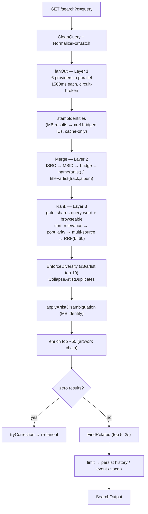
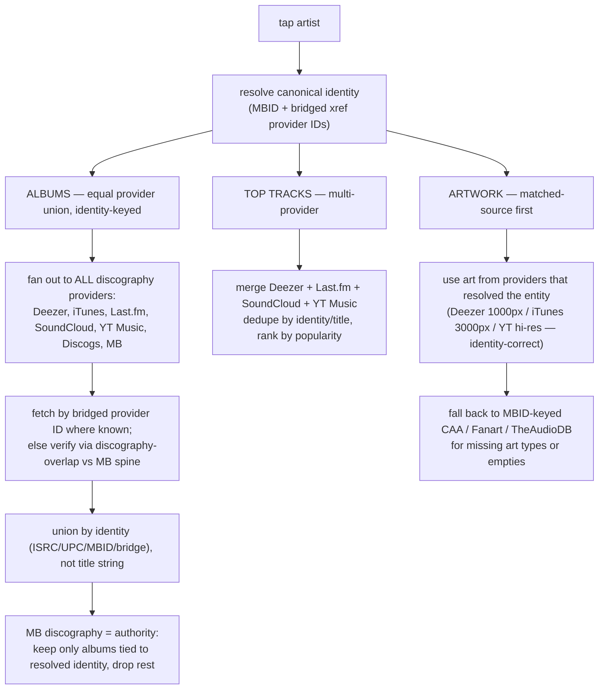

# Discovery — Architecture

Visual map of the discovery bounded context. Use this to trace data flow when
debugging search/detail quality issues. Pair with `docs/providers/*.md` (per-provider
surface) and `docs/providers/maximization-audit-2026-06-22.md` (coverage/identity gaps).

## Status legend

Sections and steps are tagged so this doc never lies about what actually runs:

- ✅ **current** — wired and running today
- 🔨 **in progress** — the identity-anchored detail rework (this effort)
- 📋 **planned** — backlog, not yet built

## The load-bearing principle: identity-anchored merge

Everything in discovery merges **by identity, never by bare name**. The identity
tiers, strongest first, are **ISRC → MBID → UPC/barcode → cross-provider bridge**.
Only when no identifier exists do we fall back to name/title matching — and that
fallback is exactly where same-name artists (the "Che" problem) collide.

**MusicBrainz is the canonical spine.** Its MBID is the identity anchor, and its
release-group discography is the cleanest, most current authority we have (verified:
exact discography incl. brand-new releases). Other providers bridge *to* the MBID via
identifiers they expose; where they can't, they must be *verified* against the spine
before their data is trusted — not merged on a name guess.

**Every provider is treated equally within its capability role** (§ Provider roles).
No provider is "the niche one": SoundCloud, Deezer, iTunes, YouTube Music all carry
mainstream and underground alike, and we pull the same shape of data (artists, albums,
singles, artwork) from each one its API supports.

## Provider roles (capability matrix)

A provider holds one or more **roles**. This table is the single source of truth for
"why is provider X in surface Y but not Z" — the answer is always its *shape*, not a
snub.

| Provider | Catalog (search) | Discography (albums / top-tracks) | Enricher (detail depth) | Artwork | Identity keys it feeds |
|---|---|---|---|---|---|
| **Deezer** | ✅ seed | ✅ albums + top-tracks | ✅ bpm/label/genres/lyrics | ✅ 1000px inline | ISRC, UPC |
| **iTunes** | ✅ | ✅ albums | ⚠️ thin (copyright/track#) | ✅ 3000px master | Apple Music id ✅ |
| **MusicBrainz** | ✅ | ✅ **discography spine** | ✅ genres/ratings | — (via CAA) | **MBID**, ISRC |
| **Last.fm** | ✅ | ✅ albums + top-tracks | ✅ bio/tags/similar/listeners | — (placeholders) | mbid bridge |
| **SoundCloud** | ✅ | ✅ albums + top-tracks | ⚠️ tags/likes | ✅ inline | ISRC |
| **YouTube Music** | ✅ | ✅ albums + top-tracks | — (duplicative) | ✅ hi-res artist | — none |
| **Discogs** | ❌ rate-limited | ✅ (detail consensus only) | ✅✅ credits/styles/labels | ⚠️ ≤600px | barcode/UPC 📋 |
| **Genius** | ❌ song/lyrics shape | — | ✅ song credits 📋 | ✅ name-search | — |
| **TheAudioDB** | ❌ 1-result cap | — | ⚠️ | ✅✅ logos/clearart/cdart | external-ID hub 📋 |
| **Cover Art Archive** | — | — | — | ✅ MBID-keyed album front | — |
| **Fanart.tv** | — | — | — | ✅ MBID-keyed artist art/backdrops | — |

**Role rules:**

- **Catalog** (search fan-out) requires: multi-result across kinds + can sustain the
  hot-path request rate + adds coverage. Discogs (rate), Genius (shape), TheAudioDB
  (1-result) fail this and are excluded from search — correctly.
- **Discography** providers feed the artist-detail album/top-track union. Discogs joins
  here (detail runs once per artist, cached 6h — its rate budget fits).
- **Enrichers** decorate an already-resolved entity on detail-open; they never mint a
  search entity, so they cannot conflate identities.
- **Artwork** resolvers supply images. **ID-keyed sources** (CAA, Fanart, TheAudioDB-by-
  MBID) are identity-safe; **name-searched** sources carry the same wrong-artist risk as
  any name match.

Config gating: MusicBrainz, Last.fm, Discogs, Fanart.tv, Genius are each gated on their
key/config being present; Deezer, iTunes, SoundCloud, YouTube Music are keyless and always
on. (The key-gated YouTube Data API artwork resolver was retired 2026-06-25 — keyless YT
Music covers it, verified working from the prod OCI IP.)

## Search flow (✅ current — one 🔨 fix)

`Service.Execute` ([search.go](service/search.go)). One query → a ranked list.



**Search providers (Layer 1):** Deezer, iTunes, MusicBrainz, Last.fm, SoundCloud
(api-v2, yt-dlp fallback), YouTube Music — **6 providers** ([app.go `buildDiscoveryProviders`](../app/app.go)).

**Ranking quality is good** (eval-gated, top-3 ≈ 99%). The one change here:

✅ **Ambiguous-artist merge gate** (shipped — *eval run still owed*). `Merge`
([merge.go](service/merge.go)) used to resolve artists *by canonical name alone* when
no identifier/bridge tied them — so every same-name artist (iTunes Che + SoundCloud Che
+ Deezer Che) collapsed into one card whose `sources[]` pointed at *different humans*.
Now `ambiguousArtistNames` flags any name MusicBrainz returns with **≥2 distinct MBIDs**,
and the merge loop **refuses the bare name-merge for those artists** (identifier/ISRC/
bridge tiers still merge freely). `CollapseArtistDuplicates` ([diversity.go](service/diversity.go))
is likewise mbid-aware: distinct identities of an ambiguous name stay as separate cards
instead of folding. Both changes are **no-ops when mbids are absent or equal**, so
unambiguous names (Drake) behave exactly as before. ⚠️ Touches the eval-gated core —
run `discoveryeval -mode eval -top-k 3` before trusting in prod.

## Artist-detail flow (✅ current → 🔨 rework)

Tapping an artist triggers two independent fetches, client-orchestrated
([useArtistContent.ts](../../../../apps/mobile/src/features/detail/hooks/useArtistContent.ts)).
This is where the "wrong Che" contamination lives.

### Shipped (✅)

- ✅ **Albums anchored on the MB spine.** `ConsensusService.applyMBAuthority`
  ([consensus.go](service/consensus.go)) now keeps only albums MusicBrainz confirms for
  the resolved artist and **rejects the rest** as same-name contamination (falls back to
  the union only when MB doesn't cover the artist). Replaced the capped, timeout-prone
  per-album probe with the single bulk discography call — more precise *and* faster.
- ✅ **SoundCloud joins the album consensus** ([search_wiring.go](../app/search_wiring.go))
  and the client passes `artistName` for its SC album fetch
  ([useArtistContent.ts](../../../../apps/mobile/src/features/detail/hooks/useArtistContent.ts)),
  so SC albums get the same MB filtering instead of bypassing it.
- ✅ **Top tracks merge Deezer + SoundCloud + Last.fm** — Deezer/SoundCloud by numeric id,
  **Last.fm by MBID** (identity-safe; only fires when an MBID is known). Deduped, capped
  at 5. YT Music top-tracks deferred — its endpoint is **name-keyed** (precision-unsafe);
  needs the browse-by-channel endpoint — 📋.

### Remaining (📋)

- Single server-side identity-anchored discography endpoint (replace the client's
  three per-provider calls). Current per-provider calls converge to the same MB-anchored
  union, so this is a cleanup/perf win, not a correctness gap.
- Fetch each provider's albums by **bridged ID** (not name) once the identity bridge is
  fed (§ Identity bridge) — removes reliance on MB-spine verification for ID-less providers.

### Design (identity-anchored)



Three equal-treatment fixes baked in: **SoundCloud joins the album union**,
**top-tracks becomes multi-provider**, and the union **keys on identity** so a wrong-Che
album cannot enter. The detail path is also where the **discography-overlap** signal is
affordable (per-artist I/O is fine once, on tap) — infeasible on the hot search path.

## Artwork resolution (✅ current → 🔨 reorder)

`buildArtworkChain` ([search_wiring.go](../app/search_wiring.go)) — ID-first, name-search
last:

```
CAA (MBID, album front, ≤1200px)
  → Fanart.tv (MBID, artist art/backdrops) [gated]
  → Genius (name-search) [gated]
  → TheAudioDB (MBID lookup; unique logos/clearart/cdart)
  → Deezer (name-search, 1000px)
  → iTunes (name-search, 3000px master)
  → YouTube Music (keyless artist image)
  → SoundCloud (name-search, last — underground long tail)
```

🔨 **Target:** prefer the **matched-source** image first (a provider that already
resolved the entity supplies identity-correct, hi-res art), then fall to the MBID-keyed
resolvers for art types coverage providers lack (Fanart backdrops, TheAudioDB logos/disc
art) or when empty. Safe only *after* the identity merge fix — pulling from a
name-matched source today inherits the wrong-Che risk. (Also fixes the §2.5 audit
mis-ordering where Fanart's 1000px album art can beat CAA/iTunes by firing first.)

## Identity bridge — what feeds it (the 🔨/📋 prerequisite)

Identity-keyed merge for non-MB providers only works if we drain the join keys we
*already fetch* (audit §2.1). State:

- ✅ **SoundCloud `isrc`** (`publisher_metadata.isrc`) — mapped; SC merges in the ISRC tier.
- ✅ **MB → Deezer/Spotify/Discogs** url-relation IDs → `xref` (the bridge stamp).
- ✅ **iTunes via Apple Music** — MB's `music.apple.com` url-rel id **==** iTunes `artistId`
  (live-verified: `…/artist/5468295` == `artistId 5468295`), emitted as the `itunes`
  xref key, so iTunes results bridge to the MB identity. *The legacy `amgArtistId` is a
  **dead** bridge — numeric AMG vs MB's `mn…` AllMusic id, proven by probe.*
- 📋 **Discogs barcode/UPC** — would need cross-context UPC threading (Deezer/iTunes
  *search* albums carry no UPC; it's detail-open only — probed).
- 📋 **TheAudioDB external-ID hub** (`strMusicBrainzID`/`strDiscogsID`/…).
- 📋 **MB recording `isrcs` + more url-rels** — track-level + more provider bridges.

Each key drained promotes a provider from name-guesswork to identity-proven. This is the
backlog that *unlocks* the detail rework — a prerequisite, not a nice-to-have. Note:
iTunes / SoundCloud / YouTube Music are coverage-rich but identity-poor, which is exactly
why they conflate today; until they carry a bridge key, the detail path verifies them
against the MB spine via discography overlap.

## Ranking key (search sort order)

Continuous relevance — no bands, tiers, intent contract, or quality score. Eligibility
gates (shares-query-word + browseable-source) drop non-matches before sorting.

```
Position  Signal         Direction   Source
────────  ─────────────  ──────────  ────────────────────────────────────────
1         Relevance      DESC        max(TokenSortRatio(q,title), TokenSortRatio(q,"artist title"))/100
2         Popularity     DESC        extras["popularity"] (provider max) — currently INERT (never populated)
3         Multi-source   DESC        distinct provider count > 1
4         RRF            DESC        Σ 1/(60 + best_rank) — within-tie tiebreak only
5         Subtitle       ASC         alphabetical tiebreak
6         Title          ASC         alphabetical tiebreak
```

Enrichment (artwork) does not reorder. Popularity is wired but inert — a reintroduction
was measured as a regression on the niche library and reverted (see discovery `CLAUDE.md`).

## Diagnostic logging

`LOG_LEVEL=debug`. Key entries:

```
search.v2.start / search.v2.complete           — query lifecycle
search.v2.provider_failed                       — provider, status, error
merge.identity_bridge_stamped                   — kind, mbid, xref id count
mb.multiple_name_matches                        — ambiguous name (candidates, picked mbid/disambiguation)
consensus.v2.complete                           — artist, total/confirmed/unconfirmed/rejected, responded
discogs.artist_resolved                         — name, discogs_id, overlap, candidates
```

## File map

```
internal/discovery/
├── domain/
│   ├── types.go              # SearchResult, SearchQuery, SourceRef, RelatedGroup, EntityResolutionTier
│   ├── identity.go           # ArtistIdentityProfile, AlbumVerdict (consensus MB check)
│   ├── events.go             # SearchPerformed, ResultClicked
│   └── vocabulary.go         # VocabularyEntry
├── ports/
│   ├── ports_search.go / ports_artwork.go / ports_telemetry.go / ports_result_cache.go
│   ├── ports_enrichment.go  # MetadataEnricher, IdentityBridge, NameKeyedCache, Discogs/LastFm/Deezer/Lyrics enrichers
│   ├── ports_content.go     # AlbumValidator, DiscographyEnricher, RelationshipQuerier
│                             # SearchProvider, ArtistContentProvider, IdentityBridge, ArtworkResolver, …
├── service/
│   ├── search.go             # Service — orchestrator (fanOut + stampIdentities + mergeRankEnrich)
│   ├── merge.go              # Merge (Layer 2) — identity tiers; 🔨 ambiguous-artist gate goes here
│   ├── rank.go               # Rank (Layer 3) — continuous-relevance sort + gates
│   ├── diversity.go          # EnforceDiversity, CollapseArtistDuplicates
│   ├── artwork_fill.go       # search-path artwork fill-in (top ~50, parallel)
│   ├── enrichment.go / enrich/  # detail-open enrichers (Deezer/Last.fm/Discogs/lyrics) + CachedLookup
│   ├── consensus.go          # ConsensusService — album consensus; 🔨 identity-anchored rework target
│   ├── get_artist_content.go # artist top-tracks/albums; 🔨 multi-provider top-tracks target
│   ├── find_related.go       # related groups
│   ├── suggest.go / correction.go / search_correction.go / vocab.go / metaphone.go
│   ├── disambiguation.go     # applyArtistDisambiguation (MB identity)
│   ├── circuit_breaker.go    # per-provider breaker
│   └── eval/ + cmd/discoveryeval/  # offline regression harnesses (the eval gate)
└── adapters/
    ├── handler/discovery_handler.go
    ├── providers/
    │   ├── deezer.go         # search + charts + content + ISRC/UPC + 1000px artwork + lyrics
    │   ├── itunes.go         # search + album lookup + 3000px artwork
    │   ├── musicbrainz.go    # search + identity/consensus + discography (ListArtistDiscography) + inc= enrichment
    │   ├── lastfm.go         # search + charts + albums/top-tracks + getInfo enrichment
    │   ├── soundcloud.go     # api-v2 (PRIMARY): search + content + ISRC + artwork
    │   ├── soundcloud_ytdlp.go # yt-dlp FALLBACK (used when api-v2 client_id resolution is down)
    │   ├── ytmusic.go        # YouTube Music (InnerTube, keyless): search + content + artist artwork
    │   ├── discogs.go        # discography (consensus) + credits/styles/labels enrichment + artwork
    │   ├── genius.go         # artwork (name-search); 📋 promote to credits enricher
    │   ├── theaudiodb.go     # artwork-by-identity (MBID lookup) — NOT a search provider
    │   ├── coverartarchive.go / fanarttv.go  # MBID-keyed artwork
    │   ├── artwork_chain.go  # chained resolver (ID-first, name-search last)
    │   └── search_kinds.go   # shared per-kind fan-out helper
    ├── cache/                # query / artwork / popularity / enrichment(=identity bridge + MBID index) / vocabulary
    └── persistence/          # history_repo, click_repo, related_tracks_repo, event_repo
```
