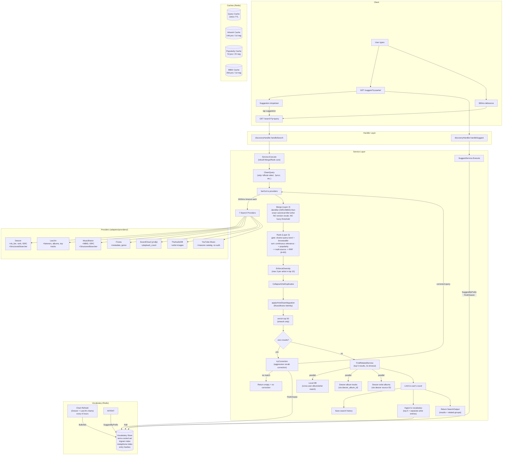
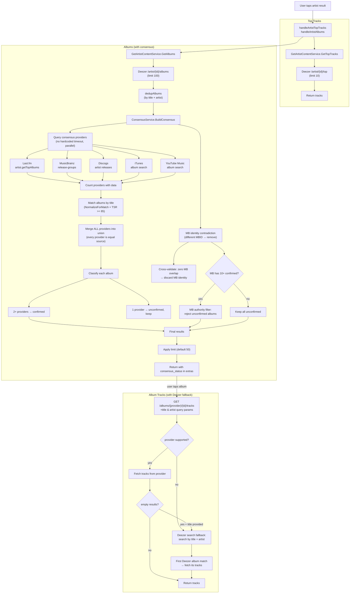
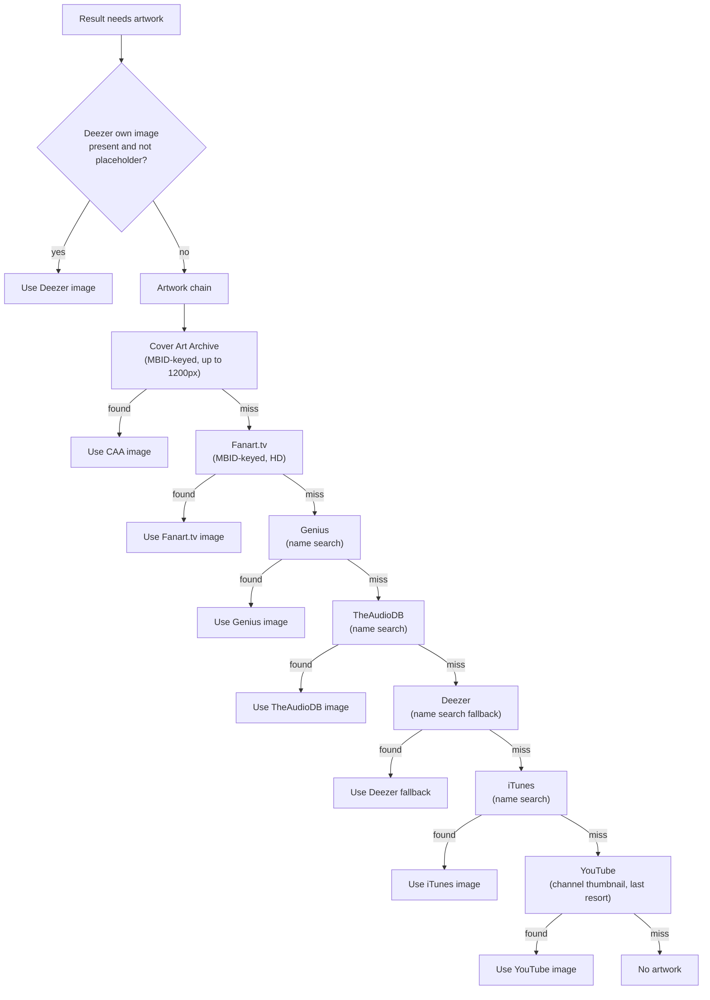

# Discovery — Architecture

Visual map of the discovery bounded context. Use this to trace data flow when debugging search quality issues.

## Search Flow



## Artist Detail Flow



## Artwork Resolution Flow



## Ranking Key (sort order)

The rebuilt `Rank` (Layer 3) sorts by **continuous** relevance — no bands, no tiers,
no intent contract, no quality score. Eligibility gates (shares-query-word +
browseable-source) drop non-matches before sorting.

```
Position  Signal         Direction   Source
────────  ─────────────  ──────────  ──────────────────────
1         Relevance      DESC        max(TokenSortRatio(q,title), TokenSortRatio(q,"artist title")) / 100
2         Popularity     DESC        extras["popularity"] (provider-supplied, max across sources)
3         Multi-source   DESC        len(distinct providers) > 1
4         RRF            DESC        Σ 1/(60 + best_rank) — equal weight, within-tie tiebreak only
5         Subtitle       ASC         alphabetical tiebreak
6         Title          ASC         alphabetical tiebreak
```

Enrichment (artwork) does not reorder, so there is no post-enrichment rerank.

## Diagnostic Logging

Enable with `LOG_LEVEL=debug`. Each pipeline stage emits a structured log entry:

```
search.v2.start           — query
search.v2.provider_failed — provider, status, error
search.v2.correcting      — original, corrected, confidence
search.v2.complete        — query, results, partial, corrected, related_groups
consensus.v2.complete     — artist, total, confirmed, unconfirmed, rejected, responded
```

## File Map

```
internal/discovery/
├── domain/
│   ├── types.go              # SearchResult, SearchQuery, SourceRef, RelatedGroup, enums
│   ├── identity.go           # ArtistIdentityProfile, AlbumVerdict (used by consensus MB check)
│   ├── events.go             # SearchPerformed, ResultClicked
│   └── vocabulary.go         # VocabularyEntry
├── ports/
│   └── ports.go              # Port interfaces (SearchProvider, ArtistContentProvider, ClickSignalProvider, etc.)
├── service/
│   ├── search.go             # Service — search orchestrator (fanOut + mergeRankEnrich + SearchOutput)
│   ├── merge.go              # Merge (Layer 2) — identifier + canonical-title entity resolution
│   ├── rank.go               # Rank (Layer 3) — continuous-relevance sort + eligibility gates
│   ├── enrich.go             # artwork enrichment (top 50, parallel)
│   ├── disambiguation.go     # applyArtistDisambiguation (MusicBrainz identity)
│   ├── search_correction.go  # tryCorrection (zero-result aggressive vocab correction)
│   ├── vocab.go              # ingestVocabulary (learn query + strong results)
│   ├── telemetry.go          # emitSearchEvent (search_performed, async best-effort)
│   ├── diversity.go          # EnforceDiversity, CollapseArtistDuplicates + extras helpers
│   ├── consensus.go          # ConsensusService — multi-provider album consensus + MB contradiction
│   ├── fuzzy.go              # levenshteinDistance (delegates to shared/textnorm; NormalizeForMatch + TokenSortRatio now live in shared/textnorm)
│   ├── correction.go         # CorrectionService (trigram Jaccard + phonetic)
│   ├── query_clean.go        # CleanQuery (strip YouTube noise)
│   ├── metaphone.go          # DoubleMetaphone, MetaphoneKey (phonetic codes)
│   ├── suggest.go            # SuggestService (prefix + fuzzy fallback)
│   ├── vocabulary_refresh.go # Background chart ingestion (6h ticker)
│   ├── circuit_breaker.go    # Per-provider circuit breaker
│   ├── record_click.go       # RecordClickService
│   ├── list_history.go       # ListSearchHistoryService
│   ├── find_related.go       # FindRelatedService — entity relationship enrichment
│   ├── get_album_tracks.go   # Album content fetch + Deezer search fallback for non-Deezer albums
│   ├── get_artist_content.go # Artist top-tracks/albums with consensus integration
│   └── url_router.go         # URL-paste provider detection
└── adapters/
    ├── handler/
    │   └── discovery_handler.go  # HTTP routes (search, suggest, history, clicks, content)
    ├── providers/
    │   ├── deezer.go         # Search + Charts + Artwork + Content + ISRC fetch
    │   ├── lastfm.go         # Search + Charts + Artist albums/top tracks
    │   ├── musicbrainz.go    # Search + Album validation + Identity resolution
    │   ├── itunes.go         # Search + Artwork + Album lookup
    │   ├── soundcloud.go     # Search via yt-dlp
    │   ├── theaudiodb.go     # Search (artists) + Artwork
    │   ├── ytmusic.go        # YouTube Music — Search + Artist albums/top tracks (raitonoberu/ytmusic, no auth)
    │   ├── coverartarchive.go # Artwork (MBID-keyed album covers, up to 1200px)
    │   ├── genius.go         # Artwork (name search)
    │   ├── fanarttv.go       # Artwork (MBID-based HD)
    │   ├── discogs.go        # Artwork + Discography enrichment
    │   ├── artwork_chain.go  # Chained artwork resolver (ID-first, name-search last)
    │   ├── wikidata.go       # MBID resolution (Deezer ID → MB via SPARQL)
    │   └── youtube.go        # Artwork (channel thumbnails, last resort)
    ├── cache/
    │   ├── query_cache.go        # 10min per-provider query cache
    │   ├── artwork_cache.go      # 14d artwork cache
    │   ├── popularity_cache.go   # 7d popularity cache
    │   ├── mbid_cache.go         # 30d MBID cache
    │   ├── discogs_cache.go      # Discogs artist resolution cache
    │   ├── vocabulary_store.go   # Trigram-indexed vocabulary (prefix + fuzzy)
    │   └── fetch_success.go      # Provider reliability tracking
    └── persistence/
        ├── history_repo.go   # Search history (Postgres)
        └── click_repo.go     # Click tracking + ClickSignalProvider (Postgres)
```
