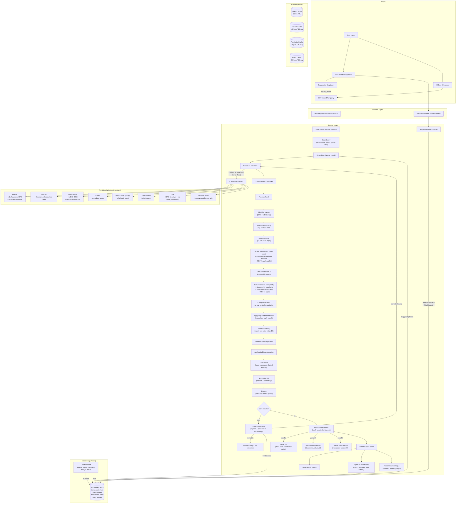
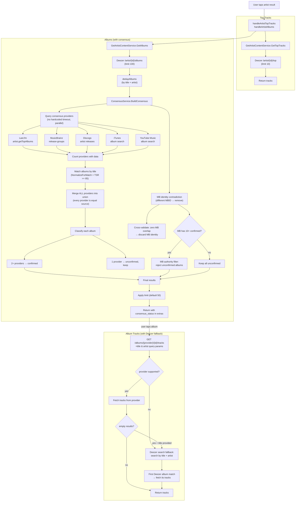
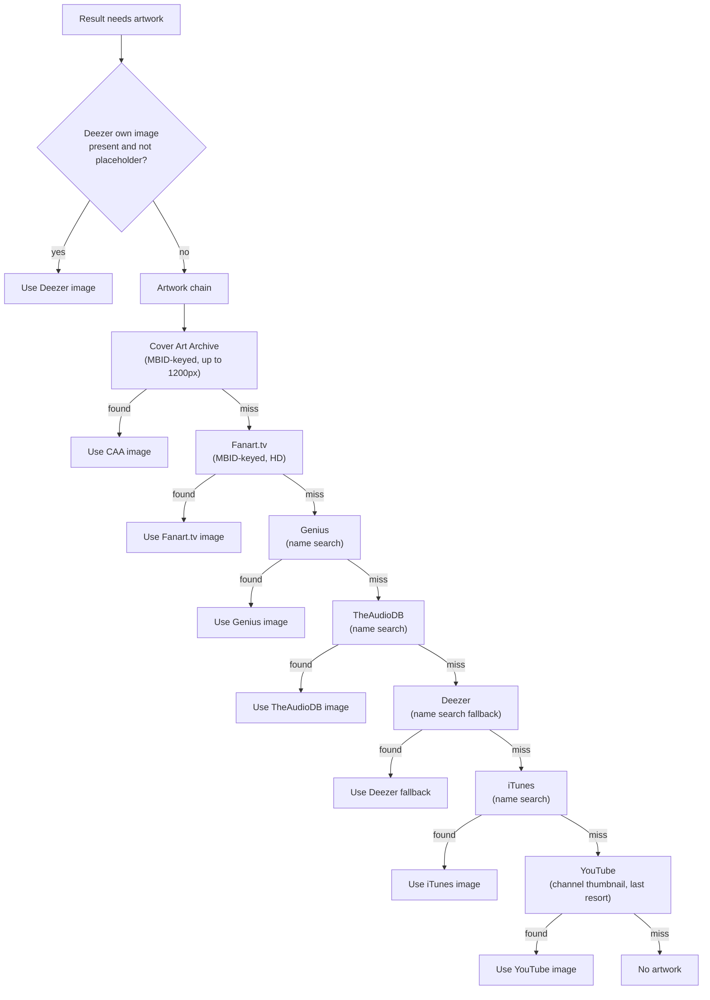

# Discovery — Architecture

Visual map of the discovery bounded context. Use this to trace data flow when debugging search quality issues.

## Search Flow



## Artist Detail Flow



## Artwork Resolution Flow



## Ranking Key (sort order)

```
Position  Signal              Direction   Source
────────  ──────────────────  ──────────  ──────────────────────
1         Relevance band      DESC        TokenSortRatio (0.05 granularity)
2         Demoted             ASC         record_type not in {album,single,ep}
3         Popularity          DESC        NormalizePopularity (0-100, log-scale)
4         Multi-source        DESC        len(providers) > 1
5         Quality score       DESC        completeness + agreement + tier + fetch
6         RRF                 DESC        Σ 1/(60 + rank) — equal weight all providers
7         Subtitle            ASC         alphabetical tiebreak
8         Title               ASC         alphabetical tiebreak
```

After enrichment, `Rerank` uses the same key minus quality score.

## Diagnostic Logging

Enable with `LOG_LEVEL=debug`. Each pipeline stage emits a structured log entry:

```
pipeline.query_clean      — input, output, changed
pipeline.intent_detect    — detected (bool)
pipeline.fuse_and_rank    — raw count, merged count (in search.merged)
pipeline.collapse_artist  — input_count, output_count
pipeline.click_boost      — count
pipeline.enrich           — count
pipeline.rerank           — count
consensus.providers_responded — artist, responded, total_providers
consensus.complete        — artist, confirmed, unconfirmed, rejected
```

## File Map

```
internal/discovery/
├── domain/
│   ├── types.go              # SearchResult, SearchQuery, SourceRef, RelatedGroup, enums (incl. ProviderTidal)
│   ├── identity.go           # ArtistIdentityProfile, AlbumVerdict (used by consensus MB check)
│   ├── events.go             # SearchPerformed, ResultClicked
│   └── vocabulary.go         # VocabularyEntry
├── ports/
│   └── ports.go              # Port interfaces (SearchProvider, ArtistContentProvider, ClickSignalProvider, etc.)
├── service/
│   ├── search_music.go       # SearchMusicService — main search orchestrator + click boost
│   ├── consensus.go          # ConsensusService — multi-provider album consensus + MB contradiction
│   ├── dedup.go              # FuseAndRank, Rerank, CollapseVersions, PopularityDominance, Diversity
│   ├── normalize.go          # NormalizeForMatch (8-step canonicalization)
│   ├── fuzzy.go              # TokenSortRatio, levenshteinDistance
│   ├── popularity.go         # NormalizePopularity (log-scale, multi-provider)
│   ├── correction.go         # CorrectionService (trigram Jaccard + phonetic)
│   ├── intent.go             # DetectIntent (vocabulary-based artist+track split)
│   ├── query_clean.go        # CleanQuery (strip YouTube noise)
│   ├── metaphone.go          # DoubleMetaphone, MetaphoneKey (phonetic codes)
│   ├── suggest.go            # SuggestService (prefix + fuzzy fallback)
│   ├── vocabulary_refresh.go # Background chart ingestion (6h ticker)
│   ├── quality_scorer.go     # ComputeQualityScore, IsDemoted
│   ├── circuit_breaker.go    # Per-provider circuit breaker
│   ├── record_click.go       # RecordClickService
│   ├── list_history.go       # ListSearchHistoryService
│   ├── find_related.go       # FindRelatedService — entity relationship enrichment
│   ├── get_album_tracks.go   # Album content fetch + Deezer search fallback for non-Deezer albums
│   ├── get_artist_content.go # Artist top-tracks/albums with consensus integration
│   └── url_router.go         # URL-paste provider detection
└── adapters/
    ├── handler/
    │   └── discovery_handler.go  # HTTP routes (search, suggest, history, clicks, content)
    ├── providers/
    │   ├── deezer.go         # Search + Charts + Artwork + Content + ISRC fetch
    │   ├── lastfm.go         # Search + Charts + Artist albums/top tracks
    │   ├── musicbrainz.go    # Search + Album validation + Identity resolution
    │   ├── itunes.go         # Search + Artwork + Album lookup
    │   ├── soundcloud.go     # Search via yt-dlp
    │   ├── theaudiodb.go     # Search (artists) + Artwork
    │   ├── tidal.go          # Search + Artist content (OAuth 2.0 — inactive, no client_credentials for 3rd party)
    │   ├── ytmusic.go        # YouTube Music — Search + Artist albums/top tracks (raitonoberu/ytmusic, no auth)
    │   ├── coverartarchive.go # Artwork (MBID-keyed album covers, up to 1200px)
    │   ├── genius.go         # Artwork (name search)
    │   ├── fanarttv.go       # Artwork (MBID-based HD)
    │   ├── discogs.go        # Artwork + Discography enrichment
    │   ├── artwork_chain.go  # Chained artwork resolver (ID-first, name-search last)
    │   ├── wikidata.go       # MBID resolution (Deezer ID → MB via SPARQL)
    │   └── youtube.go        # Artwork (channel thumbnails, last resort)
    ├── cache/
    │   ├── query_cache.go        # 10min per-provider query cache
    │   ├── artwork_cache.go      # 14d artwork cache
    │   ├── popularity_cache.go   # 7d popularity cache
    │   ├── mbid_cache.go         # 30d MBID cache
    │   ├── discogs_cache.go      # Discogs artist resolution cache
    │   ├── vocabulary_store.go   # Trigram-indexed vocabulary (prefix + fuzzy)
    │   └── fetch_success.go      # Provider reliability tracking
    └── persistence/
        ├── history_repo.go   # Search history (Postgres)
        └── click_repo.go     # Click tracking + ClickSignalProvider (Postgres)
```
