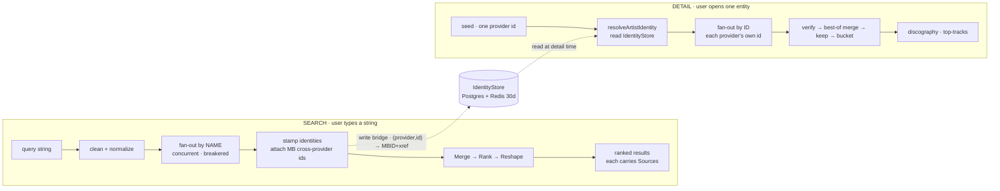
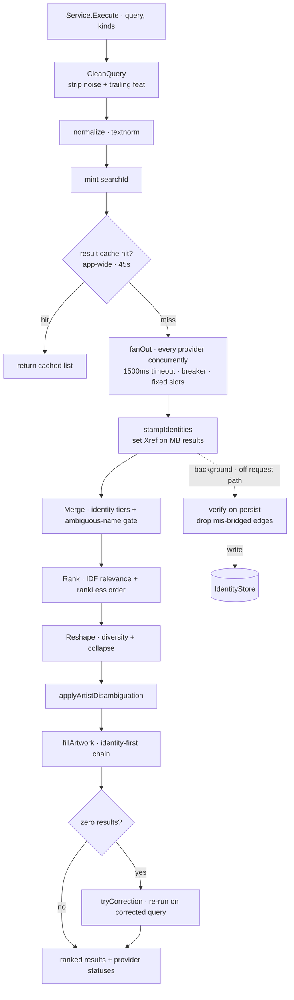
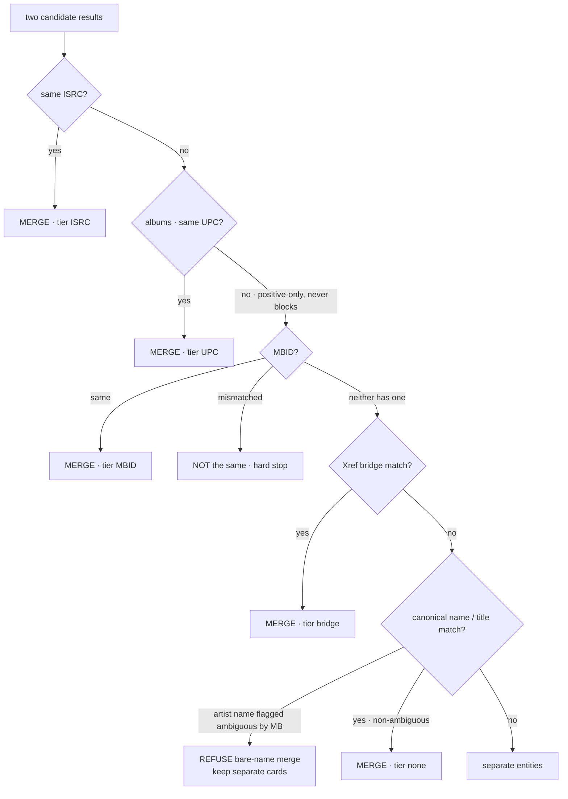
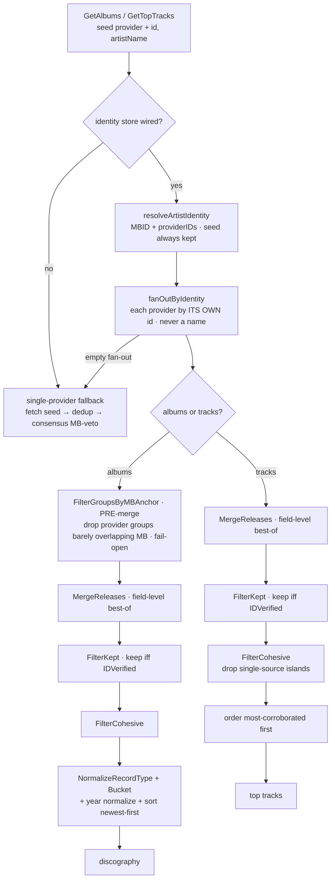
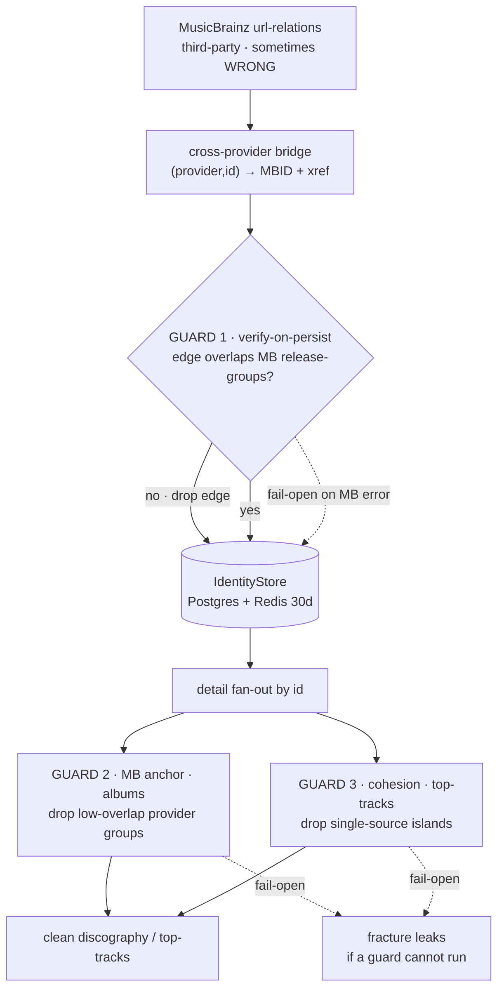
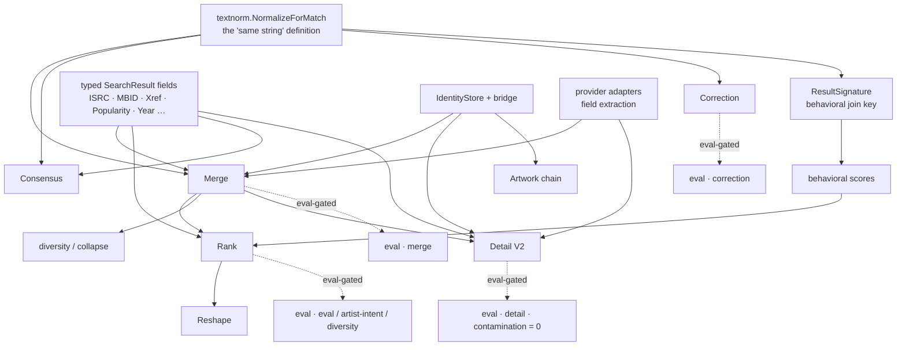

# Discovery — Module Architecture

The discovery bounded context (`services/go-api/internal/discovery/`) is the largest
module in the backend: multi-provider music **search** and detail-open **browse**
over ~a dozen third-party catalogues, merged into one identity-resolved,
ranked view. This document is the whole-module map — the design philosophy, the
two pipelines, the shared identity spine, and the open tensions worth improving.
Per-subsystem prose lives in `okf/backend/discovery/`; this is the map between
those docs and the code, plus the reasoning a reviewer needs to find edge cases.

Everything here is described in the present tense — how the module *is* and *why*.
The recurring adversary the whole design fights is the **same-name-different-human
problem** ("Che": an Atlanta rapper, a soul singer, a 1990s band, all named
"Che"). Almost every non-obvious decision below exists to keep those apart.

---

## 0. Orientation

Two request flows share providers and the `Merge` core but are **not** the same
pipeline:

- **Search** — the user types a string. Providers are queried *by name*; identity
  is resolved *after the fact* by `Merge` + the MusicBrainz cross-provider bridge.
  Output: a ranked list of entities, each carrying its merged provider sources.
- **Detail** — the user opens one known entity. Providers are queried *by that
  entity's own id per provider* (never a name), and the results are best-of merged
  into a discography / top-tracks / tracklist. Contamination-proof *by
  construction* — as long as the identity feeding it is clean.

The load-bearing seam between them: **search writes the durable identity bridge
that detail later reads.** A search that includes MusicBrainz learns
`(provider, id) → MBID + cross-provider ids` and persists it; a later detail-open
resolves the full cross-provider identity from that store without re-querying MB.



---

## 1. Design philosophy (the load-bearing principles)

These are the invariants everything else serves. A change that violates one of
these is almost always a regression waiting to happen.

1. **Merge by identity, never by bare name.** Same-name entities collide
   otherwise. Identity is a stable id (ISRC, MBID, or a cross-provider bridge),
   never a display string. Where a name match is unavoidable (two providers with
   only a title in common), it is the *weakest* tier and is refused outright for
   artist names MusicBrainz reports as ambiguous.

2. **No tuned magic constants; parameters come from the data.** Relevance weight
   is IDF computed over the live candidate set, not a hand-picked boost.
   Correction candidates come from a *learned* vocabulary store, never a hardcoded
   word bank (banks rot immediately). The few surviving constants (diversity caps,
   timeouts, TTLs, cache windows) are explicitly *product policy* or *operational*,
   not relevance tuning, and are called out as such.

3. **Typed fields over `Extras` for anything logic branches on.** Every field that
   `Merge`, `Rank`, or consensus reads is a typed field on `domain.SearchResult`
   (`ISRC`, `MBID`, `Xref`, `Popularity`, `FanCount`, `ProviderRank`, `Year`,
   `ReleaseDate`, `TrackCount`, `Album`, `Duration`), so the producer→consumer link
   is compile-checked. `Extras` is display/telemetry only — a silently-absent or
   type-drifted map entry there can't break ranking or merge.

4. **Every provider is an equal source; reputation lives in the merge, not in
   per-provider gatekeeping.** The interface is uniform (a provider fills what it
   can); trust is expressed by *how a source is weighted or corroborated during
   merge*, not by excluding a provider up front. MusicBrainz is the one authority
   with veto/anchor power, and that power is deliberately scoped and load-bearing.

5. **Rank-affecting changes are eval-gated; position, not presence.** "Is the
   right answer in the top-10" is too weak — the gate is top-3 via the offline
   `discoveryeval` harness, and A/B comparisons run on an *identical deterministic
   sample* (cross-sample deltas are noise). Non-ranking changes (display metadata,
   enrichment) are exempt.

6. **Nil-tolerant degradation is the house style.** Absent Redis, MusicBrainz, or
   any single provider switches a *feature* off, never fails a request. Caches
   no-op; providers sit out; the pipeline still returns a correct (if less
   complete) result.

7. **Dependencies point inward, wired explicitly.** `domain ← service ← adapters`;
   ports define the seams; the composition root (`internal/app`) is the only place
   adapters are chosen and injected. Behavior lives with its data.

---

## 2. Layering & structure

```
domain/      value objects + enums (SearchResult, ResultKind, EntityResolutionTier,
             ProviderName, identity read-models, enrichment VOs, InteractionEvent)
ports/       the interfaces the service depends on (providers, stores, caches, resolvers)
service/     the pipeline + use cases (search orchestration, merge, rank, diversity,
             detail/discography, consensus, enrichment, correction, telemetry, eval/)
adapters/
  handler/     inbound HTTP (chi) — thin: parse → call service → DTO
  providers/   outbound third-party clients (one file per provider + shared http)
  persistence/ Postgres repos (identity, events, history, metrics rollup)
  cache/       Redis read-through caches (each a Proxy with a Null-Object fallback)
```

The composition root builds the object graph (`internal/app`, see
`okf/backend/app-wiring.md`). Two cross-cutting facts:

- **One shared, process-wide HTTP transport** with per-host rate limiters. It must
  stay shared — per-client limiters would let N providers each hit N× a host's
  limit and get the prod IP throttled. Eval/replay inject a recording transport
  through the same seam.
- **Several MusicBrainz adapter instances exist** (discovery content wiring, the
  search-service builder, the provider and consensus builders). Rate safety holds
  because pacing lives in the shared transport, not the adapter.

---

## 3. Domain model

`domain.SearchResult` is the spine type that flows through both pipelines. Its
field groups encode the philosophy:

| Group | Fields | Why typed |
|---|---|---|
| Display | `Kind`, `Title`, `Subtitle`, `ImageURL`, `ArtworkSource` | rendered; `ArtworkSource` records *where* the image resolved for coverage telemetry |
| Identity | `ISRC`, `UPC` (album barcode), `MBID`, `Xref` (provider→id bridge) | `Merge`'s tiers branch on them — compile-checked |
| Ranking | `Popularity` (**inert**, see §11), `FanCount`, `ProviderRank` | `Rank`'s tiebreaks read them directly |
| Metadata | `Year`, `ReleaseDate`, `TrackCount`, `Album`, `Duration`, `DeezerAlbumID` | consensus / discography ordering / relevance-tail read them |
| Provenance | `Sources []SourceRef` (provider + external id + url), `Confidence` | union of contributing providers; `Confidence` is display-only |
| Escape hatch | `Extras map[string]any` | display/telemetry metadata **only** — nothing structural branches on it |

Supporting types: `ResultKind` (track/album/artist), `EntityResolutionTier`
(ISRC → MBID → bridge → none — the strength of *why* two results merged),
`Confidence` (High/Medium/Low), `ProviderName`/`ProviderStatus` enums,
`SearchQuery` (validated input), `Entity` (a merged result plus per-provider
`BestRank`, the RRF input), `ProviderSearchResponse` (per-provider wire status),
`RelatedGroup`, `CollapsedArtistSummary` (same-name artists folded into a card).

In-flight identity read-models: `ArtistIdentityProfile` (MBID, Discogs id, genre
cluster, ISRC registrants, MB-confirmed titles) and `AlbumVerdict`
(Confirmed/Contamination/Suspect/Unknown) for consensus classification.

Enrichment value objects (`MBEnrichment`, `DeezerEnrichment`, `DeezerLyrics`,
`DiscogsEnrichment`, `LastFmEnrichment`) are immutable, non-persisted read
surfaces, each with an `IsZero()`/empty-constructor pair so the wire never emits
`null`.

Telemetry: `InteractionEvent` is the append-only envelope; `ResultSignature`
(`kind|norm(title)|norm(subtitle)`) is the single cross-query, cross-provider join
key — computed identically by the rank pipeline and the wire mapper so stored
behavioral scores always rejoin the live list.

---

## 4. The search pipeline



`Service` (`service/search.go`) is the orchestrator. `Service.Execute`:

1. **Clean** — `CleanQuery` strips pasted-video noise ("official music video",
   "lyrics", "4k", …) and a *trailing* dangling "feat"/"ft" (mid-typing residue
   that otherwise makes providers expand phantom composite-artist rows). A *mid*-query
   "feat" is left intact.
2. **Normalize** — `textnorm.NormalizeForMatch` (the one canonical "same string"
   definition, used everywhere identity-by-name is decided).
3. **Mint `searchId`** — the keystone that joins every downstream engagement event
   back to this search.
4. **Result cache** — an app-wide, 45-second cache of the final ranked list keyed
   by query+kinds. Discovery results are catalog-derived, not user-specific, so a
   shared key is correct; the short window smooths provider drop-out and cache
   warmth without hiding a shipped ranking change for more than a minute. Only
   complete, non-empty results are cached.
5. **Fan out** (`fanOut`) — query every `SearchProvider` concurrently, each bounded
   by `defaultProviderTimeout` (1500ms, per-provider overridable) and gated by a
   per-provider `CircuitBreaker`. Each goroutine writes only its own slot in a
   fixed, provider-ordered slice — **never completion order** — so ties rank
   deterministically run-to-run. Non-empty groups collapse to
   `perProvider [][]SearchResult` plus per-provider statuses for the wire.
6. **Merge / rank / enrich** (`mergeRankEnrich`) — the decision core, below.
7. **Zero-result correction** — if the merged list is empty, `tryCorrection`
   re-runs the whole pipeline on a corrected query (§4.4).

Background work (identity-bridge persistence, telemetry, vocabulary ingest) runs
through one `launchBackground` helper: detach from request cancellation, track on
a `WaitGroup` (`WaitForBackground` drains it for shutdown/tests), recover+log
panics so async work can't crash the process.

### 4.1 Identity stamping (pre-merge)

`stampIdentities` reads the `IdentityBridge` (cache-only) and sets `SearchResult.Xref`
on MusicBrainz-sourced results, so `Merge` can resolve identity across providers
by *stated* id, not just name. Each learned bridge is then persisted off the
request path. When verify-on-persist is enabled, an `IdentityVerifier` first drops
any streaming edge (Deezer/Spotify/Apple) whose catalogue doesn't overlap the
artist's MusicBrainz release-groups — a mis-bridged same-name artist from a wrong
MB url-relation (§6). It filters only the *persisted* copy, never the in-flight
`Xref`, so merge and ranking are unchanged.

### 4.2 Merge (entity resolution)

`Merge` (`service/merge.go`) collapses per-provider groups into deduped `Entity`
values. `sameEntity` decides identity strictly by tier, strongest first:



Strongest tier first:

```
ISRC exact  →  UPC exact (albums only; a mismatch is NOT disproof — editions
               differ — so unlike MBID it never blocks)
            →  shared MBID (a MISMATCHED MBID is a hard "not the same")
            →  cross-provider bridge (a stamped Xref present on ≥1 side)
            →  bare canonical name (artists) / exact canonical title+subtitle (tracks, albums)
```

The UPC tier follows the Popularity pattern — machinery live and tested while the
producer set grows: Apple Music search albums are the one search-fan-out producer
today (SoundCloud `publisher_metadata.upc_or_ean` and Deezer `/album/{id}` are
candidates). Last.fm search results carry their MusicBrainz `mbid` on all three
kinds (decoded 2026-07-23), feeding the MBID tier from a second provider.

There is deliberately **no fuzzy threshold and no version-marker vocabulary** —
canonical normalization is the one structural definition of "same title."

The **ambiguous-artist merge gate** is the key correctness layer:
`ambiguousArtistNames` flags any normalized artist name for which MusicBrainz
surfaced ≥2 distinct MBIDs (the "Che" set). For those names `Merge` *refuses* a
bare-name merge (identifier/bridge tiers still merge freely), keeping distinct
humans on separate cards. The same flat-slice core (`ambiguousArtistNamesFlat`) is
reused by `CollapseArtistDuplicates` in reshaping, so both phases agree on exactly
one ambiguous-name set.

`mergeInto` folds the loser into the more-complete (`completenessOf`) canonical
result: unions `Sources`, takes max popularity, coalesces typed metadata
(canonical wins when set, else the other side fills), and stamps `Confidence`.

### 4.3 Rank

`Rank`/`rankWith` (`service/rank.go`) orders merged entities by continuous,
parameter-free relevance. Two passes, both in the shared `rankScored` core:

- **Pass 1 — eligibility gates:** `sharesQueryWord` (drop results sharing no token
  with the query) and `hasBrowseableSource` (artist/album need a Deezer source;
  tracks always pass).
- **Pass 2 — score + order (`rankLess`):**
  `demotion flag → relevance → cross-kind prominence → behavioral → popularity → multi-source → RRF (k=60) → stable title tiebreak`.

Relevance (`rank_relevance.go`, `idfWeightedCoverage`) is
`Σ IDF(qtoken)·bestFuzzyMatch(qtoken, title+subtitle) / Σ IDF(qtoken)`. IDF
(`rarity = 1 − documentFrequency/N`) is computed over the eligible candidate set,
so a repeated "artist" token in an "artist title" query weighs ~0 while a rare
title token weighs ~1; `bestTokenSimilarity` is a continuous normalized
Levenshtein ratio with no cutoff. When every token is ubiquitous (IDF can't
distinguish), it falls back to a symmetric token-sort ratio so an exact title
still beats a superset.

Two eval-gated experimental rungs, both default-off:
- **Tail-noise demotion** (`isLowConfidenceTail`) — flags single-source
  SoundCloud/Last.fm results with no ISRC/MBID/album as low-confidence tail,
  sorting them below every corroborated result.
- **Cross-kind prominence** (`prominenceOf`) — log-compressed Deezer fan-count /
  track rank, breaking relevance ties *only between different kinds* (a famous
  bare-name artist rises above a same-name track) without touching track-vs-track
  order.

`RankExplain`/`ScoredResult` runs the identical `rankScored` core but keeps each
result's scoring provenance, so the operator console's rank explainer can never
drift from production order. Experiment inputs cross the package boundary as an
exported `RankOptions` mapped onto the internal `rankConfig` at a single site, so
the offline eval and the operator re-run compose the *same* flag-gated stages.

**Reshaping** (`diversity.go`) is explicit *product policy*, exempt from the
zero-constants doctrine and validated by its own eval mode: `EnforceDiversity`
(cap 3 per artist within the top 10) and `CollapseArtistDuplicates` (fold same-name
artist duplicates, keyed by MBID when the name is ambiguous).

### 4.4 Correction, vocabulary, suggest

- `CorrectionService` (`correction.go`) is a "did you mean" engine driven entirely
  by the learned `VocabularyStore` (no word banks). `CorrectAggressive`
  (whole-query then per-token) fires **only on a zero-result search** — a
  principled trigger, not a relevance threshold. Candidates come from trigram +
  phonetic search; a term that already matches a confirmed vocabulary entry is left
  uncorrected; otherwise the smallest Levenshtein candidate under a length-scaled
  distance (1/2/3 edits for short/medium/long) wins. Pre-correction is **disabled**
  (it rewrote valid queries); post-correction alone measures ~93% recall / 100%
  precision.
- **Phonetics** (`shared/phonetics`, Double Metaphone) is injected into the
  vocabulary store so fuzzy search catches sound-alike spellings. It is a
  *rank-side / vocabulary-side* signal, not applied to the raw query.
- `VocabularyStore` is a learned term-frequency store (Redis) ingested from search
  traffic, backing both correction and autocomplete.
- `SuggestService` (`suggest.go`) powers autocomplete: prefix match first, topped
  up with fuzzy candidates, deduped by normalized term.

---

## 5. The detail / discography pipeline

A separate pipeline (`service/get_artist_content.go`,
`get_artist_content_v2.go`, `detail_identity.go`, `release_*.go`,
`get_album_tracks.go`). It answers "give me *this* artist's full discography /
top-tracks" or "give me *this* album's tracklist," starting from one
`(provider, external_id)` seed.



### 5.1 Identity-first fan-out

`resolveArtistIdentity` (`detail_identity.go`) expands one seed into a
`ResolvedArtistIdentity{MBID, ProviderIDs}` by reading the durable `IdentityStore`
— keyed on stable ids, never names. The **seed id is always preserved**, so the
result is never narrower than the input even when no cross-provider bridge exists
(the common case for underground artists MusicBrainz never url-relates — the path
still runs on the seed alone, id-verified).

`providerContentID` maps the identity to the id each provider is queried by,
encoding the two API-imposed exceptions in one place: **Last.fm** keys artist
content on the **MBID** (its "id" is an ambiguous name), and **Apple Music**
reuses the shared **iTunes** id (the bridge only emits the `itunes` key).
`fanOutByIdentity` runs every provider that has a resolved id concurrently, each by
its own id.

### 5.2 The V2 cores (four pure functions)

`v2Albums` / `v2TopTracks` assemble tagged `ReleaseGroup`s from the id fan-out
(all `IDVerified`) and pass them through pure, exhaustively-tested cores. Order
matters and differs from the numbering below on one point: for **albums** the MB
anchor (step 3) runs **first, on the raw pre-merge provider groups** — it drops a
whole mis-bridged provider group before best-of merge can absorb its fields —
then merge → keep → cohesion. Albums get **both** the anchor and cohesion;
top-tracks get cohesion only.

1. **`MergeReleases`** (`release_merge.go`) — field-level **best-of** across every
   provider that returned a release. A cover, year, or track-count from *any* source
   fills the gap; no variant is ever wholesale-discarded. (This replaced an earlier
   "replace-by-completeness" merge that scored only image/isrc/duration/album and
   silently dropped year/track-count — the root cause of blank-year discographies.)
2. **`FilterKept`** (`release_keep.go`) — keep a merged cluster **iff `IDVerified`**:
   at least one provider returned it when queried by the artist's *verified id*.
   This is the one sound signal for ambiguous names. A strong identifier and
   ≥2-provider corroboration were both tried and are **unsound** — a namesake's
   release carries its *own* valid MBID, and two by-name providers can independently
   return the *same* wrong artist. By-name groups still *merge* to enrich an
   id-verified cluster, but a cluster with no id-verified source is dropped. MB
   becomes a *vote* (best-of enrichment), not a *veto*.
3. **Identity verification** — the guard against a *corrupt identity* (§6):
   - Albums: `FilterGroupsByMBAnchor` (`release_verify.go`) checks each id-fanout
     provider group's titles against the MBID's own MusicBrainz release-group set
     and drops a group whose overlap is below threshold (min 4 shared titles or
     ratio 0.25, only when MB knows ≥5 release-groups and the group returned ≥4
     titles — **fail-open** otherwise: no anchor / no MBID / MB error keeps
     everything). A mis-bridged same-name artist shares far less of the real
     artist's catalogue than the real one does.
   - Top-tracks: `FilterCohesive` (`release_cohesion.go`) unions releases into
     connected components by cross-provider co-occurrence and drops single-source
     islands that corroborate with nothing (the album-level MB anchor doesn't apply
     to tracks).
4. **`NormalizeRecordType` / `BucketDiscography`** (`release_bucket.go`) — fold
   per-provider `record_type` signals plus a one-track⇒single rule into reliable
   album/single/EP buckets, then normalize a numeric year and sort newest-first
   (via `albumReleaseSortKey`, shared with the fallback so both agree on order).

### 5.3 Fallback and album tracklists

When there is no identity store, or the id fan-out returns empty, `GetAlbums`/
`GetTopTracks` fall back to a **single-provider path**: fetch the seed provider
directly, `dedupAlbums`, then the by-name `ConsensusService` union (which *does*
still apply MB-authority as a veto — §8). `GetAlbumTracks` resolves one album's
tracklist natively per provider, with an **artist-guarded** Deezer title-search
fallback that returns empty rather than a same-titled album by a different artist.

### 5.4 The search↔detail asymmetry

Search queries by *name* and resolves identity by merge; detail queries by *id* and
is contamination-proof by construction. Every historical detail bug lived where the
detail path *fell back to a name* (an un-bridged SoundCloud id resolved by top-hit;
a by-name consensus fetch). The durable fix is to acquire every provider's id at
*search* time and never name-resolve at detail time — see §15.

---

## 6. Cross-provider identity (the spine)



Identity is what both pipelines stand on. Two structures carry it.

- **In-flight:** `ArtistIdentityProfile` / `AlbumVerdict` — assembled per search
  from provider signals, consumed by consensus classification.
- **Durable:** the `entity_identity` table via `ports.IdentityStore` — maps
  `(provider, external_id, kind) → (mbid, xref)`. `PgxIdentityStore` is the source
  of truth (`PersistBridges` upserts one row per bridged provider id when MB answers
  a search; `LookupByProviderID` reads it back). `RedisIdentityStore` fronts it with
  a 30-day read/write-through cache, degrading transparently to Postgres on a miss
  or when Redis is absent. This is what lets a later MB-*absent* search — or any
  detail-open — resolve a provider-only result's identity deterministically instead
  of guessing by name.

**The fracture problem.** The bridge is only as correct as MusicBrainz's
url-relations, which are third-party data we don't control. A *wrong* url-relation
fuses two same-name artists (e.g. a rapper's MBID url-related to a different Che's
Deezer id). The stored identity then legitimately id-verifies releases of *two
humans*. Per-release keep rules can't separate them — the fracture is a property of
the *provider set*, not any single release.

Three layers defend against this, in order of preference:

1. **Verify-on-persist (upstream, permanent):** before a learned bridge is stored,
   each streaming edge is checked against the artist's MB release-groups and a
   mis-bridged one is dropped, so a fractured identity is ideally never stored.
2. **MB anchor (detail-time, albums):** `FilterGroupsByMBAnchor` re-checks overlap
   at read time (§5.2) — belt-and-suspenders for a verify-on-persist fail-open.
3. **Cohesion (detail-time, top-tracks):** `FilterCohesive` drops single-source
   islands where the album anchor doesn't reach.

All three are **fail-open** — they never empty a discography on a transient MB
failure. That is a deliberate safety choice with a cost (§15).

**Artwork** consumes the same identity. `ChainedArtworkResolver` tries
identity-only resolvers first (Discogs-by-id, CoverArtArchive/Fanart by MBID —
these never name-search) and only falls to name-search resolvers when no identity
source has the image. `ArtworkConfidence` (Identity > Name > None) grades the
result so the artwork cache refuses to let a weaker name-guess overwrite a
proven-identity image.

---

## 7. Providers (the outer ring)

One file per provider under `adapters/providers/`, each implementing the ports it
can. The capability seams (all in `ports/`):

| Port | Purpose |
|---|---|
| `SearchProvider` / `StructuredSearcher` | search fan-out |
| `ArtistContentProvider` | detail discography + top-tracks by id |
| `AlbumContentProvider` | album tracklists |
| `ArtworkResolver` + `IdentityArtworkResolver` + `SourcedArtworkResolver` + `TaggingArtworkResolver` | the artwork chain (chain-member vs service-facing) |
| `MetadataEnricher` / `DiscogsEnricher` / `LastFmEnricher` / `DeezerEnricher` / `LyricsProvider` | detail-open enrichment |
| `MBDiscographyAnchor` | the MB release-group set for the detail verifier |
| `ArtistIDResolver` | name→id (SoundCloud fallback only) |
| `RelatedTracksProvider` | "related tracks" (SoundCloud) |
| `ChartProvider` | Last.fm charts |
| `AlbumValidator` / `ArtistIdentityResolver` / `RelationshipQuerier` | MB identity + consensus |

Provider participation and *how each is keyed* (by id = identity-safe; by name =
contamination-prone):

| Provider | Search | Content fan-out (by id) | Consensus (by name) | Artwork |
|---|:--:|:--:|:--:|:--:|
| Deezer | ✅ | ✅ id | seed only | ✅ name |
| Apple Music | ✅ | ✅ (shared iTunes id) | — | — |
| iTunes | — | — | ✅ name | ✅ name |
| Spotify | ✅ | ✅ id | — | ✅ artist img (id) |
| SoundCloud | ✅ | ⚠️ name-resolved id | ✅ name | ✅ name (last) |
| Last.fm | ✅ | ✅ (MBID) | ✅ name | — |
| MusicBrainz | ✅ | spine / anchor | ✅ name + authority | ✅ CAA (id) |
| YouTube Music | ✅ | ❌ not wired | ✅ name | ✅ artist img (id) |
| Amazon Music | ✅ | ❌ not wired | — | — |
| Discogs | — | — | ✅ name | ✅ (id) |
| TheAudioDB | — | — | — | ✅ (id) |
| Fanart.tv | — | — | — | ✅ (MBID) |
| Genius | — | — | — | ✅ name (last) |

Per-provider notes worth carrying:

- **Apple Music vs iTunes** — same catalogue and ids, two adapters. Apple Music's
  official Catalog API (reached via the anonymous developer token its web player
  embeds) carries ISRC, composer credits, and a lyrics flag the plain iTunes Search
  API lacks, so Apple Music is in the search fan-out; iTunes stays wired for the
  artwork chain, album consensus, and content lookups.
- **Spotify** is the most fragile source — an anonymous web-visitor bootstrap
  (TOTP-gated access token + a separate client-integrity token) that Spotify
  actively rotates (both the TOTP secret and the search persisted-query hash).
  Accepted because the other providers degrade gracefully around a Spotify outage.
  A GraphQL-layer error returns HTTP 200 with an `errors` array, so the client
  parses that array (not just the status) to surface a real failure instead of a
  silent zero.
- **SoundCloud** uses its internal api-v2 with a yt-dlp fallback. MusicBrainz never
  url-relates a SoundCloud id, so it is the **only** content-fan-out provider
  reached by *name* — the single remaining contamination vector in an id-only path
  (§15).
- **Amazon Music** rides its internal web-player backend (same self-hosted personal
  use posture as SoundCloud).
- **MusicBrainz** is the identity/consensus authority *and* the detail verifier's
  anchor. Its authority is load-bearing against the noisy credited-on graphs of
  other providers — it is not to be demoted to "just another source."

---

## 8. Consensus, enrichment, related, featured (off the ranking path)

- **`ConsensusService`** (`consensus.go`) is the album-consensus surface: every
  album provider is an equal source, gathered via a generic fan-out, clustered by
  exact canonical title into confirmed/unconfirmed/rejected verdicts.
  `applyMBAuthority` anchors the union on MusicBrainz's bulk release-group
  discography — confirmed-by-MB albums kept, everything else **rejected** as
  same-name contamination. This MB-*veto* is the legacy path, still used by the
  detail single-provider fallback; the V2 discography core replaces it with
  corroboration-based keeping (§5.2). `NameGroups` exposes the raw by-name provider
  albums, but the V2 path passes `includeNameGroups=false` at both call sites — the
  by-name completeness feed is a dormant seam, consumed today only by the
  single-provider fallback/consensus path. The per-artist result is cached behind a
  pluggable name-keyed cache (Redis, 6h; a no-op default that recomputes correctly
  when unwired).

- **Enrichment** (`service/enrich/`, `enrichment.go`) is detail-open only, never on
  the ranking path. Five parallel services (MusicBrainz, Deezer, Discogs, Last.fm,
  Lyrics) share one shape: resolve id from name → look up payload → cache → degrade
  to an empty value + nil error on any failure. The generic `CachedLookup[T]`
  encodes the caching rule (positive→return, negative→empty, transient error→don't
  cache, definitive miss→negative-cache); `resolveThenLookup` handles the
  two-step resolve→fetch providers. All empty constructors return non-nil
  collections so the wire never emits `null`.

- **Related** (`find_related.go`, `get_related_tracks.go`) powers "more from this
  album/artist" and SoundCloud's per-track related list via `RelatedTracksProvider`.

- **Featured artists** (`featured_artists.go`, `featured_resolver.go`) merges
  MusicBrainz `artist-credit` with Deezer track contributors (MB-primary, Deezer
  fills gaps) so the detail "Featuring" row shows structured, tappable credits.

---

## 9. Caching (all app-wide, none per-user)

Every cache is a read-through Proxy with a Null-Object fallback: a nil/unreachable
Redis degrades each method to a no-op, so the service runs correctly, just
uncached. Because discovery data is catalog-derived, keys are **app-wide, not
per-user** by design.

| Cache | Key | TTLs | Notes |
|---|---|---|---|
| Result | query+kinds | 45s | short, to smooth provider drop-out without hiding a shipped change |
| Enrichment | (kind, mbid) | 14d / 24h neg | doubles as `IdentityBridge.ExternalIDs` and `MBIDIndex` off the same entry |
| Artwork | (kind, title, subtitle, mbid) | 14d identity / 48h name / 6–24h neg per kind | overwrite guard: a lower-confidence write can't clobber a higher one |
| Identity store | (provider, id, kind) | 30d | read/write-through front over Postgres |
| Consensus | artist name | 6h | truncated results never cached |
| Name-keyed enrichment | name | per provider | Deezer/Last.fm/Discogs/lyrics |
| Vocabulary | learned terms | — | Redis-backed term-frequency store |

Consequence to keep in mind: a shipped ranking change is visible within ~45s, but
an *identity* correction propagates only as the 30-day identity cache turns over
(or is evicted).

---

## 10. HTTP surface

Thin chi handlers (`adapters/handler/`) that parse → call service → map to DTO:

```
GET  /v1/discovery/search?q=&kinds=&limit=
GET  /v1/discovery/suggest?q=
GET/DELETE /v1/discovery/search-history   (written as a side-effect of search — no POST)
GET  /v1/discovery/artists/{provider}/{externalId}/albums?name=&limit=
GET  /v1/discovery/artists/{provider}/{externalId}/top-tracks?name=&limit=
GET  /v1/discovery/albums/{provider}/{externalId}/tracks?title=&artist=&limit=
GET  /v1/discovery/tracks/{provider}/{externalId}/related?limit=
GET  /v1/discovery/enrichment[/lastfm|/deezer|/discogs|/discogs/artist]?kind=&title=&subtitle=&mbid=
GET  /v1/discovery/lyrics
POST /v1/discovery/events
```

The DTO mapper mirrors typed fields back into the wire `extras` map (`mbid`,
`isrc`, `year`, `release_date`, `track_count`, …) so clients key on stable names
while the domain keeps them typed. Handlers also feed the operator console's
request-drill-down (`RecordSearch` / `RecordContentFetch`) off the request path.

---

## 11. Telemetry & the behavioral loop

`InteractionEvent` (append-only, JSONB payload) is persisted to `discovery_events`
by `PgxEventStore`, which satisfies four ports (`EventStore`, `EventQuery`,
`BehavioralSignalStore`, `BehavioralLabelStore`) over one table. `searchId` joins
every event to its search; `result_signature` joins across searches.

`SatisfactionSignals` nets +1 per play/completed and −1 per short-dwell skip
(< 20s), grouped by signature. `SatisfactionConsumer` (an `EventConsumer` Strategy)
turns that into a score map that `RefreshBehavioralScores` recomputes off the
request path and atomically swaps in; the search path only reads the published
snapshot, gated behind the behavioral flag. **Behavioral ranking is currently a
dark signal** — a new signal is a new `EventConsumer`, never a pipeline rewrite.

**Popularity is deliberately inert.** `SearchResult.Popularity` is never populated
by providers: a naive revival (Deezer track rank / artist-album fan count) was
eval-*rejected* because albums report zero fan count, so a high-rank obscure track
buries the canonical album, and because this is a *personal, niche* library where a
global popularity prior regresses relevance. The machinery (merge-max, the rank
tier) is live and tested; only the producer is intentionally absent. A fair revival
needs a per-kind-comparable popularity that clears the top-3 gate first.

Coverage signals (`CoverageSignalAService`) mine query-grain gaps — zero-result,
results-shown-no-click, and abandoned-then-reformulated-within-60s — as inputs to
the eval harness.

---

## 12. The regression gate (offline eval)

`cmd/discoveryeval` runs the *real* pipeline in-process (`app.BuildSearchService`,
the single construction site so eval never drifts from production) against cloned
prod data, nightly rather than per-commit — the scheduled runner is
`.github/workflows/discovery-eval-nightly.yml` (the gated modes vs
`baselines.json`, ntfy alert on regression); the per-PR
`discovery-eval-gate.yml` runs only the deterministic provider-free tests. Every gated mode flows through one
spine: run → write JSON → render → gate headline metrics against a committed
`baselines.json` → print failure slices → exit non-zero on regression.

Modes: `eval` (library "artist title → top-K"), `merge` (under/over-merge),
`correction` (synthetic-typo precision/recall), `diversity` (reshaping cost),
`signal-a`/`signal-b` (coverage / provider-imbalance), `health`/`consensus`
(report-only gauges), `artwork`, `artist-intent`, `corpus-build`, and `detail`.

Re-baselining is explicit (`--update-baselines -noise-runs N`): the baseline is the
mean over N runs and the margin is the *measured* peak-to-peak spread × 1.5 —
hand-picked floors are banned. Gates are relative drops below a measured baseline.

The **`detail` mode** gates the *other* pipeline: it runs `GetArtistContentService`
against live providers over a *seeded* in-memory identity store built from
committed goldens, so a golden can carry a deliberately **fractured** identity (the
Che bug) and the harness asserts the read-time guards drop every contaminated item
— `detail.contamination` gated at 0, alongside recall and metadata coverage. It
needs no DB, so it runs anywhere.

Testing discipline (from the module's `CLAUDE.md`): **position not presence**
(top-3, not top-10); **A/B on an identical deterministic sample**; **no hardcoded
workarounds** (fix the algorithm, never add a word to a bank); **question every
new stage** ("if I remove it, do the positioning tests still pass?"); **log the
math and verify provider responses directly**.

---

## 13. Observability seam

Discovery feeds the Mission Control operator console through consumer-defined seams
(request tracing, live re-run, provider health, the eval meter) and **never imports
admin**. The re-run reuses the exported rank composition so its waterfall can't
diverge from production; a detail "as phone" trace reproduces the mobile client's
per-seed fan-out + client-side merge over the production services, closing the
gap where a bug only visible in the client's multi-seed union was invisible to a
single-endpoint test.

---

## 14. Invariant checklist

A change should preserve all of these; if it can't, that's the discussion:

- Imports point inward; adapters chosen only in the composition root.
- Anything merge/rank/consensus branches on is a **typed field**, not `Extras`.
- Identity is an id, never a bare name; ambiguous artist names never bare-merge.
- No tuned relevance constants; no hardcoded correction word banks.
- Rank-affecting changes clear the offline eval gate (position, same-sample A/B).
- Nil Redis / MB / a dead provider degrades a feature, never fails a request.
- Fan-out writes deterministic per-provider slots (tie order is reproducible).
- Discovery caches are app-wide; artwork can't be clobbered by a weaker guess.
- Search = by-name + merge; detail = by-id; the detail path never name-resolves
  except the one explicit SoundCloud fallback.
- MB authority/anchor is load-bearing — scope it, don't remove it.
- Popularity is inert by design until a per-kind-comparable signal clears the gate.

---

## 15. Known tensions & improvement surface

Where the module is strongest *and* where a deeper review should push. Each is a
current state → tension → candidate direction.

1. **The ambiguity ceiling.** A bare single-token query ("Hello", "Scorpion")
   legitimately surfaces the *famous* entity over a user's niche owned one, and
   discovery is not personalized. Exact "artist title" queries hit ~100% top-3;
   bare single tokens plateau ~81%. This is an inherent ceiling, not a bug — but
   it's the natural home for a *personalization / library-aware* signal that
   doesn't exist yet.

2. **MB-authority's double role.** In the detail *fallback* and legacy consensus,
   MusicBrainz is simultaneously the contamination filter *and* a purger of real
   releases it simply hasn't catalogued. The V2 core already decoupled these
   (corroboration-keep + MB-as-vote), but the veto path still lives in the
   single-provider fallback. Fully retiring the veto everywhere — vs. keeping it as
   the fallback's only defense — is an open call.

3. **Identity fracture from third-party error.** The read-time guards (MB anchor,
   cohesion) are **fail-open** — a transient MB failure or a missing MBID keeps
   *everything*, so a fractured identity leaks when the anchor can't run. The
   permanent fix (verify-on-persist) is itself a guard, not a guarantee (it too
   fail-opens). Open questions: should the guards be fail-*closed* for high-ambiguity
   names? Is there a corroboration signal beyond MB release-group overlap (the
   title/ISRC options were ruled out — titles collide for namesakes, Deezer artist
   endpoints don't expose ISRC)?

4. **Top-tracks has no anchor.** The MB release-group anchor is album-level; top
   tracks rely on cohesion alone, which is weaker (it needs ≥2 corroborating
   providers to have any signal). A track-level identity check is unbuilt.

5. **The un-bridged-id gap (SoundCloud).** SoundCloud is the last provider the
   detail path reaches *by name*, because MusicBrainz never bridges it. The
   top-hit name-resolve is the residual contamination vector for ambiguous names.
   The durable fix is **search-time id acquisition**: persist a provider's id into
   the IdentityStore when it *provably co-identifies* with the entity during search
   (shared ISRC/UPC, or exact title+artist under a non-ambiguous name), so detail
   resolves it by id and never name-guesses. Uncertain for genuinely ambiguous
   names where SC never co-identifies.

6. **Metadata completeness is uneven.** Year, track-count, and especially
   `record_type` are extracted inconsistently across providers (some list endpoints
   omit them entirely; several providers under-label single/EP/album). This is
   *directly* why album/single/EP bucketing is "good, not perfect," and why a
   bridged card whose native-typed provider group was dropped by the anchor can show
   coarser buckets and blank years. Two threads: (a) squeeze every displayable field
   out of each provider's payload at extraction time (2026-07-23: Spotify search
   albums now carry artist/year/record_type; Apple search results carry
   preview/explicit; Deezer/MB/Spotify discography fetches now paginate past page
   one); (b) derive `record_type` from a reliable track-count rather than trusting
   provider labels. Artwork: Apple search art now requests 1000px (was 500);
   SoundCloud still caps at 500 where 1080/original exist.

7. **Providers absent from the content fan-out.** YouTube Music and Amazon Music are
   in search (and YT in consensus) but not the detail fan-out. YTM's content
   methods are **by-name** (a filtered search — its `GetArtistTopTracks` was
   deleted as dead 2026-07-23; `GetArtistAlbums` survives for the by-name
   consensus union only), so joining the id fan-out requires a genuinely
   id-keyed fetch (the album `browse` endpoint) plus a bridgeable id; otherwise
   they inherit SoundCloud's name-resolve problem.

8. **The client's multi-seed union.** The backend is now authoritative and complete,
   but the mobile client still fans out to several seed providers and merges them
   client-side. Each seed is trusted independently, so a wrong same-name seed (from a
   contaminated search entity) contributes a whole wrong discography that no single
   backend call can catch. The clean end state is a **single backend call the client
   renders verbatim** — removing the client's re-merge entirely.

9. **Popularity & behavioral signals are dark.** Both the popularity producer and
   behavioral ranking are wired but inert, each pending a version that clears the
   eval gate on this niche library. The self-growing behavioral corpus (search →
   engagement labels) is the intended in-sample answer; the offline replay harness
   can score a candidate ranker against it same-day instead of shipping dark.

10. **Freshness vs. stability.** The 45s result cache and 30-day identity cache trade
    consistency for load. A corrected identity or a newly-acquired track can lag; the
    windows are chosen deliberately but are worth revisiting if identity corrections
    become frequent.

11. **Correction reach.** Phonetics is vocabulary-side, not applied to the raw query;
    the abandoned-search dissatisfaction signal is mined but report-only. Both are
    levers for recall that are intentionally conservative today.

---

## 16. Change-impact map (the ripple effects)

Searching is fragile precisely because a few shared primitives sit under
everything. The map below is what to consult *before* editing: which components a
change touches, and which eval mode is the backstop. The rule of thumb — **the
hard correctness lives in the pure, I/O-free cores; a change is safest when it
stays inside one and is proven by a golden test before it reaches the wiring.**



The blast radius, per change:

| Change this… | Ripples to… | Re-clear (eval) | Classic failure mode |
|---|---|---|---|
| `NormalizeForMatch` | Merge (name identity), Consensus clustering, Correction, **ResultSignature** | eval, merge, correction | behavioral scores silently stop joining (signature drift); over/under-merge |
| a typed field or its provider producer | Merge tiers, Rank tiebreaks, Consensus, Detail best-of | eval, merge, detail | a provider stops populating it → silent rank/merge shift |
| `Merge` / `sameEntity` tiers | Rank input set, diversity, detail fallback | eval, merge | same-name artists collide (under-merge) or fragment (over-merge) |
| `rankLess` / relevance | top-3 positions everywhere | eval + artist-intent (same-sample A/B) | a niche owned track buried under the famous same-name one |
| diversity / collapse caps | top-window composition | diversity | duplicate cards, or distinct artists over-collapsed |
| identity bridge / verify-on-persist | detail fan-out contents, artwork, search merge (via `Xref`) | detail, eval | fractured identity → cross-artist contamination |
| MB-anchor / cohesion thresholds | detail contamination vs recall | detail | too loose = leak; too tight = real releases dropped |
| a provider's field extraction | Merge best-of completeness, bucketing | detail *(only if it touches identity keys)* | blank year/tracks; wrong single/EP/album bucket |
| cache TTL / keying | freshness vs stability; the artwork overwrite guard | — | stale identity; a weak artwork guess clobbers a proven one |
| add a provider to the content fan-out | detail contamination if its id isn't bridgeable | detail | inherits SoundCloud's name-resolve problem |
| add a ranking stage or signal | every position; the "one more layer" trap | eval (remove-it-and-retest) | a regression masked as an improvement across different samples |

**Where correctness is concentrated.** The pure, no-I/O functions are where the
hard logic lives and where it is safest to change: `Merge` (`merge.go`), the
`rankPipeline` composition (`pipeline.go` / `rank.go` / `rank_relevance.go`), and
the detail cores `MergeReleases` / `FilterKept` / `NormalizeRecordType` /
`FilterGroupsByMBAnchor` / `FilterCohesive` (`release_*.go`). Each is exhaustively
unit-testable with plain data and deletable in isolation. Every regression this
module has seen came from the opposite shape — a conditional accreted across the
orchestrator or a provider adapter, invisible to the pure-core tests. So: put new
logic in a pure core, add a golden case first (the ENCORE / namesake / fracture
cases are the templates), and treat the offline `discoveryeval` gate as the
backstop — no rank-affecting change is "done" until it clears the relevant mode on
an identical, deterministic sample.
